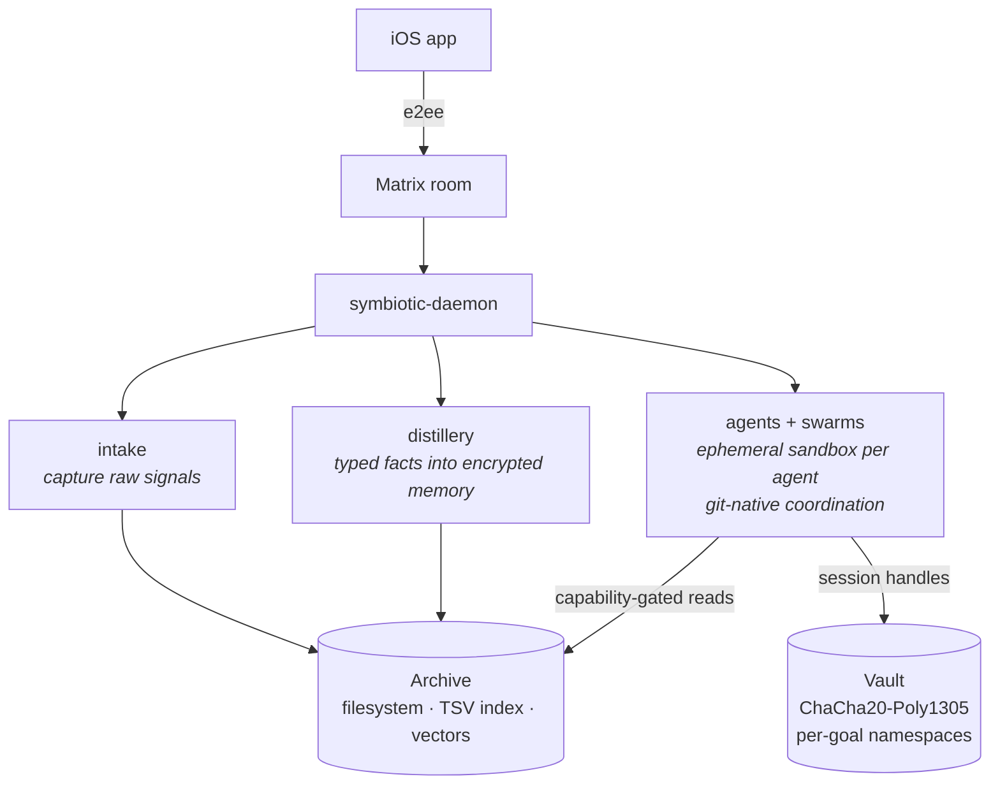

# Symbiotic.sh

**A personal AI operating system.** Second brain · Agent team · Always on.

Symbiotic captures what you care about, distills it into a structured personal
Archive, and coordinates a team of specialist agents that reason over that
context and act on your behalf — all under capability-gated boundaries you can
audit.

You choose how it runs:

- **Self-host** on a laptop, Mac mini, or VPS you own
- **Bring any LLM** — Ollama locally, or Claude / GPT / Gemini via your own keys
- **(Soon) Use the hosted service** at symbiotic.sh — same runtime, we operate it

This repo is the runtime: daemon, agents, memory, transport, and the capability
sandbox. It's the entire trust-relevant surface.

- **Landing + full pitch:** [symbiotic.sh](https://symbiotic.sh)
- **Demo video (2 min):** _coming soon_
- **License:** [FSL-1.1-ALv2 → Apache 2.0 in 2 years](LICENSE.md)

---

## What makes it different

| Status | Pillar | Why it matters |
|---|---|---|
| Shipped | **Any provider, any deploy** | Ollama, Claude, GPT, Gemini. Your keys, your host, or our hosted. Swap at runtime — no lock-in |
| Shipped | **Capability-gated memory** | Every agent read is scoped by a capability token. Least-privilege per sub-task, enforced at the tool boundary |
| Shipped | **Memory with shape** | Typed facts in a structured personal Archive, not flat embeddings. Filesystem + TSV index today, encrypted-at-rest on the roadmap |
| Shipped | **Credential sandbox** | Cloud LLMs see reference IDs, never raw secrets — a ChaCha20-Poly1305-encrypted vault + sidecar gateway mediates every outbound call |
| In progress | **Agent swarms** | Ephemeral sysboxes, real dev-team workflow — branches, PRs, reviews, CI |
| In progress | **Forgeable skills** | Agents synthesize new Rust tools when they hit novel problems. The library grows with you |
| Planned | **Agent marketplace** | Pull better agents. Share your own |

## Architecture at a glance

The runtime is a single daemon plus the transport + sandbox it needs. The
mobile app talks to your daemon over an **E2E-encrypted Matrix room**. The
Archive (knowledge) lives on the filesystem with a TSV index + firewall
verdict sidecars; the Vault (secrets) is encrypted at rest with
**ChaCha20-Poly1305 AEAD**. Every agent read is gated by a capability token
whose scope is narrower than the caller's.

> **Navigating the system**: [`docs/SYSTEM-MAP.md`](docs/SYSTEM-MAP.md) is the
> one-stop hub — high-level diagram, shipped-vs-aspirational breakdown, and
> pointers into every architecture doc by capability.



Deploy it where it fits: a laptop for dev, a home server for always-on, a
personal VPS for remote access, or (soon) our hosted offering if you don't
want to run infra yourself. The code path is the same either way.

## What's in this repo

```
crates/           24 libraries — core, agents, memory, firewall, intake,
                  distillery, matrix transport, skills, workflows, vm, etc.
services/
  symbiotic-daemon/       long-running orchestrator (main binary)
  credential-gateway/     sandboxed proxy so cloud LLMs see refs, not secrets
workflows/        declarative workflow runtime + JSON templates
tests/integration/        cross-crate end-to-end tests
config/           .env templates (non-secret)
scripts/          VPS bootstrap, LUKS encryption, Matrix setup
docker/           Dockerfile + compose for local and VPS
```

## Run it yourself

```bash
git clone https://github.com/symbiotic-sh/core
cd core
cp services/symbiotic-daemon/.env.example .env   # fill in your Matrix creds
docker compose -f docker-compose.local.yml up
```

VPS bootstrap (dry-run first):

```bash
./scripts/bootstrap-vps.sh --dry-run \
  --access-mode public \
  --public-domain matrix.your-domain.com
```

See `config/.env.runtime` for the full non-secret config surface,
`services/symbiotic-daemon/.env.example` for secrets shape.

## Try the hackathon demos

Runnable demos live under `scripts/`. They default to a local Ollama provider
so they work offline — swap to any cloud provider via `SYMBIOTIC_DEFAULT_PROVIDER`
+ the matching API key env var if you prefer.

**Prerequisites** (one-time):

```bash
ollama pull gemma3:e4b            # chat / reasoning model used by agents
ollama pull nomic-embed-text      # embedding model used by Recall Gateway
cargo build --release -p symbiotic-cli --bin symbiotic
```

Source the demo env (sets `SYMBIOTIC_OLLAMA_URL`, role-dir override, log level):

```bash
source .env.demo
```

### Demo 1 — Single agent closes the Capture → Recall → Act → Evolve loop

```bash
./scripts/demo-all.sh --seed
```

- Fetches 3 real articles (cua, trustgraph, ghuntley/ralph), intakes them into
  the Archive with LLM-generated titles.
- Spawns a `researcher` agent with a synthesis goal.
- The researcher calls `recall`, reads all three sources, writes a
  `synthesis.md` deliverable, AND **writes the synthesis back into the Archive
  as a new tagged entry**. That last step is the Evolution arrow —
  tomorrow's recall will find today's synthesis next to its sources.

### Demo 2 — Multi-agent tool evaluation via nested dispatch

```bash
./scripts/demo-2.sh
```

- One user command spawns an `orchestrator` agent.
- The orchestrator uses the `dispatch_agent` tool to **synchronously spawn
  specialist sub-agents mid-ReAct-loop**: `security-auditor`,
  `architecture-analyst`, `fit-analyst`, `risk-adversary` — run against each
  candidate framework from Demo 1.
- Each sub-agent gets its own capability tokens (scoped to `archive.read` +
  `archive.write` for its own findings — no cross-agent access). Specialists
  write their reports into the Archive and hand back `arc_<id>` pointers; the
  orchestrator recalls those reports to synthesize the final decision memo.
- The `fit-analyst` is the one that cites the user's personal preferences
  note — a single generalist agent would never surface that unprompted.

The specialist roster shown to the orchestrator is **auto-injected at resolve
time** from the role registry (see
[`docs/design/agent-evolution.md`](docs/design/agent-evolution.md) §Phase 1).
Drop a new TOML in `config/agents/` → it's instantly callable by any
dispatcher. No prompt edits, no recompile.

### Smoke test — specialist archive handoff

```bash
./scripts/test-agent-ollama-smoke.sh
```

Seeds a fixture archive entry, invokes the security-auditor, and asserts the
archive-handoff invariants (specialist archives its findings, emits a proper
`done` wrapper referencing a real `arc_<id>` on disk). Skips cleanly if
Ollama isn't reachable — CI-friendly.

### What's in the scripts

- `scripts/demo.sh` — CLI wrapper that sources `.env.demo` and runs
  `symbiotic <args>`. Consistent prefix so one approval matches all invocations.
- `scripts/demo-seed.sh` — fetches + intakes the three real articles used by
  Demo 1 as titled archive entries.
- `scripts/demo-all.sh` — Demo 1 orchestration (optionally `--seed`).
- `scripts/demo-2.sh` — Demo 2 orchestration (assumes Archive already seeded).
- `scripts/test-agent-ollama-smoke.sh` — Ollama-backed smoke test.
- `config/agents/*.toml` — the role definitions used by the demos. Edit them
  live; the daemon re-reads on next invocation.

## Where the mobile app lives

The Flutter app is in a private repo today. That's a product decision, not a
trust one — everything that **touches your data or executes on your behalf**
(daemon, memory, firewall, agents, credential gateway) is in this repo and
auditable under FSL. We may open the app later once the UX surface stabilizes
and there's value in outside contribution; for now it ships faster staying
in-house.

## License

**[FSL-1.1-ALv2](LICENSE.md)** — Functional Source License v1.1, auto-converting
to Apache 2.0 on the 2-year anniversary of each release.

You may use, modify, self-host, and distribute this software for any purpose
**except** running a commercial hosted service that competes with Symbiotic.sh
during the 2-year window. That window is a rolling, per-release clock — code
committed today auto-converts to Apache 2.0 on 2028-04-20.

See [fsl.software](https://fsl.software/) for the license rationale.

## Status

Submitted to the [Loops](https://loops.house) hackathon (April 2026).

Shipped and stable: intake, distillery, memory graph, credential gateway,
capability-gated reads, firewall, Matrix transport, core agent runtime,
multi-agent orchestration with archive handoff.
In active development: agent swarms (sysboxed workers), forgeable skills,
hosted offering.
Planned: agent marketplace.

- Waitlist: [symbiotic.sh/#access](https://symbiotic.sh/#access)
- Org: [github.com/symbiotic-sh](https://github.com/symbiotic-sh)

## Working on this repository

This repository uses [House Rules](https://github.com/jak-pan/house-rules) as the base rules for agentic work, and Warden, our review service, reviews its pull requests on request. If you work here, with or without an agent, follow House Rules too. This repository's own rules, including any that tighten or loosen House Rules, are in [AGENTS.md](AGENTS.md).
