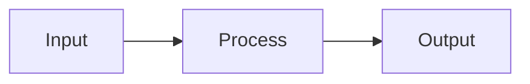

# {{project_name}} Architecture

## Overview

{{project_description}}

## Components

*(to be filled in from Excavate stage observations — typical fields:
 module boundaries, entry points, external dependencies, data flow)*

## Data Flow

## Key Decisions

*(enumerate architectural decisions that weren't obvious from the code alone)*

## Error Handling

*(describe how errors flow through the system + what surfaces to the operator)*

<!-- Symbiotic Source Archeology scaffold — placeholder tokens:
     {{project_name}}, {{project_description}} -->
