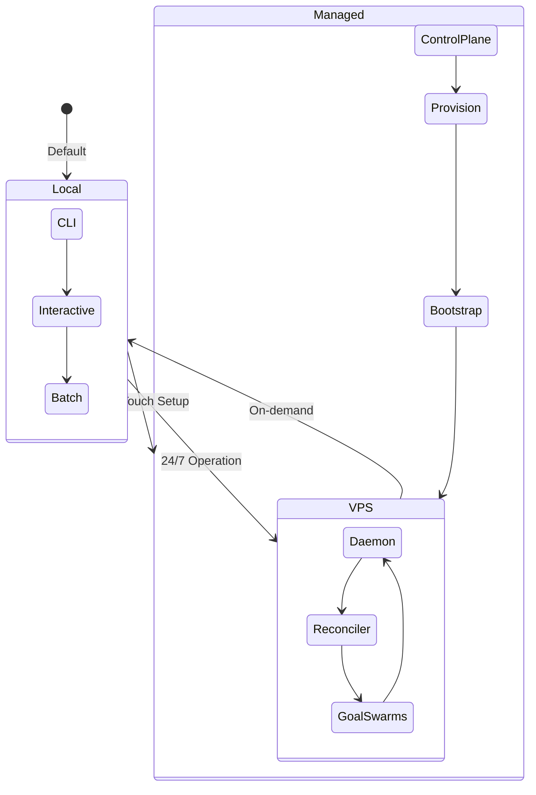

# Development Roadmap

> Updated 2026-02-22 to reflect the Architecture 2.0 pivot. See `docs/design/architecture-2.0-pivot.md` for the full structural mandate.

## Phase 1: Foundation (Complete)

Core intake, storage, and transport layer.

- [x] Core intake pipeline (web, Twitter, GitHub)
- [x] Archive storage (Markdown/Obsidian)
- [x] CLI interface
- [x] Ollama integration
- [x] Matrix E2EE transport (rooms, envelopes, device trust)
- [x] Secure Agent Framework (ReAct loop, capability gating, 3 built-in tools)
- [x] Trust + Capability enforcement (`CapabilityToken`, `AccessBroker` / Gatekeeper)
- [x] Credential sandbox (svlt2 AEAD vault encryption)
- [x] Queue system (durable + retry + DLQ)
- [x] Shared event protocol (33 typed events, forward-compatible wire)

## Phase 2: Declarative Control Plane (Complete)

Kubernetes-style reconciliation: declare desired state in Markdown, Nucleus reconciles.

- [x] `ManifestParser` — YAML frontmatter parsing for SOUL.md, preferences, goal plans, skills
- [x] `StateDiffer` — desired vs actual state diffing, produces `ReconciliationAction[]`
- [x] `GoalProcessManager` — lifecycle state machine, phase transitions, agent slot allocation, JSON persistence
- [x] `Reconciler` — async 30s observe-diff-plan loop with `StateQuery` trait
- [x] `DaemonStateQuery` — daemon-side runtime state bridge
- [x] Agent identity injection (SOUL.md prepended to agent system prompts)
- [x] Handoff file persistence (circuit breaker writes `operations/handoffs/YYYY-MM-DD-HHMM.md`)
- [ ] Wire reconciler action execution to daemon subsystems
- [ ] Wire SOUL.md loading on daemon startup

## Phase 3: Distillery Memory

Memory as identity construction. Markdown + Graph duality with temporal/emotional indexing.

- [x] Memory store (SQLite + FTS5), extraction (LLM + grounding), context graphs
- [x] Temporal decay, conflict detection, staleness
- [x] BFS context graph retrieval with decay scoring
- [x] Vector embeddings (hybrid BM25 + cosine, Ollama embeddings, chunking)
- [x] Metrics layer (rolling windows, proposals, CLI dashboard)
- [ ] Distillery pipeline stages: Reduce, Reflect, Reweave, Verify, Archive
- [ ] Three memory spaces: Knowledge (Semantic), Self (Episodic), Methodology (Procedural)
- [ ] Temporal/emotional graph indexing (somatic markers for fast routing)

## Phase 4: The Extended Arm (Action Engine)

Autonomous 24/7 execution: goal workflows, agent swarms, dynamic skill synthesis.

- [x] Goal/workflow execution from Matrix
- [x] Agent swarms (priority distribution, channel coordination, review queue)
- [x] Browser automation (session profiles, login handoff, extraction)
- [x] VM sandboxing (mock backend, capability gating, file bridge, audit)
- [x] Skills system (TOML manifests, trust gating, auto-load)
- [x] Agent-to-agent dispatch via `dispatch_agent` tool (orchestrator spawns sub-agents synchronously mid-ReAct-loop)
- [x] Parametric dispatcher prompts (live role roster injected from registry at resolve time)
- [ ] Dynamic Skill Synthesis (Coder Agent, Docker sandbox, skill archival)
- [ ] Git worktree isolation for swarm agents
- [ ] Token persistence + audit logging for Gatekeeper (`AccessBroker`)
- [ ] AI Provider Management Layer (multi-provider routing, cost tracking)
- [ ] **Agent evolution pipeline** — see [`docs/design/agent-evolution.md`](design/agent-evolution.md) for phases 2-6: dynamic tool discovery, capability registry as data, self-evolving roles, tools as declared contracts, earned capabilities

## Phase 5: Mission Control UX

The Flutter app as a living command center for the autonomous workforce.

- [x] Flutter Matrix SDK integration + all screens wired to live streams
- [x] iOS runner + share extension scaffold
- [x] Zero-touch onboarding wizard (8 steps wired to backend)
- [x] Setup experience (device trust bootstrap)
- [ ] Identity Stream home screen (distillery pipeline visualization)
- [ ] Glassmorphism + motion design (ambient feedback of Nucleus processing)
- [ ] Native wikilink parsing (`[[links]]` traversal)
- [ ] Command palette (universal contextual capture/orchestration)
- [ ] Push delivery to devices (APNs/FCM via gateway)

## Phase 6: Deployment + Hardening

Production-ready self-hosted runtime and optional managed control plane.

- [x] VPS Dockerfiles + Conduwuit config
- [x] Docker Compose + room setup scripts
- [x] Daemon environment config
- [x] MVP deployment documentation
- [ ] Real VPS provisioning (replace mock driver)
- [ ] SQLCipher encryption for memory store
- [ ] Advanced security hardening
- [ ] Redaction policy engine production rollout

---

## Operational Modes

