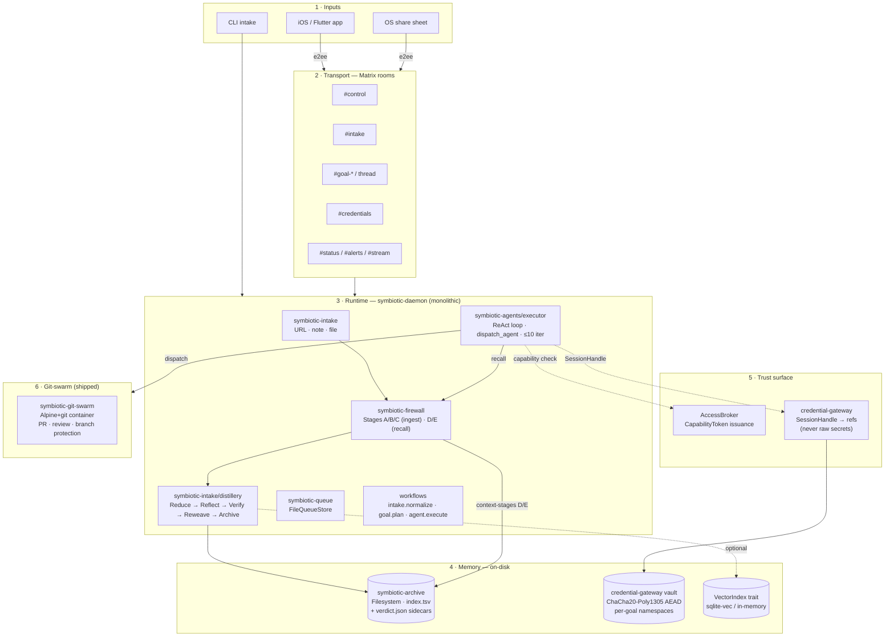

# Symbiotic System Map

Navigation hub for the runtime. Start here, zoom in where you need.

Every claim in this doc is grounded in what's actually running in the
binary — not in what the design docs describe as a future state. For the
post-pivot target topology, see [`design/system-map.md`](design/system-map.md).
For the per-subsystem implementation walkthrough, see
[`architecture/system-map.md`](architecture/system-map.md).

---

## One-line summary

> A single daemon process that **captures** what you care about, **distills**
> it into typed memory, and **coordinates** specialist agents to reason over
> that memory and act on your behalf — all under capability-gated boundaries
> you can audit.

## The shipped system

**Five layers plus the swarm substrate:**

1. **Inputs** — the app over Matrix, OS share sheet, CLI intake.
2. **Transport** — Matrix room topology with typed roles (control, intake, goals/thread, credentials, status, stream, alerts). See `services/symbiotic-daemon/src/routing.rs` for `RoomRole`.
3. **Runtime** — a single daemon process (`symbiotic-daemon`) that boots ~30 subsystems at startup. Entry: `services/symbiotic-daemon/src/lib.rs:834 SymbioticDaemon::open`.
4. **Memory** — two isolated stores. The **Archive** is filesystem + TSV index + per-entry verdict sidecars (not SQLCipher today). The **Vault** is encrypted at rest with **ChaCha20-Poly1305 AEAD** and segmented by goal-scope.
5. **Trust surface** — every agent read passes a `CapabilityChecker::check(agent_id, scope)` gate; every outbound credentialed call goes through the credential gateway and sees only session handles, never raw secrets.
6. **Swarm substrate** — the `symbiotic-git-swarm` crate boots an Alpine+git container (via bollard) that agents interact with via JSON-RPC. PRs, reviews, and branch-protection pre-receive hooks that call back for capability token verification are all shipped.

## What's actually shipped vs aspirational

Grounded from a pass over the runtime code by the `Explore` agent — see commit log for when each landed.

### Shipped and running in the binary

- **Daemon boot + ~30 injected subsystems** (`SymbioticDaemon::open`)
- **ReAct agent executor** with max-10-iteration loop, JSON tool-call protocol, and synchronous sub-agent dispatch via `spawn_blocking`
- **Built-in tools**: `recall`, `archive`, `queue`, `dispatch_agent`, `ask_user`, workspace tools (`fs.read/write`, `exec`)
- **10 agent roles**: orchestrator + researcher + security-auditor + security-analyst + architecture-analyst + fit-analyst + risk-adversary + coder + reviewer + planner (all in `config/agents/*.toml`)
- **Archive-handoff flow** — specialists write findings into the Archive, return `arc_<id>` pointers in their `done` wrapper; orchestrator recalls clean markdown to synthesize
- **Capability tokens** with `{subject, trust_level, scopes, goal_scope, expiry, one_time}` shape; issued by `AccessBroker`, checked at every tool invocation
- **Credential gateway** as a sidecar — `SessionHandle` indirection, time-limited handles, goal-scoped vaults
- **Vault encryption** — ChaCha20-Poly1305 AEAD, per-namespace keys, file perms hardened to 0o600, atomic write with temp+rename
- **Distillery** — 5 stages (Reduce, Reflect, Verify, Reweave, Archive) with PII redaction pre-LLM, verdict sidecar persistence
- **Content firewall** — Stages A/B/C at ingest, Stages D/E at context-assembly; firewall verdict is a writer-guard invariant on the Archive
- **Recall Gateway** — keyword + optional hybrid (0.4·BM25 + 0.6·cosine), substring fallback on title/content/tags, graph-seed merge
- **Matrix transport** — per-room role routing, outbound pump loop decoupling background tasks from SDK delivery
- **Git-swarm container** — Alpine+git image via bollard, PR/review/CI model, branch protection hooks call daemon for capability auth
- **Active recall probes** — 24h synthetic-query health checks of the memory surface
- **Workflow runner** — 8+ executors (intake.normalize, goal.plan, agent.execute, archive.review.enqueue, …)
- **Process Engineer meta-agent** — DB schema exists; execution pipeline exists; how often it's invoked in prod is unclear

### Framework exists but not wired into daemon boot

- **`symbiotic-vm`** — capability-gated VM lifecycle (create/exec/destroy), file bridge, Sysbox/Docker backend support. No agent path routes through it yet.
- **Swarm server module** — complete implementation, but the daemon doesn't spawn it from `open()` in prod.

### Aspirational (documented, not in code yet)

- **X API intake** — Twitter URL normalization exists; no live API client.
- **Browser bookmarks intake** — pipeline stub; no browser integration yet.
- **SQLCipher for the Archive** — referenced in some docs; current implementation is plain filesystem + TSV. Archive encryption landed for the Vault only so far.
- **Agent marketplace** — design only.
- **Hosted offering** — product plan, not code.

---

## By capability

### Core orchestration
- [`architecture/symbiotic-daemon.md`](architecture/symbiotic-daemon.md) — the daemon binary, what it boots
- [`architecture/daemon-bootstrap.md`](architecture/daemon-bootstrap.md) — startup order, Matrix join, capability token issuance
- [`architecture/agent-orchestration.md`](architecture/agent-orchestration.md) — ReAct, dispatch_agent, sub-agent lifecycles
- [`architecture/agent-swarms.md`](architecture/agent-swarms.md) — git-swarm container + PR-style coordination
- [`architecture/goals-layer.md`](architecture/goals-layer.md) — intent → goal → tasks → dispatch

### Memory & knowledge
- [`architecture/distillery.md`](architecture/distillery.md) — Reduce → Reflect → Verify → Reweave → Archive
- [`architecture/ingestion-pipeline.md`](architecture/ingestion-pipeline.md) — URL, note, file intake (X API + bookmarks still aspirational)
- [`architecture/knowledge-storage.md`](architecture/knowledge-storage.md) — Archive layout + index.tsv + verdict sidecars
- [`architecture/context-graphs.md`](architecture/context-graphs.md) — typed-fact graph
- [`architecture/vector-search.md`](architecture/vector-search.md) — `VectorIndex` trait + hybrid scoring
- [`architecture/context-delivery.md`](architecture/context-delivery.md) — Recall Gateway + context packing
- [`architecture/linked-entities.md`](architecture/linked-entities.md) — cross-entry references
- [`architecture/tool-memory.md`](architecture/tool-memory.md) — per-tool persistence

### Security & trust
- [`architecture/trust-capabilities.md`](architecture/trust-capabilities.md) — `CapabilityToken`, `AccessBroker`, tool-boundary enforcement
- [`architecture/credential-sandbox.md`](architecture/credential-sandbox.md) — sidecar gateway, `SessionHandle` indirection
- [`architecture/credential-management.md`](architecture/credential-management.md) — ChaCha20-Poly1305 vault, per-goal namespaces
- [`architecture/device-trust-bootstrap.md`](architecture/device-trust-bootstrap.md) — pairing + Matrix cross-signing
- [`architecture/session-handles.md`](architecture/session-handles.md) — per-agent session scoping
- [`architecture/tiered-data-protection.md`](architecture/tiered-data-protection.md) — sensitivity tiers
- [`architecture/redaction-policy.md`](architecture/redaction-policy.md) — firewall rule engine
- [`architecture/content-firewall.md`](architecture/content-firewall.md) — A/B/C (ingest) + D/E (context-assembly)

### Transport & queueing
- [`architecture/matrix-client.md`](architecture/matrix-client.md) — Matrix SDK wrapper
- [`architecture/matrix-channels.md`](architecture/matrix-channels.md) — room topology (`RoomRole`)
- [`architecture/queue-system.md`](architecture/queue-system.md) — job queue model
- [`architecture/queue-persistence.md`](architecture/queue-persistence.md) — durable state + replay

### LLM providers & runtime
- [`architecture/ai-provider-management.md`](architecture/ai-provider-management.md) — provider registry: Ollama, Anthropic/Claude Code, OpenAI, Gemini, OpenRouter, Codex
- [`architecture/local-llm-runtime.md`](architecture/local-llm-runtime.md) — Ollama integration
- [`architecture/dynamic-skill-synthesis.md`](architecture/dynamic-skill-synthesis.md) — agents forging new tools
- [`architecture/skills-system.md`](architecture/skills-system.md) — skill library + versioning
- [`architecture/extraction-cost-model.md`](architecture/extraction-cost-model.md) — token budgets

### Sandboxing & compute
- [`architecture/vm-sandboxing.md`](architecture/vm-sandboxing.md) — `symbiotic-vm` framework (Sysbox/Docker backends; **not wired to daemon boot yet**)
- [`architecture/browser-automation.md`](architecture/browser-automation.md) — headed browser in a sandbox
- [`architecture/source-archeology.md`](architecture/source-archeology.md) — deep-repo-inspection pipeline

### Deployment & ops
- [`architecture/vps-deployment.md`](architecture/vps-deployment.md) — VPS bootstrap + LUKS at-rest
- [`architecture/phone-only-mode.md`](architecture/phone-only-mode.md) — mobile-only profile
- [`architecture/onboarding.md`](architecture/onboarding.md) — first-run + pairing
- [`architecture/archive-sync.md`](architecture/archive-sync.md) — multi-device replication
- [`architecture/testing.md`](architecture/testing.md) — test taxonomy

### Observability & intake specifics
- [`architecture/twitter-ingestion.md`](architecture/twitter-ingestion.md) — thread reconstruction (**API client aspirational**)
- [`architecture/active-recall-probes.md`](architecture/active-recall-probes.md) — 24h synthetic-recall health checks
- [`architecture/recall-gateway-integration.md`](architecture/recall-gateway-integration.md) — intake ↔ recall glue
- [`architecture/temporal-modeling.md`](architecture/temporal-modeling.md) — time-aware queries
- [`architecture/metrics-layer.md`](architecture/metrics-layer.md) — telemetry

### Workspace topology
- [`architecture/repo-structure.md`](architecture/repo-structure.md) — crate responsibility map

---

## Future-target documents

Post-pivot design drafts live under `docs/design/`. Highlights:

- [`design/system-map.md`](design/system-map.md) — canonical target topology (400-line deep dive)
- [`design/architecture-2.0-pivot.md`](design/architecture-2.0-pivot.md) — pivot rationale
- [`design/thread-architecture.md`](design/thread-architecture.md) — threads as first-class work containers
- [`design/deliberation-first-pipeline.md`](design/deliberation-first-pipeline.md) — pre-action reasoning stage
- [`design/memory-system.md`](design/memory-system.md) — next-gen memory graph
- [`design/vault-as-truth.md`](design/vault-as-truth.md) — credential boundary sharpening
- [`design/sandbox-transition-plan.md`](design/sandbox-transition-plan.md) — current → full sysbox path
- [`design/internal-git-swarm.md`](design/internal-git-swarm.md) — swarm coordination via git primitives
- [`design/agent-evolution.md`](design/agent-evolution.md) — how new specialist roles land

Full design-doc index: [`docs/design/`](design/)

---

## Also in root docs

- [`VISION.md`](VISION.md) — product thesis + why we're building this
- [`ROADMAP.md`](ROADMAP.md) — shipped vs planned
- [`NAMING-CANON.md`](NAMING-CANON.md) — canonical names
- [`SELF-HOSTING.md`](SELF-HOSTING.md) — self-host guide
- [`MANUAL-SETUP.md`](MANUAL-SETUP.md) — manual bootstrap
- [`TESTING.md`](TESTING.md) — test suite structure
