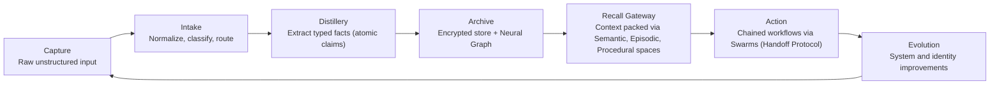
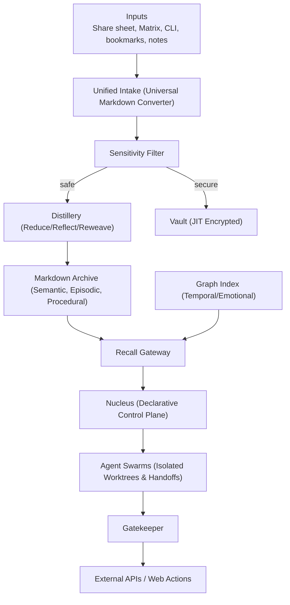

# Symbiotic Vision

Website: [symbiotic.sh](https://symbiotic.sh)

Related:
- Narrative: [`README.md`](../README.md)
- Naming: [`docs/NAMING-CANON.md`](./NAMING-CANON.md)
- Architecture specs: [`docs/architecture/`](./architecture/)
- Architecture 2.0 Pivot: [`docs/design/architecture-2.0-pivot.md`](./design/architecture-2.0-pivot.md)

## Core Idea

Symbiotic is a personal AI operating system that turns raw inputs into reliable action. It acts as a **Declarative Cognitive Control Plane**—you declare your thoughts, goals, and identity in Markdown, and the system autonomously reconciles reality to match them.

It is not just a database; memory is treated as **identity construction**. It is a distillery loop:

`Capture -> Intake -> Distillery -> Archive -> Recall -> Action -> Evolution`

## The Loop

## Product Principles

- **Human-directed autonomy via Declarative State**: AI executes based on Markdown manifests, human sets direction and approval boundaries.
- **Strict Security & Sovereign Sync**: Vault (JIT encryption) is entirely isolated from the Archive. Sync happens via Matrix E2EE and self-hosted Git, never public cloud repos.
- **Living Memory (Duality Architecture)**: Plain Markdown files for human ownership, overlaid with a local SQLite Graph Index using temporal and emotional (sentiment) weighting for agent routing.
- **Operational clarity**: One canonical naming model and one event model across all clients.
- **Continuous evolution**: System behavior and workflows improve through isolated worktrees and the 80% Context Handoff Protocol.
- **The Identity Stream UX**: The frontend is not an IT dashboard. It is a fluid, glassmorphic brain-interface, natively rendering the distillery stream of your thought graph.

## Concept Architecture

This is the conceptual view. Detailed contracts, schemas, and rollout sequencing live in architecture docs.

## Experience Direction

Onboarding should feel like a guided brain-interface boot sequence, while remaining technically honest:

`Signal Online -> Nucleus Boot -> Matrix Link -> Memory Channels -> Vault Seal -> Recall Calibration -> System Alive`

The core interaction shifts from static forms to a dynamic **Identity Stream** and **Command Palette**.

See: [`docs/architecture/setup-experience.md`](./architecture/setup-experience.md)
