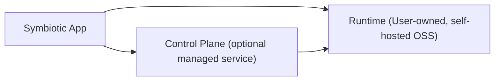

# Architecture Index

This repository is the legacy host and documentation anchor.
Canonical implementation is split across submodules under `submodules/`.

## Architecture Docs (this repo)

### Core Systems
- **Declarative control plane**: `control-plane/docs/architecture/control-plane.md` (ManifestParser, StateDiffer, GoalProcessManager, Reconciler)
- System map: `docs/architecture/system-map.md`
- Future system map target: `docs/design/system-map.md`
- Daemon bootstrap: `docs/architecture/daemon-bootstrap.md`
- Symbiotic daemon: `docs/architecture/symbiotic-daemon.md`
- Agent orchestration: `docs/architecture/agent-orchestration.md`
- Agent swarms: `docs/architecture/agent-swarms.md`

### Memory & Knowledge
- **Distillery pipeline**: `docs/architecture/distillery.md` (Reduce, Reflect, Verify, Reweave, Archive -- full knowledge processing)
- **Source Archeology**: `docs/architecture/source-archeology.md` (deep repo inspection pipeline — Excavate + Date live; later stages tracked in `docs/design/source-archeology.md`)
- Knowledge storage: `docs/architecture/knowledge-storage.md`
- Context graphs: `docs/architecture/context-graphs.md`
- Vector search: `docs/architecture/vector-search.md`
- Linked entities: `docs/architecture/linked-entities.md`
- Metrics layer: `docs/architecture/metrics-layer.md`
- Ingestion pipeline: `docs/architecture/ingestion-pipeline.md`
- Twitter ingestion: `docs/architecture/twitter-ingestion.md`
- Redaction policy: `docs/architecture/redaction-policy.md`

### Security & Trust
- Trust capabilities: `docs/architecture/trust-capabilities.md`
- Credential sandbox: `docs/architecture/credential-sandbox.md`
- Device trust bootstrap: `docs/architecture/device-trust-bootstrap.md`
- Session handles: `docs/architecture/session-handles.md`
- Tiered data protection: `docs/architecture/tiered-data-protection.md`

### Transport & Communication
- Matrix client: `docs/architecture/matrix-client.md`
- Matrix channels: `docs/architecture/matrix-channels.md`
- Queue system: `docs/architecture/queue-system.md`
- Queue persistence: `docs/architecture/queue-persistence.md`

### App & Deployment
- Symbiotic app: `docs/architecture/symbiotic-app.md`
- Install wizard: `docs/architecture/install-wizard.md`
- Setup experience: `docs/architecture/setup-experience.md`
- VPS deployment: `docs/architecture/vps-deployment.md`
- Zero-touch onboarding: `control-plane/docs/architecture/zero-touch-managed-onboarding.md`
- Onboarding: `docs/architecture/onboarding.md`
- Repo structure: `docs/architecture/repo-structure.md`
- Testing: `docs/architecture/testing.md`

### Boundaries
- Runtime/control-plane boundary: `control-plane/docs/architecture/runtime-control-plane-boundary.md`
- Goals layer: `docs/architecture/goals-layer.md`
- Browser automation: `docs/architecture/browser-automation.md`
- VM sandboxing: `docs/architecture/vm-sandboxing.md`
- Skills system: `docs/architecture/skills-system.md`
- AI provider management: `docs/architecture/ai-provider-management.md`
- Phone-only mode (Tier 3): `docs/architecture/phone-only-mode.md`
- Local LLM runtime: `docs/architecture/local-llm-runtime.md`
- MVP readiness: `docs/architecture/mvp-readiness.md`
- Context delivery: `docs/architecture/context-delivery.md`

### Archived
Superseded docs moved to `docs/architecture/archived/`:
- `timeline.md` — Initial planning timeline (superseded by ROADMAP.md with Arch 2.0 phases)
- `implementation-map.md` — Pre-pivot MVP implementation plan (superseded by control plane + ROADMAP)
- `eod-execution-plan.md` — One-day sprint plan from 2026-02-14 (no longer actionable)
- `execution-plan-autonomous-loop.md` — Pre-pivot execution plan (superseded by declarative control plane)
- `runtime-workflows.md` — Imperative workflow runner docs (superseded by declarative reconciler in control-plane.md)

## Split Repos (canonical code paths)

- Runtime architecture set:
  - `submodules/runtime/docs/architecture/system-map.md`
  - `submodules/runtime/docs/architecture/implementation-map.md`
  - `submodules/runtime/docs/architecture/mvp-readiness.md`
  - `submodules/runtime/docs/architecture/symbiotic-daemon.md`
- Control-plane API/contracts:
  - `submodules/control-plane/openapi/control-plane.v1.yaml`
  - `submodules/control-plane/apps/control-api/src/main.rs`
- Mobile app setup flow:
  - `submodules/app/lib/src/screens/setup_screen.dart`
- Cross-repo migration/status:
  - `submodules/dev/MIGRATION-MAP.md`
  - `submodules/dev/MVP-STATUS.md`

## Working Rule

- Keep architecture and product vision readable from this host repo.
- Implement runtime changes in `submodules/runtime`.
- Implement provisioning/control-plane changes in `submodules/control-plane`.
- Implement app UX and setup flow in `submodules/app`.
- Keep shared types in `submodules/runtime/crates/symbiotic-core`.

## Ownership Boundary

- Runtime must be installable/operable without control-plane.
- Control-plane exists to reduce setup friction (provision, bootstrap, lifecycle ops).
- User data plane (content, credentials, agent state) stays in runtime boundary.
