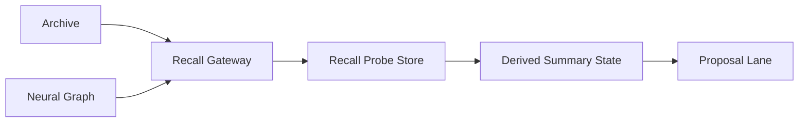

# Active Recall Probes

## Overview

Active Recall Probes are the derived retrieval-evaluation layer for Symbiotic memory. They do not add canonical memory truth. They measure whether existing `Archive` entries and `Neural Graph` entities are actually reachable through the live `Recall Gateway`.

## Implemented Behavior

- Probe targets are built from live active `Archive` documents and active graph entities backed by active memories.
- Probe queries are deterministic, not LLM-authored.
- Probe runs execute against the real configured `RecallGateway`.
- Results are persisted in a derived SQLite store under `data/runtime/recall-probes.db`.
- Run metrics are subject-based:
  - `subject_count` = number of probed subjects in the run
  - `matched_count` = number of subjects with at least one successful probe result
- Repeated failures update derived summary state and can emit proposals through the existing proposal lane.
- The daemon supports both explicit operator-triggered runs and periodic scheduled runs.
- The daemon HTTP API exposes read-only operator surfaces for:
  - `GET /api/recall-probes/health?limit=`
  - `GET /api/recall-probes/summary?target_kind=&target_id=`
  - `GET /api/recall-probes/runs/{run_id}`
  - `GET /api/recall-probes/regressions?run_id=&limit=`
- The Flutter app now consumes those read-only probe endpoints in `MemoryScreen` via a header-launched `Signals` sheet inside MEMORY, with per-target detail sheets and routed handoff into entity briefs or Archive entry detail.

## Boundaries

- `Archive` remains canonical truth.
- Probe state is derived and rebuildable.
- Remediation signals are hints only.
- Probe failures do not auto-edit Markdown and do not auto-promote canonical relationships.
- Proposal escalation stays in the review/approval lane.

## Flow

## Control Surface

Explicit control-room commands:

- `recall probe run [max_subjects]`
- `recall probe status <run_id>`
- `recall probe summary <archive_entry|graph_entity> <target_id>`
- `recall probe health [limit]`
- `recall probe regressions <run_id> [limit]`

The JSON `sym.c` surface also supports:

- `recall.probe.run`
- `recall.probe.status`
- `recall.probe.summary`

`recall.probe.run` may override:

- `top_k`
- `max_subjects`
- `max_queries_per_subject`

## Scheduled Execution

The daemon loop may run probes periodically using `DaemonConfig`:

- `recall_probe_interval_secs`
- `recall_probe_top_k`
- `recall_probe_max_subjects_per_run`
- `recall_probe_max_queries_per_subject`

The scheduler reuses the exact same execution path as the explicit operator command and routes resulting events to `#status`.

## Signals View

The first reporting surface is still `recall probe health [limit]`, but in the app it is presented as part of the MEMORY `Signals` sheet rather than a standalone `Health` tab.

It returns derived summary rows ordered by:

1. `unreachable`
2. `at_risk`
3. `healthy`

Then by:

- higher `consecutive_failures`
- lower `success_rate`
- newer `last_checked_at`

The same data is also available over the authenticated daemon HTTP API and is now surfaced in the app's `MemoryScreen > Review` surface as secondary diagnostics.

## Regression View

The daemon also supports `recall probe regressions <run_id> [limit]`.

This compares a completed run to the immediately previous completed run and reports:

- regressions: previously reachable targets now unreachable
- improvements: previously unreachable targets now reachable
- stable reachable / stable unreachable counts
- newly tracked targets in the current run
- dropped targets absent from the current run

The regression view is derived-only. It does not rewrite probe summaries and does not mutate canonical memory.

## Proposal Escalation

When a subject is `unreachable` for at least 3 consecutive runs:

- the latest run can emit a proposal event
- the proposal is stored in the existing in-memory proposal store
- approve/dismiss uses the normal `proposal.approve` / `proposal.dismiss` flow

Current proposal source: `recall_probe`

## Key Files

- `submodules/runtime/crates/symbiotic-memory/src/recall_probes.rs`
- `submodules/runtime/crates/symbiotic-memory/src/sqlite_schema.rs`
- `submodules/runtime/services/symbiotic-daemon/src/recall_probes.rs`
- `submodules/runtime/services/symbiotic-daemon/src/commands.rs`
- `submodules/runtime/services/symbiotic-daemon/src/http_api.rs`
- `submodules/runtime/services/symbiotic-daemon/src/main.rs`
- `submodules/app/lib/src/services/archive_sync_service.dart`
- `submodules/app/lib/src/screens/memory_screen.dart`

## Related Docs

- `docs/design/active-recall-probes.md`
- `docs/design/vault-as-truth.md`
- `docs/architecture/context-delivery.md`
