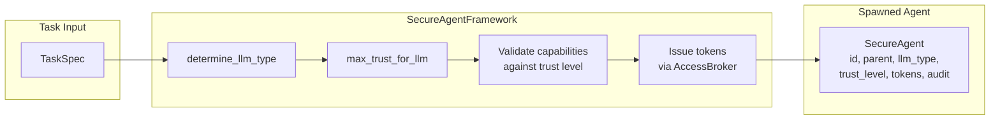
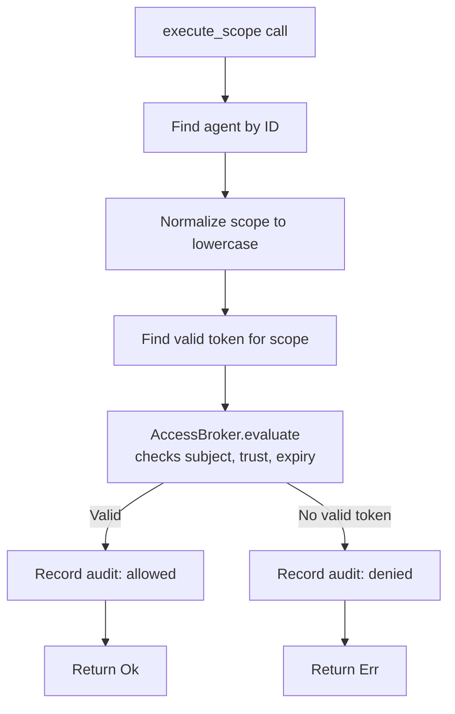
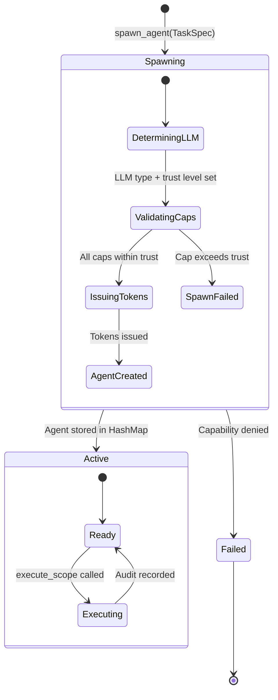
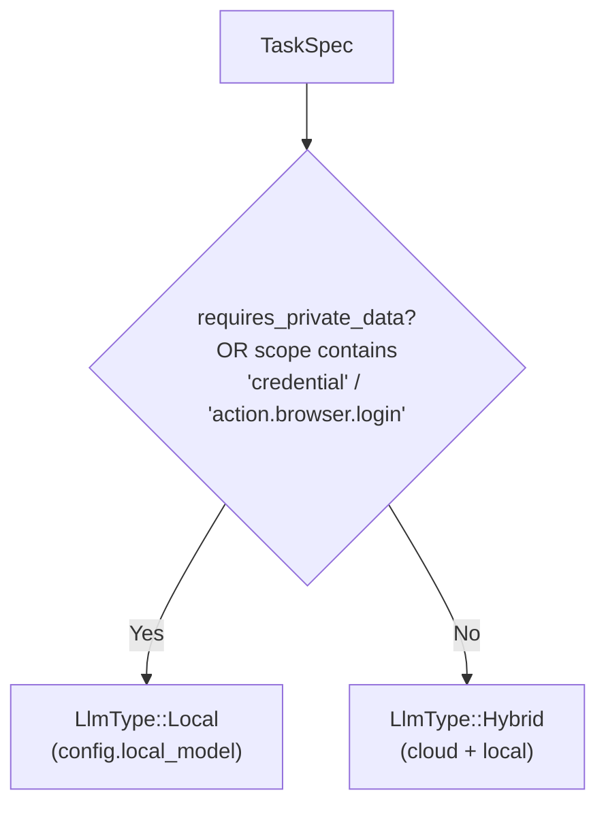
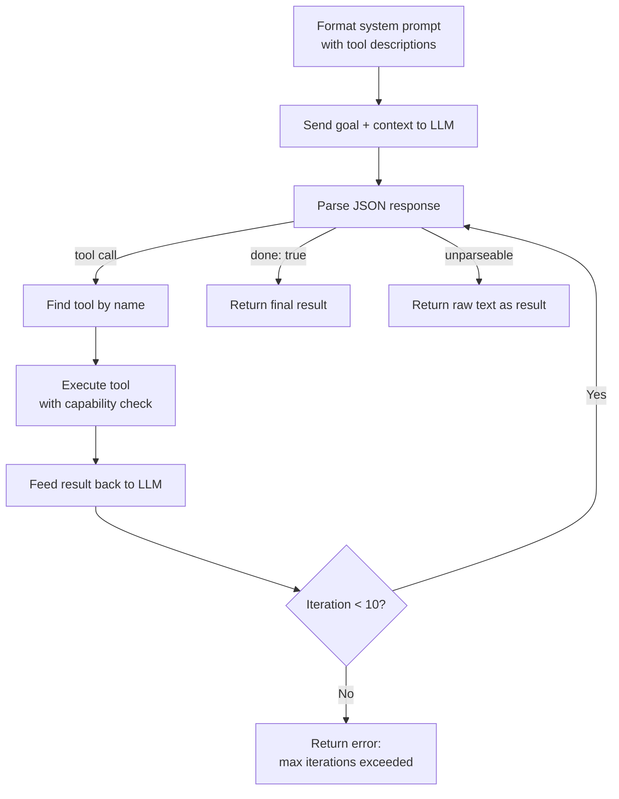

# Agent Orchestration Architecture

## Overview

The agent orchestration framework manages the lifecycle of secure AI agents, controlling how they are spawned, what capabilities they receive, how their actions are audited, and how they execute tasks via LLM-driven tool use. The core abstraction is `SecureAgentFramework`, which determines LLM routing based on task sensitivity, issues scoped capability tokens through the trust layer, and records an audit trail of every action. Agents execute via a ReAct-style loop that calls tools and feeds results back to the LLM until the task is complete.

**Implementation:** `submodules/runtime/crates/symbiotic-agents/src/` (lib.rs, llm.rs, tools.rs, builtin_tools.rs, executor.rs)

**Planned work:** see `docs/design/agent-orchestration.md` (forward reference; may not yet exist as a dedicated file — related planning lives in `docs/design/orchestration-integration.md` and `docs/design/agent-company-model.md`)

## Components

| Component | Location | Purpose |
|-----------|----------|---------|
| `SecureAgentFramework` | `symbiotic-agents/src/lib.rs` | Manages agent spawning, capability issuance, scope execution |
| `SecureAgent` | `symbiotic-agents/src/lib.rs` | Agent instance with identity, LLM type, trust level, tokens, audit trail |
| `LlmType` | `symbiotic-agents/src/lib.rs` | Enum: `Local { model }`, `Cloud { provider, model }`, `Hybrid { cloud, local }` |
| `AgentParent` | `symbiotic-agents/src/lib.rs` | Enum: `Goal { slug }`, `Stream { goal, stream }`, `User`, `System` |
| `TaskSpec` | `symbiotic-agents/src/lib.rs` | Task definition with capabilities and sensitivity flags |
| `AuditEntry` | `symbiotic-agents/src/lib.rs` | Timestamped record of scope execution (allowed/denied) |
| `AccessBroker` (Gatekeeper) | `symbiotic-trust/` | Capability token storage and evaluation (external dependency) |
| `LlmClient` trait | `symbiotic-agents/src/llm.rs` | Abstraction for LLM chat interactions (mockable) |
| `OllamaClient` | `symbiotic-agents/src/llm.rs` | Production client for Ollama HTTP API (`POST /api/chat`) |
| `Tool` trait | `symbiotic-agents/src/tools.rs` | Interface for agent-callable tools |
| `RecallTool` | `symbiotic-agents/src/builtin_tools.rs` | Queries Recall Gateway for context |
| `ArchiveTool` | `symbiotic-agents/src/builtin_tools.rs` | Writes entries to the Archive |
| `QueueTool` | `symbiotic-agents/src/builtin_tools.rs` | Submits jobs to the Queue |
| `run_agent` | `symbiotic-agents/src/executor.rs` | ReAct-style execution loop (iteration cap and buffer size are tunable per the `agent_tunables` pattern, not hard-coded constants) |

## Data Flow

### Scope Execution Flow

## State Diagram: Agent Lifecycle

## LLM Routing

The `determine_llm_type` method routes agents to appropriate LLM backends:

### Trust Level Mapping

Each LLM type maps to a maximum trust level via `max_trust_for_llm`:

| LLM Type | Max Trust Level | Rationale |
|----------|----------------|-----------|
| `Local` | `ExternalAct` | Full trust; data stays on device |
| `Cloud` | `ArchiveWrite` | Moderate trust; no credential access |
| `Hybrid` | `CredentialAccess` | Mixed; local handles sensitive parts |

### Scope-to-Trust Mapping

The `required_trust_for_scope` function maps capability scopes to minimum trust levels:

| Scope Pattern | Required Trust |
|--------------|---------------|
| `action.browser.login` | `ExternalAct` |
| `vm.network.modify` | `ExternalAct` |
| `credential` | `CredentialAccess` |
| `archive.write` | `ArchiveWrite` |
| `vm.*` (other vm scopes) | `ArchiveWrite` |
| Everything else | `ReadOnly` |

## Agent Execution Flow

The `run_agent` function in `executor.rs` implements a ReAct-style loop:

### Tool Interface

Tools implement the `Tool` trait with `name`, `description`, `parameters_schema`, and `execute`. Each built-in tool checks capability tokens before executing via a `CapabilityChecker` trait, keeping the security boundary enforced at the tool level.

### Built-in Tools

| Tool | Scope Required | Backend Trait | Purpose |
|------|---------------|---------------|---------|
| `RecallTool` | `archive.read` | `RecallBackend` | Query Archive for context |
| `ArchiveTool` | `archive.write` | `ArchiveBackend` | Write entries to Archive |
| `QueueTool` | `queue.submit` | `QueueBackend` | Submit jobs to Queue |

### LLM Client

The `LlmClient` trait abstracts LLM interactions. The production implementation (`OllamaClient`) calls Ollama's HTTP API at `POST {base_url}/api/chat`. JSON mode is supported via the `format: "json"` parameter. Default model is `qwen3.5`, configurable via `LlmConfig`.

## Key Decisions

### 1. Sensitivity-Based LLM Routing

**Decision:** Tasks involving credentials or private data are always routed to local LLM.

**Rationale:** Cloud LLMs could leak sensitive data through logs, prompt injection, or API interception. Local-only routing eliminates this attack surface entirely.

**Implementation:** `determine_llm_type` checks `requires_private_data` and scans capability scopes for `credential` or `action.browser.login`.

### 2. Capability Tokens with 1-Hour Expiry

**Decision:** Each capability is issued as a scoped token with a 1-hour TTL.

**Rationale:** Time-bounded tokens limit blast radius of compromised agents. Short expiry forces re-authorization, maintaining continuous mediation.

**Implementation:** `spawn_agent` sets `expires_at: now + 3600` on each `CapabilityToken`.

### 3. Trust Ceiling Per LLM Type

**Decision:** Agent trust level is capped by its LLM type, not the task request.

**Rationale:** Prevents privilege escalation; a cloud agent cannot request credential-level capabilities regardless of task specification.

**Implementation:** `max_trust_for_llm` returns the ceiling; `spawn_agent` rejects capabilities requiring higher trust.

### 4. Audit Trail on Every Scope Execution

**Decision:** Both allowed and denied scope executions are recorded in the agent's audit trail.

**Rationale:** Full audit history enables post-hoc security review and anomaly detection. Denied attempts are especially valuable for detecting misbehaving agents.

### 5. Agent Message Buffer Guard

**Decision:** The agent execution loop enforces a per-agent buffer-size limit on the accumulated message buffer (historically 2 MiB as a default; now exposed via the `agent_tunables` pattern so individual agent roles can raise or lower it).

**Rationale:** Prevents runaway context accumulation from verbose tool outputs or looping agents from exhausting memory. The guard triggers before the next LLM call, returning an error rather than silently truncating.

**Implementation:** `run_agent` in `executor.rs` sums message sizes each iteration and returns `Err` if the buffer exceeds the configured limit.

### 6. ReAct-Style Execution with Max Iteration Guard

**Decision:** Agent execution follows a ReAct loop capped at a configurable maximum iteration count (historically 10 as a default; now exposed via the `agent_tunables` pattern so individual agent roles can set their own ceiling).

**Rationale:** Prevents runaway agents from consuming unbounded LLM calls. The default is sufficient for most single-task goals while providing a safety net; specialist roles can override it.

**Implementation:** `run_agent` in `executor.rs` counts iterations and returns an error if the configured limit is exceeded.

### 7. Capability Checks at Tool Level

**Decision:** Each tool checks capability tokens before executing, rather than checking at the executor level.

**Rationale:** Defense in depth. Even if the executor is bypassed or a tool is used outside the standard loop, capability enforcement still applies. Tools receive a `CapabilityChecker` trait object to keep the check decoupled from the framework internals.

### 8. Backend Traits for Tool Dependencies

**Decision:** Built-in tools use injected trait objects (`RecallBackend`, `ArchiveBackend`, `QueueBackend`) rather than depending directly on the corresponding crates.

**Rationale:** Keeps `symbiotic-agents` free of transitive dependencies on `symbiotic-context`, `symbiotic-archive`, and `symbiotic-queue`. Integration code wires concrete implementations at runtime. This also makes tools fully testable with mocks.

## Error Handling

| Scenario | Behavior |
|----------|----------|
| Capability exceeds agent trust level | `spawn_agent` returns `Err` with details; agent is not created |
| No valid token for requested scope | `execute_scope` records "denied" audit entry, returns `Err` |
| Agent not found | `execute_scope` returns `Err("agent not found")` |
| Token expired | `AccessBroker.evaluate` fails; treated same as no valid token |
| Mutex poisoned | Returns `Err` or `None` (graceful degradation; no panics in production lock paths) |
| Ollama unavailable | `LlmClient.chat` returns `Err` with connection details |
| Tool execution failure | Recorded in `ToolCallRecord`, fed back to LLM for recovery |
| Max iterations exceeded | `run_agent` returns `Err` with iteration count |
| Message buffer exceeds configured limit | `run_agent` returns `Err` before next LLM call |
| Unknown tool requested | Recorded as failed tool call, LLM informed |

## Related Components

| Component | Relationship |
|-----------|--------------|
| [Trust & Capabilities](./trust-capabilities.md) | Provides `AccessBroker`, `CapabilityToken`, `AgentTrustLevel` |
| [Credential Sandbox](./credential-sandbox.md) | Credentials accessed only via local-routed agents |
