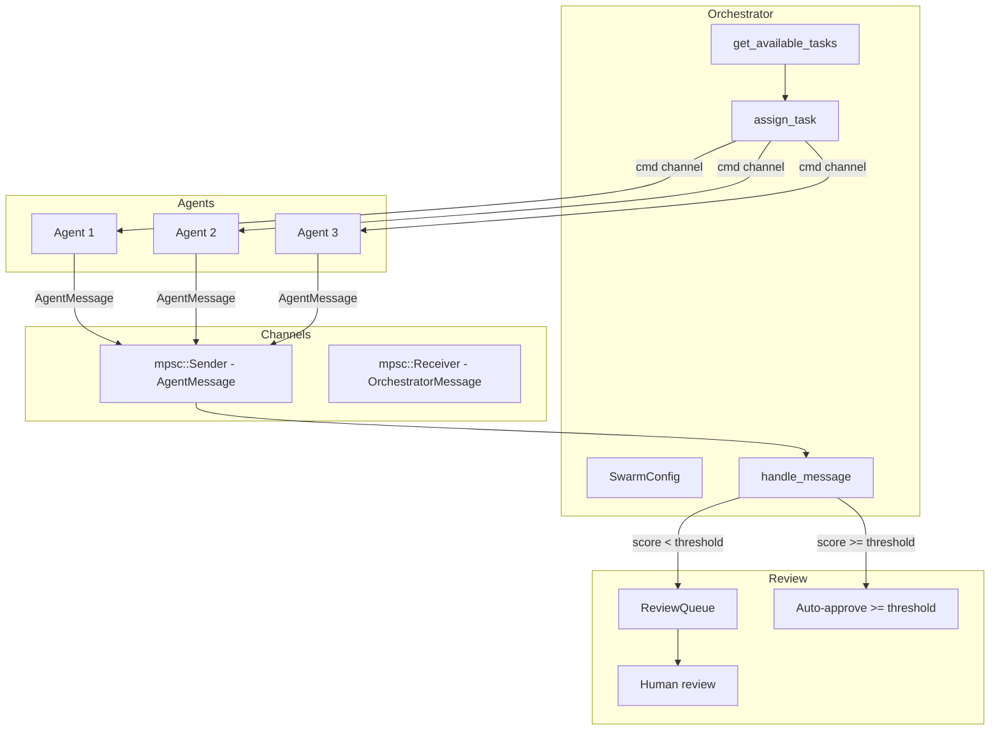

# Agent Swarms

## Overview

Agent swarms enable multiple AI agents to work in parallel on a shared task set. The `SwarmOrchestrator` manages task distribution, channel-based agent coordination, and a review queue for human-in-the-loop approval.

Implemented in `submodules/runtime/crates/symbiotic-agents/src/swarm.rs`.

## Components

| Module | Purpose |
|--------|---------|
| `SwarmConfig` | Configuration: max parallel, total agents, auto-approve threshold |
| `SwarmOrchestrator` | Priority-based task distribution, agent lifecycle, message handling |
| `SwarmTask` | Task with priority, dependencies, file read/write sets, retry tracking |
| `AgentMessage` / `OrchestratorMessage` | Typed channel messages (tokio::mpsc) |
| `ReviewQueue` | Aggregates completed work for human review; supports persistence |

## Data Flow

## Key Decisions

1. **Priority-based greedy distribution**: Tasks sorted by (priority ASC, id ASC). Critical tasks run first.
2. **Channel coordination (no shared mutable state)**: Each agent gets a `mpsc::Sender<AgentMessage>` to report to the orchestrator and a `mpsc::Receiver<OrchestratorMessage>` for commands (cancel).
3. **Write-conflict detection**: `can_parallelize()` checks for overlapping write paths and read-write conflicts between candidate tasks.
4. **Auto-approve threshold**: Configurable score threshold (default 0.85). High-scoring results are auto-approved; low scores enter the review queue.
5. **Single retry on failure**: Failed tasks are re-queued once. Second failure marks the task as permanently failed.
6. **Review queue persistence**: Optional JSON persistence for the review queue (in-memory mode for tests).

## Error Handling

| Failure | Handling |
|---------|----------|
| Agent failure | Retry once (re-queue as Pending), then mark Failed |
| Max parallel reached | `assign_task` returns error; caller waits for a slot |
| Max total agents reached | `assign_task` returns error; no more agents can be spawned |
| Channel disconnected | Agent presumed dead; cancel cleans up orchestrator state |
| Task not found | Operations return descriptive errors |

## Related Docs

- Design doc: `docs/design/agent-swarms.md`
- Agent framework: `docs/architecture/agent-orchestration.md`
- Trust & capabilities: `docs/architecture/trust-capabilities.md`
