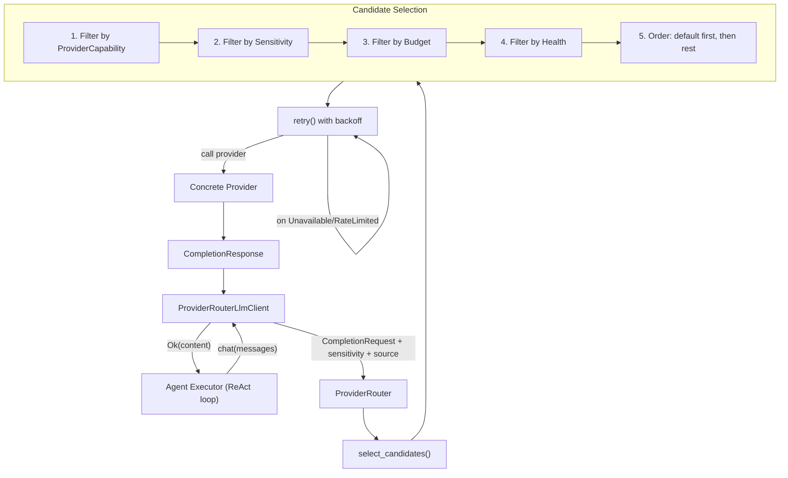
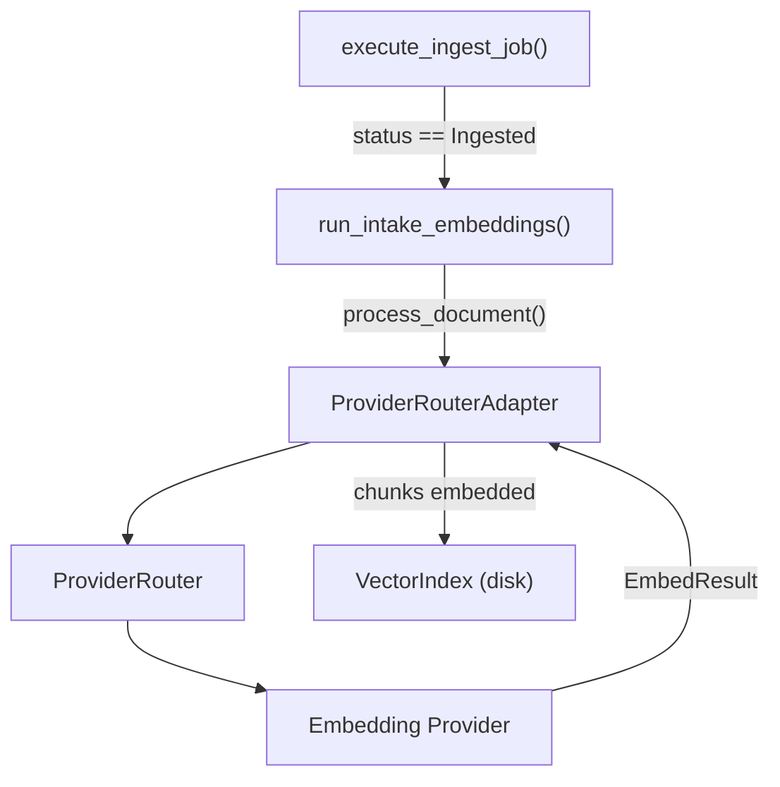
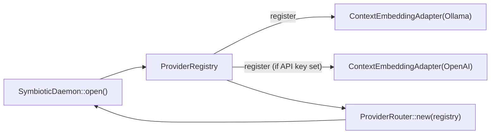

# AI Provider Management

## Overview

Unified multi-provider AI abstraction with sensitivity-aware routing, budget enforcement, health checking, retry logic, and token metering. The `symbiotic-providers` crate provides a single entry point for all AI model interactions (completions, embeddings, image generation, video generation, and autonomous agent tasks) so that every consumer in the system (agents, ingestion, recall) uses the same routing and enforcement infrastructure. The daemon wires concrete providers into a `ProviderRouter` at startup, and the `ProviderRouterLlmClient` adapter bridges the router into the agent executor's `LlmClient` trait, making the full provider infrastructure transparent to agent code.

## Components

### Crate: `symbiotic-providers`

Location: `submodules/runtime/crates/symbiotic-providers/`

| File | Purpose |
|------|---------|
| `src/lib.rs` | Re-exports all public types at crate root |
| `src/traits.rs` | `ModelProvider`, `CompletionProvider`, `EmbeddingProvider`, `ImageProvider`, `VideoProvider`, `AgentProvider` |
| `src/types.rs` | Request/response types (`CompletionRequest`, `ChatMessage`, `Role`, `ProviderCapability`, `CapabilitySet`, `ProviderClass`, `PricingInfo`, `UsageRecord`) |
| `src/error.rs` | `ProviderError` enum (11 variants covering unavailable, sensitivity, budget, auth, rate-limit, agent lifecycle) |
| `src/registry.rs` | `ProviderRegistry` — stores `RegisteredProvider` entries, lookup by name/capability/class, defaults per capability |
| `src/routing.rs` | `ProviderRouter` — selection algorithm, retry with exponential backoff, `HealthChecker` trait |
| `src/metering.rs` | `UsageLog`, `MeteredCompletionProvider`, `MeteredEmbeddingProvider`, usage aggregation and querying |
| `src/budget.rs` | `BudgetEnforcer` — per-provider and global daily/monthly budget limits |
| `src/config.rs` | TOML config parsing (`ProvidersConfig`, `ProviderConfig`, `BudgetConfig`) |
| `src/auth.rs` | `ProviderAuth`, `CredentialResolver`, `EnvVarResolver` |
| `src/completion/` | Concrete providers: `OllamaCompletionProvider`, `OpenAiCompletionProvider`, `AnthropicProvider`, `GenericOpenAiCompatProvider` |
| `src/embedding/` | Re-exports (embeddings currently bridged from `symbiotic-context` via adapters) |
| `src/image/` | `OpenAiImageProvider`, `StubImageProvider` |
| `src/video/` | `StubVideoProvider` |
| `src/agent/` | `ClaudeCodeProvider`, `CodexProvider` (stubs for external agent services) |

### Daemon Integration

Location: `submodules/runtime/services/symbiotic-daemon/`

| File | Purpose |
|------|---------|
| `src/lib.rs` | Daemon startup: builds `ProviderRegistry`, registers providers, creates `ProviderRouter`; contains `ContextEmbeddingAdapter` and `ProviderRouterAdapter` bridges |
| `src/agents.rs` | `ProviderRouterLlmClient` adapter, `make_llm_client()`, `provider_router()` accessor |

## Trait Hierarchy

Every provider implements `ModelProvider` for metadata (name, class, model, capabilities, pricing). Specific capabilities are expressed through additional traits:

```
ModelProvider (base)
  +-- CompletionProvider  (text completion / chat)
  +-- EmbeddingProvider   (text embedding generation)
  +-- ImageProvider        (image generation)
  +-- VideoProvider        (video generation)
  +-- AgentProvider        (autonomous agent task execution)
```

`ProviderClass` classifies where a provider runs:
- `Local` — runs on user hardware (Ollama, ComfyUI)
- `Cloud` — calls a remote API (OpenAI, Anthropic)
- `Aggregator` — proxies through a multi-model API (OpenRouter, Venice)

## Data Flow



### Embedding Flow (Intake Pipeline)



### Provider Registration at Startup



## Sensitivity Routing

The `Sensitivity` enum (from `symbiotic-core`) drives data classification:

| Sensitivity | Allowed Provider Classes | Example Content |
|-------------|------------------------|-----------------|
| `Shareable` | Local, Cloud, Aggregator | Public articles, open-source code |
| `Restricted` | Local only | Personal notes, private repos |
| `Private` | Local only | Medical records, financial data |

When no local provider is available for restricted/private content, the router returns `ProviderError::SensitivityViolation` rather than silently routing to the cloud.

## Agent Executor Integration

The `ProviderRouterLlmClient` adapter in `agents.rs` implements the `LlmClient` trait (from `symbiotic-agents`) by delegating to `ProviderRouter::complete()`. This allows the agent executor's ReAct loop to use the full provider infrastructure transparently.

**Type mapping**: The agents crate uses `ChatMessage` with string roles (`"system"`, `"user"`, `"assistant"`), while the providers crate uses a `Role` enum. The adapter converts between these on every call. Unknown role strings default to `Role::User`.

**Construction**: `SymbioticDaemon::make_llm_client(sensitivity)` creates a `ProviderRouterLlmClient` with the daemon's shared `ProviderRouter` and a sensitivity level derived from the agent's task context. The source attribution string is `"agent_execution"` for metering.

## Key Decisions

- **Adapter pattern over trait rewrite**: The `ProviderRouterLlmClient` adapter bridges `ProviderRouter` to `LlmClient` without changing the existing `LlmClient` trait. This keeps the change additive; the old `OllamaClient` still works for testing or fallback.

- **Sensitivity set per-agent at spawn time**: Rather than inferring sensitivity per-request, the sensitivity level is fixed when the `ProviderRouterLlmClient` is created. This matches the trust model: an agent handling private data should never route any of its completions through cloud providers.

- **`symbiotic-providers` has no dependency on `symbiotic-agents` or `credential-gateway`**: The crate depends only on `symbiotic-core` for shared types (`Sensitivity`). The daemon implements the bridge between the two. This prevents circular dependencies and keeps the provider crate lightweight.

- **Embedding providers bridged from `symbiotic-context`**: Existing `OllamaProvider` and `OpenAiProvider` from `symbiotic-context` are wrapped in `ContextEmbeddingAdapter` at daemon startup rather than being rewritten. The `ProviderRouterAdapter` bridges the `ProviderRouter` back to the `EmbedRouter` trait expected by `IntakeEmbeddingProcessor`.

- **Selection algorithm order**: ProviderCapability -> Sensitivity -> Budget -> Health -> Default preference. This ordering ensures security constraints (sensitivity) are checked before cost constraints (budget), and health is checked last because it requires async I/O.

- **Retry only on transient errors**: `Unavailable` and `RateLimited` errors trigger exponential-backoff retry. All other error types (`AuthFailed`, `BudgetExceeded`, `SensitivityViolation`, `RequestFailed`) are returned immediately since retrying them is pointless.

## Error Handling

`ProviderError` is the unified error type for all provider operations:

| Variant | Meaning | Retryable? |
|---------|---------|------------|
| `Unavailable` | Provider not reachable or not configured | Yes |
| `RateLimited` | Provider rate-limiting requests (includes `retry_after_ms`) | Yes |
| `RequestFailed` | Provider returned a failure response | No |
| `InvalidResponse` | Response could not be parsed | No |
| `SensitivityViolation` | Content too sensitive for provider class | No |
| `UnsupportedCapability` | Provider does not support requested capability | No |
| `BudgetExceeded` | Usage budget exceeded | No |
| `AuthFailed` | Authentication failed | No |
| `ConfigError` | Invalid or missing configuration | No |
| `TaskCancelled` | Agent task cancelled before completion | No |
| `TaskTimeout` | Agent task exceeded timeout | No |

**Error flow in the agent adapter**: `ProviderRouterLlmClient::chat()` maps any `ProviderError` to an `anyhow::Error` with the message `"provider router completion failed: {e}"`. The agent executor receives this as a standard `Result::Err` and can decide whether to retry or abort the task.

**Error flow in the embedding pipeline**: `run_intake_embeddings()` in the daemon is best-effort. Embedding failures are logged with `tracing::warn` but never propagate to the ingest pipeline caller. This keeps ingestion reliable even when embedding providers are offline.
