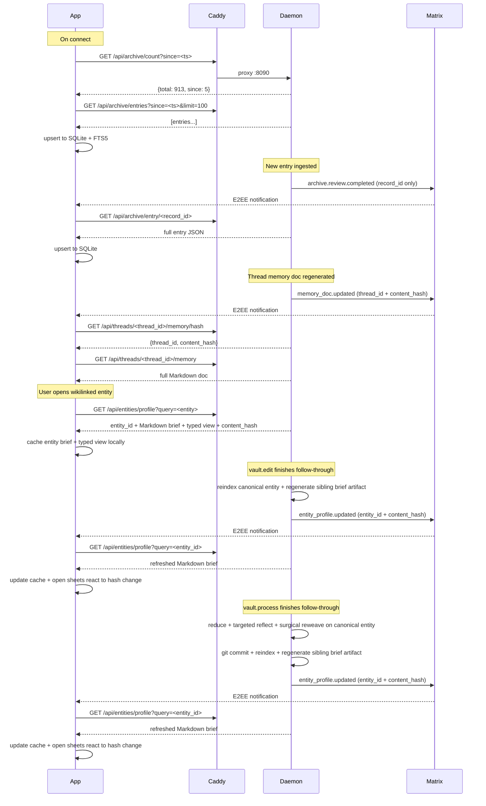

# Archive Sync — Local Storage + Generated Brief Fetch

## Overview

One-way sync of Archive-derived query surfaces to the app's local SQLite store. Canonical truth stays in `knowledge-base/`; the app syncs only read surfaces over HTTP: `Archive` entries, Thread Memory Docs, and generated entity brief docs. Entity profile responses now include both the generated Markdown brief and a typed structured view (summary, active facts, archived facts, active relationships, relationship-history entries, references), so the app no longer reparses Markdown as its data contract. The raw Markdown still renders underneath as the readback artifact.

## Architecture

## Components

### Daemon HTTP API (`services/symbiotic-daemon/src/http_api.rs`)

Axum router on port 8090 (configurable via `SYMBIOTIC_HTTP_PORT`).

| Endpoint | Method | Description |
|----------|--------|-------------|
| `/api/archive/entries` | GET | Paginated list, `?since=&limit=&offset=` |
| `/api/archive/entry/{record_id}` | GET | Single entry with full content |
| `/api/archive/count` | GET | Total count + count since timestamp |
| `/api/threads/{thread_id}/memory` | GET | Thread Memory Doc as Markdown |
| `/api/threads/{thread_id}/memory/hash` | GET | Thread Memory Doc content hash |
| `/api/threads/{thread_id}/memory/history` | GET | Canonical Git history for the generated Thread Memory Doc file |
| `/api/threads/{thread_id}/memory/diff?commit=` | GET | Per-commit diff for the generated Thread Memory Doc file |
| `/api/entities/profile?query=` | GET | Generated entity brief Markdown plus typed structured sections resolved by entity id/name/alias |
| `/api/entities/profile/hash?query=` | GET | Entity profile content hash |
| `/api/entities/history?query=` | GET | Canonical Git history for the entity record resolved by entity id/name/alias |
| `/api/entities/history/diff?query=&commit=` | GET | Per-commit diff for the canonical entity record |
| `/api/memory-integrity/contradictions?limit=` | GET | Derived contradiction snapshot for operator review surfaces |
| `/api/health` | GET | Health check |

Auth: Bearer token validated against Conduit's `/_matrix/client/v3/account/whoami`.

### App Local Store (`services/archive_store.dart`)

SQLite database (`symbiotic_archive.db`) with:
- `archive_entries` — main table
- `archive_entries_fts` — FTS5 virtual table (title + content)
- `archive_links` — wikilink edges (source_id, target_title)
- `thread_memory_docs` — cached Thread Memory Doc Markdown + content hash
- `entity_profile_docs` — cached generated entity brief Markdown + typed view JSON + content hash
- `sync_state` — key-value (last_sync_ts)

### App Sync Service (`services/archive_sync_service.dart`)

- `initialSync()` — paginated fetch since last sync, upserts to local store
- `fetchEntry(recordId)` — single entry fetch, triggered by Matrix notification
- `onArchiveNotification(details)` — event handler wired via EventRouter
- `fetchThreadMemoryDoc(threadId)` — fetch Thread Memory Doc Markdown + hash
- `onThreadMemoryNotification(threadId, details)` — refresh handler for `memory_doc.updated`
- `fetchEntityProfileDoc(query, expectedHash?)` — fetch generated entity brief Markdown + typed view on demand or conditional refresh
- `onEntityProfileNotification(entityId, details)` — refresh handler for `entity_profile.updated`

### Data Flow

1. App connects → `_initArchiveSync()` opens store, configures sync service
2. `initialSync()` fetches entries since `last_sync_ts` via HTTP
3. Entries upserted to SQLite, FTS5 index + wikilinks updated
4. On `archive.review.completed` Matrix event → `fetchEntry()` via HTTP
5. On `memory_doc.updated` Matrix event → app checks thread doc hash and fetches updated Markdown when needed
6. Open Thread Memory sheets now reconcile local cache/hash changes while they are visible, so daemon follow-through can refresh the sheet without requiring the operator to dismiss and reopen it
7. The Thread Memory sheet can now open a `Git History` drill-down fetched on demand from the daemon, and each Git row can open the exact file-level diff for one commit without leaving the thread-memory surface
8. On wikilink open from thread memory or Memory UI → app resolves entity links into generated entity briefs, and thread links into real thread navigation, so cross-memory references do not dead-end inside the sheet
9. On `entity_profile.updated` Matrix event → app compares the announced hash against the local entity brief cache and re-fetches only when it changed
10. MemoryScreen queries local store for Feed, Search (FTS5), and Graph while `ChatView` can open a Thread Memory Doc sheet and entity brief sheets backed by the same local cache
11. Entity brief sheets consume the cached typed view for editing and quick inspection, still render the raw Markdown brief below, can apply optimistic local typed-view updates while a direct edit is syncing, and then reconcile against cache updates when the local hash changes
12. The entity brief history surface is now unified at the app layer: archived facts and relationship changes are rendered as one typed `History` timeline with filterable browsing (`All`, `Facts`, `Relationships`) plus tap-for-detail inspection, while canonical truth remains split between active sections and `## History` in the underlying Markdown record
13. That same `History` card can now open a `Git History` drill-down fetched on demand from the daemon, and each Git row can open the exact file-level diff for one commit without leaving the entity brief surface
14. Semantic history rows in the entity brief now derive direct commit provenance from the canonical record’s Git patch history: both archived facts and relationship changes can carry a specific commit hash in the typed view and generated brief without requiring a second annotation write to the canonical Markdown record
15. When a semantic history row already carries that derived commit metadata, the entity brief can jump directly from the row’s detail dialog into the exact Git diff without forcing the operator back through the broader Git history list first
16. Relationship-history detail dialogs are no longer text-only dead ends: from one history row the operator can now jump directly into the previous or replacement related brief, so semantic record browsing can move laterally across linked entities without leaving the canonical memory workspace
17. When the user triggers the Process action from the entity brief sheet, the app submits `vault.process` with the selected canonical Markdown text, and the daemon mutates the same canonical entity record before driving the same brief-hash refresh loop as `vault.edit`
18. After that refresh lands, the app derives any newly added facts from the refreshed typed view and visually highlights them in the entity brief sheet, without treating the optimistic local state as canonical truth
19. When the user removes an outgoing relationship from the entity brief sheet, the app submits `vault.edit { operation: remove_relationship }`; the daemon removes the active link from the canonical record, appends a semantic history entry under `## History`, regenerates the `.brief.md`, and the refreshed typed view exposes that relationship history back to the app
20. When the user edits an outgoing relationship target from the entity brief sheet, the app submits `vault.edit { operation: replace_relationship }`; the daemon rewrites the active link in the canonical record, appends a `replaced:` semantic history entry under `## History`, regenerates the `.brief.md`, and the refreshed typed view exposes both the new active relationship and the replacement history row back to the app
21. Before any canonical write hits disk, the daemon-side writer runs the strict Vault linter against the resulting `{slug}.md`; malformed section order, legacy `## Archived`, or generated-artifact misuse are rejected before git follow-through
22. `MemoryScreen > Review` now opens a full-screen `Memory Review` queue over the same sync lane: contradiction/integrity snapshots from `/api/memory-integrity/contradictions` are the primary review items, while recall-probe health from `/api/recall-probes/*` lives behind a separate `Open Diagnostics` drill-down instead of sharing the main review queue.
23. Contradiction review no longer stops in a generic diagnostics sheet: a contradiction row opens a dedicated full-screen review detail, and from there the operator can jump directly into the generated entity brief for that entity with the conflicting fact texts highlighted for canonical resolution.
24. The contradiction snapshot now carries a deeper investigation payload beyond the raw fact pair: the daemon includes a human-readable investigation summary, per-fact evidence excerpts/provenance, plus an optional preferred fact/reason when confidence, disposition, authorship, or recency produce a clear winner, and the app renders that as a recommendation-first review detail instead of forcing the operator to infer everything from two bare facts.
25. The contradiction payload is now explicitly triaged: each row carries `needs_review` plus a conservative `resolution_confidence_percent`, and the full-screen `Memory Review` queue only shows contradictions whose investigation still falls below that threshold. Clear-winner contradictions remain tracked in the snapshot for future diagnostics without interrupting the user.
26. When multiple conflicting facts are highlighted, that `Resolve Contradiction` card now exposes direct per-fact `Edit` / `Archive` controls inline for each highlighted fact instead of forcing the operator through a secondary picker first; `Process Contradiction` remains the bulk Distillery path for rewriting the whole conflict set together
27. Recall-probe detail sheets now resolve to the underlying target type instead of staying diagnostic-only: `graph_entity` targets hand off into the entity brief surface, while `archive_entry` targets fetch and open the synced Archive entry detail, so retrieval-health investigation converges back onto real operator surfaces instead of fragmenting into debug-only views

## Key Decisions

- **One-way sync (daemon → app)**: Local store is read-only cache. Edits flow through daemon via Matrix commands.
- **HTTP for data, Matrix for notifications**: Matrix events carry only lightweight metadata (record_id, title). Full content fetched via HTTP to avoid E2EE payload size limits.
- **Thread Memory Docs stay file-backed**: the daemon serves them directly from `knowledge-base/threads/`; they are not duplicated into the Archive entries list.
- **Entity briefs are generated read surfaces, not Archive entries**: the app fetches them on demand from `knowledge-base/ledger/{type}/{slug}/{slug}.brief.md`; they are cached locally but remain distinct from the Archive receipts/feed.
- **Canonical edits target the colocated truth record**: `vault.edit` mutates `knowledge-base/ledger/{type}/{slug}/{slug}.md`, then follow-through regenerates the sibling `.brief.md` artifact and emits the updated brief hash to the app.
- **Canonical writes are lint-gated**: direct writes and `vault.process` now validate the final canonical record shape before writing, so the runtime contract for `Facts` → `Relationships` → `History` is enforced instead of being only a doc convention.
- **Fact edits stay semantically honest**: replacing a fact now uses one canonical `replace_fact` mutation that archives the old fact and adds the new fact atomically in the same Markdown write, instead of faking an edit as two unrelated UI operations.
- **Relationship removal is semantic, not silent**: removing an outgoing relationship no longer means “delete and rely on Git later”; the canonical record keeps the active graph clean while appending an explicit `## History` → `### Relationship Changes` entry that the generated brief and typed app view can surface directly.
- **Semantic history provenance is derived, not re-written**: archived facts and relationship changes now pick up their exact commit hash by matching the canonical history line against Git patch history during brief/view generation; this preserves single-commit canonical writes while still letting the app deep-link from a history row to the exact diff.
- **LLM-assisted canonical edits use the same follow-through**: `vault.process` now runs a targeted Distillery pass against one canonical entity, and the entity brief sheet can invoke it directly from a real text selection in the generated Markdown readback before reusing the same git commit, re-index, sibling brief regeneration, and `entity_profile.updated` refresh path as `vault.edit`.
- **Entity brief UI is hybrid, not Markdown-editing**: active facts, archived facts, active relationships, and relationship-history rows now travel as typed sections in the daemon response, while the generated Markdown brief remains visible as the read surface.
- **Entity brief notifications happen only after real follow-through**: both `vault.edit` and `vault.process` regenerate the generated entity brief artifact before emitting `entity_profile.updated`, so app refreshes are tied to actual updated docs, not optimistic assumptions.
- **Optimistic edits stay local to the typed view**: the sheet may show add/archive/relationship changes immediately for UX continuity, but canonical truth, cache hashes, and the Markdown brief remain daemon-driven until follow-through completes.
- **Process-result highlighting is derived from the refreshed canonical view**: after `vault.process`, the app highlights only facts that are newly present in the refreshed typed view compared with the pre-process snapshot, so the visible “new” state is based on daemon-confirmed output rather than the request payload.
- **FTS5 for search**: Good enough for MVP. Later: sync pre-computed embedding vectors for semantic search.
- **No CRDT/PowerSync**: One-way sync doesn't need conflict resolution.
- **Separate database**: `symbiotic_archive.db` is independent from Matrix SDK's database.

## Error Handling

- HTTP failures during sync: logged, `lastError` exposed on sync service
- Auth token expiry: returns 401, app can re-authenticate
- Partial sync: entries already upserted remain, `last_sync_ts` only updated after full batch completes
- Store not open: `StateError` thrown if methods called before `open()`
