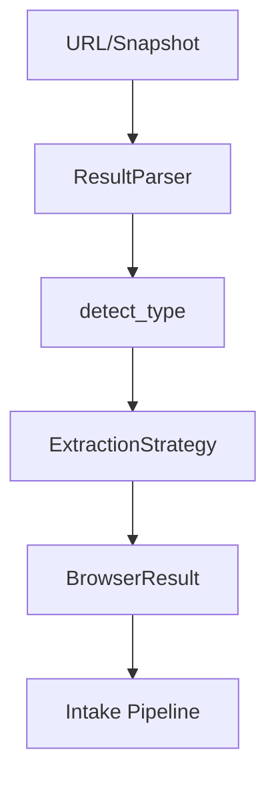

# Browser Automation

## Overview

Browser automation provides typed content extraction from web pages, session profile management for authenticated sites, and a login handoff state machine that ensures cloud AI never handles credentials. Implemented in `submodules/runtime/crates/symbiotic-browser/`.

## Components

| Component | File | Purpose |
|-----------|------|---------|
| `types` | `src/types.rs` | `BrowserResult`, `ExtractionType`, `ExtractedContent`, `ExtractedLink`, `ExtractedImage` |
| `extraction` | `src/extraction.rs` | `ResultParser`, `ExtractionStrategy` trait, `GenericStrategy`, `TweetStrategy`, `ArticleStrategy` |
| `session` | `src/session.rs` | `SessionProfile`, `ProfileManager`, `Viewport`, `ProxyConfig` |
| `handoff` | `src/handoff.rs` | `LoginHandoff` state machine, `HandoffState`, `HandoffEvent`, `LoginActor` |

## Data Flow

## Key Decisions

- **Typed extraction**: `BrowserResult` carries `ExtractionType` and structured `ExtractedContent` rather than raw text.
- **Strategy pattern**: `ExtractionStrategy` trait allows site-specific parsers (Tweet, Article, Generic) with custom strategies registerable at runtime.
- **Auto-detection**: `ResultParser.detect_type()` selects strategy based on URL pattern and snapshot content.
- **Profile-based sessions**: `SessionProfile` stores per-site browser config (viewport, headless, proxy, user data dir).
- **Login handoff state machine**: `LoginHandoff` enforces the sequence Detecting -> HandoffRequested -> BrowserLaunched -> AwaitingLogin -> Validating -> SessionRestored, with validation retries and timeout.
- **Credential isolation**: Cloud AI never sees credentials. Handoff delegates to local AI or user via headed browser.
- **No external dependencies**: The crate uses only `serde`, `serde_json`, `anyhow`, and `thiserror`.

## Error Handling

- Extraction strategies return `anyhow::Result<ExtractedContent>` — failures fall back to `GenericStrategy`.
- `ProfileManager` operations return `anyhow::Result` for I/O and validation errors.
- `LoginHandoff.apply()` returns `HandoffError::InvalidTransition` for illegal state transitions.
- Handoff timeout is checked via `is_timed_out(now)`, and `TimedOut` event transitions any state to `Failed`.
