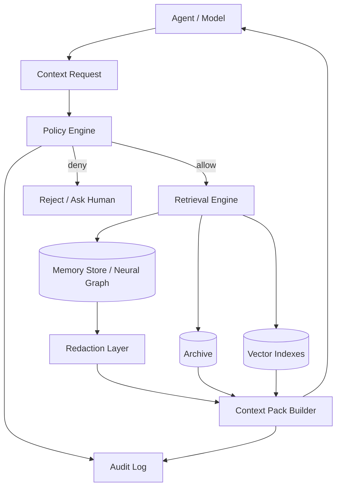

# Recall Gateway

## Overview

The Recall Gateway (context delivery service) is the policy-enforced gateway for all memory and Archive access. Agents/models do **not** query storage directly; they request a **Context Pack**. The gateway applies sensitivity rules, model capabilities, token budgets, and redaction.

**Status (2026-04-05)**: Implemented for MVP. Recall Gateway contract, policy enforcement, redaction path, strict Context Pack parsing/validation, audit sink, hybrid vector retrieval, and live SQLite-backed graph merge retrieval are implemented.

## Components

| Component | Purpose |
| --- | --- |
| Recall Gateway API | Entry point for context requests |
| Policy Engine | Enforces sensitivity, model class, and purpose |
| Memory Gateway | Local-only access to private/restricted memory |
| Retrieval Engine | Keyword retrieval with hybrid/vector scoring plus live Neural Graph merge |
| Redaction Layer | Produces safe summaries for cloud models |
| Context Pack Builder | Assembles final, token-bounded context |
| Audit Log | Immutable log of access decisions |

## Data Flow



## Context Request Contract

```json
{
  "request_id": "uuid",
  "model_class": "local|hybrid|cloud",
  "purpose": "answer|plan|review|act",
    "sensitivity_max": "shareable|restricted|private",
  "token_budget": 1500,
  "filters": {
    "tags": ["symbiotic/archive"],
    "goals": ["build-symbiotic-business"],
    "recency_days": 30
  }
}
```

## MVP Retrieval Fallback (Approved)

- MVP uses **keyword/tag/recency retrieval first**.
- Vector retrieval is optional until Task 32/53 is in production.
- If vector indexes are unavailable, the gateway degrades to keyword-only retrieval and marks `retrieval_mode: keyword` in audit metadata.

## Context Pack Response

```json
{
  "request_id": "uuid",
  "policy": {
    "model_class": "cloud",
    "sensitivity_max": "shareable",
    "redaction": true
  },
  "items": [
    {
      "type": "memory|entry",
      "id": "short-id",
      "title": "Title",
      "content": "...",
      "sensitivity": "shareable",
      "source_url": "https://example.com",
      "evidence": ["a1b2c3d4"]
    }
  ],
  "budget": {
    "token_budget": 1500,
    "token_used": 1320
  }
}
```

Schema: `schemas/context-pack.json`.
Runtime parser/validator: `ContextPack::parse_strict` (rejects unknown fields + invalid contract values).

## Redaction Rules (Approved)

- Remove PII fields (emails, phones, addresses) by default.
- Replace private entities with typed placeholders (e.g., `Person A`).
- Include **only** summarized preferences for cloud models.
- Preserve evidence links but strip private detail.

Full policy: `docs/architecture/redaction-policy.md`.

## Policy Rules (Approved)

- **Private & restricted memory**: local-only retrieval.
- **Cloud models**: receive shareable items or **redacted summaries** computed locally.
- **Evidence links required** for memory facts (link to Archive `article_id` and/or `source_url`).
- **Fail closed** when policy constraints cannot be satisfied.

## Error Handling

| Error | Handling |
| --- | --- |
| Policy denial | Return rejection and request user approval |
| Missing evidence | Include with low confidence + review flag |
| Token overflow | Truncate by relevance and return summary |
| Redaction failure | Omit private content and log issue |
| Audit failure | Fail closed and alert user |

## Graph Retrieval Reality

- The daemon wires a live `BfsGraphRetriever` backed by `symbiotic-memory::SqliteGraphStore`.
- Graph merge retrieval now traverses the same `memory.db` used by Vault indexing rather than only test-only in-memory graph fixtures.
- Graph results are merged as `memory` context items alongside Archive entries, preserving evidence from the memory store.
- Successful graph recall now persists per-memory FSRS state (`stability`, `difficulty`, `last_access`) back into `memory.db`, so repeated retrieval can reinforce memory durability over time.
- The live SQLite Neural Graph now also persists returned-path edge reinforcement in `graph_edge_weights`; weights decay lazily back toward neutral `1.0` when loaded, so repeated successful routes gain influence without a background decay worker.
- The live SQLite Neural Graph now also persists rebuildable node betweenness metrics in `graph_node_metrics`; recall uses a bounded structural boost for hub nodes, and the metrics refresh lazily when topology changes.
- The live memory store can now build graph-maintenance snapshots and surface aged, memory-backed weakly connected nodes as structural proposals; those proposals stay in the derived/proposal lane and do not mutate canonical graph truth.

## Related Docs

- `docs/architecture/active-recall-probes.md`
- `docs/design/vault-as-truth.md`
- `docs/architecture/vector-search.md`
- `docs/architecture/knowledge-storage.md`
