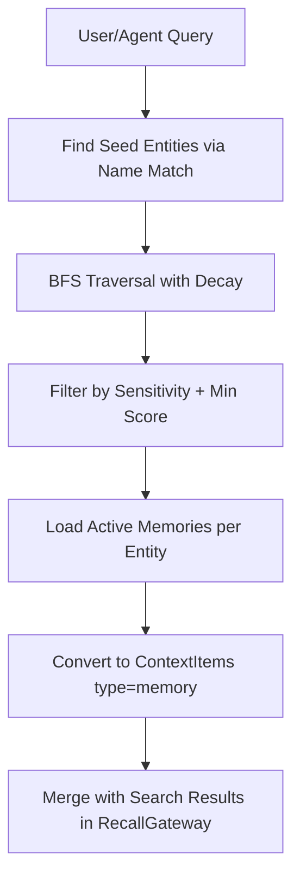

# Context Graphs

## Overview

Context graphs provide BFS-based retrieval from entity relationships to complement keyword and vector search in the Recall Gateway. Entities and their relationships form a graph; traversal from query-matched seed entities discovers related context with exponential score decay per hop.

## Components

| File | Purpose |
|------|---------|
| `submodules/runtime/crates/symbiotic-context/src/graph.rs` | Graph types, traits, BFS retriever, in-memory store |
| `submodules/runtime/crates/symbiotic-context/src/lib.rs` | RecallGateway integration (optional graph field) |

## Types

- `GraphEntity` -- entity with id, name, type, sensitivity, and memories
- `GraphEdge` -- typed directed edge with strength (0.0..1.0)
- `GraphNode` -- retrieval result node with score, depth, path
- `GraphRetrievalConfig` -- max_depth (3), decay_factor (0.7), max_entities (20), max_memories_per_entity (5), min_score (0.1)
- `GraphRetrievalResult` -- seeds + related nodes + total_considered count
- `Memory` -- fact attached to an entity with evidence links

## Traits

- `GraphStore` -- provides `find_seed_entities`, `get_edges`, `get_entity`
- `GraphRetriever` -- `retrieve(query, config, sensitivity_max)` returns `GraphRetrievalResult`

## Data Flow



## Algorithm: BFS with Decay

1. **Seed selection**: Find entities whose names match query terms.
2. **BFS traversal**: From each seed, traverse edges up to `max_depth` hops.
3. **Score decay**: Each hop applies `score = edge_strength * decay_factor^depth`.
4. **Deduplication**: If an entity is reached via multiple paths, keep the highest score.
5. **Filtering**: Exclude entities below `min_score` or above `sensitivity_max`.
6. **Result assembly**: Return seeds + related entities sorted by score descending.

## RecallGateway Integration

The graph retriever is an optional field on `RecallGateway`:

```rust
pub struct RecallGateway {
    // ...
    graph: Option<Arc<dyn GraphRetriever>>,
}
```

When present, graph results are merged after keyword/vector scoring:
- Seed entities (depth=0) get a +0.2 merge bonus
- Entities appearing in both search and graph results keep the higher score
- Graph entities become `ContextItem` with `type: "memory"`
- When absent or when retrieval fails (NoSeeds), the system degrades gracefully

## Key Decisions

1. **Synchronous trait**: GraphRetriever is sync, matching RecallGateway's existing pattern. Can be made async later if needed.
2. **In-memory store for MVP**: `InMemoryGraphStore` allows testing without database. SQLite-backed store planned for production.
3. **Graceful degradation**: Graph retrieval errors are silently caught; the gateway proceeds with search-only results.
4. **Score type**: Graph uses f64 internally, converts to f32 at the RecallGateway merge boundary (matching ContextItem.score).

## Error Handling

| Failure | Handling |
|---------|----------|
| No seed entities | `GraphRetrievalError::NoSeeds` -- gateway ignores and proceeds |
| Store unavailable | `GraphRetrievalError::StoreError` -- gateway ignores |
| Cycles in graph | BFS deduplication prevents infinite loops |
| Score below threshold | Filtered out by `min_score` check |
