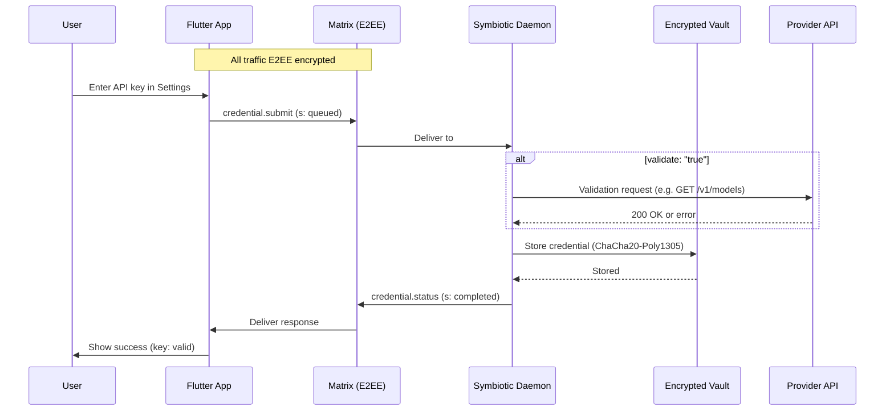
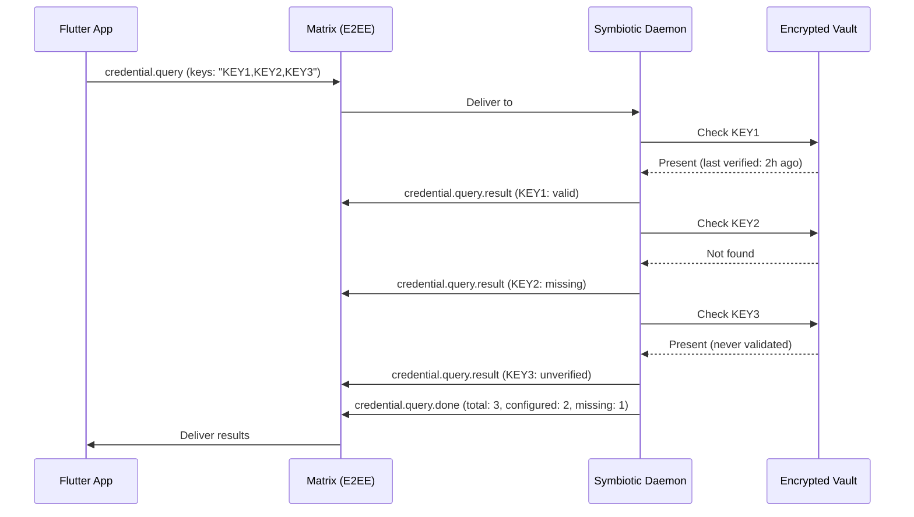
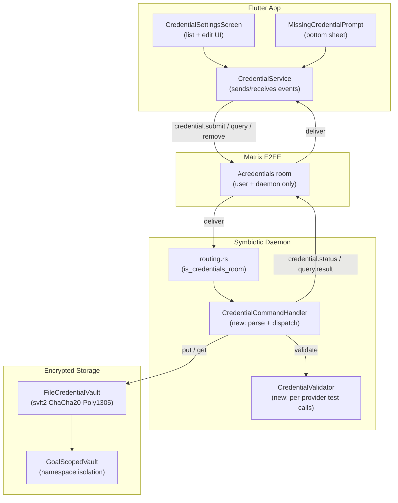

# In-App Credential Management


> Design doc for adding/changing API credentials from the Flutter app.
> Task link: TBD (to be added when task is created in TASKS.md)

**Status**: Implemented
**Related Tasks**: T41 (Local-Only Credential Handling), T101 (AI Provider Management Layer)
**Related docs:**
- `docs/design/credential-sandbox.md` (Vault architecture and planned sandbox)
- `docs/design/ai-provider-management.md` (provider trait hierarchy)
- `docs/architecture/credential-sandbox.md` (current MVP Vault implementation)
- `docs/architecture/matrix-channels.md` (event delivery via Matrix E2EE rooms)

## Overview

Users currently configure daemon credentials via environment variables or the setup script. This design adds the ability to add, change, query, and remove API credentials from within the Flutter app at any time. Credentials travel exclusively through E2EE Matrix rooms to the daemon's encrypted Vault -- never through any cloud service. The daemon validates credentials against their respective provider APIs before storing, and only returns status metadata to the app (never actual key values).

## Flows

### Flow 1: Settings - API Keys Screen

A settings screen where users can:
- View all configurable credentials with masked values (last 4 characters only)
- See status for each: `valid` / `missing` / `unverified` / `expired` / `invalid`
- Add, change, or remove credentials
- Credential categories and keys:

| Category | Credential | Vault Key |
|----------|-----------|-----------|
| **AI Providers** | Anthropic (Claude) | `ANTHROPIC_API_KEY` |
| | OpenAI | `OPENAI_API_KEY` |
| | OpenRouter | `OPENROUTER_API_KEY` |
| **Social** | X/Twitter Client ID | `SYMBIOTIC_X_CLIENT_ID` |
| | X/Twitter Client Secret | `SYMBIOTIC_X_CLIENT_SECRET` |
| **Infrastructure** | Hetzner Cloud | `SYMBIOTIC_HCLOUD_TOKEN` |
| | Cloudflare Tunnel | `SYMBIOTIC_CF_TUNNEL_TOKEN` |
| **Push** | APNs Team ID | `APNS_TEAM_ID` |
| | APNs Key ID | `APNS_KEY_ID` |
| | APNs Private Key | `APNS_PRIVATE_KEY` |
| | FCM Service Account | `FCM_SERVICE_ACCOUNT_JSON` |

### Flow 2: Prompted (Contextual) Flow

When a user triggers a feature that requires a missing credential:
- Example: User tries to use AI agent, but no Claude API key is configured
- App shows a bottom sheet: "Add your Claude API key to enable this feature"
- User enters key, same submit flow as Settings screen
- On success, the original action resumes automatically

### Flow 3: Daemon Vault API (Matrix Commands)

The app talks to the daemon via the `#credentials` Matrix room. All commands use the existing `org.symbiotic.event` envelope format with `SymEventPayload`.

**Important:** The `sym.d` field is a flat `HashMap<String, String>` (not nested JSON). All values are string-encoded. The `sym.s` field must be one of the allowed statuses: `queued`, `running`, `blocked`, `completed`, `failed`, `retry`, `dlq`.

#### Submit Credential

App sends to `#credentials` room:

```json
{
  "msgtype": "org.symbiotic.event",
  "body": "credential.submit",
  "sym": {
    "v": 1,
    "t": "credential.submit",
    "s": "queued",
    "rid": "cred_a1b2c3d4",
    "ts": 1740500000,
    "d": {
      "key": "ANTHROPIC_API_KEY",
      "value": "sk-ant-api03-...",
      "validate": "true"
    }
  }
}
```

Daemon receives, optionally validates (test API call), stores in Vault. Daemon responds:

```json
{
  "msgtype": "org.symbiotic.event",
  "body": "credential.status",
  "sym": {
    "v": 1,
    "t": "credential.status",
    "s": "completed",
    "rid": "cred_a1b2c3d4",
    "ts": 1740500001,
    "d": {
      "key": "ANTHROPIC_API_KEY",
      "status": "valid",
      "last_verified": "2026-02-25T12:00:00Z"
    }
  }
}
```

If validation fails, the key is still stored but marked `unverified`:

```json
{
  "msgtype": "org.symbiotic.event",
  "body": "credential.status",
  "sym": {
    "v": 1,
    "t": "credential.status",
    "s": "completed",
    "rid": "cred_a1b2c3d4",
    "ts": 1740500001,
    "d": {
      "key": "ANTHROPIC_API_KEY",
      "status": "unverified",
      "reason": "API returned 401 Unauthorized"
    }
  }
}
```

#### Query Credential Status

App queries status of all or specific credentials (never returns actual values):

```json
{
  "msgtype": "org.symbiotic.event",
  "body": "credential.query",
  "sym": {
    "v": 1,
    "t": "credential.query",
    "s": "queued",
    "rid": "qry_e5f6g7h8",
    "ts": 1740500100,
    "d": {
      "keys": "ANTHROPIC_API_KEY,OPENAI_API_KEY,SYMBIOTIC_HCLOUD_TOKEN"
    }
  }
}
```

Daemon responds with one event per credential queried:

```json
{
  "msgtype": "org.symbiotic.event",
  "body": "credential.query.result",
  "sym": {
    "v": 1,
    "t": "credential.query.result",
    "s": "completed",
    "rid": "qry_e5f6g7h8",
    "ts": 1740500101,
    "d": {
      "key": "ANTHROPIC_API_KEY",
      "status": "valid",
      "last_verified": "2026-02-25T10:00:00Z",
      "masked_suffix": "X4f2"
    }
  }
}
```

For missing credentials:

```json
{
  "msgtype": "org.symbiotic.event",
  "body": "credential.query.result",
  "sym": {
    "v": 1,
    "t": "credential.query.result",
    "s": "completed",
    "rid": "qry_e5f6g7h8",
    "ts": 1740500101,
    "d": {
      "key": "OPENAI_API_KEY",
      "status": "missing"
    }
  }
}
```

A final summary event signals query completion:

```json
{
  "msgtype": "org.symbiotic.event",
  "body": "credential.query.done",
  "sym": {
    "v": 1,
    "t": "credential.query.done",
    "s": "completed",
    "rid": "qry_e5f6g7h8",
    "ts": 1740500102,
    "d": {
      "total": "3",
      "configured": "1",
      "missing": "2"
    }
  }
}
```

#### Remove Credential

App sends:

```json
{
  "msgtype": "org.symbiotic.event",
  "body": "credential.remove",
  "sym": {
    "v": 1,
    "t": "credential.remove",
    "s": "queued",
    "rid": "rm_i9j0k1l2",
    "ts": 1740500200,
    "d": {
      "key": "OPENAI_API_KEY"
    }
  }
}
```

Daemon removes from Vault and confirms:

```json
{
  "msgtype": "org.symbiotic.event",
  "body": "credential.removed",
  "sym": {
    "v": 1,
    "t": "credential.removed",
    "s": "completed",
    "rid": "rm_i9j0k1l2",
    "ts": 1740500201,
    "d": {
      "key": "OPENAI_API_KEY"
    }
  }
}
```

## Architecture

### Sequence Diagram



### Query Flow



### Component Diagram



### Security Considerations

1. **E2EE only**: All credential data travels through E2EE Matrix rooms. The `#credentials` room has restricted membership (user device + daemon only).
2. **No value return**: Credential values are NEVER returned to the app -- only status metadata (`valid`/`missing`/`unverified`/`expired`) and a masked suffix (last 4 characters).
3. **Vault encryption at rest**: Credentials are stored using ChaCha20-Poly1305 AEAD (`svlt2` envelope) with per-vault encryption keys. File permissions hardened to `0600`, directories to `0700`.
4. **Cloud AI isolation**: Cloud AI providers never see credential values. The credential submit event travels app -> Matrix E2EE -> daemon local process -> Vault. No cloud model is in the path.
5. **Validation is optional**: `validate: "false"` skips API validation, supporting offline or air-gapped setups. Failed validation still stores the key but marks it `unverified`.
6. **No credential in logs**: The existing `CredentialRecord` Debug impl redacts the `secret` field as `[REDACTED]`. The daemon must not log `sym.d.value` for `credential.submit` events.
7. **Goal-scoped isolation**: Credentials stored via `GoalScopedVault` are namespaced per-goal and cannot be accessed cross-goal.

## Screen Mockups

### Settings - Credentials List

```
+-------------------------------------+
|  < Settings / API Keys              |
+-------------------------------------+
|                                     |
|  AI Providers                       |
|  +----------------------------------+
|  | Claude (Anthropic)    * Valid    |
|  | sk-ant-...X4f2                   |
|  | Last verified: 2h ago    [Edit]  |
|  +----------------------------------+
|  | OpenAI               x Missing  |
|  |                         [Add]    |
|  +----------------------------------+
|                                     |
|  Social                             |
|  +----------------------------------+
|  | X/Twitter             * Valid    |
|  | Client ID: ...8a3f               |
|  | Last verified: 1d ago   [Edit]   |
|  +----------------------------------+
|                                     |
|  Infrastructure                     |
|  +----------------------------------+
|  | Hetzner Cloud        x Missing  |
|  |                         [Add]    |
|  +----------------------------------+
|  | Cloudflare           x Missing  |
|  |                         [Add]    |
|  +----------------------------------+
|                                     |
|  Push                               |
|  +----------------------------------+
|  | APNs                 ? Unverified|
|  | Team ID: ...9b2e                 |
|  |                        [Verify]  |
|  +----------------------------------+
|  | FCM                  x Missing  |
|  |                         [Add]    |
|  +----------------------------------+
+-------------------------------------+
```

### Add Credential Modal

```
+-------------------------------------+
|  Add Claude API Key                 |
|                                     |
|  +----------------------------------+
|  | sk-ant-api03-...                 |
|  +----------------------------------+
|                                     |
|  [x] Validate before saving         |
|                                     |
|  Your key is sent through an        |
|  encrypted channel directly to      |
|  your daemon. It never passes       |
|  through any cloud service.         |
|                                     |
|  [Cancel]              [Save Key]   |
+-------------------------------------+
```

### Missing Credential Prompt (Bottom Sheet)

```
+-------------------------------------+
|  Claude API Key Required            |
|                                     |
|  This feature uses Claude for       |
|  analysis. Add your API key to      |
|  enable it.                         |
|                                     |
|  [Not Now]          [Add API Key]   |
+-------------------------------------+
```

## Credential Validation

For each credential type, the daemon performs an optional validation check:

| Vault Key | Validation Method | Expected Success |
|-----------|------------------|-----------------|
| `ANTHROPIC_API_KEY` | `GET https://api.anthropic.com/v1/models` with `x-api-key` header | HTTP 200 |
| `OPENAI_API_KEY` | `GET https://api.openai.com/v1/models` with `Authorization: Bearer` | HTTP 200 |
| `OPENROUTER_API_KEY` | `GET https://openrouter.ai/api/v1/models` with `Authorization: Bearer` | HTTP 200 |
| `SYMBIOTIC_X_CLIENT_ID` | OAuth2 token exchange test (PKCE flow) | Token received |
| `SYMBIOTIC_HCLOUD_TOKEN` | `GET https://api.hetzner.cloud/v1/servers` with `Authorization: Bearer` | HTTP 200 |
| `SYMBIOTIC_CF_TUNNEL_TOKEN` | `GET https://api.cloudflare.com/client/v4/user/tokens/verify` | HTTP 200, `status: active` |
| `APNS_*` (Team ID + Key ID + Private Key) | Sign test JWT and call APNs sandbox endpoint | No auth error |
| `FCM_SERVICE_ACCOUNT_JSON` | OAuth2 service account token exchange | Token received |

Validation is optional (`validate: "false"` skips it). Failed validation still stores the key but marks status as `unverified`. The daemon stores `last_verified` timestamp and `status` alongside the credential in the Vault's metadata.

## Implementation Plan

### Daemon (Rust)

1. **Add `credential.submit` handler to `commands.rs`**: Parse `credential.submit` events in the `#credentials` room. Extract `key`, `value`, `validate` from `sym.d`. Store via `CredentialVault::put()`. Respond with `credential.status`.
2. **Add `credential.query` handler**: Parse comma-separated keys from `sym.d.keys`. Check Vault for each. Emit one `credential.query.result` per key and a final `credential.query.done`.
3. **Add `credential.remove` handler**: Remove credential from Vault. Respond with `credential.removed`.
4. **Add `CredentialValidator` module**: Per-provider HTTP validation calls. Async with configurable timeout (default 10s). Returns `valid`, `invalid`, or `unreachable`.
5. **Add credential metadata store**: Track `last_verified`, `status`, and `masked_suffix` alongside the credential record. Extend `CredentialRecord` or use a separate sidecar file.
6. **Extend allowed statuses if needed**: The current `ALLOWED_STATUSES` list (`queued`, `running`, `blocked`, `completed`, `failed`, `retry`, `dlq`) already covers the needed states. Credential-specific status (`valid`, `missing`, `unverified`) lives in `sym.d.status`, not `sym.s`.

### App (Flutter/Dart)

1. **Add `CredentialService`**: Sends and receives credential events via the Matrix `#credentials` room. Tracks pending requests by `rid`. Exposes streams for UI binding.
2. **Add `CredentialSettingsScreen` widget**: Lists all credential categories with status indicators. Pulls status via `credential.query` on screen load. Edit/Add/Remove buttons per credential.
3. **Add `MissingCredentialPrompt` reusable widget**: Bottom sheet triggered by feature entry points when a required credential is missing. On success, resumes the original action via a callback.
4. **Wire prompted flow into feature entry points**: AI agent launch, intake pipeline start, push notification setup, etc. Each checks required credentials via `CredentialService` before proceeding.

## Key Decisions

| # | Decision | Rationale |
|---|----------|-----------|
| 1 | Credentials travel via E2EE Matrix, not HTTP | Consistent with existing transport. No new API surface to secure. |
| 2 | Daemon never returns actual key values to app | Only status metadata and masked suffix. Prevents credential exfiltration via compromised app. |
| 3 | Validation is optional | Supports offline/air-gapped setups. Failed validation stores with `unverified` status. |
| 4 | `#credentials` room already exists | The room role system includes credentials. `is_credentials_room()` is already implemented in `routing.rs`. |
| 5 | Flat `sym.d` map (not nested JSON) | Matches the existing `SymEventPayload` structure where `d: HashMap<String, String>`. Credential-specific fields go in `d` as flat key-value pairs. |
| 6 | One response event per queried key | Avoids stuffing multiple credential statuses into a single flat `d` map. Keeps each event self-contained. Final `credential.query.done` signals completion. |
| 7 | `sym.s` uses standard statuses, credential status in `sym.d` | The protocol `sym.s` field uses existing allowed values (`queued`, `completed`, `failed`). The credential-specific status (`valid`/`missing`/`unverified`) is carried in `sym.d.status`. |

## Error Handling

| Error | Handling |
|-------|---------|
| Matrix room unavailable | App queues credential events locally, retries on reconnect. Shows "Daemon offline" indicator on Settings screen. |
| Validation fails | Daemon stores credential with `unverified` status. Responds with reason in `sym.d.reason`. App shows warning but allows user to proceed. |
| Vault write fails | Daemon returns `sym.s: "failed"` with `sym.d.reason`. App shows error dialog. Credential is not stored. |
| Duplicate key | Daemon overwrites existing value with new value, re-validates if requested. No confirmation prompt (idempotent upsert). |
| Unknown key name | Daemon stores it anyway (forward-compatible). Validation is skipped for unknown keys. |
| Credential event with missing `sym.d.key` | Daemon returns `sym.s: "failed"` with `sym.d.reason: "missing required field: key"`. |
| Credential event with missing `sym.d.value` (for submit) | Daemon returns `sym.s: "failed"` with `sym.d.reason: "missing required field: value"`. |

## Event Type Summary

| Event Type (`sym.t`) | Direction | Purpose |
|----------------------|-----------|---------|
| `credential.submit` | App -> Daemon | Store a new or updated credential |
| `credential.status` | Daemon -> App | Result of a submit operation |
| `credential.query` | App -> Daemon | Request status of one or more credentials |
| `credential.query.result` | Daemon -> App | Status of a single queried credential |
| `credential.query.done` | Daemon -> App | Summary signaling query completion |
| `credential.remove` | App -> Daemon | Remove a credential from the Vault |
| `credential.removed` | Daemon -> App | Confirmation of removal |
