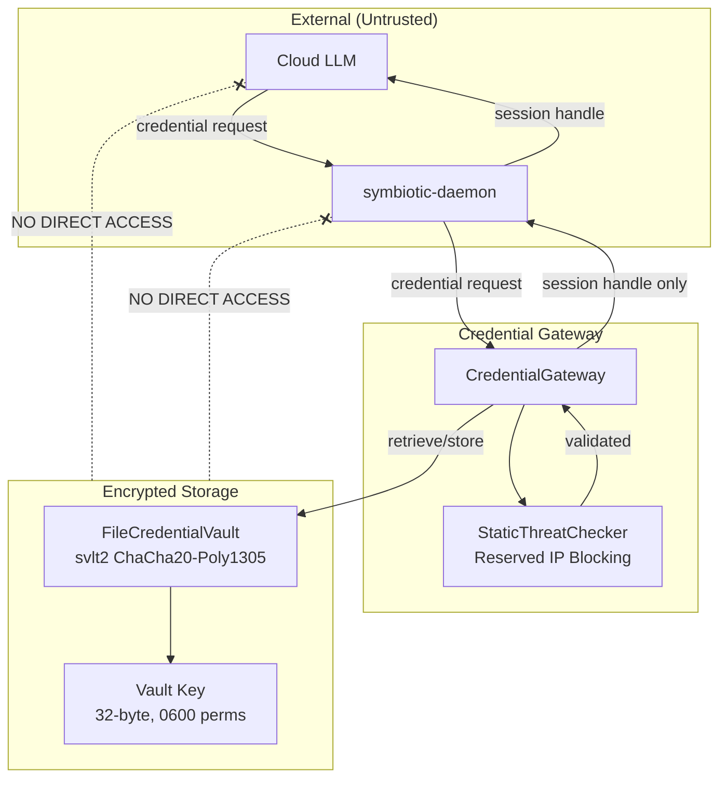
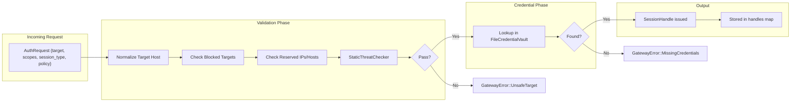
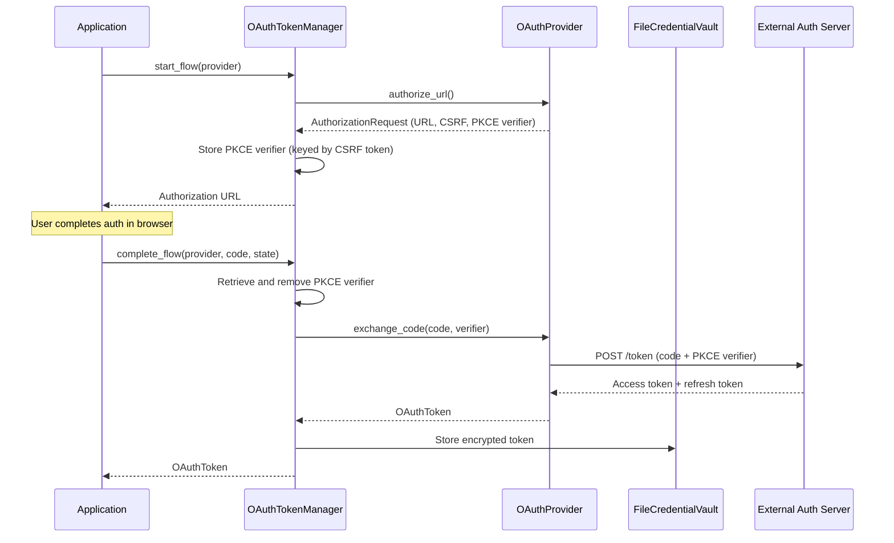

# Credential Sandbox Architecture

> Planned work: see `docs/design/credential-sandbox.md`

## Overview

The Credential Sandbox is a security-critical component that isolates credential handling from all other system components. Credentials are stored encrypted at rest, retrieved only through a validated gateway, and never exposed to cloud LLMs or execution agents.

**Status (2026-04-04)**: MVP implemented and the raw-credential exception path has been tightened. Session handles, vault encryption (`svlt2` AEAD), static threat checking, the gateway API, OAuth2 PKCE flows, and the one-shot auth sandbox worker path are working. See `services/credential-gateway/` for the implementation.

**Core Principle:** Credentials never leave the sandbox by default. Only **session handles** are passed out by default; raw session export requires explicit user approval.

**Current exception state:** unavoidable raw-secret use now runs in a dedicated, short-lived auth sandbox worker instead of the long-lived daemon process or general runner. The current worker still uses deterministic auth scripts for first-login/session-capture flows, so this is a narrowed transitional exception rather than the final approval-rich auth job model. See `docs/design/credential-sandbox.md`.

**Approved next surface:** runner-backed first-login auth is now implemented through a dedicated bridge auth-job RPC plus channel-visible approval, documented in `docs/design/credential-auth-bridge.md`. `credential.authenticate` can originate from the authenticated runner bridge, pause workflow execution with a persisted pending auth artifact, and resume after `#credentials` approval. Interactive follow-up input now continues through the same auth-job lifecycle via `credential.respond`, with opaque continuation state passed only between the daemon and the one-shot auth worker. Approval/input TTLs are now daemon-configured and enforced, and input-phase `auth.required` events expose `expires_at` so the UI can treat them as real deadlines. Auth execution now also carries trusted profile provenance from the worker into daemon auth-job state and emitted `auth.required` / `auth.completed` / `auth.failed` events via `auth_profile_id`, `auth_profile_match`, `auth_script_kind`, and `auth_profile_sha256`. The runtime auth lifecycle is now deliberately split into a pure `AuthJobCoordinator`, an application-layer `AuthOrchestrator`, and thin transport adapters (`commands.rs`, `llm_gateway.rs`), with attestation-keyed remembered approval policies in the Vault layer and the bridge auto-approved path executing through a native async coordinator path rather than trying to nest Tokio runtimes inside the gateway task.

See session handle contract: `docs/architecture/session-handles.md`.

## Components

| Component | Location | Purpose |
|-----------|----------|---------|
| **CredentialGateway** | `services/credential-gateway/src/lib.rs` | Entry point; validates requests, issues/validates/revokes session handles |
| **FileCredentialVault** | `services/credential-gateway/src/lib.rs` | Encrypted credential storage with `svlt2` AEAD envelopes |
| **StaticThreatChecker** | `services/credential-gateway/src/lib.rs` | Reserved IP/hostname blocking (localhost, metadata services, private ranges) |
| **SessionHandle** | `services/credential-gateway/src/lib.rs` | Opaque, scoped, revocable token representing an authenticated session |
| **CLI** | `services/credential-gateway/src/main.rs` | `put` and `issue` subcommands for credential storage and handle issuance |
| **OAuthProvider** | `services/credential-gateway/src/oauth.rs` | Trait for OAuth2 providers (authorize, exchange, refresh, revoke) |
| **GitHubOAuthProvider** | `services/credential-gateway/src/oauth.rs` | GitHub OAuth2 PKCE implementation |
| **OAuthTokenManager** | `services/credential-gateway/src/oauth.rs` | Token lifecycle: storage, auto-refresh, revocation |
| **AuthSandboxLauncher** | `services/credential-gateway/src/auth_engine.rs` | Spawns one-shot auth worker subprocesses from trusted services without exposing raw credentials to the caller |
| **Auth Sandbox Worker** | `services/credential-gateway/src/main.rs` + `services/credential-gateway/src/auth_engine.rs` | Short-lived process that opens the scoped vault, runs the deterministic auth profile, and returns scoped results only |
| **AuthScriptEngine** | `services/credential-gateway/src/auth_engine.rs` | Low-level deterministic auth executor used only inside the one-shot auth worker |

## Component Diagram



## Data Flow



## Session Handle Lifecycle

```mermaid
stateDiagram-v2
    [*] --> Issued: issue_session_handle()

    Issued --> Valid: validate_session_handle() succeeds
    Issued --> Expired: expires_at <= now
    Issued --> Revoked: revoke_session_handle()

    Valid --> Valid: subsequent validations
    Valid --> Expired: TTL exceeded
    Valid --> Revoked: revoke_session_handle()
    Valid --> Exported: export_session_handle(approval=true)

    Expired --> [*]: GatewayError::HandleExpired
    Revoked --> [*]: GatewayError::HandleRevoked
```

## Vault Encryption

### Storage Model

The `FileCredentialVault` stores credentials as encrypted `svlt2` envelopes on disk.

```
vault_dir/                     (0700 permissions)
  vault.tsv                    (0600, svlt2 AEAD envelope JSON)
  vault.tsv.key                (0600, 32-byte hex-encoded key)
```

### Envelope Format (`svlt2`)

```json
{
  "version": "svlt2",
  "nonce": "<hex-encoded 12-byte nonce>",
  "ciphertext": "<hex-encoded ChaCha20-Poly1305 ciphertext>"
}
```

The `svlt2` envelope uses ChaCha20-Poly1305 (AEAD), providing both confidentiality and integrity. The 16-byte Poly1305 authentication tag is appended to the ciphertext by the `chacha20poly1305` crate.

### Migration Support

On vault open, the `FileCredentialVault` detects and migrates legacy formats:

| Source Format | Detection | Migration |
|---------------|-----------|-----------|
| **Plaintext TSV** | Content does not start with `{` | Read TSV, re-encrypt as `svlt2` |
| **svlt1 envelope** | JSON with `"version": "svlt1"` | Decrypt via XOR stream cipher + HMAC, re-encrypt as `svlt2` |
| **svlt2 envelope** | JSON with `"version": "svlt2"` | No migration needed |

### Credential Record Schema

```rust
pub struct CredentialRecord {
    pub service: String,   // Normalized hostname (e.g., "x.com")
    pub username: String,
    pub secret: String,
}
```

Internally serialized as tab-separated values (with percent-encoding for special characters) before AEAD encryption.

## Static Threat Checker

The `StaticThreatChecker` implements the `ThreatChecker` trait and blocks requests to reserved/dangerous targets.

### Reserved Target Blocking

The `is_reserved_target()` function blocks:

- **Hostnames**: `localhost`, `*.localhost`, `*.local`, `*.internal`
- **Cloud metadata**: `metadata.google.internal`, `metadata.aws.internal`, `metadata.azure.internal`
- **IPv4 ranges**: private (RFC 1918), loopback, link-local, broadcast, unspecified, documentation, shared address space (100.64/10), benchmarking (198.18/15), AWS metadata (169.254.169.254)
- **IPv6 ranges**: loopback, unspecified, unique local, link-local, documentation (2001:db8::/32)

### Configurable Blocklist

`GatewayConfig.blocked_targets` provides an additional static set of denied hostnames, checked before the `ThreatChecker` trait.

## Gateway API

### Core Types

```rust
pub struct AuthRequest {
    pub target: String,          // URL or hostname, normalized to host
    pub scopes: Vec<String>,     // e.g., ["web.login", "api.request"]
    pub session_type: SessionType, // Browser or Api
    pub policy: SessionPolicy,
}

pub struct SessionPolicy {
    pub exportable: bool,        // Whether raw export is allowed
    pub requires_reauth: bool,   // Whether re-auth is needed per use
}

pub struct SessionHandle {
    pub handle_id: String,       // "sh_<hex>" opaque identifier
    pub issued_at: u64,          // Unix timestamp
    pub expires_at: u64,         // Unix timestamp
    pub scope: HashSet<String>,  // Allowed scopes
    pub target: String,          // Normalized hostname
    pub session_type: SessionType,
    pub policy: SessionPolicy,
    pub revoked: bool,
}
```

### Operations

| Method | Purpose |
|--------|---------|
| `put_credential(record)` | Store a credential (normalizes target host) |
| `issue_session_handle(request, now)` | Validate target, check credentials exist, issue handle |
| `validate_session_handle(id, target, scope, now)` | Check handle is valid, not expired/revoked, scope matches |
| `revoke_session_handle(id)` | Immediately invalidate a handle |
| `export_session_handle(id, approval)` | Export handle data; requires `exportable` policy or explicit approval |

### CLI

```bash
# Store a credential
credential-gateway put --vault-file ./vault.tsv --service x.com --username user --secret pass

# Issue a session handle
credential-gateway issue --vault-file ./vault.tsv --target x.com --scopes web.login
```

## Key Decisions

### 1. Session Handle Default

**Decision:** The gateway returns **session handles** by default. Raw session export requires explicit user approval via `export_session_handle(handle_id, explicit_approval=true)`.

**Rationale:**
- Prevents cookie/token leakage to cloud models
- Allows revocation by invalidating the handle
- Export is still possible when the user explicitly approves

### 1a. Raw Credential Exception Is Transitional

**Decision:** The only acceptable current raw-secret path is the dedicated one-shot auth sandbox worker used for first-login/bootstrap flows. The worker is implemented. It remains transitional only in the sense that it still runs deterministic auth scripts and has not yet grown richer approval policy on top of the now-implemented execution attestation controls.

**Rationale:**
- Some targets still require first-login with raw credentials before a session handle exists
- The current exception is narrower than exposing secrets to the general runner, daemon host process, or cloud models
- The implemented worker keeps raw credential retrieval inside a short-lived process rather than the long-lived credential authority
- The long-term design can add tighter policy and remembered-approval rules keyed on attested worker/profile identity without reopening the broad secret-exposure boundary

### 2. ChaCha20-Poly1305 AEAD for Vault (`svlt2`)

**Decision:** Vault uses ChaCha20-Poly1305 authenticated encryption with 12-byte random nonces.

**Rationale:**
- AEAD provides both confidentiality and tamper detection in a single primitive
- ChaCha20-Poly1305 is constant-time, avoiding timing side channels
- Audited implementation via the `chacha20poly1305` crate
- Replaces `svlt1` (custom XOR stream cipher + separate HMAC) with a standard construction

### 3. Static Threat Checking with Reserved IP Blocking

**Decision:** Block requests targeting localhost, private IPs, link-local addresses, and cloud metadata endpoints.

**Rationale:**
- Prevents SSRF-style attacks through the credential gateway
- Cloud metadata endpoints (169.254.169.254, metadata.*.internal) are high-value targets
- Zero external dependencies; works offline

### 4. Target Normalization

**Decision:** All targets are normalized to lowercase hostnames via URL parsing. Full URLs like `https://X.com/i/bookmarks` become `x.com`.

**Rationale:**
- Prevents bypass via case differences or path variations
- Credential lookup is always by normalized host
- Consistent scope enforcement

### 5. Filesystem Permission Hardening

**Decision:** Vault files are set to `0600`, vault directories to `0700` on Unix systems.

**Rationale:**
- Prevents other users/processes from reading credentials
- Applied on every open/write operation (not just creation)
- Key file permissions match vault file permissions

## OAuth2 PKCE Flow

The gateway supports OAuth2 Authorization Code with PKCE for external provider authentication. Tokens are stored encrypted in the vault alongside other credentials.

### Flow



### Token Lifecycle

The `OAuthTokenManager` handles automatic refresh and revocation:

- **Auto-refresh**: `get_valid_token()` checks if the token is within `refresh_buffer_secs` of expiry and triggers a refresh using the stored refresh token.
- **Revocation**: `revoke()` calls the provider's revocation endpoint and marks the token as revoked in the vault.
- **Encrypted storage**: OAuth tokens are stored in the vault as JSON-serialized `OAuthToken` structs, encrypted with the same `svlt2` ChaCha20-Poly1305 AEAD as other credentials.

### Vault Key Format

OAuth tokens are stored with the key `oauth:{provider}` (e.g., `oauth:github`).

### Implemented Providers

| Provider | PKCE | Refresh | Revocation |
|----------|------|---------|------------|
| **GitHub** | S256 | Yes | No-op (GitHub uses API-based revocation) |

### OAuthToken Schema

```rust
pub struct OAuthToken {
    pub provider: String,
    pub access_token: String,
    pub refresh_token: Option<String>,
    pub token_type: String,
    pub scopes: Vec<String>,
    pub issued_at: u64,
    pub expires_at: Option<u64>,
    pub revoked: bool,
}
```

### OAuth Errors

| Error | Meaning |
|-------|---------|
| `NoToken` | No OAuth token stored for the provider |
| `TokenExpired` | Token has expired and no refresh token is available |
| `TokenRevoked` | Token was explicitly revoked |
| `NoRefreshToken` | Token needs refresh but no refresh token is stored |
| `StateMismatch` | CSRF state from callback does not match a pending flow |
| `ExchangeFailed` | Token exchange or refresh HTTP request failed |

## Error Handling

### Gateway Errors

| Error | Type | Meaning |
|-------|------|---------|
| `BlockedTarget` | Validation | Target is in static blocklist or is a reserved IP/host |
| `UnsafeTarget` | Validation | ThreatChecker reports target as unsafe |
| `MissingCredentials` | Credential | No credential stored for the normalized target host |
| `HandleNotFound` | Session | Handle ID does not exist in the handles map |
| `HandleExpired` | Session | Handle TTL has been exceeded |
| `HandleRevoked` | Session | Handle was explicitly revoked |
| `ScopeDenied` | Session | Requested scope is not in the handle's scope set |
| `TargetMismatch` | Session | Validation target does not match handle target |
| `ExportDenied` | Policy | Export attempted on non-exportable handle without explicit approval |

### Vault Errors

| Error | Cause |
|-------|-------|
| Vault integrity check failed | `svlt2` AEAD decryption failure (wrong key or tampered data) |
| Unsupported vault version | Envelope version is not `svlt1` or `svlt2` |
| Invalid vault line | TSV record has wrong number of fields |
| Failed to generate vault key | Secure RNG unavailable (non-Unix fallback) |

## Related Components

| Component | Relationship |
|-----------|--------------|
| [Session Handles](./session-handles.md) | Contract for the session handle format |
| [Trust & Capabilities](./trust-capabilities.md) | Trust boundaries that govern credential access |
| [Agent Orchestration](./agent-orchestration.md) | Credential request source |
