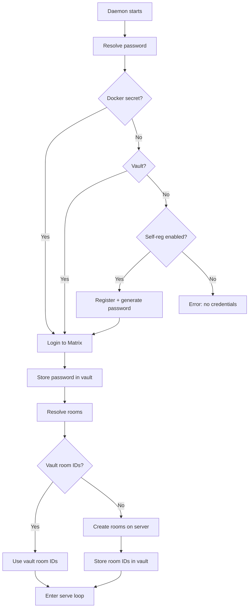

# Daemon Bootstrap — Zero-Config Credential Management

## Overview

The daemon bootstrap system eliminates the need for pre-configured plaintext secret files by implementing a secure credential resolution chain and self-registration flow. On first boot, the daemon can auto-register on Conduwuit, create Matrix rooms, and store credentials in the encrypted vault. On subsequent boots, it restores from vault with zero configuration files needed.

**Security principle:** Plaintext env var overrides (`SYMBIOTIC_MATRIX_PASSWORD`, `SYMBIOTIC_MATRIX_ACCESS_TOKEN`, `SYMBIOTIC_MATRIX_ROOM_*`) are intentionally not supported — they are visible in `/proc/pid/environ`, `docker inspect`, and process listings.

## Components

| File | Purpose |
|------|---------|
| `services/credential-gateway/src/lib.rs` | Vault key constants (`VAULT_KEY_MATRIX_*`) |
| `submodules/runtime/crates/symbiotic-matrix/src/registration.rs` | Matrix registration, login, room creation |
| `submodules/runtime/services/symbiotic-daemon/src/secrets.rs` | Docker secrets reader (`/run/secrets/`) |
| `submodules/runtime/services/symbiotic-daemon/src/bootstrap.rs` | Bootstrap orchestrator (priority chain) |
| `submodules/runtime/services/symbiotic-daemon/src/main.rs` | Bootstrap wiring in `Serve` command |

## Data Flow



## Credential Priority Chain

```
Password resolution (first match wins):
1. /run/secrets/symbiotic_matrix_password (Docker secret, production)
2. vault.get("matrix.password")           (stored from previous boot)
3. Generate password + self-register      (when SYMBIOTIC_BOOTSTRAP_SELF_REGISTER=true)

Room ID resolution (first match wins):
1. vault.get("matrix.room.*")             (stored from previous boot)
2. Create rooms via Matrix API
```

## Key Decisions

- **No env var overrides**: Plaintext password/token env vars are insecure (visible in `/proc`, `docker inspect`, logs). All credential paths use secure storage (Docker secrets use tmpfs, vault uses ChaCha20-Poly1305 AEAD).
- **Vault reuse**: Bootstrap uses the same `FileCredentialVault` at `data/vault/credentials.tsv` that the daemon already uses for OAuth tokens. No new storage mechanism.
- **Registration via raw HTTP**: Uses `reqwest` rather than `matrix-sdk` for registration because the SDK doesn't expose the registration API directly. Login and room operations also use raw HTTP for consistency.
- **Idempotent**: `register_user()` handles `M_USER_IN_USE` gracefully. `ensure_rooms()` checks alias existence before creating.
- **Bootstrap is mandatory**: When a homeserver is configured, bootstrap must succeed. There is no fallback to env var credentials.
- **Server name from env**: `SYMBIOTIC_MATRIX_SERVER_NAME` defaults to `symbiotic.local` (matching `conduwuit.toml`).

## Environment Variables

| Variable | Required | Default | Description |
|----------|----------|---------|-------------|
| `SYMBIOTIC_MATRIX_HOMESERVER` | Yes | — | Matrix homeserver URL |
| `SYMBIOTIC_MATRIX_USER` | No | `testuser` | Matrix username (same user as app for shared key backup) |
| `SYMBIOTIC_BOOTSTRAP_SELF_REGISTER` | No | `false` | Enable auto-registration |
| `SYMBIOTIC_MATRIX_SERVER_NAME` | No | `symbiotic.local` | Server name for room aliases |

## Same-User Design

The daemon logs in as the **same Matrix user** as the mobile app (default: `testuser`). This is critical for E2EE key backup sharing — both devices access the same Megolm session keys via SSSS, so events encrypted by the daemon are decryptable by the app after reinstalls.

Self-message filtering uses `msgtype` discrimination: user commands are `m.text`, daemon events are `org.symbiotic.event`. The transport layer skips non-`m.text` messages, preventing the daemon from processing its own output.

## Deployment Modes

### Local Dev (docker compose)
- Conduwuit: `allow_registration = true` (localhost only)
- `SYMBIOTIC_BOOTSTRAP_SELF_REGISTER=false` + Docker secret at `config/.secrets/matrix_password`
- Daemon logs in as testuser (same account as app)
- Shared key backup — app can decrypt all daemon events

### Production (Docker secret)
- Password at `/run/secrets/symbiotic_matrix_password` (tmpfs)
- `SYMBIOTIC_BOOTSTRAP_SELF_REGISTER=false` (or unset)
- Conduwuit: `allow_registration = false`
- Daemon reads secret, logs in, stores in vault, creates rooms

### Subsequent Boots
- Vault has password and room IDs from first boot
- No Docker secret or registration needed
- Daemon restores from vault and enters serve loop

## Error Handling

- Registration failure with `M_USER_IN_USE` and no password: hard error with actionable message
- Network errors during bootstrap: propagated with context
- Vault storage failures: propagated with context
- Bootstrap failure is always fatal when a homeserver is configured (no env var fallback)
