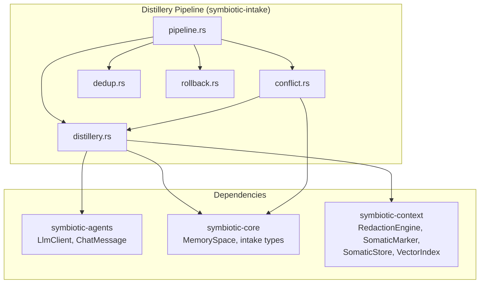

# Distillery Pipeline

## Overview

The Distillery is Symbiotic's core knowledge-processing engine. It transforms raw captured content into structured, verified, interconnected knowledge within the user's memory graph. The pipeline is unidirectional and deterministic: each stage uses strict prompt chaining via `LlmClient::chat()` (never the ReAct agent loop), ensuring fast, predictable extraction.

The full pipeline flow is: **Dedup -> Reduce -> Classify -> Reflect -> Verify -> Semantic Verify -> Conflict Detection -> Reweave -> PII Post-Check -> Archive**.

Canonical terminology: `Capture -> Intake -> Distillery -> Archive -> Recall -> Action -> Evolution` (see `docs/NAMING-CANON.md`).

## Components

| Component | Location | Purpose |
|-----------|----------|---------|
| `distillery.rs` | `symbiotic-intake/src/distillery.rs` | Stage functions: `reduce()`, `reflect()`, `verify()`, `verify_with_spaces()`, `verify_with_semantic()`, `reweave()`, `reweave_with_spaces()`, `classify_claims()`, `archive()`, `build_graph_context*()` |
| `pipeline.rs` | `symbiotic-intake/src/pipeline.rs` | `DistilleryPipeline` coordinator, `DistilleryConfig`, `PipelineReport`, `PipelineSomaticMarker`, `AnnotatedLink` |
| `conflict.rs` | `symbiotic-intake/src/conflict.rs` | `ConflictDetector`, `ConflictReport`, `Conflict`, `ConflictType` |
| `dedup.rs` | `symbiotic-intake/src/dedup.rs` | `ContentHashStore`, `DedupResult`, `content_hash()`, `normalized_hash()` |
| `rollback.rs` | `symbiotic-intake/src/rollback.rs` | `PipelineTransaction`, `StagedWrite`, rollback safety |
| `somatic.rs` | `symbiotic-context/src/somatic.rs` | `SomaticMarker`, `SomaticIndex`, `SqliteSomaticStore`, `SomaticStore` trait, temporal decay, somatic boost |
| `redaction.rs` | `symbiotic-context/src/redaction.rs` | `RedactionEngine` for PII detection and stripping |
| `MemorySpace` | `symbiotic-core/src/memory_space.rs` | `Knowledge`, `SelfSpace`, `Methodology` enum |

### Dependency Graph



## Data Flow

```mermaid
flowchart TB
    subgraph Dedup["Content Dedup"]
        INPUT["RawInput<br/>(URL + Markdown)"]
        HASH["SHA-256 Hash Check<br/>(exact + normalized)"]
    end

    subgraph Reduce["Stage 1: Reduce"]
        REDACT_PRE["PII Pre-Redaction<br/>(when redact_before_llm)"]
        ENZYME["Enzymatic Breakdown<br/>LLM: extract atomic claims"]
        GUARD["Hallucination Guard<br/>max_claims_per_source"]
    end

    subgraph Classify["Stage 1.5: Classify"]
        ROUTE["Memory Router<br/>LLM: route to K/S/M"]
    end

    subgraph Reflect["Stage 2: Reflect"]
        CTX["Build Graph Context<br/>(all 3 spaces)"]
        CIRC["Circulation<br/>LLM: find connections"]
        SOMATIC["Somatic Annotation<br/>(deterministic)"]
    end

    subgraph Verify["Stage 3: Verify"]
        DET_VERIFY["Deterministic Checks<br/>(claims, scores, links)"]
        SEM_VERIFY["Semantic Verify<br/>LLM: fact-check claims<br/>(optional)"]
    end

    subgraph ConflictDetect["Conflict Detection"]
        DETECT["Scan for contradicts<br/>links"]
        ENQUEUE["Enqueue to<br/>ReviewQueue"]
    end

    subgraph Reweave["Stage 4: Reweave"]
        READ["Read target notes<br/>(per space)"]
        TISSUE["Tissue Building<br/>LLM: rewrite notes"]
        PII_POST["PII Post-Check<br/>on rewritten notes"]
    end

    subgraph Archive["Stage 5: Archive"]
        RAW_SAVE["Preserve raw content<br/>YAML frontmatter"]
        HASH_REC["Record content hash"]
    end

    INPUT --> HASH
    HASH -->|new/near-dup| REDACT_PRE
    HASH -->|exact dup| SKIP["Skip"]
    REDACT_PRE --> ENZYME
    ENZYME --> GUARD
    GUARD --> ROUTE
    ROUTE --> CTX
    CTX --> CIRC
    CIRC --> SOMATIC
    SOMATIC --> DET_VERIFY
    DET_VERIFY --> SEM_VERIFY
    SEM_VERIFY --> DETECT
    DETECT --> ENQUEUE
    ENQUEUE --> READ
    READ --> TISSUE
    TISSUE --> PII_POST
    PII_POST --> RAW_SAVE
    RAW_SAVE --> HASH_REC
```



## Pipeline Stages (Implemented)

### Stage 0: Content Deduplication

Before any LLM work, the pipeline checks whether content has been processed before using SHA-256 hashing.

- **Exact duplicate** (same hash): skip entirely, return early with `DedupResult::ExactDuplicate`.
- **Near duplicate** (same normalized hash, different raw): proceed but flag in report.
- **New content**: proceed normally.

Normalization strips whitespace and lowercases for near-duplicate detection. The `ContentHashStore` is an in-memory thread-safe `HashMap` behind `Arc<RwLock>`.

### Stage 1: Reduce (Enzymatic Breakdown)

Decomposes raw content into `Vec<AtomicClaim>` -- atomic, impact-scored factual assertions stripped of hedging and filler.

```rust
pub struct AtomicClaim {
    pub content: String,       // The factual assertion
    pub impact_score: u8,      // 1-10
    pub source_ref: String,    // Back-reference to source
}
```

- **LLM pattern**: Strict prompt chaining, JSON mode enabled.
- **PII redaction**: When `redact_before_llm` is true, `RedactionEngine::redact()` strips PII before sending to LLM.
- **Retry**: Up to `max_retries` on `LlmFailed` or `ParseFailed` errors, with backoff (`retry_delay_ms * attempt`).
- **Hallucination guard**: If claim count exceeds `max_claims_per_source` (default 100), the pipeline aborts.

### Stage 1.5: Space Classification

Classifies each claim into one of three memory spaces using a single batched LLM call:

| Space | Directory | Content Type |
|-------|-----------|-------------|
| **Knowledge** (Semantic) | `knowledge/` | Facts, entities, external knowledge |
| **Identity** (Episodic) | `identity/` | Identity, preferences, personal experiences |
| **Operations** (Procedural) | `operations/` | Workflows, processes, skills |

```rust
pub struct SpaceClassification {
    pub space: MemorySpace,
    pub rationale: String,
}
```

- **Fallback**: If LLM fails or returns mismatched count, all claims default to `Knowledge`.
- **Toggle**: Controlled by `enable_space_classification`. When off, all claims go to `Knowledge`.

### Stage 2: Reflect (Circulation)

Discovers connections between new claims and the existing Neural Graph by scanning all three memory spaces.

```rust
pub struct ReflectedGraph {
    pub claims: Vec<AtomicClaim>,
    pub proposed_links: Vec<ProposedLink>,
}

pub struct ProposedLink {
    pub source_claim_idx: usize,
    pub target_node_id: String,       // File stem of target note
    pub relationship: String,          // "supports", "contradicts", "extends", "exemplifies"
    pub target_space: MemorySpace,     // Which space the target lives in
}
```

- **Graph context assembly**: `build_graph_context_all_spaces()` scans `{kb_root}/{knowledge,self,methodology}/` for `.md` files, prefixes each with `[space] stem`.
- **PII redaction**: Both claims and graph context are redacted before sending to LLM when enabled.
- **Retry**: Same retry logic as Reduce.
- **Cross-space linking**: The LLM can propose links across spaces (e.g., a knowledge claim linking to a methodology note).

### Somatic Annotation

After Reflect, each proposed link is annotated with a deterministic `PipelineSomaticMarker`:

```rust
pub struct PipelineSomaticMarker {
    pub valence: f32,   // -1.0 to 1.0
    pub arousal: f32,   // 0.0 to 1.0
}
```

- Arousal = `impact_score / 10.0`
- Valence: `contradicts` = -0.5, `supports` = 0.3, `extends` = 0.2, `exemplifies` = 0.1, other = 0.0

This is distinct from the full `SomaticMarker` in `symbiotic-context::somatic`, which includes temporal tracking, access counts, impact categories, and persistence via `SqliteSomaticStore`.

### Stage 3: Verify (Deterministic Gate)

Filters the reflected graph before expensive reweave LLM calls:

- Strips claims with empty `content` or `impact_score` outside 1-10.
- Strips links whose `source_claim_idx` is out of bounds.
- Strips links whose `target_node_id` does not map to an existing file in the appropriate space directory.
- Returns `Err(AllClaimsRejected)` only if every claim was invalid.

Two implementations exist:
- `verify()`: Knowledge-only path checking (`{kb_root}/knowledge/`).
- `verify_with_spaces()`: Space-aware path checking (`{kb_root}/{space}/`). Used by `DistilleryPipeline`.

### Stage 3a: Semantic Verify (LLM-assisted, Optional)

When `enable_semantic_verify` is true, an LLM validates each claim against the original source text:

```rust
pub struct SemanticClaimVerdict {
    pub claim_index: usize,
    pub valid: bool,
    pub reason: String,
}
```

- Claims the LLM flags as invalid (hallucinated, unsupported, distorted) are removed.
- Links referencing removed claims are also removed, with index remapping.
- **Graceful fallthrough**: If the LLM call fails or returns unparseable JSON, all claims pass through with a warning. The pipeline never breaks due to semantic verify unavailability.

### Conflict Detection

Before reweave, the pipeline scans the verified graph for `"contradicts"` relationships:

```rust
pub struct Conflict {
    pub claim_content: String,
    pub claim_idx: usize,
    pub target_node_id: String,
    pub relationship: String,
    pub old_content_snippet: Option<String>,
    pub conflict_type: ConflictType,  // ClaimVsNote or CrossSpace
}
```

- **ClaimVsNote**: New claim contradicts a Knowledge note.
- **CrossSpace**: Knowledge claim contradicts a Self or Methodology note.
- Cross-space conflicts are preserved (identity/preference claims are never overridden by factual claims).

When a `ReviewQueue` is configured on the pipeline, conflicting notes are auto-enqueued for user review. If no queue is configured, a warning is logged.

### Stage 4: Reweave (Tissue Building)

Modifies existing notes to incorporate new knowledge. For each unique `target_node_id`:

1. Read the note from its space-specific path (`{kb_root}/{space}/{target_node_id}.md`).
2. Collect all claims linked to this note with their relationship descriptions.
3. Redact PII from note content and claims before sending to LLM.
4. LLM rewrites the note (JSON mode off -- raw Markdown response).
5. Write the rewritten note back.

- **Toggle**: Controlled by `enable_reweave`. When off, no notes are modified.
- **PII post-check**: After reweave, `RedactionEngine::detect()` scans rewritten notes for hallucinated PII. If found and `redact_before_storage` is enabled, notes are re-redacted.
- **Rollback**: Reweave runs inside a `PipelineTransaction`. On failure, `rollback()` restores all files to pre-reweave state.

### Stage 5: Archive (Raw Preservation)

Persists the original unredacted raw input to an archive file for provenance:

- Path: `{kb_root}/operations/archive/{date}-{slug}.md`
- YAML frontmatter: `source_url`, `ingested_at`, `claim_count`
- Content hash is recorded in the `ContentHashStore` on success.

**Key invariant**: Raw content is always preserved in the archive. A pipeline failure at any stage never deletes source material.

## Somatic Marker Persistence

The `SomaticStore` trait in `symbiotic-context/src/somatic.rs` provides durable persistence for somatic markers:

```rust
pub trait SomaticStore: Send + Sync {
    async fn save_marker(&self, entity_id: &str, marker: &SomaticMarker) -> Result<(), SomaticError>;
    async fn load_marker(&self, entity_id: &str) -> Result<Option<SomaticMarker>, SomaticError>;
    async fn load_all(&self) -> Result<Vec<(String, SomaticMarker)>, SomaticError>;
    async fn record_access(&self, entity_id: &str) -> Result<(), SomaticError>;
    async fn prune_older_than(&self, days: u64) -> Result<u64, SomaticError>;
}
```

`SqliteSomaticStore` implements this with a `somatic_markers` table:

```sql
somatic_markers(
    entity_id TEXT PRIMARY KEY,
    valence TEXT NOT NULL,
    intensity REAL NOT NULL,
    impact_category TEXT NOT NULL,
    event_time INTEGER NOT NULL,
    access_count INTEGER NOT NULL DEFAULT 0,
    last_accessed INTEGER NOT NULL DEFAULT 0,
    created_at INTEGER NOT NULL
)
```

The `SomaticIndex` (in-memory) supports an optional store backing for write-through caching. On construction, `load_from_store()` hydrates the in-memory cache from SQLite.

### Temporal Decay

Somatic-temporal scoring uses exponential decay with configurable half-life:

```
freshness = 0.5 ^ (age_seconds / half_life_seconds)
somatic_boost = valence.salience_weight() * intensity
multiplier = 1.0 + somatic_weight * boost + temporal_weight * (freshness - 0.5) + access_frequency_weight * ln(access_count + 1)
```

Default configuration: 1-week half-life, 0.3 somatic weight, 0.5 temporal weight, 0.1 access frequency weight.

## Configuration

```rust
pub struct DistilleryConfig {
    pub kb_root: PathBuf,                    // default: "knowledge-base"
    pub model: String,                       // default: "qwen3.5"
    pub llm_timeout_secs: u64,              // default: 60
    pub max_retries: u32,                   // default: 2
    pub retry_delay_ms: u64,                // default: 1000
    pub enable_reweave: bool,               // default: true
    pub enable_memory_extraction: bool,      // default: true
    pub enable_semantic_verify: bool,        // default: false
    pub enable_space_classification: bool,   // default: true
    pub enable_dedup: bool,                 // default: true
    pub max_graph_context_entities: usize,  // default: 200
    pub max_claims_per_source: usize,       // default: 100
    pub redact_before_llm: bool,            // default: false (for local Ollama)
    pub redact_before_storage: bool,        // default: true
    pub staleness_threshold_days: u64,      // default: 365
}
```

### Environment Variable Overrides

| Env Var | Config Field | Type |
|---------|-------------|------|
| `SYMBIOTIC_DISTILLERY_MODEL` | `model` | String |
| `SYMBIOTIC_DISTILLERY_TIMEOUT` | `llm_timeout_secs` | u64 |
| `SYMBIOTIC_KB_PATH` | `kb_root` | PathBuf |
| `SYMBIOTIC_DISTILLERY_RETRIES` | `max_retries` | u32 |
| `SYMBIOTIC_DISTILLERY_REWEAVE` | `enable_reweave` | bool |
| `SYMBIOTIC_DISTILLERY_REDACT_LLM` | `redact_before_llm` | bool |
| `SYMBIOTIC_DISTILLERY_SEMANTIC_VERIFY` | `enable_semantic_verify` | bool |

Applied via `DistilleryConfig::with_env_overrides()` at daemon startup.

## Key Decisions

- **Strict prompt chaining, not ReAct**: All LLM calls use `llm.chat()` directly. The ReAct agent loop is intentionally avoided to keep extraction deterministic and fast.
- **PII redaction at every LLM boundary**: `RedactionEngine::redact()` is applied before every LLM call when `redact_before_llm` is enabled. The original content is preserved for archival.
- **Graceful degradation**: LLM failures in optional stages (classify, semantic verify) degrade to deterministic fallbacks. Only Reduce and Reflect failures abort the pipeline.
- **Cross-space identity preservation**: Cross-space conflicts (knowledge vs. identity/preference) are logged and flagged for review but never auto-resolved. Identity claims are never overridden by factual claims.
- **Pipeline-level somatic markers are lightweight**: The `PipelineSomaticMarker` (valence + arousal) is computed deterministically without LLM calls. The full `SomaticMarker` with temporal tracking and persistence lives in `symbiotic-context`.
- **File-system staging for rollback**: `PipelineTransaction` captures original file content before writes. On failure, all files are restored to their pre-pipeline state.
- **Content dedup before LLM work**: SHA-256 hash checking prevents wasting LLM calls on duplicate content. Near-duplicates (same normalized hash) still proceed but are flagged.

## Error Handling

| Stage | Failure | Behavior |
|-------|---------|----------|
| **Dedup** | Lock poisoned | Treated as `New` (pipeline proceeds). |
| **Reduce** | LLM invalid JSON | Retry up to `max_retries`. Abort on exhaustion. |
| **Reduce** | LLM timeout | Retry with backoff. Same abort. |
| **Reduce** | LLM unavailable | Abort. Record stays in queue for next daemon tick. |
| **Reduce** | Too many claims | Abort (hallucination guard). |
| **Classify** | LLM failure | Default all claims to Knowledge. Not a pipeline failure. |
| **Reflect** | LLM invalid JSON | Retry. Abort on exhaustion. |
| **Reflect** | Empty graph context | Not an error. `proposed_links` will be empty. |
| **Verify** | All claims rejected | Pipeline aborts. Archive still written. |
| **Semantic Verify** | LLM call fails | All claims pass through. Not a pipeline failure. |
| **Semantic Verify** | Parse fails | All claims pass through (graceful fallthrough). |
| **Conflict Detection** | Review queue unavailable | Warning logged. Conflicts not enqueued. |
| **Reweave** | File not found | Skip that note. Pipeline continues. |
| **Reweave** | LLM timeout per note | `DistilleryError::LlmFailed`. Rollback triggered. |
| **Reweave** | File write permission error | Rollback triggered. |
| **PII Post-Check** | PII detected | Notes re-redacted if `redact_before_storage`. |
| **Archive** | Write fails | Returns default path. Pipeline result still returned. |

Retry logic uses linear backoff: `retry_delay_ms * attempt_number`.

Non-retryable errors (IO, serialization) fail immediately without retry.

### Pipeline Report

Every pipeline run produces a `PipelineReport` containing:

- `claims_extracted`, `claims_verified`, `links_proposed`, `links_verified`
- `claims_by_space` (per-space counts)
- `annotated_links` (links with somatic markers)
- `notes_rewritten`
- `conflict_report` (conflicts detected, notes flagged)
- `dedup_result` and `content_hash`
- `pii_post_check_flags` (notes with detected PII after reweave)
- `semantic_claims_rejected` (claims removed by semantic verify)
- `conflicts_enqueued` (conflicts sent to review queue)
- `rolled_back` (whether rollback was performed)
- `succeeded` / `failure_reason`

## Rollback Safety

`PipelineTransaction` provides file-system-level staging:

1. **stage_write()**: Captures original file content before modification.
2. **stage_new_file()**: Records that a file was newly created (no original to restore).
3. **commit()**: Writes all staged content to disk. On partial failure, rolls back written files.
4. **rollback()**: Restores all files to their original state (or removes newly created files).

Guards prevent double-commit, double-rollback, and staging after commit/rollback.

## Test Coverage

414 tests pass across `symbiotic-intake` (222) and `symbiotic-context` (192), including:

- Reduce round-trip with mock LLM
- Reduce with PII redaction
- Reduce invalid JSON handling
- Space classification routing and defaults
- Reflect with empty and populated graph context
- Cross-space link verification
- Conflict detection (claim vs note, cross-space, multiple per target)
- Content hash deduplication (exact, near-duplicate, normalized)
- Rollback transaction safety (commit, rollback, partial failure, overwrite preservation)
- Somatic marker computation and persistence
- PII post-check on rewritten notes
- Full pipeline happy path and failure scenarios
