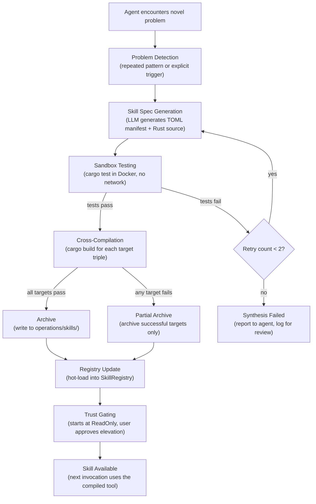
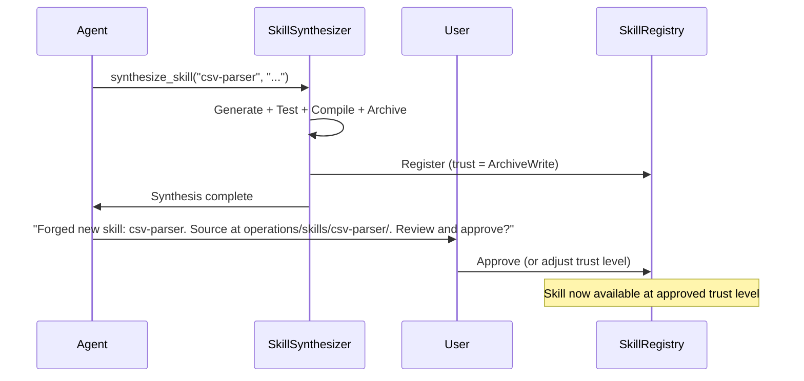
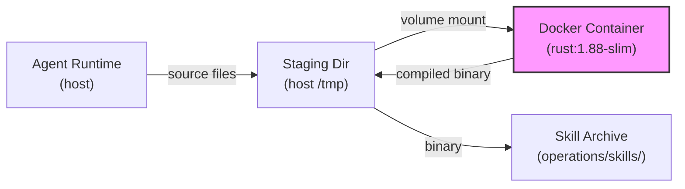
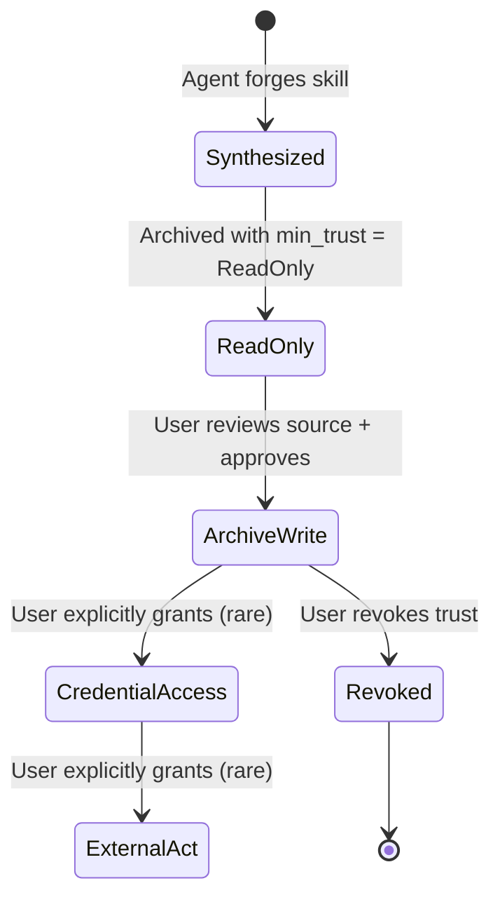
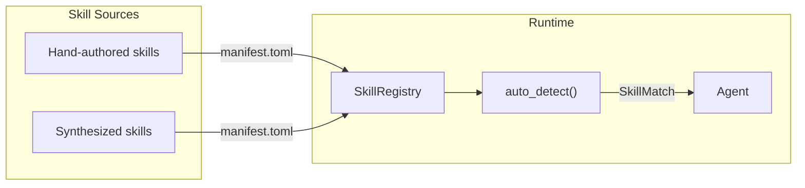
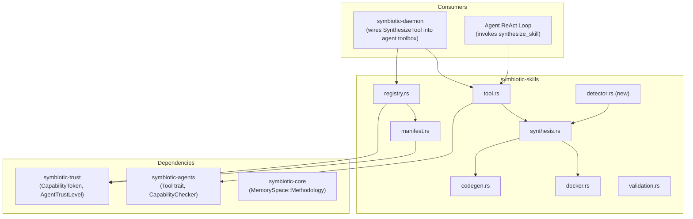

# Dynamic Skill Synthesis


**Status**: Implemented
**Task**: T65 (Skills Auto-Loading System), T70 (Secure Agent Framework), T62 (VM Sandboxing) — all landed
**Code**: `submodules/runtime/crates/symbiotic-skills/` — `detector.rs`, `synthesis.rs`, `codegen.rs`, `docker.rs`, `tool.rs`

## Overview

Dynamic Skill Synthesis is the system that allows Symbiotic agents to permanently solve recurring friction by forging reusable Rust binary tools at runtime, rather than writing throwaway bash scripts or inline hacks.

When an agent encounters a novel problem -- parsing a new file format, interacting with an unfamiliar API, automating a multi-step shell workflow -- it recognizes the opportunity, generates a native Rust `stdio-json-rpc` binary, compiles it in a sandboxed Docker container, runs tests, and archives the result as a permanent skill in `knowledge-base/operations/skills/`. The next time any agent encounters the same problem class, the skill is auto-loaded from the registry instead of being reinvented.

This is the implementation of the "Forge Over Hack" rule from `CONTEXT.md` and a core expression of the Extended Arm paradigm: the system does not just execute tasks, it improves its own tooling as a side effect of working.

### Why It Matters

1. **Compounding capability**: Every solved problem leaves behind a reusable tool. The system gets measurably better over time.
2. **Reliability**: Compiled Rust binaries with tests are strictly more reliable than ad-hoc shell pipelines.
3. **Security**: Synthesized skills run through the same `CapabilityToken` gating as all other agent actions. They start at the lowest trust level and require user approval to escalate.
4. **Cross-platform**: Skills are compiled as "fat bundles" (see `docs/design/skill-bundle-manifest.md`) with binaries for macOS ARM, macOS Intel, and Linux x86_64 -- a skill forged on a Mac works on the VPS.

## Synthesis Pipeline

The pipeline transforms a problem observation into a registered, tested, cross-platform skill.



### Stage 1: Problem Detection

An agent recognizes a synthesis opportunity through one of three mechanisms:

| Trigger | Description | Example |
|---------|-------------|---------|
| **Explicit request** | User or goal text says "forge a tool for X" | `"forge a skill for CSV-to-JSON conversion"` |
| **Repeated friction** | Agent detects it has solved the same class of problem 2+ times in the current goal execution | Third time writing sed commands to patch JSON files |
| **Tool gap** | Agent calls `synthesize_skill` directly when it determines no existing skill or built-in tool can solve the problem | Agent needs to parse a proprietary binary format |

Detection is handled inside the agent's ReAct loop (`symbiotic-agents`). When the agent decides to synthesize, it invokes the `synthesize_skill` tool (already implemented in `symbiotic-skills::tool::SynthesizeTool`).

```rust
/// The agent's internal heuristic for synthesis triggers.
/// This runs as part of the ReAct observation phase.
pub struct SynthesisDetector {
    /// Tracks problem signatures seen during this execution.
    problem_log: Vec<ProblemSignature>,
    /// Minimum number of similar problems before suggesting synthesis.
    repetition_threshold: usize, // default: 2
}

/// A fingerprint of a problem the agent encountered.
#[derive(Debug, Clone)]
pub struct ProblemSignature {
    /// Category of the problem (e.g., "file-parsing", "api-integration", "text-transform").
    pub category: String,
    /// Free-text description of what the agent was trying to do.
    pub description: String,
    /// Hash of the approach used (to detect repetition of the same workaround).
    pub approach_hash: u64,
    /// Timestamp of when this problem was encountered.
    pub timestamp: u64,
}
```

### Stage 2: Skill Spec Generation

Once synthesis is triggered, the `CodeGenerator` trait (implemented by `LlmCodeGenerator` in `symbiotic-skills::codegen`) produces:

1. A `Cargo.toml` with the skill name, edition 2021, and minimal dependencies (`serde`, `serde_json`, plus domain-specific crates).
2. A `src/main.rs` following the `stdio-json-rpc` protocol: read JSON requests from stdin, write JSON responses to stdout.
3. At least one `#[cfg(test)]` unit test validating core behavior.

The LLM receives a system prompt defining the skill contract (protocol, type signatures, test structure) and a user prompt describing the specific problem. The existing `LlmCodeGenerator::system_prompt()` and `LlmCodeGenerator::user_prompt()` in `symbiotic-skills::codegen` handle this.

**Validation before compilation**: The generated code is checked for:
- `[package]` section in `Cargo.toml`
- `fn main()` in `src/main.rs`
- No `unsafe` blocks (unless explicitly authorized by the synthesis request)
- No network dependencies in `Cargo.toml` (synthesized skills start with no network access)

### Stage 3: Sandbox Testing

Before cross-compiling, the generated code is tested inside a Docker container with no network access.

```rust
// Existing trait in symbiotic-skills::synthesis
#[async_trait]
pub trait SandboxCompiler: Send + Sync {
    async fn compile(
        &self,
        source: &GeneratedSource,
        target: &str,
        skill_name: &str,
    ) -> Result<CompileResult, SynthesisError>;

    async fn test(
        &self,
        source: &GeneratedSource,
        skill_name: &str,
    ) -> Result<TestResult, SynthesisError>;
}
```

The `DockerSandboxCompiler` (already implemented in `symbiotic-skills::docker`) handles this. Configuration:

| Parameter | Default | Purpose |
|-----------|---------|---------|
| `image` | `rust:1.88-slim` | Docker image for compilation |
| `memory_limit` | `512m` | Container memory cap |
| `cpu_limit` | `1.0` | CPU cores allocated |
| `timeout_secs` | `120` | Max seconds before kill |
| `no_network` | `true` | Network isolation |

If tests fail, the pipeline retries code generation up to 2 times, feeding the error output back to the LLM as context for correction.

### Stage 4: Cross-Compilation

After tests pass, the source is compiled for all target platforms using `cross` (Docker-based cross-compilation):

```
cargo build --release                                    # host (e.g. aarch64-apple-darwin)
cross build --target x86_64-unknown-linux-musl --release  # Linux VPS
```

Default targets (from `synthesis::default_targets()`):
- `aarch64-apple-darwin` (Mac Silicon)
- `x86_64-unknown-linux-musl` (Linux VPS / Docker)

Additional targets can be added per-request.

### Stage 5: Archival

The `SkillArchiver` (existing in `symbiotic-skills::synthesis`) writes the skill bundle to `knowledge-base/operations/skills/{skill-name}/`:

```
knowledge-base/operations/skills/{skill-name}/
+-- manifest.toml      # TOML manifest (T65 format + [targets] section)
+-- src/
|   +-- main.rs        # Original synthesized source code
+-- Cargo.toml         # Build definition (for re-synthesis)
+-- bin/
    +-- aarch64-apple-darwin
    +-- x86_64-unknown-linux-musl
```

### Stage 6: Registration

After archival, the new skill is hot-loaded into the `SkillRegistry`:

```rust
// In the daemon or agent runtime, after successful synthesis:
let manifest = load_manifest(&skill_dir)?;
registry.register(manifest);
```

The skill is immediately available for auto-detection by any agent in the current runtime session. On daemon restart, it is discovered during the normal `load_from_dir()` scan.

### Stage 7: Trust Gating

Synthesized skills start at the lowest usable trust level:

| Trust Level | What It Means | How to Reach |
|-------------|--------------|--------------|
| `ReadOnly` | Skill can be loaded and its source inspected, but cannot execute | Initial state for all synthesized skills |
| `ArchiveWrite` | Skill can execute in sandbox with archive read/write | User approves after reviewing source + test results |
| `CredentialAccess` | Skill can access the Vault | User explicitly grants (rare for synthesized skills) |
| `ExternalAct` | Skill can make network calls, interact with external APIs | User explicitly grants after sustained trust |

The generated `manifest.toml` sets `min_trust_level = "ArchiveWrite"` by default, meaning an agent needs at least `ArchiveWrite` trust to use the skill. The skill's own capabilities are gated by the `[capabilities]` section.

**Elevation flow**:



## Skill Template

### TOML Manifest

Synthesized skills use the same manifest format as T65 hand-authored skills, with an additional `[targets]` section for binary resolution and `[synthesis]` section for provenance:

```toml
[skill]
name = "csv-to-json"
version = "0.1.0"
description = "Converts CSV files to JSON with configurable column mapping"
min_trust_level = "ArchiveWrite"

[capabilities]
required = ["vm.exec"]

[triggers]
keywords = ["csv", "csv to json", "csv convert"]
invocation = "csv-to-json"

[validation]
script = "validate.sh"
timeout_secs = 30
on_failure = "warn"

[metadata]
author = "symbiotic-synthesizer"
created = "2026-03-01"
tags = ["synthesized", "auto-generated", "data-transform"]

[targets]
aarch64-apple-darwin = "./bin/aarch64-apple-darwin"
x86_64-unknown-linux-musl = "./bin/x86_64-unknown-linux-musl"

[synthesis]
requesting_agent = "agent-42"
synthesis_session = "session-37"
problem_description = "Agent needed to convert a 50MB CSV export to JSON for archive ingestion"
retry_count = 0
```

### Rust Binary Scaffold

Every synthesized skill follows the `stdio-json-rpc` pattern:

```rust
//! Auto-synthesized skill: {skill-name}
//! {description}

use std::io::{self, BufRead, Write};
use serde::{Deserialize, Serialize};

#[derive(Deserialize)]
struct Request {
    method: String,
    params: serde_json::Value,
}

#[derive(Serialize)]
struct Response {
    result: serde_json::Value,
    error: Option<String>,
}

fn main() {
    let stdin = io::stdin();
    let stdout = io::stdout();
    let mut stdout = stdout.lock();

    for line in stdin.lock().lines() {
        let line = match line {
            Ok(l) => l,
            Err(_) => break,
        };
        if line.trim().is_empty() {
            continue;
        }

        let request: Request = match serde_json::from_str(&line) {
            Ok(r) => r,
            Err(e) => {
                let resp = Response {
                    result: serde_json::Value::Null,
                    error: Some(format!("parse error: {e}")),
                };
                let _ = writeln!(stdout, "{}", serde_json::to_string(&resp).unwrap());
                continue;
            }
        };

        let response = handle_request(&request);
        let _ = writeln!(stdout, "{}", serde_json::to_string(&response).unwrap());
    }
}

fn handle_request(request: &Request) -> Response {
    match request.method.as_str() {
        "execute" => {
            // Domain-specific logic here
            Response {
                result: serde_json::json!({"status": "ok"}),
                error: None,
            }
        }
        _ => Response {
            result: serde_json::Value::Null,
            error: Some(format!("unknown method: {}", request.method)),
        },
    }
}

#[cfg(test)]
mod tests {
    use super::*;

    #[test]
    fn test_execute_method() {
        let req = Request {
            method: "execute".to_string(),
            params: serde_json::json!({}),
        };
        let resp = handle_request(&req);
        assert!(resp.error.is_none());
    }

    #[test]
    fn test_unknown_method() {
        let req = Request {
            method: "nonexistent".to_string(),
            params: serde_json::json!({}),
        };
        let resp = handle_request(&req);
        assert!(resp.error.is_some());
    }
}
```

### Input/Output Schema

Skills communicate via line-delimited JSON on stdio:

**Request** (stdin, one JSON object per line):
```json
{
  "method": "execute",
  "params": {
    "input_file": "/path/to/input.csv",
    "delimiter": ",",
    "headers": true
  }
}
```

**Response** (stdout, one JSON object per line):
```json
{
  "result": {
    "output_file": "/path/to/output.json",
    "rows_processed": 1250,
    "status": "ok"
  },
  "error": null
}
```

**Error Response**:
```json
{
  "result": null,
  "error": "failed to parse CSV: unexpected column count at row 42"
}
```

## Sandbox and Security

### Compilation Sandbox

All synthesis happens inside Docker containers managed by `DockerSandboxCompiler`:



**Container security constraints**:

| Constraint | Setting | Rationale |
|-----------|---------|-----------|
| Network | `--network none` | Prevents exfiltration of host data or downloading malicious dependencies |
| Memory | `--memory 512m` | Prevents resource exhaustion |
| CPU | `--cpus 1.0` | Prevents CPU starvation of daemon |
| Timeout | 120 seconds | Prevents hung builds |
| Volume | Read-write only to `/workspace` | Prevents filesystem escape |
| User | Non-root (future) | Defense in depth |

### No Network During Compilation

Synthesized skills cannot download dependencies during compilation. All required crates must be available in the Docker image or vendored into the staging directory. This is a deliberate constraint:

- If a skill needs `serde` and `serde_json` (the common case), these are pre-installed in the Docker image.
- If a skill needs a domain-specific crate (e.g., `csv`, `regex`), the code generator must vendor it or the Docker image must include it.
- A curated set of "allowed crates" can be pre-loaded in the Docker image. This set is documented and version-pinned.

### Trust Level Lifecycle



### Capability Token Gating

Synthesis itself requires a `CapabilityToken` with the `vm.exec` scope. The `SynthesizeTool::execute()` method (in `symbiotic-skills::tool`) checks this before proceeding:

```rust
// From tool.rs -- existing implementation
async fn execute(&self, params: serde_json::Value) -> Result<ToolResult> {
    // Capability gate: skill synthesis requires vm.exec
    self.caps.check(&self.agent_id, "vm.exec")?;
    // ... proceed with synthesis
}
```

This means:
- Only agents with `vm.exec` scope can trigger synthesis.
- The `vm.exec` scope requires at least `ArchiveWrite` trust level in the current trust framework.
- Users must have issued a `CapabilityToken` granting `vm.exec` to the agent.

### Preventing Malicious Synthesis

Several layers prevent a compromised agent (e.g., via prompt injection) from synthesizing a malicious skill:

1. **Capability gate**: Only agents with explicit `vm.exec` token can synthesize.
2. **No network in sandbox**: Compiled code cannot phone home.
3. **Source preservation**: The `src/main.rs` is archived alongside binaries for human review.
4. **Low initial trust**: New skills start at `ReadOnly` -- they cannot execute without user approval.
5. **Validation hooks**: Skills can include validation scripts that verify output correctness.
6. **Audit trail**: The `[synthesis]` section in the manifest records which agent requested the skill, from which session, and why.

## Integration Points

### Agent Framework (T70)

The `SynthesizeTool` is registered as an agent tool in the daemon's tool registry. When the agent's ReAct loop determines that synthesis is needed, it calls the tool like any other:

```json
{"tool": "synthesize_skill", "params": {"skill_name": "csv-parser", "description": "Parse CSV files with arbitrary delimiters and output JSON records"}}
```

The `SynthesisDetector` (new component) integrates into the agent's observation phase to suggest synthesis proactively. It does not force synthesis -- it adds a system message like: "You have solved similar file-parsing problems 3 times in this session. Consider forging a permanent skill with `synthesize_skill`."

### Skills System (T65)

Synthesized skills use the exact same `manifest.toml` format as hand-authored skills. They are stored in the same directory (`knowledge-base/operations/skills/`), loaded by the same `SkillRegistry::load_from_dir()`, and matched by the same `auto_detect()` algorithm.

The only difference: synthesized skills include a `[targets]` section (for binary resolution per `skill-bundle-manifest.md`) and a `[synthesis]` section (for provenance tracking).



### Trust Framework

The trust framework (`symbiotic-trust`) provides the `CapabilityToken` and `AccessBroker` that gate synthesis:

- **Synthesis trigger**: Requires `vm.exec` scope in the agent's token.
- **Skill execution**: Requires the agent's `AgentTrustLevel` to be >= the skill's `min_trust_level`.
- **Capability intersection**: The agent must have all capabilities listed in the skill's `[capabilities].required`.

### Distillery (Procedural Memory)

Synthesized skills are stored in `knowledge-base/operations/skills/`, which maps to `MemorySpace::Operations` -- the procedural memory space. This is intentional: skills are "how the system acts", and the Distillery pipeline can index, decay, and surface them just like any other procedural knowledge.

When a skill is synthesized:
1. The skill bundle is written to `operations/skills/`.
2. A Markdown entry can be created at `operations/skills/{name}/README.md` describing the skill's purpose, usage, and provenance.
3. The Neural Graph can index the skill by its keywords, domain, and creation context, enabling recall during future goal planning.

### VM Sandboxing (T62)

For environments where Docker is not available (e.g., macOS without Docker Desktop), the synthesis pipeline can fall back to the VM sandboxing system from T62. The `SandboxCompiler` trait abstracts the backend:

| Backend | When Used |
|---------|-----------|
| `DockerSandboxCompiler` | Default -- Docker available on host |
| `VmSandboxCompiler` | Fallback -- Docker unavailable, Lume/QEMU VM used instead |
| `StubSandboxCompiler` | Testing -- returns mock results |

## Key Decisions

1. **Rust-only synthesis (no Python/Node/shell skills)**
   - *Rationale*: Compiled Rust binaries are fast, memory-safe, and cross-compilable. Interpreted skills would require language runtimes on every platform and introduce supply-chain risk.
   - *Tradeoff*: Synthesis is harder (Rust is more complex to generate correctly), but the retry mechanism compensates.

2. **No network during compilation**
   - *Rationale*: Eliminates supply-chain attacks via malicious crate downloads. All dependencies must be pre-vendored or available in the Docker image.
   - *Tradeoff*: Limits the crates available to synthesized skills. A curated allowlist mitigates this.

3. **Start at ReadOnly trust, require user approval**
   - *Rationale*: Prevents a compromised agent from forging and immediately executing a malicious tool. The user always has veto power.
   - *Tradeoff*: Adds friction to the first use of a new skill. This is acceptable for security.

4. **Retry code generation up to 2 times on test failure**
   - *Rationale*: LLM-generated code often has minor bugs. Feeding the error back produces correct code on retry. More than 2 retries has diminishing returns.
   - *Tradeoff*: Increases synthesis time and LLM cost. Bounded retries keep this reasonable.

5. **Fat bundles (multi-platform binaries in one directory)**
   - *Rationale*: A skill forged on macOS must work on the Linux VPS. Cross-compilation via `cross` handles this at synthesis time rather than runtime.
   - *Tradeoff*: Larger disk usage (multiple binaries per skill). Acceptable given skills are typically small.

6. **`stdio-json-rpc` protocol for all skills**
   - *Rationale*: Simple, debuggable, language-agnostic. The agent spawns the binary, writes JSON to stdin, reads JSON from stdout. No HTTP server, no sockets, no complexity.
   - *Tradeoff*: Not suitable for long-running services or streaming. Adequate for tool-style request/response patterns.

7. **Source code preserved alongside binaries**
   - *Rationale*: Enables human review, re-synthesis with improvements, and auditing. The source is the ground truth; binaries can be rebuilt from it.
   - *Tradeoff*: Marginal disk usage increase. Worth it for transparency.

## Module Layout

All synthesis code lives in the `symbiotic-skills` crate (already exists):

```
submodules/runtime/crates/symbiotic-skills/
+-- Cargo.toml
+-- src/
    +-- lib.rs            # Module declarations
    +-- manifest.rs       # TOML manifest parsing and validation
    +-- registry.rs       # SkillRegistry, auto-detection, trust gating
    +-- synthesis.rs       # Pipeline orchestration, SynthesisRequest/Result types
    +-- codegen.rs        # LLM-backed and stub code generation
    +-- docker.rs         # DockerSandboxCompiler implementation
    +-- tool.rs           # SynthesizeTool (agent-callable tool)
    +-- validation.rs     # Output validation hooks
    +-- detector.rs       # [NEW] SynthesisDetector for proactive synthesis triggers
```

**New file**: `detector.rs` contains the `SynthesisDetector` and `ProblemSignature` types. Everything else already exists and needs only targeted extensions (e.g., adding `[synthesis]` section parsing to `manifest.rs`, adding retry logic to `synthesis.rs`).

**Changes to existing files**:

| File | Change |
|------|--------|
| `manifest.rs` | Add `SynthesisSection` to `ManifestToml` (optional, for provenance) |
| `synthesis.rs` | Add retry logic (re-generate on test failure, max 2 retries) |
| `codegen.rs` | Add error-feedback prompt construction for retries |
| `registry.rs` | Add `register_hot()` method for live registration after synthesis |

## Dependency Graph



**What this depends on**:
- `symbiotic-trust` -- `AgentTrustLevel`, `CapabilityToken` for access gating
- `symbiotic-agents` -- `Tool` trait, `CapabilityChecker` trait for tool registration
- `symbiotic-core` -- `MemorySpace::Methodology` for archive path resolution
- Docker runtime -- for `DockerSandboxCompiler`
- `cross` CLI tool -- for cross-compilation (optional, only needed for multi-target builds)

**What depends on this**:
- `symbiotic-daemon` -- registers `SynthesizeTool` in the agent's toolbox
- Agent ReAct loop -- invokes synthesis when encountering novel problems
- Distillery pipeline -- indexes synthesized skills as procedural memory
- Future: self-improvement loop (metrics detect gaps, system proposes and synthesizes skills)

## Error Handling

| Error | Handling | Recovery |
|-------|----------|----------|
| LLM unavailable | `SynthesisError::CodeGenFailed` | Fall back to stub template; report to agent |
| Generated code invalid | `SynthesisError::CodeGenFailed` | Retry with error context (up to 2 times) |
| Tests fail | `SynthesisError::TestFailed` | Retry code generation with test output as feedback |
| Compilation fails | `SynthesisError::CompileFailed` | Report to agent with compiler errors; do not archive |
| Docker unavailable | `SynthesisError::SandboxUnavailable` | Fall back to VM sandbox (T62) or report to user |
| Archival fails (disk full, permissions) | `SynthesisError::ArchivalFailed` | Report to agent; skill is lost (source was ephemeral) |
| Partial compilation (some targets fail) | Archive with successful targets only | Log warning; skill works on subset of platforms |
| Capability denied | `anyhow::Error` from `CapabilityChecker` | Agent cannot synthesize; report denial reason |
