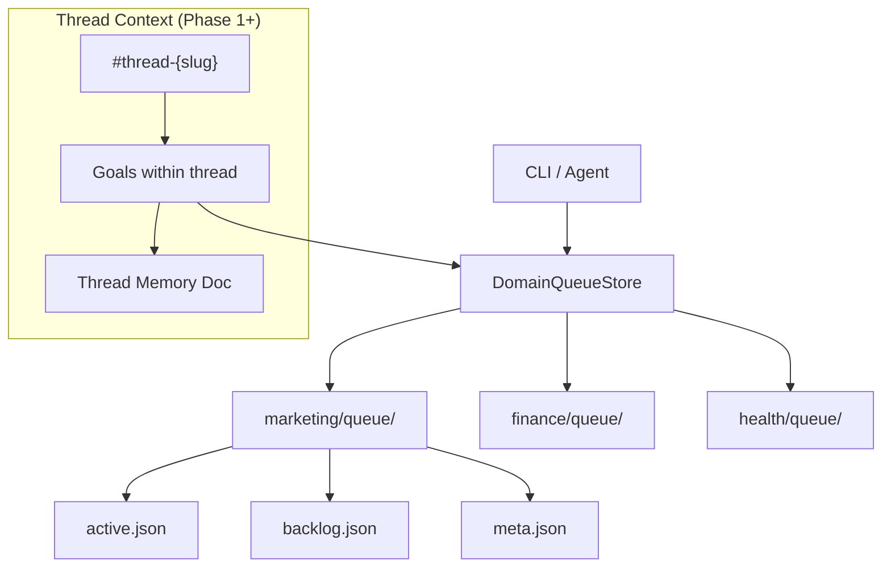

# Goals Layer


## Overview

The Goals Layer provides goal-aware task management via the `DomainTask` struct and domain queue system. Each task can optionally reference a goal and a stream, enabling goal-scoped filtering and organization. Tasks are persisted in per-domain JSON files.

**Thread architecture (2026-03-16, clarified 2026-04-10):** Goals attach to threads, but threads are messaging surfaces rather than the ownership container. Goals remain owned work units linked by `thread_id` when they project into conversation. The `#goal-{slug}` room pattern is being replaced by `#thread-{slug}` (Phase 2 of thread architecture). See `docs/design/thread-architecture.md` for the full design.

**Current daemon ownership projection (2026-04-11, updated 2026-04-16):** direct `#goals` inquisition intake now creates a stable goal-owned project identity immediately, using `inquisition:{goal_id}` as the durable workflow template. The daemon also persists canonical goal planning state into the Archive under `knowledge-base/operations/goals/{goal}/plan.md`. Once the user approves a generated plan, the daemon materializes canonical child task docs under `knowledge-base/operations/goals/{goal}/tasks/*.md` and derives child task / execution work items from those planned records. Those child task docs now carry explicit `task_id`, mutable `task_slug`, canonical `task_kind`, canonical `task_driver`, `depends_on`, questionnaire-context, `owner_hint`, typed `declared_context`, typed `policy`, retry/reopen metadata, explicit plan state / execution status separation, and lineage fields (`derived_from`, `replaces`, `superseded_by`). The planner now authors structural replanning intent directly: renames preserve `task_id`, splits/merges declare lineage via `derived_from` / `replaces`, and Archive reconciliation marks removed tasks as `cancelled` or `superseded` accordingly. Runtime projection now depends on `task_driver`, not on semantic kind alone: the orchestrator defaults `execution`/`distillation` to `agent` and `review`/`coordination`/`waiting`/`approval` to `declared`, then enforces legality (`execution`/`distillation` cannot become `declared`; `waiting`/`approval` cannot become `agent`; `review`/`coordination` may use either path). The planner also now separates `owner_hint` from `role`: `role` is only for `task_driver: agent`, while `owner_hint` is the canonical ownership target for declared or human-facing tasks. Declared or human-facing tasks keep semantic context and runtime policy separate: `declared_context` carries review target, waiting condition, coordination target, and external dependency, while `policy.escalation` carries escalation mode, audience, severity, trigger/cooldown metadata, and `policy.timing` carries timezone-aware lateness/delivery-window overrides. Goal plans can now also attach shared Archive policy scopes via `policy_scopes`, and Nucleus resolves those shared scope records from `knowledge-base/operations/policy/scopes/*.md` before goal/task overrides. The minimal Archive-native scheduling layer is also live: `knowledge-base/operations/calendar/availability/*.md` now defines delivery-subject availability records, and timing resolution now uses them to supply timezone and concrete quiet-hour/working-hour windows for subjects like `operator`, optional shared delivery scopes such as `team:*`, and optional operational audiences such as `oncall:*`. Effective escalation now resolves as built-in -> operator defaults -> attached goal policy scopes -> goal defaults -> task override, while effective timing resolves as built-in -> operator defaults -> audience-matched delivery scope -> attached goal policy scopes -> goal defaults -> delivery-subject availability -> task override. This keeps Symbiotic focused on agent-workflow delivery policy rather than general workplace scheduling while still allowing operational audiences to override personal quiet hours without hidden daemon config. `task_driver: agent` spawns execution work items, while `task_driver: declared` keeps the task Archive-native without a synthetic execution child. Non-execution task kinds now progress only through explicit declared transitions (`goal.task.transition`) and explicit blocker mutation commands (`goal.task.condition.set`, `goal.task.condition.satisfied`) instead of inferred runtime activity, so waiting/approval semantics stay visible and auditable in the Archive. Ownership changes are explicit too: `goal.task.assign` updates canonical `owner_hint`, writes a structured `task_owner_changed` event, and refreshes the derived task work-item assignee. Task work-item assignees now derive from canonical `owner_hint` first, then role fallback, so accountability lives in the Archive instead of being guessed from the goal owner. Declared-task escalation is now state-driven and time-aware: when a declared task explicitly enters `blocked`, the daemon first evaluates the effective timing policy. If the delivery window is open, it appends canonical `task_escalated` history and projects the consequence outward by policy (`notify_operator` -> attached thread notice, `raise_alert` -> thread notice plus `#alerts`, `auto_replan` -> thread notice plus canonical replan request event). If the delivery window is closed, it records canonical `task_escalation_deferred` instead and defers the human-facing projection until the window opens, while still allowing canonical replanning requests. Audience and severity are now canonical too, so urgent work or operational delivery subjects can route to `#alerts` without inventing a special task kind or hiding delivery rules in Matrix-only code. A daemon reconciler now consumes unprocessed `task_replan_requested` events from the Archive, appends canonical `task_replan_enqueued`, and re-enters the same `inquisition:{goal}` planning lane with Archive-derived `replan_context` instead of inventing a second replanning path. Background policy evaluation is also live now: built-in/operator/shared-scope/goal/task defaults resolve into an effective escalation and timing policy, `after_secs` can trigger later escalations, `lateness_basis` can count either wall-clock or delivery-window elapsed time, closed delivery windows produce canonical `task_escalation_deferred` / `task_escalation_window_opened`, cooldown / `max_count` produce canonical `task_escalation_suppressed`, internal dependencies produce `task_dependencies_satisfied`, and blocked declared tasks with no remaining blockers resume to their last runnable state from Archive event history. Explicit declared-condition satisfaction clears the canonical blocker field from `declared_context`, appends `task_condition_satisfied`, and also resumes the task when that cleared condition was the only remaining blocker. The daemon writes task lifecycle status back into those same Archive docs during execution and explicit declared transitions, and each goal maintains append-only planning/lifecycle events under `knowledge-base/operations/goals/{goal}/events/*.md` with structured frontmatter for added/preserved/deactivated task IDs, supersession edges, owner-change edges, task status transitions, escalation metadata, and condition metadata. Thread observability now reads those goal/task projections back out: active Project Board operations come from goal task work items when available, and recent board updates can come from canonical Archive goal events instead of only transient workflow logs. The Archive is therefore sufficient to reconstruct declared goal/task state; the runtime work-item layer is the live execution projection.

**Current implementation**: `submodules/runtime/crates/symbiotic-domains/src/lib.rs`

**Planned work**: see `docs/design/goals-layer.md` for the Goal Orchestrator, ranking agents, coordination queue, workflow engine, and goal state machine.

## Components

The domain-queue primitives remain the persistent substrate, but the bulk of the shipped Goals Layer now lives in the daemon and control-plane crates that sit on top of them.

### Domain queue primitives

| Component | Location | Purpose |
|-----------|----------|---------|
| `DomainTask` | `symbiotic-domains/src/lib.rs` | Task struct with `goal` and `stream` fields |
| `DomainQueue` | `symbiotic-domains/src/lib.rs` | Container for a list of domain tasks |
| `DomainQueueStore` | `symbiotic-domains/src/lib.rs` | Filesystem-backed store for domain queues |
| `DomainQueueMeta` | `symbiotic-domains/src/lib.rs` | Metadata (counts, timestamps) per domain |
| `QueueKind` | `symbiotic-domains/src/lib.rs` | Enum: `Active` or `Backlog` |

### Goal management & policy runtime (daemon)

| Component | Location | Purpose |
|-----------|----------|---------|
| `goal_management.rs` | `symbiotic-daemon/src/` | Canonical goal/task lifecycle, Archive-backed plan state, declared-task transitions |
| `goals.rs` | `symbiotic-daemon/src/` | Goal routing, inquisition entry, per-goal project identity |
| `subgoal/dispatcher.rs` | `symbiotic-daemon/src/` | Subgoal fan-out and execution work-item dispatch |
| `declared_task_policy.rs` | `symbiotic-daemon/src/` | Escalation / timing / delivery-window policy resolution for declared tasks |
| `thread_observability.rs` | `symbiotic-daemon/src/` | Projects goal/task state into thread Project Board summaries |

### Project / Goal / Process manifests (control-plane)

| Component | Location | Purpose |
|-----------|----------|---------|
| `ProjectManifest` | `symbiotic-control-plane/` | Parsed project-level manifest (state, metadata, owned goals) |
| `GoalManifest` | `symbiotic-control-plane/` | Parsed goal manifest (process linkage, policy scopes, defaults) |
| `ProcessManifest` | `symbiotic-control-plane/` | Parsed process manifest (generator mode, task templates, cadence) |

See `docs/design/project-goal-process-model.md` and `docs/design/goal-task-work-item-hierarchy.md` for the target shape that these manifests and daemon modules are converging on.

## DomainTask Schema

```rust
pub struct DomainTask {
    pub id: String,
    pub title: String,
    pub goal: Option<String>,       // Goal slug reference
    pub stream: Option<String>,     // Stream within the goal
    pub thread_id: Option<String>,  // NEW: Thread context (Phase 1)
    pub status: String,
    pub priority: u8,
    pub assignee: Option<String>,
    pub created_at: u64,
    pub due_at: Option<u64>,
    pub context: Value,             // Arbitrary JSON context
}
```

The `goal` field links a task to a goal by slug (e.g., `"build-symbiotic-business"`). The `stream` field names the sub-process within that goal (e.g., `"marketing"`). The `thread_id` field links the task to a thread container (e.g., `"thread-saas-product"`). All three are optional; tasks without goals or threads are standalone.

## Domain Queue Persistence

Each domain gets a directory under the store root:

```
domains/{domain}/queue/
  active.json     # Active tasks
  backlog.json    # Backlog tasks
  meta.json       # Queue metadata
```

**Write safety**: all writes use a tmp-file-then-rename pattern to prevent corruption on crash.

## Data Flow



## Operations

| Operation | Method | Description |
|-----------|--------|-------------|
| Add task | `add_task()` | Add to active or backlog queue |
| List tasks | `list_tasks()` | List by domain, optionally filtered by queue kind |
| List all | `list_all_tasks()` | List across all domains |
| Update status | `update_status()` | Change task status by ID |
| Assign | `assign_task()` | Set assignee on a task |
| Promote | `promote_task()` | Move task from backlog to active |
| Refresh meta | `refresh_meta()` | Recompute metadata counts |

## Goal Lifecycle in Thread Context

Goals are created within threads — either explicitly (user requests a complex task) or via auto-promotion (classifier identifies a conversation as goal-worthy).

### Creation

- User sends a message in `#stream` that the UX Classifier identifies as GOAL complexity
- Daemon creates a `#thread-{slug}` room (or routes to an existing thread)
- Emits `goal.created` event in the thread room:
  ```json
  {
    "sym": {
      "t": "goal.created",
      "d": {
        "goal_id": "goal-competitor-research",
        "thread_id": "thread-saas-product",
        "title": "Research competitors"
      }
    }
  }
  ```

### Result and Completion

Goals emit two events at the end of their lifecycle:

1. **`goal.result`** — carries the actual output/answer (structured body with the work product)
2. **`goal.completed`** — carries the status (success/failure, timing, metadata)

This separation allows the app to display the result immediately while the daemon finalizes bookkeeping.

### Goals Attached To Threads

A thread is a **messaging surface** that can carry updates from multiple attached goals. For example:

```
Thread: SaaS Product (#thread-saas-product)
  ├── Goal 1: "Research competitors" (completed)
  ├── Goal 2: "Build frontend" (running)
  ├── Goal 3: "Set up CI/CD" (queued)
  └── Goal 4: "Configure Stripe" (not started)
```

Goals attached to a thread can share context via the Thread Memory Document and Neural Graph facts. The Recall Gateway provides thread-scoped context packs to agents working on related goals within the same thread surface.

### Cross-Thread Routing

When a message in one thread relates to a different thread's topic:
- The system **suggests** moving to the relevant thread (routing card with options)
- The user **confirms** before any message moves
- **Never auto-move** — moving messages without consent is disruptive

See `docs/design/thread-architecture.md` section 3.5 for the full cross-thread routing design.

## Key Decisions

1. **Goal as optional field**: tasks can exist without goals, supporting both goal-driven and ad-hoc workflows.
2. **Per-domain JSON files**: simple, inspectable, no database dependency.
3. **Atomic writes**: tmp-file-then-rename prevents partial writes.
4. **Priority + creation time sort**: tasks are sorted by `(priority, created_at)` for deterministic ordering.
5. **Thread-attached goals**: goals project into threads, but the thread is the messaging surface rather than the ownership container.
6. **Multiple goals can attach to one thread**: a single conversation surface may reflect several related goals without becoming the project itself.
7. **`goal.result` precedes `goal.completed`**: the result event carries the answer/output, the completed event carries the status. This enables immediate display of results.
8. **Cross-thread routing: suggest only, never auto-move**: the classifier proposes, the user decides. No unilateral message movement.

## Error Handling

| Error | Handling |
|-------|----------|
| Domain directory missing | Auto-created via `ensure_domain()` |
| Queue file missing | Returns empty `DomainQueue` |
| Queue file corrupted | `serde_json` parse error propagated to caller |
| Task not found | Returns `DomainQueueError::TaskNotFound` |
| Filesystem write failure | Error propagated with path context |
