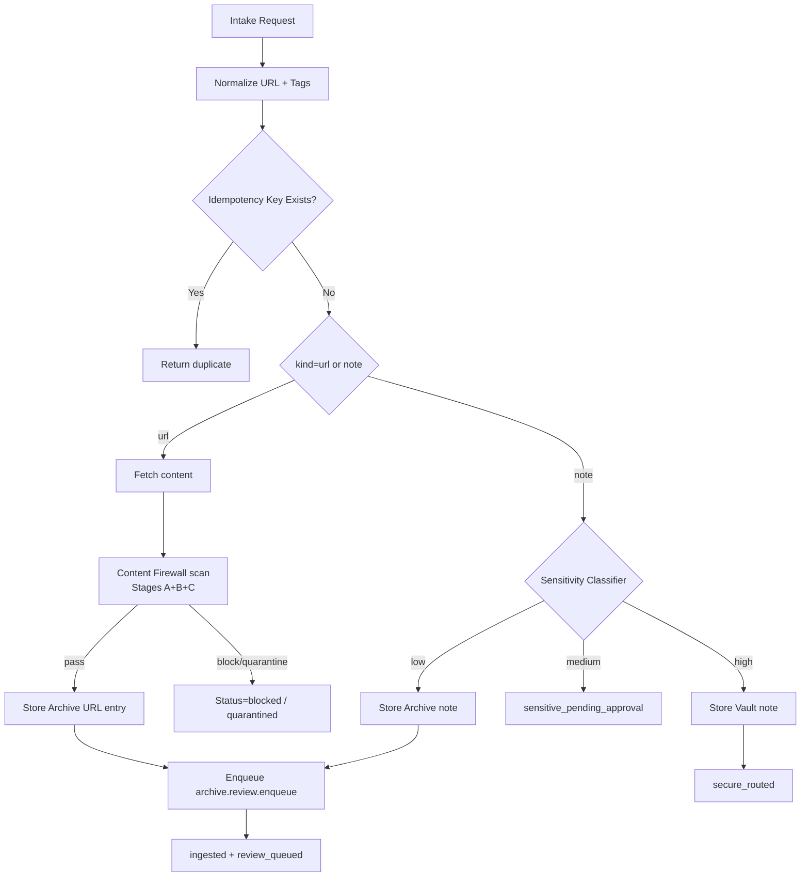

# Ingestion Pipeline

## Overview

The ingestion pipeline normalizes intake requests, deduplicates by idempotency key, classifies note sensitivity, stores records, and enqueues Archive review work.

**Status (2026-04-20)**: In progress. Core intake pipeline, queue admission, review worker, curl-based fetcher, bookmarks API->fallback chain, and live X thread API fetch path are implemented; live browser automation and non-curl HTTP transport are still pending. The crate was renamed `symbiotic-ingestion` -> `symbiotic-intake` on 2026-02-25 (paths below reflect the current layout). T132 Content Firewall now runs a scan stage between fetch and archive — see `docs/design/content-firewall.md` and "Firewall Scan" below.

Primary command:

- `symbiotic intake ...`
- `symbiotic ingest ...` (single-URL alias)

## Implemented Components

| Path | Purpose |
| --- | --- |
| `submodules/runtime/crates/symbiotic-intake/src/lib.rs` | `IntakePipeline` core contract |
| `submodules/runtime/crates/symbiotic-intake/src/twitter.rs` | X/Twitter fetch contract (API + fallback interfaces) |
| `submodules/runtime/crates/symbiotic-core/src/` | canonical intake request/result types + normalization (re-exported from the intake module) |
| `submodules/runtime/services/symbiotic-daemon/src/lib.rs` | queue-backed admission + worker execution + curl fetcher |
| `submodules/runtime/crates/symbiotic-matrix/src/intake.rs` | Matrix intake parser/handler contract |
| `submodules/runtime/crates/symbiotic-firewall/src/` | ingest-time scan stages (A+B+C) — see T132 |

## Data Flow



## Runtime Guardrails

| Guard | Value | Behavior |
|-------|-------|----------|
| URL scheme validation | `http` and `https` only | Non-http(s) URLs (e.g. `ftp://`, `file://`) are rejected with status `blocked` and error `unsupported URL scheme: {scheme}` |
| Content size limit | 10 MiB (`MAX_CONTENT_BYTES = 10 * 1024 * 1024`) | Fetched content exceeding the limit is rejected with status `blocked` before storage |

These guards are enforced in `IntakePipeline::process()` (`submodules/runtime/crates/symbiotic-intake/src/lib.rs`) before any content reaches the archive or review queue.

## Firewall Scan (T132)

After fetch and before Archive write, fetched content is passed through the Content Firewall (`symbiotic-firewall`). Stages A+B+C run ingest-time:

- **Stage A** — structural/MIME/size checks, fast-path reject for clearly unsafe payloads.
- **Stage B** — deterministic rule scan (regex, domain/trust lists, known-bad signatures) with cache.
- **Stage C** — LLM-lite adjudication via the `LlmGateway` trait for ambiguous cases.

Verdicts: `allow` (proceed to Archive), `quarantine` (route to operator review), or `block` (emit `blocked` status). The Archive writer guard refuses to persist content without a terminal firewall verdict. Stages D+E run context-time in the Recall Gateway rather than ingest-time.

See `docs/design/content-firewall.md` for the full stage contract and the `SECURITY_VERSION` rescan protocol.

## Intake Contract

Request:

```json
{
  "source": "cli|matrix|share|bookmarks|notes|api",
  "kind": "url|note",
  "urls": ["https://example.com/..."],
  "note": "optional text note",
  "tags": ["bookmark"]
}
```

Result item status:

- `ingested`
- `duplicate`
- `blocked` (includes firewall block verdicts)
- `invalid`
- `fetch_failed`
- `parse_failed`
- `store_failed`
- `queue_failed`
- `sensitive_pending_approval`
- `secure_routed`
- `quarantined` (firewall verdict routed to operator review — T132)

## Entry Points

- CLI (`symbiotic intake`, `symbiotic ingest`)
- Matrix room intake routing (`#intake`)
- Control command queueing for bookmark sync (`bookmarks sync ...`)
- Planned app share-sheet adapter (same intake contract)

## X/Twitter Intake

Current code defines the contract:

- primary API client (`TwitterApiClient`)
- fallback client (`TwitterFallbackClient`)

Current daemon integration for bookmarks:

- `bookmarks sync [api|browser] [limit]` -> `bookmarks.sync` queue job contract
- Worker expansion via deterministic source adapters:
  - `data/intake/bookmarks-api.txt`
  - `data/intake/bookmarks-browser.txt`
- Each discovered URL is enqueued into `ingest.fetch` with intake source `bookmarks`.

Pending:

1. Live browser-session fallback adapter for `source=browser`.
2. Native HTTP fetcher (non-curl) if we remove shell dependency.

## Sensitivity Routing

For note intake:

- high -> Vault route (`secure_routed`)
- medium -> `sensitive_pending_approval`
- low -> Archive + review enqueue

Credential and secure-channel architecture:

- `docs/architecture/credential-sandbox.md`
- `docs/architecture/session-handles.md`

## Status Envelope

Intake and related flows emit `org.symbiotic.event`:

```json
{
  "msgtype": "org.symbiotic.event",
  "body": "Intake complete",
  "sym": {
    "v": 1,
    "t": "intake.completed",
    "s": "completed",
    "rid": "run_abc",
    "ts": 1767222609,
    "d": { "ingested": 3, "duplicates": 1, "failed": 0, "total": 4 }
  }
}
```

Schema: `schemas/matrix-events.json`.
