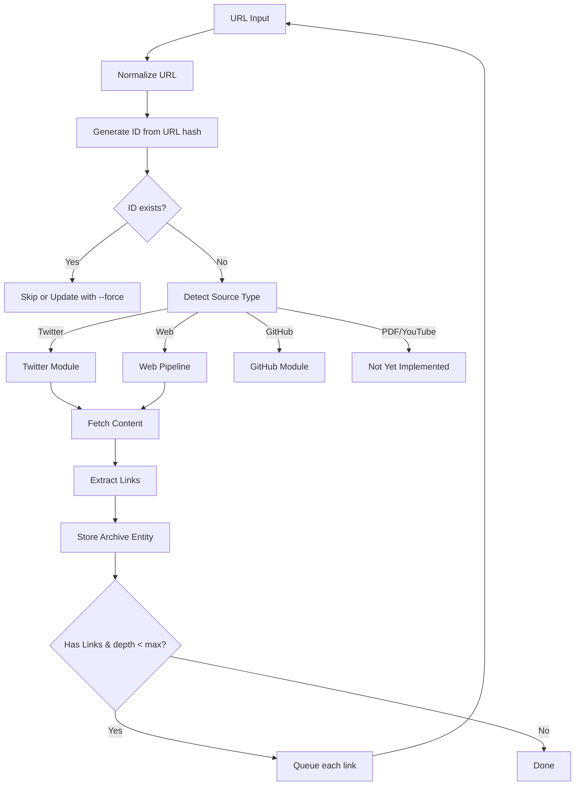

# Linked Entities Architecture


## Overview

Every piece of content in Symbiotic is a separate Archive entity. When content links to other content, each linked item becomes its own Archive entity with bidirectional wikilinks. This enables proper deduplication, independent analysis, and rich graph visualization in Obsidian.

**Status (2026-02-05)**: Planned. Archive storage is implemented; recursive link following is deferred to post‑MVP.

## Core Principles

1. **One URL = One Entity**: Each unique URL becomes exactly one Archive entry
2. **Deterministic idempotency**: Idempotency key is derived from normalized URL (record_id is assigned at store time)
3. **Recursive Processing (planned)**: Links found in content trigger new ingestion cycles
4. **Bidirectional Links**: Parent links to children, children link back to parent
5. **Independent Analysis**: Each entity can be analyzed separately

## Data Flow



**MVP behavior:** ingestion stops after `Store`. Link extraction + recursive enqueue is planned.

## Idempotency Key Generation

```rust
/// Generate deterministic idempotency key from normalized URL and tags.
pub fn idempotency_key(normalized_url: &Url, tags: &[String]) -> String {
    let mut hasher = Sha256::new();
    hasher.update(normalized_url.as_str());
    hasher.update("|");
    let sorted_tags = normalize_tags(tags);
    for tag in sorted_tags {
        hasher.update(tag.as_bytes());
        hasher.update(",");
    }
    format!("{:x}", hasher.finalize())
}
```

Tags are included in the hash so that the same URL with different tags produces distinct keys. Record IDs are generated when the Archive store writes the entry; the idempotency key enforces deduplication.

**Benefits:**
- Same URL always generates the same idempotency key
- Duplicate detection is automatic (idempotency key collision = duplicate)
- No separate URL index needed (Archive index tracks idempotency keys)
- Idempotent ingestion

## Entity Types

| Type | Source | Status |
|------|--------|--------|
| Article | Web page | Implemented |
| Tweet | Twitter/X | Implemented |
| PDF | PDF file | Not yet implemented |
| YouTube | Video | Not yet implemented |
| GitHub | Repository | Not Implemented |
| Analysis | Archive review output | Manual Briefs (structured analysis planned) |

## File Structure (MVP)

```mermaid
flowchart TB
    Archive[data/archive/]
    Archive --> Index[index.tsv]
    Archive --> Records[records/]

    Records --> Web[arc_* .md (web)]
    Records --> Tweet[arc_* .md (tweet)]
    Records --> Repo[arc_* .md (repo)]
    Records --> Pdf[arc_* .md (pdf planned)]

    Review[data/review/]
    Review --> ReviewIndex[index.tsv]
    Review --> ReviewRecords[records/]
    ReviewRecords --> Brief[arc_* .md (brief)]
```

## Link Format

### Forward Link (Parent → Child)

In the entry body, linked content appears as wikilinks:
```markdown
## Linked Content
- [[{child-id}-child-title]]
- [[{child-id}-another-link]]
```

### Back Link (Child → Parent)

In frontmatter, parent is stored as UUID (not wikilink):
```yaml
---
parent_id: 550e8400-e29b-41d4-a716-446655440000
source_url: https://...
---
```

Note: `parent_id` is the UUID of the parent entry. Obsidian can still navigate via backlinks.

## Example: Tweet with Links

**Input:** Tweet containing link to article, article links to another page

**Result:** 3 Archive entities (with `--max-depth 2`)

```mermaid
flowchart TB
    Tweet[Tweet (id: abc12345)\nlinked_ids: [def67890]]
    Article[Article (id: def67890)\nparent_id: abc12345\nlinked_ids: [ghi11111]]
    Linked[Linked Page (id: ghi11111)\nparent_id: def67890]

    Tweet --> Article --> Linked
```

In Obsidian, the "Linked Content" section shows wikilinks like `[[def67890-article-title]]`.

## Review Output (MVP)

Briefs are stored by the review worker in `data/review/records/` and indexed in `data/review/index.tsv`. Structured analysis entities remain planned and are tracked in `docs/architecture/knowledge-storage.md`.

## Deduplication

With URL-derived IDs, deduplication is automatic:

1. Ingest URL
2. Generate idempotency key from URL
3. Check if idempotency key exists in Archive index
4. If exists: skip (or update with `--force`)
5. If not: create new entity

## Link Follow Queue (Planned)

Recursive follow will enqueue `intake.link_follow` jobs into the queue system, using idempotency keys to avoid refetch loops. The queue will track `depth` and enforce `max_depth` limits per run.

## Components (MVP)

| File | Purpose |
|------|---------|
| `submodules/runtime/crates/symbiotic-core/src/intake.rs` | Intake types + idempotency keys |
| `submodules/runtime/crates/symbiotic-intake/src/lib.rs` | Intake pipeline + policy |
| `submodules/runtime/crates/symbiotic-intake/src/twitter.rs` | X thread fetch contract |
| `submodules/runtime/crates/symbiotic-archive/src/lib.rs` | Archive storage + idempotency index |
| `submodules/runtime/crates/symbiotic-review/src/lib.rs` | Brief storage (review output) |
| `submodules/runtime/crates/symbiotic-cli/src/main.rs` | `symbiotic intake` / `ingest` commands |
| `submodules/runtime/services/symbiotic-daemon/src/lib.rs` | Intake + review queue integration |

## CLI Usage (MVP)

```bash
# Current: single URL intake
symbiotic ingest https://example.com
```

Recursive flags (e.g., `--max-depth`) are planned for the link‑follow feature.

## Configuration (MVP)

Current intake config is minimal and lives in `IntakePolicy`:

```rust
pub struct IntakePolicy {
    pub blocked_hosts: HashSet<String>,
}
```

Recursive link‑follow config (`max_depth`, `follow_links`) will be introduced when the planned link‑follow queue lands.

## Key Decisions

1. **URL-derived ID**: Deterministic, enables automatic dedup
2. **Separate entities**: Each URL = one file, enables independent operations
3. **Manual Briefs in Markdown**: Human-readable, visible in Obsidian (automation planned)
4. **Recursive with depth limit**: Prevents infinite loops, configurable
5. **Queue-based processing**: Breadth-first, tracks processed IDs
