# Matrix Channels Architecture


## Overview

Matrix channels provide the communication backbone for Symbiotic's multi-agent system. Using self-hosted Matrix with end-to-end encryption, channels enable secure command & control, goal coordination, agent messaging, and user escalation. Each goal gets dedicated channels for status and coordination, while sensitive operations like credential requests use isolated channels.

**Status (2026-03-16)**: Room routing uses a persisted room-role map (`RoomRoleMap`) that maps room_id to role (control/intake/alerts/status). Room IDs are resolved by the daemon bootstrap process (from encrypted vault or auto-created on first boot). Sender authorization gate checks `allowed_senders` before command execution; empty allowlist is fail-closed. Alias-pattern fallback is retained for dev/test when no room-role map is configured. Lock poisoning no longer panics the daemon. Matrix SDK transport rejects/ignores unencrypted rooms by default (`SYMBIOTIC_MATRIX_ALLOW_UNENCRYPTED=true` overrides for local debugging).

> **Thread Architecture Transition**: The room model is evolving. The approved thread architecture (`docs/design/thread-architecture.md`, T108) introduces a hybrid room model where `#stream` replaces `#control` + `#status` + `#intake`, and `#thread-{slug}` replaces `#goal-{slug}`. Phase 1 (event protocol changes) is implementing now. Phase 2 (room consolidation) is planned. Sections below are annotated with **[Current]**, **[Phase 1 -- Implementing]**, or **[Phase 2 -- Planned]** to distinguish implemented behavior from in-progress and planned changes.

**Key Design Principles:**
- E2EE by default for all channels
- Self-hosted (Conduwuit) for maximum security
- Per-goal channel isolation (evolving to per-thread isolation in Phase 2)
- Clear escalation paths

## Components

| Component | Purpose |
|-----------|---------|
| **Conduwuit** | Self-hosted Matrix homeserver |
| **matrix-rust-sdk** | Rust client library |
| **Message Router** | Routes incoming messages to handlers |
| **Command Handler** | Processes user commands |
| **Credential Gateway** | Handles auth requests (isolated, terminates secrets) |
| **Escalation Handler** | Manages user escalations |
| **Intake Handler** | Parses intake URLs and queues ingestion |
| **Agent Messenger** | Inter-agent communication |
| **UxClassifier** | **[Phase 2 -- Planned]** Pre-filter: QUICK / SHORT_TASK / GOAL / FOLLOW_UP / ROUTING |
| **ThreadManager** | **[Phase 2 -- Planned]** Create/split/merge/archive thread rooms |

## Component Diagram

### Current [Implemented]

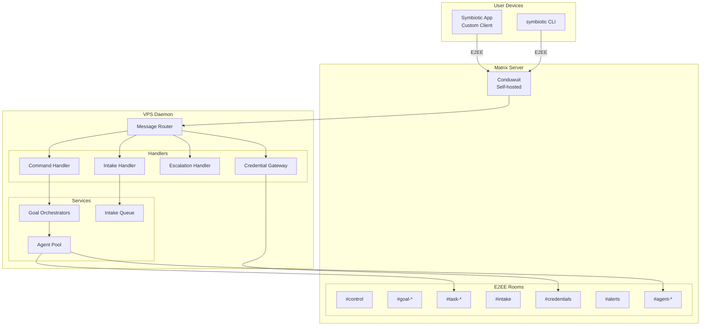

### Target State [Phase 2 -- Planned]

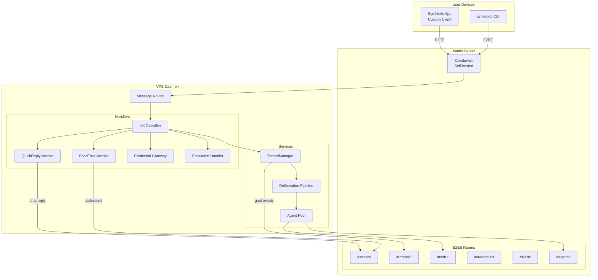

## Channel Structure

### Room Types [Current]

| Room Pattern | Purpose | Participants | Sensitivity |
|--------------|---------|--------------|-------------|
| `#control` | User commands to daemon | User + Daemon | Standard |
| `#status` | Daemon status updates | User + Daemon | Standard |
| `#intake` | Drop/paste URLs for ingestion | User + Daemon | Standard |
| `#goal-{slug}` | Goal progress, decisions | User + Goal Orchestrator | Standard |
| `#task-{id}` | Task execution updates | User + Assigned Agents | Standard |
| `#credentials` | Setup/fallback channel | User + Credential Gateway | High |
| `#cred-{request}` | Short-lived credential DM | User + Credential Gateway | High |
| `#alerts` | Escalations, urgent items | User (priority notification) | High |
| `#agent-{id}` | Agent-to-agent messaging | Specific Agents | Standard |

### Room Types [Phase 2 -- Planned]

In Phase 2, three rooms collapse into one and goal rooms become thread rooms:

| Room Pattern | Purpose | Participants | Sensitivity | Replaces |
|--------------|---------|--------------|-------------|----------|
| **`#stream`** | Landing pad: quick replies, short tasks, routing cards, all user-to-daemon interaction | User + Daemon | Standard | `#control` + `#status` + `#intake` |
| **`#thread-{slug}`** | Promoted conversation (long-lived project/topic, multiple goals) | User + Daemon | Standard | `#goal-{slug}` |
| `#task-{id}` | Task execution updates | User + Assigned Agents | Standard | (unchanged) |
| `#credentials` | Setup/fallback channel | User + Credential Gateway | High | (unchanged) |
| `#cred-{request}` | Short-lived credential DM | User + Credential Gateway | High | (unchanged) |
| `#alerts` | Escalations, urgent items | User (priority notification) | High | (unchanged) |
| `#agent-{id}` | Agent-to-agent messaging | Specific Agents | Standard | (unchanged) |

**Migration notes:**
- `#stream` absorbs the roles of `#control`, `#status`, and `#intake`. The universal input bar accepts both natural language and structured commands.
- `#thread-{slug}` replaces `#goal-{slug}`. A thread is the messaging surface; attached goals and work project into it without making the thread the ownership container.
- Existing `#goal-*` rooms continue working during migration. The daemon routes to them normally until all active goals are migrated to thread rooms.
- `#credentials`, `#alerts`, and `#agent-*` rooms are unchanged.

### Credential Channel Policy

- `#credentials` terminates at the Credential Gateway, not at the cloud LLM.
- Secrets are redacted from logs and never forwarded to agents.
- Requests can return session handles or require user interaction via remote login.
- Credential requests use **short-lived DMs** (per request) and auto-redact after completion (default: 5 minutes).
- The Symbiotic app keeps the credential UI separate from general chat/ops views.

### Intake Room Policy [Current -- replaced by `#stream` in Phase 2]

- `#intake` accepts **URLs only** (optionally with tags).
- The Intake Handler parses messages, normalizes URLs, and deduplicates by `source_url`.
- New URLs are queued for `symbiotic intake` (with `ingest` as a single-URL alias) and then Archive review.
- Non-URL messages are rejected with a guidance reply.
- Intake is only "complete" once review is queued.

In Phase 2, URL intake is handled by the UX Classifier in `#stream` -- pasted URLs are auto-classified and queued without a separate room.

### Room-Role Map [Current -- Implemented]

The daemon uses a `RoomRoleMap` to route incoming messages by canonical Matrix room_id (`!room:server`) rather than alias pattern matching. The map is populated by the daemon bootstrap process, which resolves room IDs from the encrypted vault or creates them on first boot.

| Role | Vault Key | Room |
|------|-----------|------|
| Control | `matrix.room.control` | Command dispatch |
| Intake | `matrix.room.intake` | URL ingestion |
| Alerts | `matrix.room.alerts` | Escalation & failure alerts |
| Status | `matrix.room.status` | Daemon status queries |

When the room-role map is configured, routing uses exact room_id matching. When unconfigured (dev/test without bootstrap), the daemon falls back to alias-pattern matching (`#control`, `#intake`, etc.).

Goal rooms (`#goal-*`) and credential rooms (`#credentials`, `#cred-*`) continue to use alias-pattern routing since they are dynamically created.

**[Phase 2 -- Planned]**: The `RoomRoleMap` will expand to include a `Stream` role (replacing `Control` + `Status` + `Intake`). Thread rooms will use a `ThreadRegistry` -- a persistent `thread_id -> room_id` mapping stored in the daemon's SQLite database. The `ThreadRegistry` enables O(1) lookup of which Matrix room backs a given thread, and supports the `TopicRouter` for follow-up detection.

### Router Dispatch Contract [Current -- MVP]

| Route | Handler | Action |
|------|---------|--------|
| `#control` + `command.request` | Command Handler | Parse command and dispatch workflow |
| `#intake` + `command.request` | Intake Handler | Normalize URLs, enqueue intake jobs |
| `#goal-*` + `goal.*` | Goal Gateway | Update goal run state and queue work |
| `#credentials`/`#cred-*` + `auth.*` | Credential Gateway | Run approval/login/session flow |
| Any room + `*.failed` | Escalation Handler | Route to `#alerts` with severity |

`#control` accepts both:
- text commands (`goal list|start|retry|stop`, `workflow <template>`, `install run [byok|managed] [install_id]`, `install provision [byok|managed] [install_id]`, `install bootstrap`, `install verify [byok|managed]`, `auth issue <target> [scopes]`, `bookmarks sync [api|browser] [limit]`, `push register <device_id> <platform> <token>`, `push ack <notification_id> [run_id]`)
- versioned JSON command envelope (schema `schemas/control-command.json`, `v=1`)

Daemon guardrails:
- maximum Matrix message body size is enforced (MVP default: `32 KiB`); oversized payloads are rejected before routing.
- bookmarks sync command limit is enforced (`1..=500`) to prevent queue amplification.
- JSON command payloads reject unsupported fields; malformed payloads return `command.rejected`.

### Router Dispatch Contract [Phase 2 -- Planned]

| Route | Handler | Action |
|------|---------|--------|
| `#stream` + any user message | UxClassifier | Classify intent (QUICK / SHORT_TASK / GOAL / FOLLOW_UP / ROUTING) and dispatch |
| `#thread-*` + user message | Thread-scoped handler | Route to goal pipeline or thread conversation handler |
| `#credentials`/`#cred-*` + `auth.*` | Credential Gateway | Run approval/login/session flow (unchanged) |
| Any room + `*.failed` | Escalation Handler | Route to `#alerts` with severity (unchanged) |

`#stream` accepts both natural language and structured commands. The UxClassifier determines the dispatch path:
- **QUICK**: Direct LLM call, response inline in `#stream` as `chat.reply`
- **SHORT_TASK**: Single agent pass, result inline in `#stream` as `task.result`
- **GOAL**: Creates or routes to `#thread-{slug}`, enters Deliberation Pipeline
- **FOLLOW_UP**: Routes to existing `#thread-{slug}` by topic similarity
- **ROUTING**: Detects topic mismatch in current thread, suggests different thread (user confirms)

### Status Message Envelope (Minimal)

All process updates use a minimal, parseable envelope inside `m.room.message`.
Schema: `schemas/matrix-events.json`.

**Matrix fields**

- `msgtype`: `org.symbiotic.event`
- `body`: human-readable fallback
- `sym`: structured payload (UI-parseable)

```json
{
  "msgtype": "org.symbiotic.event",
  "body": "Intake accepted: 5 queued, 2 duplicates, 1 invalid",
  "sym": {
    "v": 1,
    "t": "intake.started",
    "s": "queued",
    "rid": "run_2026-02-04T12:30:00Z",
    "ts": 1767222609,
    "d": { "ingested": "5", "duplicates": "2", "invalid": "1", "total": "8" }
  }
}
```

**Field meanings**

- `v`: schema version
- `t`: event type
- `s`: state (`queued|running|blocked|completed|failed`)
- `rid`: run id (shared across a pipeline run)
- `ts`: unix timestamp (seconds)
- `p`: progress (0.0-1.0), optional
- `d`: small payload for UI summaries (all values are strings)
- `d.thread_id`: **[Phase 1 -- Implementing]** optional string, present on all thread-scoped events. Links the event to a thread for routing and grouping. Events in `#stream` that are truly inline (quick replies, short tasks with no thread context) MAY omit this field.

### Event Type Set (Cross-Process)

**Current [Implemented]:**

- `command.request|accepted|rejected`
- `install.nucleus|matrix|recall|signal|alive`
- `intake.started|item|completed|failed`
- `bookmarks.sync`
- `review.queued|started|completed|failed`
- `goal.started|retry|stop_requested|cancelled|state_changed|completed|failed`
- `task.started|progress|completed|failed`
- `auth.required|approved|completed|failed`
- `agent.spawned|progress|completed|failed`
- `thread.promotion.proposed`
- `memory.staleness`
- `push.sent|ack|failed`

**New event types [Phase 1 -- Implementing]:**

- `chat.reply` -- direct LLM response to quick question (inline in `#stream`)
- `task.result` -- single-agent short task result (inline in `#stream`)
- `goal.created` -- goal promotion from conversation (emitted in `#thread-{slug}`)
- `goal.result` -- goal output/answer, emitted before `goal.completed` (in `#thread-{slug}`)
- `goal.answer` -- goal response to user question within thread (in `#thread-{slug}`)
- `routing.created` -- new thread created from stream conversation (in `#stream`)
- `routing.moved` -- message moved between threads, suggested and user-confirmed (in source thread)
- `routing.split` -- thread split into child thread (in parent thread)
- `routing.undo` -- undo a routing action (in source thread)
- `thread.summary` -- periodic thread summary for list view (in `#thread-{slug}`)

### Retention & Redaction

- Credential DMs are created per request and auto-redacted after completion.
- Message bodies are wiped client-side after the gateway confirms capture.
- Room retention is capped (default: 24 hours) for credential DMs.

### Custom App UX

**Current [Implemented]:**

- **Primary UI:** Symbiotic custom app using Matrix for transport.
- **Implementation:** Flutter UI + Flutter Matrix SDK (Dart). Rust core stub for future FFI bridge.
- **Navigation:** 4-tab bottom bar (Home, Memory, Goals, Vault) + persistent AppBar (notifications bell, settings gear).
- **Views:**
  - **Home** (dashboard: system health, metrics, pipeline, activity)
  - **Memory** (capture intake, event feed, graph placeholder)
  - **Goals** (agent workflows -- placeholder for Phase 4)
  - **Vault** (credential requests and `auth issue` actions; secrets/notes placeholders)
  - **Settings** (push-navigated: connection, login, disconnect)
  - **Notifications** (modal sheet from bell icon: priority-classified alerts)
- **Event Routing:** `EventRouter` dispatches `StatusEvent` by type prefix (`status.*` -> Home, `intake.*` -> Memory, `auth.*` -> Vault, `goal.*` -> Goals). Notable events also generate notifications.
- **Embedded Browser:** Auth flows via noVNC over Tailscale (planned, not yet implemented).

**[Phase 2 -- Planned]:** The 4-tab bottom bar is being replaced with STREAM-based navigation. The primary surface becomes a thread list (STREAM) with conversation-first interaction. See `docs/design/ux-specification.md` for the full UX spec and `docs/architecture/symbiotic-app.md` for the app architecture details.

See `docs/architecture/symbiotic-app.md` for the full mobile app architecture.

### Room Hierarchy

#### Current [Implemented]

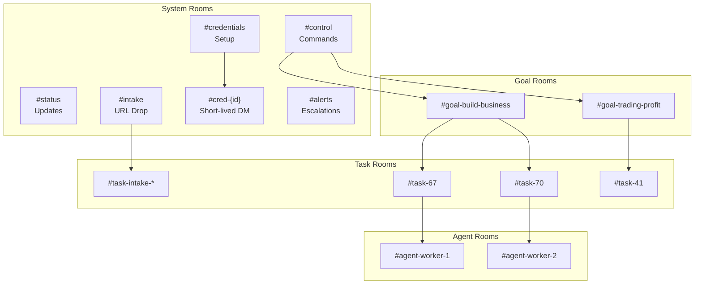

> **Migration note:** During the transition, both `#control`/`#status`/`#intake` and `#stream` may coexist. Existing `#goal-*` rooms continue to function until their goals complete and are migrated to `#thread-*` rooms.

#### Target State [Phase 2 -- Planned]

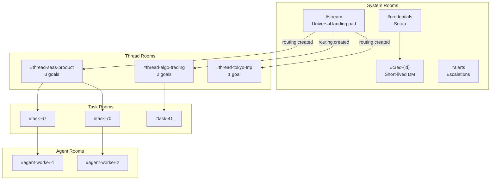

## E2EE Bootstrap and Verification

1. **Daemon logs in as user account** (same Matrix user as the app, e.g. `testuser`). This enables shared E2EE key backup -- Megolm session keys uploaded by the daemon are accessible to the app via SSSS.
2. **Create credential gateway device** (separate Matrix device ID).
3. **User verifies credential gateway device** using SAS/emoji verification in the Symbiotic app. Daemon device shares the user's key backup automatically.
4. **Self-message filtering**: The daemon uses `msgtype` discrimination (`org.symbiotic.event` vs `m.text`) to avoid processing its own events, since both daemon and app share the same user ID.
5. **Room membership rules**:
   - `#credentials` and credential DMs: only user + credential gateway device.
   - `#control`, `#status`, `#intake`: user (shared by app and daemon devices).
   - **[Phase 2]**: `#stream` replaces the above three rooms with the same membership policy.
   - **[Phase 2]**: `#thread-*` rooms: user + daemon (same as current `#goal-*` membership).
   - `#agent-*` rooms: daemon device + specific agent devices only.

This ensures E2EE is meaningful and credential flows never reach cloud agents.

## Data Flow

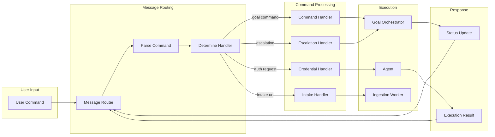

## State Diagram: Message Processing

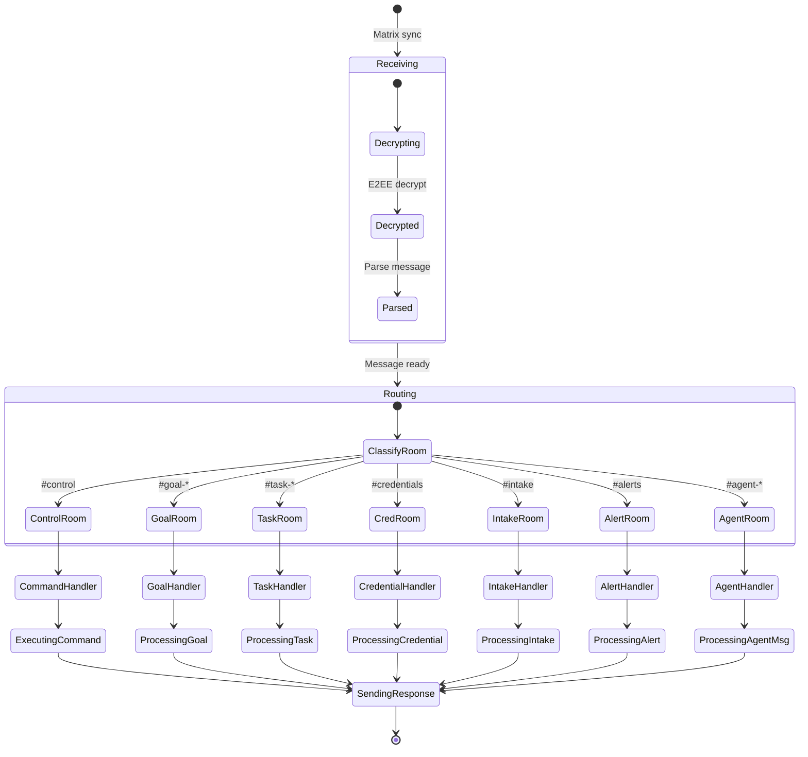

## Sequence Diagram: Command Flow

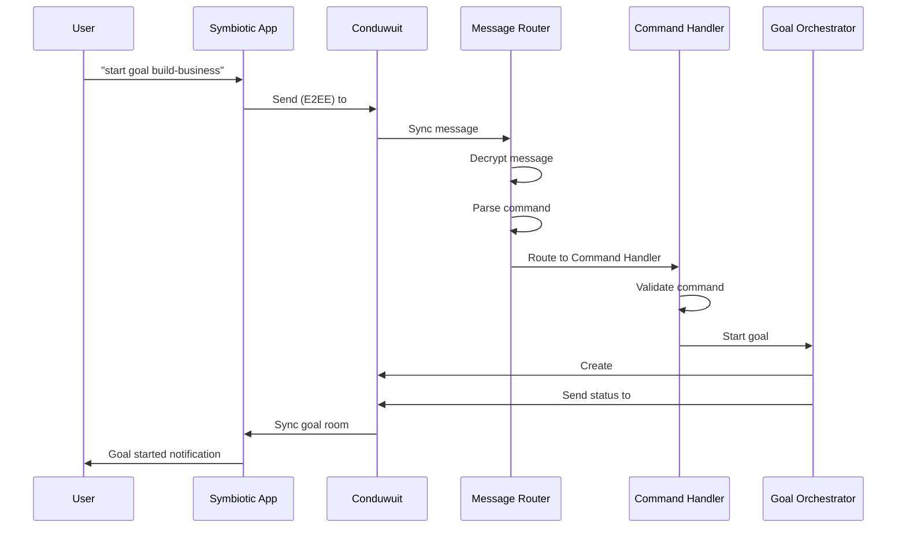

## Sequence Diagram: Credential Request

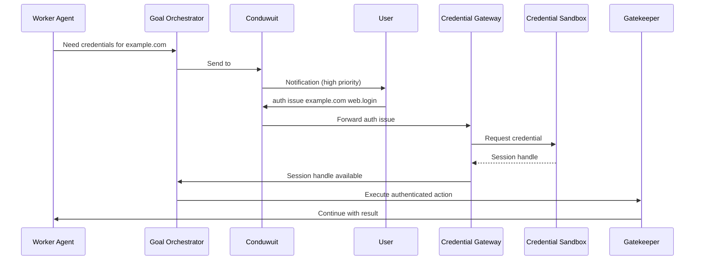

## Sequence Diagram: Escalation

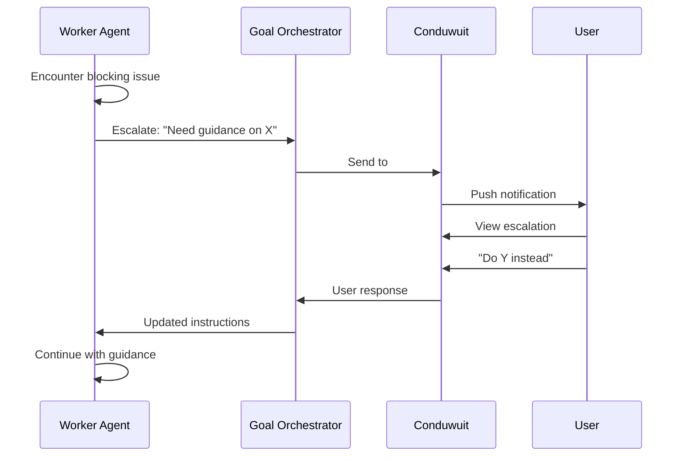

## Sequence Diagram: Agent-to-Agent

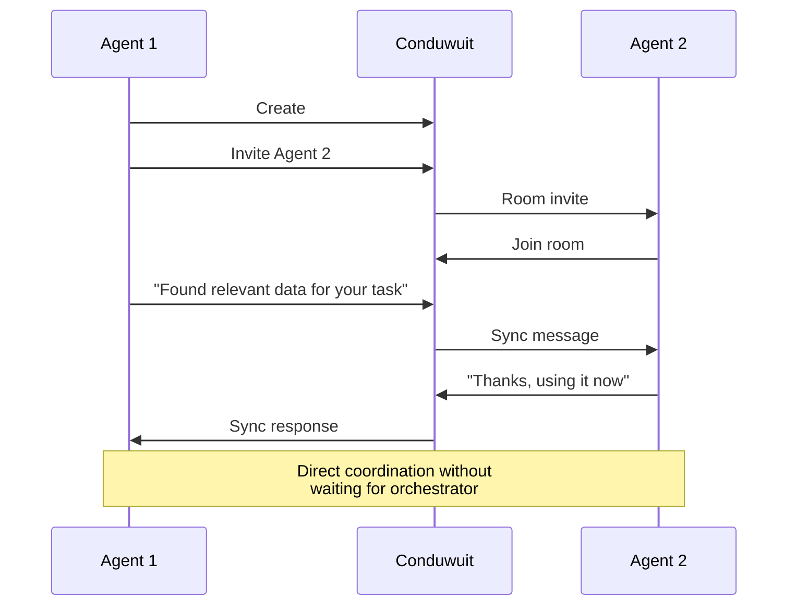

## Message Types

All custom messages use `m.room.message` with the same minimal envelope:

- `msgtype`: `org.symbiotic.event`
- `body`: human-readable fallback
- `sym`: structured payload (`v`, `t`, `s`, `rid`, `ts`, `d`)

### Command Request

```json
{
  "type": "m.room.message",
  "content": {
    "msgtype": "org.symbiotic.event",
    "body": "Run intake for 1 URL",
    "sym": {
      "v": 1,
      "t": "command.request",
      "s": "queued",
      "rid": "run_2026-02-04T12:30:00Z",
      "ts": 1767203400,
      "d": {
        "command": "intake",
        "url": "https://example.com/article",
        "tags": "research,ai"
      }
    }
  }
}
```

### Status Update (with thread_id) [Phase 1 -- Implementing]

```json
{
  "type": "m.room.message",
  "content": {
    "msgtype": "org.symbiotic.event",
    "body": "Task 67 completed",
    "sym": {
      "v": 1,
      "t": "task.completed",
      "s": "completed",
      "rid": "run_2026-02-04T12:30:00Z",
      "ts": 1767203500,
      "d": {
        "task_id": "67",
        "thread_id": "thread-saas-product",
        "summary": "Security research complete",
        "artifacts": "02-threat-model.md",
        "duration_secs": "120"
      }
    }
  }
}
```

### Quick Reply [Phase 1 -- Implementing]

```json
{
  "type": "m.room.message",
  "content": {
    "msgtype": "org.symbiotic.event",
    "body": "The capital of France is Paris.",
    "sym": {
      "v": 1,
      "t": "chat.reply",
      "s": "completed",
      "ts": 1767203450,
      "d": {
        "in_reply_to": "$msg-xyz789"
      }
    }
  }
}
```

### Thread Creation [Phase 2 -- Planned]

```json
{
  "type": "m.room.message",
  "content": {
    "msgtype": "org.symbiotic.event",
    "body": "Thread created: Algo Trading",
    "sym": {
      "v": 1,
      "t": "routing.created",
      "s": "completed",
      "ts": 1767203500,
      "d": {
        "thread_id": "thread-algo-trading",
        "title": "Algo Trading",
        "room_id": "!abc123:matrix.symbiotic.sh",
        "promoted_from": ["$msg-001"],
        "reason": "goal_classified"
      }
    }
  }
}
```

### Goal Result [Phase 1 -- Implementing]

```json
{
  "type": "m.room.message",
  "content": {
    "msgtype": "org.symbiotic.event",
    "body": "## Competitor Analysis\n\n### 1. Acme Corp ($49/mo)\n...",
    "sym": {
      "v": 1,
      "t": "goal.result",
      "s": "completed",
      "rid": "run_2026-03-14T10:00:00Z",
      "ts": 1767203600,
      "d": {
        "goal_id": "goal-competitor-research",
        "thread_id": "thread-saas-product",
        "format": "structured"
      }
    }
  }
}
```

### Credential Request

```json
{
  "type": "m.room.message",
  "content": {
    "msgtype": "org.symbiotic.event",
    "body": "Auth required for example.com",
    "sym": {
      "v": 1,
      "t": "auth.required",
      "s": "blocked",
      "rid": "run_2026-02-04T12:30:00Z",
      "ts": 1767203530,
      "d": {
        "request_id": "uuid",
        "target": "example.com",
        "purpose": "Login to fetch data",
        "requested_by": "worker-agent-1",
        "thread_id": "thread-saas-product",
        "goal": "build-business",
        "task": "67"
      }
    }
  }
}
```

### Escalation

```json
{
  "type": "m.room.message",
  "content": {
    "msgtype": "org.symbiotic.event",
    "body": "Escalation: unexpected page layout",
    "sym": {
      "v": 1,
      "t": "task.failed",
      "s": "failed",
      "rid": "run_2026-02-04T12:30:00Z",
      "ts": 1767203580,
      "d": {
        "priority": "high",
        "source": "worker-agent-1",
        "issue": "Unexpected page layout on target site",
        "thread_id": "thread-saas-product",
        "goal": "build-business",
        "task": "67"
      }
    }
  }
}
```

## Command Reference

### Control Room Commands [Current]

| Command | Description | Example |
|---------|-------------|---------|
| `goal list` | Return persisted goal run states | `goal list` |
| `goal start <template>` | Queue a goal workflow in control room context | `goal start my-workflow` |
| `goal retry <template>` | Retry a goal workflow in control room context | `goal retry my-workflow` |
| `goal stop <template>` | Request cancellation before workflow execution starts | `goal stop my-workflow` |
| `workflow <template>` | Queue workflow run | `workflow intake-url` |
| `install run [byok|managed] [install_id]` | Queue full install wizard flow | `install run byok install-001` |
| `install provision [byok|managed] [install_id]` | Queue provision-only stage | `install provision managed install-001` |
| `install bootstrap` | Queue bootstrap-handshake stage | `install bootstrap` |
| `install verify [byok|managed]` | Queue install verification stage | `install verify byok` |
| `auth issue <target> [scopes]` | Queue auth/session-handle issuance | `auth issue x.com web.login` |
| `bookmarks sync [api|browser] [limit]` | Queue bookmark sync pipeline | `bookmarks sync browser 25` |

`goal list` response details (machine parse):

- `count`: number of persisted goal rows.
- `items_json`: JSON array of goal state objects (`room`, `template`, `status`, `job_id`, `run_id`, `owner`, `updated_at`).
- `items`: legacy delimited fallback (`room:template:status;...`) for backwards compatibility.
- `items_version`: payload contract version (`2` for structured `items_json`).

**[Phase 2 note]:** In `#stream`, structured commands continue to work alongside natural language. The UxClassifier detects structured command patterns and routes them to the existing Command Handler.

### Goal Commands

| Command | Description | Example |
|---------|-------------|---------|
| `run <template>` | Queue workflow run from `#goal-*` room | `run intake-url` |
| `start <template>` | Alias for run | `start intake-url` |

### Agent Commands

| Command | Description | Example |
|---------|-------------|---------|
| `agents` | List active agents | `agents` |
| `agent <id>` | Show agent details | `agent worker-1` |
| `kill <id>` | Terminate agent | `kill worker-1` |

## Security Model

### Sender Authorization (Implemented)

The daemon gates all command execution behind a sender allowlist (`SYMBIOTIC_ALLOWED_SENDERS` env var, comma-separated Matrix user IDs). When the allowlist is non-empty, only listed senders can issue commands; unauthorized senders receive a `command.rejected` response. When the allowlist is empty, commands are denied by default (fail-closed).

For local development only, explicit open-access mode can be enabled via `SYMBIOTIC_ALLOW_OPEN_ACCESS=true`.

The check runs before any room routing or command dispatch. Comparison is case-insensitive per Matrix spec.

### DM Pairing (Planned)

When accessible via Matrix, unknown contacts must be paired before commands are accepted:

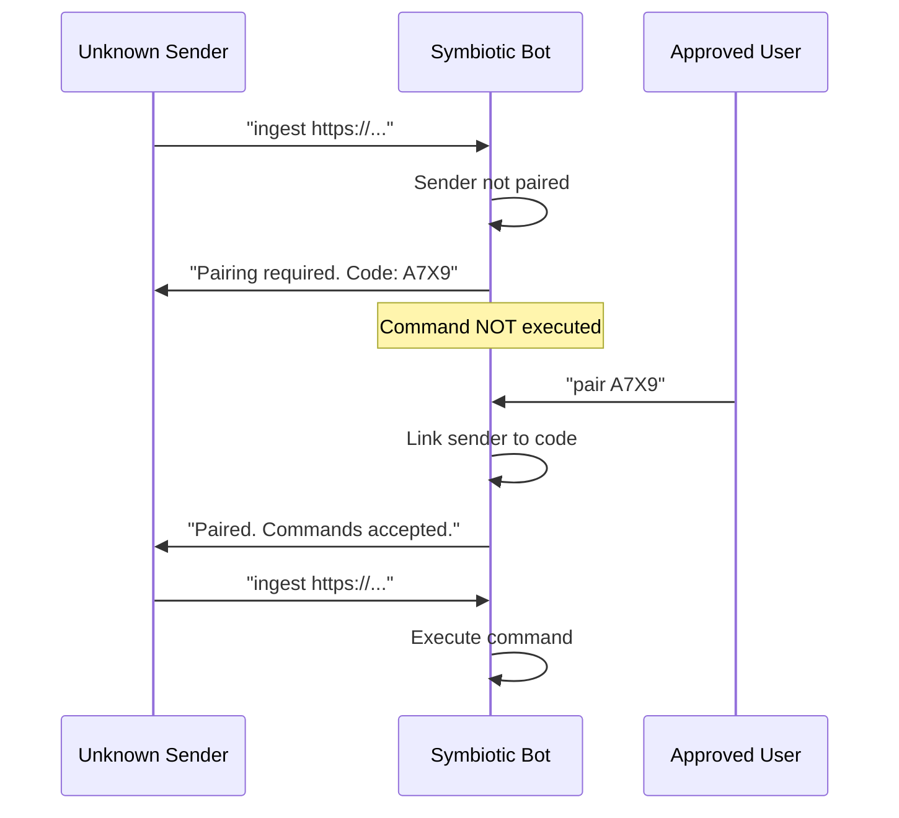

### E2EE Requirements

| Room Type | E2EE Required | Verification Required |
|-----------|---------------|----------------------|
| `#control` | Yes | Yes |
| `#stream` **[Phase 2]** | Yes | Yes |
| `#credentials` | Yes | Yes (strict) |
| `#alerts` | Yes | Yes |
| `#goal-*` | Yes | Yes |
| `#thread-*` **[Phase 2]** | Yes | Yes |
| `#task-*` | Yes | Recommended |
| `#agent-*` | Yes | Optional |

### Device Verification

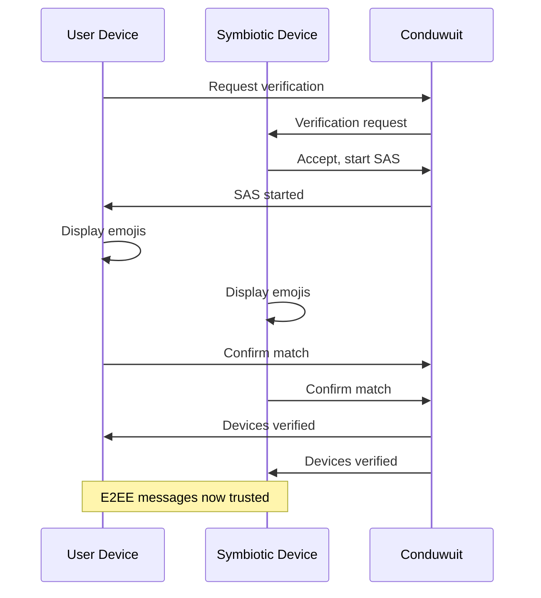

## Room Management

### Room Creation [Current]

```rust
impl ChannelManager {
    async fn create_goal_room(&self, goal: &Goal) -> Result<RoomId> {
        let room_alias = format!("#goal-{}", goal.slug);

        let room = self.client.create_room()
            .name(format!("Goal: {}", goal.title))
            .alias(room_alias)
            .encrypted(true)
            .direct(false)
            .build()
            .await?;

        // Invite goal orchestrator
        room.invite(&self.orchestrator_id).await?;

        // Set power levels
        room.set_power_levels(PowerLevels {
            users: hashmap! {
                self.user_id.clone() => 100,
                self.orchestrator_id.clone() => 50,
            },
            ..Default::default()
        }).await?;

        Ok(room.room_id())
    }
}
```

**[Phase 2 -- Planned]:** `create_goal_room` will be replaced by `ThreadManager::create_thread_room`, which creates `#thread-{slug}` rooms with a context summary as the opening message. See `docs/design/thread-architecture.md` section 3.1 for the full promotion flow.

### Room Cleanup

```rust
impl ChannelManager {
    async fn cleanup_goal_rooms(&self, goal: &Goal) -> Result<()> {
        // Archive task rooms
        for task in goal.completed_tasks() {
            let room_alias = format!("#task-{}", task.id);
            if let Some(room) = self.client.get_room(&room_alias) {
                room.leave().await?;
            }
        }

        // Keep goal room for history
        // (or archive based on policy)
        Ok(())
    }
}
```

## Notification Priorities

| Priority | Push Behavior | Examples |
|----------|---------------|----------|
| **Critical** | Always push, sound | Credential requests, security alerts |
| **High** | Push, no sound | Escalations, blocking issues |
| **Normal** | Badge only | Status updates, completions |
| **Low** | Silent | Agent messages, debug info |

### Push Delivery Contract (MVP)

Push delivery is explicit and auditable (not implied by Matrix alone):

1. App registers device push token (`APNs` for iOS, `FCM` for Android) with daemon.
2. Daemon stores token metadata and routing preferences per device.
3. For `critical|high` events, daemon emits push via notification gateway and also posts Matrix event.
4. App opens the related room/run and sends `push.ack` event (or `push ack <notification_id> [run_id]` command).

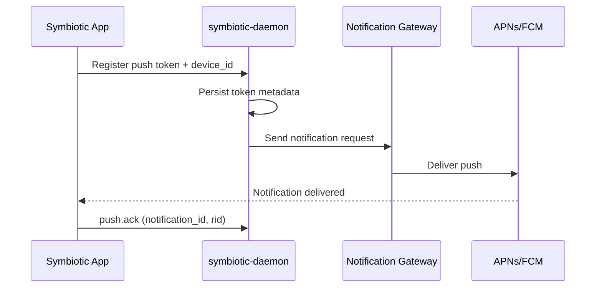

**Delivery rules**

- Use `rid` as collapse key to avoid duplicate alerts for the same run.
- Retry push delivery with exponential backoff (3 attempts max).
- If all retries fail, post `push.failed` and keep Matrix status path authoritative.
- Store token hash + last-seen timestamp; never log raw push tokens.

## Key Decisions

### 1. Self-Hosted Conduwuit

**Decision:** Self-host Matrix server using Conduwuit.

**Rationale:**
- Full control over data
- No third-party access to messages
- Lower resource usage than Synapse
- Rust implementation aligns with stack

### 2. Per-Goal Rooms (evolving to Per-Thread Rooms)

**Decision:** Create dedicated rooms for each goal.

**Rationale:**
- Clear separation of concerns
- Easy to follow goal progress
- Natural threading
- Can mute inactive goals

**[Phase 2 -- Planned]:** Thread rooms replace goal rooms. A thread becomes the conversation surface for related work, while goals remain owned work units attached to that surface. This is a broader scope change: `#goal-build-business` (1 goal = 1 room) becomes `#thread-saas-product` (one thread surface that can reflect several related goals and work items). Rationale: fewer rooms, less overhead for key exchange and room state, and a cleaner separation between messaging and ownership.

### 3. Isolated Credentials Room

**Decision:** Credential requests in dedicated `#credentials` room.

**Rationale:**
- Highest security requirements
- Clear audit trail
- Separate notification settings
- Device verification enforced

### 4. Single Event Envelope

**Decision:** Use one custom envelope (`msgtype: org.symbiotic.event`) with typed `sym.t` events.

**Rationale:**
- Structured data parsing
- Clear intent
- Can still fall back to text display
- Extensible schema with versioning (`sym.v`)

### 5. Agent-to-Agent via Matrix

**Decision:** Agents communicate via Matrix rooms, not direct channels.

**Rationale:**
- Same E2EE infrastructure
- Auditable communication
- Works across VPS boundaries
- Consistent with overall architecture

### 6. Explicit Push Gateway

**Decision:** Push is routed through a notification gateway owned by daemon logic (APNs/FCM adapter), not treated as implicit Matrix behavior.

**Rationale:**
- Deterministic delivery policy by event priority
- Retry/ack telemetry for mobile UX reliability
- Separation of transport concerns (Matrix sync vs OS push)

### 7. `#stream` Consolidates Three Rooms [Phase 2 -- Planned]

**Decision:** `#control` + `#status` + `#intake` collapse into a single `#stream` room.

**Rationale:**
- The UX redesign makes everything conversational -- a single input surface handles commands, URL drops, and natural language
- Fewer rooms = simpler bootstrap, less key material, faster initial sync
- The UxClassifier handles dispatch internally; separate rooms for command types are no longer needed
- Structured commands still work in `#stream` for power users and backward compatibility

### 8. Cross-Thread Routing: Suggest Only, Never Auto-Move [Phase 2 -- Planned]

**Decision:** When the classifier detects a topic mismatch (e.g., user types about headphones in a travel thread), the system **suggests** moving to a different thread but never auto-moves.

**Rationale:**
- Auto-moving messages without consent is disruptive
- Users must confirm where their message goes
- The classifier suggests, the user decides
- `routing.undo` provides a safety net if a move was wrong

### 9. Multiple Goals Per Thread [Phase 2 -- Planned]

**Decision:** A thread can contain multiple goals, replacing the 1:1 goal-to-room model.

**Rationale:**
- Real projects have multiple goals (e.g., "SaaS Product" has research, frontend, CI/CD, payments)
- Goals are sub-entities within a thread, not independent conversation spaces
- Fewer rooms = less overhead for room creation, key exchange, room state
- Thread Memory Documents capture context across all goals in a project

## Error Handling

### Connection Errors

| Error | Response |
|-------|----------|
| Sync timeout | Exponential backoff retry |
| Server unreachable | Queue messages locally, retry |
| E2EE error | Log, request re-verification |

### Message Errors

| Error | Response |
|-------|----------|
| Parse failure | Log error, ignore message |
| Unknown command | Reply with help text |
| Permission denied | Reply with error |
| Lock poisoning | Return `Result::Err` (no panic) |
| Unauthorized sender | Reply with `command.rejected` |

## Related Components

| Component | Relationship |
|-----------|--------------|
| [Matrix Client](./matrix-client.md) | Client implementation |
| [VPS Deployment](./vps-deployment.md) | Conduwuit hosting |
| [Agent Orchestration](./agent-orchestration.md) | Agent coordination |
| [Credential Sandbox](./credential-sandbox.md) | Auth requests |
| [Thread Architecture (design)](../design/thread-architecture.md) | Full design for thread/stream room model |

## Future Enhancements

1. ~~**Custom Mobile App:**~~ Implemented. Flutter UI with event routing and Matrix transport. See `docs/architecture/symbiotic-app.md`.
2. ~~**Message Threading:**~~ Approved design. Thread architecture (`docs/design/thread-architecture.md`) replaces flat goal rooms with conversational threads. Phase 1 implementing, Phase 2 planned.
3. **Voice Messages:** Speech-to-text command input
4. **Rich Notifications:** Interactive notification actions (OS push via APNs/FCM)
5. **Reactions:** Quick feedback on agent outputs
6. **Read Receipts:** Know when user has seen updates
