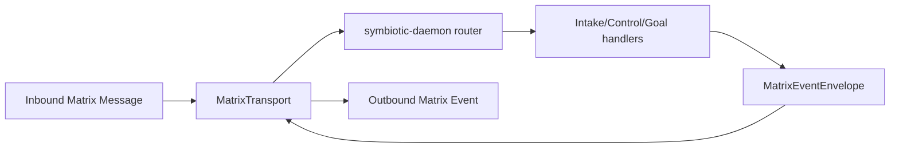

# Matrix Client Runtime

## Overview

The `symbiotic-matrix` crate currently defines the **runtime contracts** used by Nucleus for Matrix integration:

- intake message parsing
- structured event envelopes (`org.symbiotic.event`)
- transport abstraction for inbound/outbound Matrix messages

**Status (2026-04-20)**: Shipped. Contract layer is implemented and tested; live HTTP polling transport is implemented; `matrix-rust-sdk` encrypted adapter is implemented with session persistence and E2EE-required room checks by default.

## Implemented Components

| File | Purpose |
| --- | --- |
| `submodules/runtime/crates/symbiotic-matrix/src/intake.rs` | URL/tag parser and intake message handler |
| `submodules/runtime/crates/symbiotic-matrix/src/events.rs` | `MatrixEventEnvelope` contract |
| `submodules/runtime/crates/symbiotic-matrix/src/transport.rs` | `MatrixTransport` trait + in-memory, file-backed, live HTTP, and matrix-sdk transports |
| `submodules/runtime/crates/symbiotic-matrix/src/lib.rs` | Public module exports |

## Data Flow

## Current Contract

`MatrixMessage` (transport input):

- `room_id`
- `sender`
- `body`
- `timestamp`

`MatrixEventEnvelope` (transport output):

- `msgtype = org.symbiotic.event`
- `body` (human fallback)
- `sym.v`
- `sym.t`
- `sym.s`
- `sym.rid`
- `sym.ts` (unix seconds)
- `sym.p` (optional progress)
- `sym.d` (details map)

Schema: `schemas/matrix-events.json`.

Runtime check:

- `MatrixEventEnvelope::validate()` is enforced in daemon transport pump before sending events.

## Current Daemon Integration

Nucleus (`submodules/runtime/services/symbiotic-daemon`) currently routes:

- `#intake` -> intake parsing + queue admission + `intake.completed`
- `#control` -> command parsing + queue admission (`goal.list|start|retry|stop`, `workflow.run`, `install.run|provision|bootstrap|verify`, `auth.issue`, `bookmarks.sync`, `push.register`, `push.ack`)
- `#goal-*` -> workflow start admission (`goal.started`) + worker completion updates (`goal.completed|goal.failed`) when daemon `serve` runs with Matrix transport enabled
- `goal.list` responses include both legacy `sym.d.items` and structured `sym.d.items_json` (JSON array with `room/template/status/job_id/run_id/owner/updated_at`) so app clients can render stable goal status cards without delimiter parsing.
- Goal completion/failure envelopes now include `sym.d.job_id`, `sym.d.run_id` (when available), and `sym.d.detail` for UI timeline drilldown.
- `#credentials` / `#cred-*` -> auth command intake (`auth.required` / `auth.failed`)
- `#status` -> queue status snapshot (`status.snapshot`)
- `#alerts` -> escalation intake acknowledgment (`alert.received`)
- Goal state is persisted in `data/goals/state.tsv` keyed by `(room, template)` and exposed via daemon query APIs/CLI for timeline/status views.

`symbiotic-daemon serve` transport modes:

- file mode: `--matrix-incoming-file` + `--matrix-outgoing-file`
- live mode: `--matrix-homeserver` + `--matrix-access-token` (+ optional `--matrix-since-file`, `--matrix-timeout-ms`)
- matrix-sdk mode: `--matrix-sdk --matrix-homeserver --matrix-user --matrix-password` (+ optional `--matrix-sdk-data-dir`, `--matrix-session-file`)
  - Matrix SDK mode requires encrypted rooms by default. Set `SYMBIOTIC_MATRIX_ALLOW_UNENCRYPTED=true` only for local debugging.

**Self-message filtering:** Both transports filter incoming messages by `msgtype`, not by sender user ID. Only `m.text` messages (user commands) are processed; daemon events use `msgtype: org.symbiotic.event` and are automatically skipped. This allows the daemon and app to share the same Matrix user account for unified E2EE key backup access.

**Key backup (SSSS):** On startup, `setup_key_backup()` opens the Secure Secret Storage (SSSS) with the user's password and calls `import_secrets()`, which imports the backup recovery key and enables the backup. This lets the daemon's Megolm session keys auto-upload to the server-side backup. The Flutter app must bootstrap SSSS + key backup first (via `initCryptoIdentity`); the daemon joins the existing backup. `auto_enable_backups` is explicitly `false` on the daemon to prevent it from creating a competing backup version. `BackupDownloadStrategy::AfterDecryptionFailure` is set so the daemon can download keys when decryption fails.

## Implemented Since Initial Build

- **Room-role mapping**: `RoomRoleMap` in `submodules/runtime/services/symbiotic-daemon/src/routing.rs` maps canonical room_id to role (Control/Intake/Alerts/Status). Configured via `SYMBIOTIC_MATRIX_ROOM_CONTROL`, `_INTAKE`, `_ALERTS`, `_STATUS` env vars written by the installer. Alias-pattern fallback retained for dev/test when no map is configured. Sender authorization is fail-closed via `SYMBIOTIC_ALLOWED_SENDERS`; explicit local override is `SYMBIOTIC_ALLOW_OPEN_ACCESS=true`.
- **Device trust bootstrap**: SAS emoji verification and trust cache implemented in `submodules/runtime/crates/symbiotic-trust/` (`DeviceTrustLevel`, `TrustCache`). See `docs/architecture/device-trust-bootstrap.md`.

## Pending Work (External Integration)

1. Add live encrypted integration tests against local Conduwuit in CI/dev profile.

## Related Docs

- `docs/architecture/matrix-channels.md`
- `docs/architecture/symbiotic-daemon.md`
- `docs/architecture/install-wizard.md`
