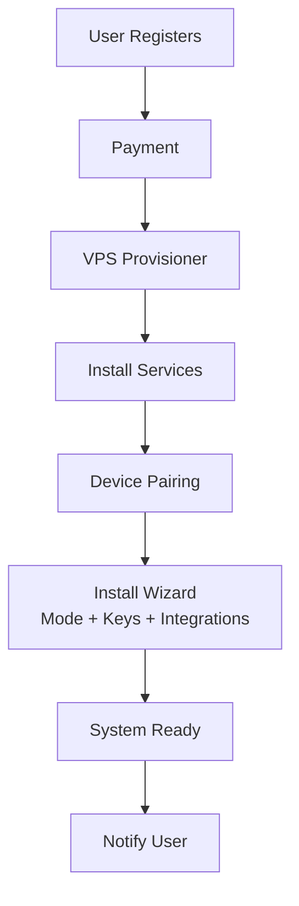

# Onboarding & Provisioning

## Overview

Onboarding provisions a new Symbiotic environment after registration and payment. It orchestrates VPS spin‑up, service install, credential vault initialization, and Matrix device pairing.

**Status (2026-04-20)**: Partially implemented. The daemon-side install command flow (`install run/provision/bootstrap/verify`) lives in `submodules/runtime/services/symbiotic-daemon/src/install.rs`, and the managed-side control API + bootstrap authority + install state live in `submodules/control-plane/crates/`. Full end-to-end provisioning with live cloud providers and billing integration remains planned. No billing or IAP integration exists yet; "Billing Service" and "Status Notifier" in the Components table below are aspirational.

For app-facing scene names and animation behavior, see `docs/architecture/setup-experience.md`.

## Components

| Component | Purpose |
| --- | --- |
| Provisioner | Orchestrates VPS creation and setup |
| Billing Service | Handles IAP/usage billing |
| Bootstrap Scripts | Idempotent service installers |
| Device Pairing | Matrix device verification + trust bootstrap |
| Status Notifier | Progress updates to the app |

## Data Flow

## Install Wizard (MVP)

Onboarding uses an explicit install wizard after payment:

1. Signal Online
2. Nucleus Boot
3. Matrix Link
4. Memory Channels (`BYOK` or managed passthrough)
5. Provider Keys (LLM providers + X OAuth for BYOK)
6. Vault Seal
7. Recall Calibration
8. System Alive

Full flow and step contract: `docs/architecture/install-wizard.md`.

## Key Decisions

1. **Idempotent provisioning**: scripts are safe to rerun.
2. **Progress telemetry**: users see real‑time step status.
3. **Matrix‑first comms**: all status updates via Matrix events.
4. **Separation of duties**: billing never touches credentials.

## Error Handling

| Error | Handling |
| --- | --- |
| Provision failure | Roll back and retry |
| Install failure | Continue with retries, mark partial |
| Pairing failure | Escalate to manual support |
| Billing failure | Abort provisioning |
