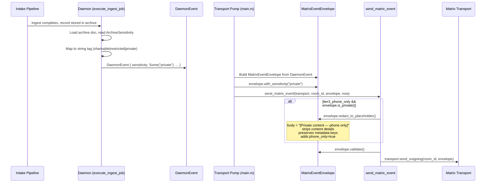
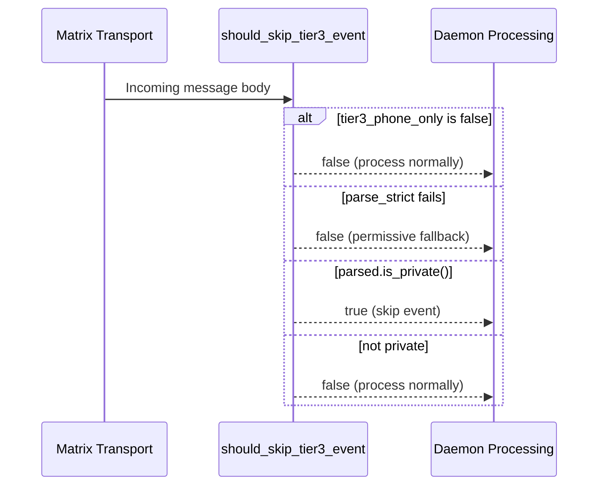

# Phone-Only Mode (Tier 3 Private Content)

## Overview

Phone-only mode ensures Tier 3 (Private) content is never transmitted over Matrix in full. When enabled (the default), Private events are redacted to metadata-only placeholders before leaving the daemon's send path, and incoming Private events from other nodes are skipped on the receive path. This guarantees that sensitive content (medical records, financial data, credentials) stays on the originating device and never reaches the VPS or any Matrix homeserver in cleartext.

## Components

| Component | Location | Responsibility |
|-----------|----------|----------------|
| `MatrixEventEnvelope` sensitivity methods | `symbiotic-matrix/src/events.rs` | Tag, query, and redact envelope sensitivity |
| Send-path redaction filter | `symbiotic-daemon/src/commands.rs` (`send_matrix_event`) | Redact Private envelopes before Matrix transmission |
| Receive-path skip filter | `symbiotic-daemon/src/commands.rs` (`should_skip_tier3_event`) | Gate incoming Private events |
| `DaemonEvent.sensitivity` field | `symbiotic-daemon/src/events.rs` | Carry sensitivity tag through the job execution loop |
| Sensitivity propagation (ingest) | `symbiotic-daemon/src/lib.rs` (`execute_ingest_job`) | Read archive sensitivity, map to string tag |
| Sensitivity propagation (Matrix) | `symbiotic-daemon/src/main.rs` (transport pump) | Copy `DaemonEvent.sensitivity` to `MatrixEventEnvelope` via `with_sensitivity()` |
| `DaemonConfig.tier3_phone_only` | `symbiotic-daemon/src/lib.rs` | Configuration flag (default: `true`) |

## Data Flow



### Receive Path



## Key Functions

### `MatrixEventEnvelope` methods (`symbiotic-matrix/src/events.rs`)

```rust
/// Tag this envelope with a sensitivity level (shareable|restricted|private).
/// Stored in the `sym.d` details map under the key "sensitivity".
pub fn with_sensitivity(self, sensitivity: &str) -> Self

/// Return the sensitivity level embedded in this envelope, if any.
pub fn sensitivity(&self) -> Option<&str>

/// Return `true` when this envelope is tagged as Private / Tier 3.
/// Uses case-insensitive comparison (eq_ignore_ascii_case).
pub fn is_private(&self) -> bool

/// Replace the body with a metadata-only placeholder and strip
/// any content details.
pub fn redact_to_placeholder(mut self) -> Self
```

### `redact_to_placeholder` behavior

**Preserves** these keys in `sym.d`:
- `sensitivity` -- the tier tag itself
- `url` -- source URL
- `title` -- document title
- `room` -- originating room
- `sender` -- originating sender
- `record_id` -- archive record identifier

**Adds:**
- `phone_only` = `"true"` -- client-side UX hint

**Strips:** all other keys in `sym.d` (content details, progress, counts, etc.)

**Replaces body with:** `"[Private content \u2014 phone only]"`

### Send-path filter (`commands.rs`)

```rust
pub async fn send_matrix_event<T: MatrixTransport + ?Sized>(
    &self,
    transport: &T,
    room_id: &str,
    envelope: MatrixEventEnvelope,
    now: u64,
) -> Result<()>
```

When `self.config.tier3_phone_only && envelope.is_private()`:
1. Logs redaction via `debug!` (event type, run_id, room_id)
2. Calls `envelope.redact_to_placeholder()`
3. Continues with validation and send

### Receive-path gate (`commands.rs`)

```rust
/// Returns `true` when the event should be **skipped** (not processed).
pub fn should_skip_tier3_event(&self, body: &str) -> bool
```

1. If `!self.config.tier3_phone_only` -- returns `false` (disabled)
2. Attempts `MatrixEventEnvelope::parse_strict(body)`
3. If parse fails -- returns `false` (permissive)
4. Returns `parsed.is_private()`

### Sensitivity propagation (`lib.rs` / `execute_ingest_job`)

After ingestion and embedding generation, the daemon reads the archive document's sensitivity:

```rust
let doc_sensitivity = first.record_id.as_deref()
    .and_then(|rid| self.archive_store.get(rid).ok().flatten())
    .map(|doc| match doc.sensitivity {
        ArchiveSensitivity::Shareable => "shareable",
        ArchiveSensitivity::Restricted => "restricted",
        ArchiveSensitivity::Private => "private",
    })
    .map(String::from);
```

This value flows into `DaemonEvent.sensitivity`, then in `main.rs` the transport pump copies it to the `MatrixEventEnvelope`:

```rust
if let Some(ref sensitivity) = event.sensitivity {
    envelope = envelope.with_sensitivity(sensitivity);
}
```

## Key Decisions

- **Default-on (privacy by default).** `tier3_phone_only` defaults to `true`. Users must explicitly set it to `false` to allow full Private content over Matrix. This follows the principle that sensitive data should never leak unless the user consciously opts in for a trusted network.

- **Metadata preservation in redacted envelopes.** The placeholder retains `sensitivity`, `url`, `title`, `room`, `sender`, and `record_id` so that receiving clients can display a notification stub (e.g., "Private content available on your phone") without exposing the actual body.

- **Case-insensitive sensitivity matching.** `is_private()` uses `eq_ignore_ascii_case("private")` to handle inconsistencies in how the tag might be set across different pipeline stages or external sources.

- **`phone_only` marker in redacted envelope.** The `phone_only=true` detail is added to the redacted envelope so client-side code can distinguish a deliberately redacted event from a genuinely empty one, enabling appropriate UX (e.g., showing a lock icon or "view on phone" prompt).

- **Redaction is infallible.** `redact_to_placeholder` is a pure in-memory transformation that cannot fail. This ensures the send path is never interrupted by a redaction error.

- **Permissive receive-path fallback.** When `parse_strict` fails on an incoming message, `should_skip_tier3_event` returns `false` (do not skip). This prevents legitimate non-Symbiotic messages or malformed events from being silently dropped.

## Configuration

| Field | Type | Default | Description |
|-------|------|---------|-------------|
| `tier3_phone_only` | `bool` | `true` | When `true`, Private content is redacted to a placeholder before Matrix transmission, and incoming Private events are skipped. Set to `false` to allow full Private content over Matrix (for trusted networks). |

In `DaemonConfig::default()`:

```rust
tier3_phone_only: true,
```

## Error Handling

| Scenario | Behavior |
|----------|----------|
| Redaction (`redact_to_placeholder`) | Infallible -- pure in-memory transformation, never fails the send path |
| Envelope validation after redaction | Validated after redaction; if validation fails, the `send_matrix_event` call returns an error (but redacted envelopes always pass validation since body is non-empty and structural fields are preserved) |
| Receive-path parse failure | `parse_strict` returns `Err` -- `should_skip_tier3_event` returns `false` (permissive, does not skip) |
| Sensitivity tag missing on DaemonEvent | `envelope.is_private()` returns `false` -- envelope passes through unredacted |
| Archive document not found during sensitivity lookup | `doc_sensitivity` is `None` -- `DaemonEvent.sensitivity` is `None` -- no redaction applied |
