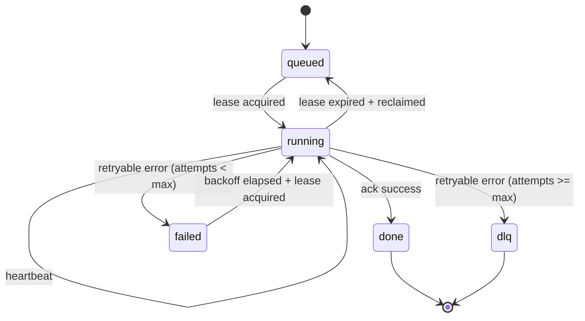

# Queue Persistence


## Overview

Queue persistence guarantees that jobs survive restarts and can be retried safely. This spec defines durability and replay behavior for the queue system.

**Status (2026-04-20)**: File-backed `FileQueueStore` is live in `symbiotic-queue`; SQLite backend is still a planned evolution.

## Storage Decision (v1)

- **MVP implementation:** file-backed durable queue state (default: `data/queue/jobs.state`, created at runtime by `FileQueueStore::open`) with atomic rewrite semantics.
- **Target evolution:** SQLite + WAL backend with identical `QueueBackend` contract.
- Jobs are **idempotent** and safe to replay.

## Replay Semantics

- **At‑least‑once** delivery by default.
- Idempotency keys prevent duplicate effects.
- Dead‑letter queue captures jobs after max retries.

## Data Model (Planned)

```json
{
  "job_id": "uuid",
  "type": "ingest.fetch",
  "payload": {"url": "https://..."},
  "status": "queued|running|failed|done",
  "attempts": 2,
  "next_run_at": 1767222609,
  "idempotency_key": "hash",
  "last_error": "..."
}
```

## SQL Schema (Planned — not yet implemented)

> The schema below is aspirational. No migration matching `queue_jobs` exists in `symbiotic-queue` today; the shipped backend is `FileQueueStore`.


```sql
CREATE TABLE queue_jobs (
  job_id TEXT PRIMARY KEY,
  type TEXT NOT NULL,
  payload_json TEXT NOT NULL,
  status TEXT NOT NULL CHECK(status IN ('queued','running','failed','done','dlq')),
  attempts INTEGER NOT NULL DEFAULT 0,
  max_attempts INTEGER NOT NULL DEFAULT 5,
  next_run_at INTEGER NOT NULL,
  lease_owner TEXT,
  lease_expires_at INTEGER,
  heartbeat_at INTEGER,
  idempotency_key TEXT NOT NULL,
  last_error TEXT,
  created_at INTEGER NOT NULL,
  updated_at INTEGER NOT NULL
);

CREATE UNIQUE INDEX idx_queue_jobs_idempotency
  ON queue_jobs(idempotency_key);

CREATE INDEX idx_queue_jobs_dispatch
  ON queue_jobs(status, next_run_at, lease_expires_at);
```

## Lease + Heartbeat Semantics (MVP)

1. Worker claims a job with short lease (`lease_expires_at = now + 60s`) in one transaction.
2. Worker heartbeats every 15s while status is `running`.
3. If worker crashes and lease expires, another worker can reclaim the job.
4. Completion clears lease fields and sets status `done`.
5. Retry sets status to `failed` with `next_run_at = now + backoff`. The job stays in `failed` state until the next dispatch cycle picks it up after backoff elapses, providing observability into failure rates.
6. If `attempts >= max_attempts` on failure, the job moves directly to `dlq`.



## Error Handling

| Error | Handling |
| --- | --- |
| DB unavailable | Pause workers and retry |
| Corrupt job | Send to DLQ |
| Duplicate job | Drop if idempotency key exists |
