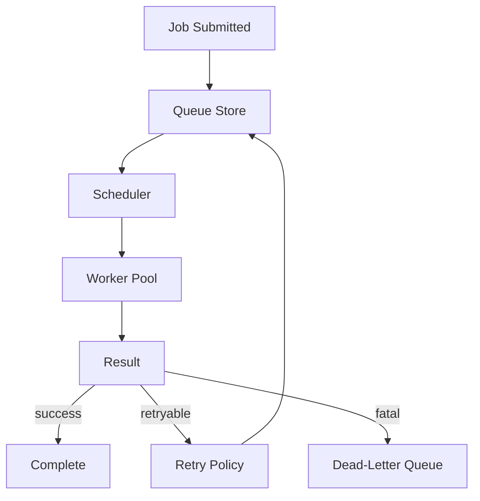

# Queue System

## Overview

Queues decouple ingestion, analysis, and goal workflows from execution. They enable retries, backoff, rate limits, and domain‑specific scheduling without blocking the user.

**Status (2026-04-20)**: Shipped. Queue backend, lease/ack/retry/DLQ semantics, the intake completion contract, and daemon worker integration are live in `symbiotic-queue`, `symbiotic-intake`, and `symbiotic-daemon`.

## Components

| Component | Purpose |
| --- | --- |
| Queue Store | Durable queue for pending jobs |
| Worker Pool | Executes jobs by type and domain |
| Scheduler | Applies rate limits, windows, and delays |
| Retry Policy | Exponential backoff + max attempts |
| Dead‑Letter Queue | Captures failed jobs for review |
| Job Registry | Defines job types and handlers |

## Data Flow

## Job Types (Planned)

- `ingest.fetch` — fetch a URL and store article
- `bookmarks.sync` — fetch bookmark URLs (API or browser fallback) and enqueue intake
- `archive.review.enqueue` — durable enqueue of review work (completion gate for intake)
- `archive.review` — run Archive review/Brief pipeline (extractive Brief MVP implemented)
- `goal.rank` — score content for active goals
- `memory.extract` — extract entities/relationships
- `context.refresh` — rebuild embeddings or Briefs

## Intake Completion Contract (Approved)

For intake runs, `"completed"` means:

1. Article storage succeeded (or URL was deduplicated as already stored).
2. `archive.review.enqueue` was durably written to queue storage.
3. A `review_job_id` is returned in the intake result envelope.

If step 2 fails, intake must return `status=store_failed|queue_failed` and **must not** report completion.

## Key Decisions

1. **Domain‑aware queues**: jobs can be scoped by domain (finance, marketing, health).
2. **Backpressure first**: prefer delaying jobs over dropping.
3. **Retry with caps**: avoid infinite retry loops.
4. **Human escalation**: DLQ jobs create alerts for review.
5. **Deterministic handlers**: job handlers must be idempotent.
6. **Idempotency required**: intake and review enqueue use deterministic idempotency keys to prevent duplicate review jobs.

Persistence details: `docs/architecture/queue-persistence.md`.

## Error Handling

| Error | Handling |
| --- | --- |
| Handler failure | Retry with exponential backoff |
| Rate limit | Delay and reschedule |
| Duplicate job | Coalesce or skip if idempotent |
| Poison message | Send to DLQ |
| Queue write failure | Fail intake completion and emit `intake.failed` |
