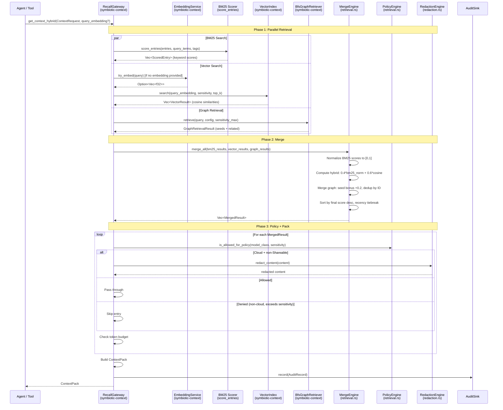
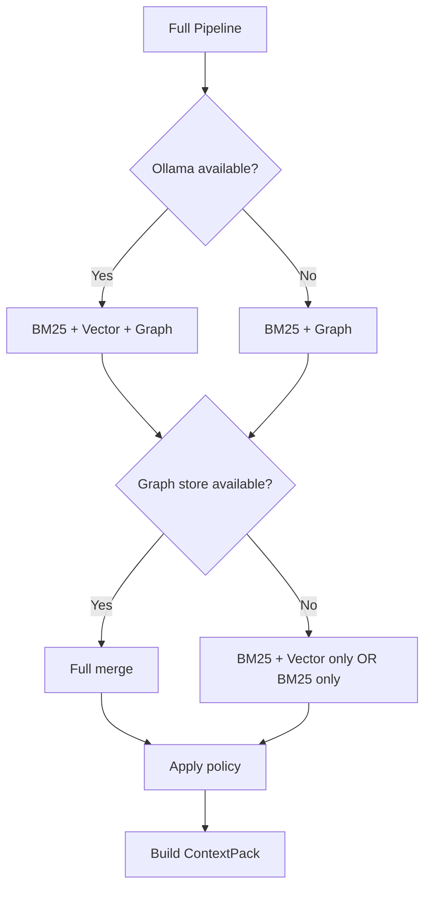

# Recall Gateway Integration Spec

>
> **2026-04-20 addendum (T121 Mycelium Memory):** Since this doc was authored (Feb 2026), `symbiotic-context` graph scoring gained FSRS-based retention (`FsrsParams`, `fsrs_retention`, `fsrs_update_stability`, `fsrs_update_difficulty`) and a `structural_boost` contribution derived from `graph_edge_weights` and `graph_node_metrics` (betweenness centrality) persisted by `SqliteGraphStore`. The merge/score sections below pre-date those additions; see `docs/design/mycelium-memory.md` for the current graph scoring contract. Per-Purpose weight tuning remains a future enhancement as originally noted.

## Overview

This document specifies how the Recall Gateway merges results from three retrieval methods -- BM25 keyword search, vector cosine similarity, and graph BFS traversal -- into a single ranked, policy-filtered, token-budgeted context pack. It defines the exact merge algorithm, scoring weights, deduplication strategy, redaction policy application, performance budget, and all call sites.

**Related docs:**
- `docs/design/vector-search.md` (hybrid search, reranker, sensitivity partitioning)
- `docs/design/context-graphs.md` (BFS retrieval, decay scoring)
- `docs/architecture/vector-search.md` (current hybrid implementation)
- `docs/architecture/context-graphs.md` (current BFS implementation)
- `docs/architecture/redaction-policy.md` (PII redaction engine)

**Tasks**: T32 (Vector Embeddings), T53 (Hierarchical Retrieval)

## Data Flow



## Merge Algorithm

### Step 1: BM25 Score Normalization

BM25 raw scores are normalized to `[0.0, 1.0]` by dividing by the maximum score in the result set:

```rust
fn normalize_bm25(scored_entries: &[ScoredEntry]) -> Vec<(String, f32)> {
    let max_score = scored_entries.iter()
        .map(|e| e.score)
        .fold(0.0f32, f32::max);

    scored_entries.iter().map(|e| {
        let norm = if max_score > 0.0 { e.score / max_score } else { 0.0 };
        (e.entry.id.clone(), norm)
    }).collect()
}
```

If all BM25 scores are zero (no keyword matches), all normalized scores are 0.0. Vector results then dominate the final ranking.

### Step 2: Hybrid Score Computation

For entries that appear in both BM25 and vector results, compute the hybrid score:

```
hybrid_score = 0.4 * bm25_normalized + 0.6 * cosine_similarity
```

For entries that appear in only one source:
- BM25-only: `score = 0.4 * bm25_normalized + 0.0` (vector contribution is zero)
- Vector-only: `score = 0.0 + 0.6 * cosine_similarity` (BM25 contribution is zero)

This naturally favors entries found by both methods.

**Current implementation:** `retrieval.rs::compute_hybrid_scores()` and `retrieval.rs::hybrid_score()`

### Step 3: Graph Result Merge

Graph results are merged with the BM25+vector results using score-based interleaving:

```rust
// Current implementation in retrieval.rs::merge_graph_results()

const GRAPH_SEED_BONUS: f32 = 0.2;

fn merge_graph_into_results(
    graph_result: &GraphRetrievalResult,
    existing: &mut Vec<MergedResult>,
    token_used: &mut usize,
    token_budget: usize,
) {
    let all_nodes = graph_result.seeds.iter()
        .chain(graph_result.related.iter());

    for node in all_nodes {
        let graph_score = if node.depth == 0 {
            // Seed entities get +0.2 bonus
            (node.score as f32) + GRAPH_SEED_BONUS
        } else {
            // Traversed entities use decayed score directly
            node.score as f32
        };

        // Deduplication: if entity already in results, keep higher score
        if let Some(existing_item) = existing.iter_mut()
            .find(|r| r.id == node.entity_id)
        {
            if graph_score > existing_item.final_score {
                existing_item.final_score = graph_score;
            }
            continue;
        }

        // New entry from graph
        let content = node.memories.iter()
            .map(|m| m.content.as_str())
            .collect::<Vec<_>>()
            .join("\n");
        let evidence: Vec<String> = node.memories.iter()
            .flat_map(|m| m.evidence.iter().cloned())
            .collect();

        // Skip entries without evidence (required by ContextPack validation)
        if evidence.is_empty() { continue; }

        let candidate_tokens = estimate_tokens(&node.entity_name)
            + estimate_tokens(&content);
        if *token_used + candidate_tokens > token_budget { continue; }

        *token_used += candidate_tokens;
        existing.push(MergedResult {
            id: node.entity_id.clone(),
            result_type: ResultType::Memory,
            title: node.entity_name.clone(),
            content,
            evidence,
            final_score: graph_score,
            source_url: None,
            sensitivity: Sensitivity::Shareable, // Graph respects sensitivity_max at retrieval time
            redacted: false,
        });
    }

    // Re-sort after merge
    existing.sort_by(|a, b|
        b.final_score.partial_cmp(&a.final_score)
            .unwrap_or(std::cmp::Ordering::Equal)
    );
}
```

### Scoring Weight Summary

| Source | Weight in Final Score | Bonus | Condition |
|--------|----------------------|-------|-----------|
| BM25 keyword | 40% of hybrid score | -- | Always runs |
| Vector cosine | 60% of hybrid score | -- | Requires Ollama + VectorIndex |
| Graph seed (depth=0) | `node.score` (1.0 base) | +0.2 | Requires GraphRetriever |
| Graph related (depth>0) | `edge_strength * 0.7^depth` | -- | Via BFS traversal |

**Effective score ranges:**
- BM25-only entry: `0.0 to 0.4`
- Vector-only entry: `0.0 to 0.6`
- Both BM25+vector: `0.0 to 1.0`
- Graph seed: `1.0 + 0.2 = 1.2` (can exceed 1.0, ensuring graph seeds surface)
- Graph depth-1: `0.7 * edge_strength`
- Graph depth-2: `0.49 * edge_strength`
- Graph depth-3: `0.343 * edge_strength`

### Deduplication Strategy

Deduplication happens at three points:

1. **BM25 + Vector merge (by entry_id):** `compute_hybrid_scores()` joins results by `entry.id`. Each entry appears once with a hybrid score.

2. **Graph + search merge (by entity_id/entry_id):** `merge_graph_results()` checks if `node.entity_id` matches any existing `item.id`. If found, keeps the higher score. This handles the case where an archive entry and a graph entity represent the same knowledge.

3. **No cross-type dedup by content:** Items from BM25/vector (`type: "entry"`) and graph (`type: "memory"`) are different types and may coexist even if they reference the same archive source. The evidence links (`archive:{id}`) allow the consuming agent to detect this overlap.

```rust
// Deduplication pseudocode (as implemented in retrieval.rs)
for each graph_node:
    if existing_results.contains(node.entity_id):
        existing.score = max(existing.score, graph_score)
        skip insertion
    else:
        insert as new ContextItem with type="memory"
```

## Policy Filtering

Policy filtering happens after merge, before token budgeting. The policy engine applies sensitivity and model class rules:

### Decision Matrix

| Model Class | Entry Sensitivity | Action |
|------------|------------------|--------|
| `Cloud` | `Shareable` | Pass through |
| `Cloud` | `Restricted` | Redact content, downgrade to `Shareable` |
| `Cloud` | `Private` | Redact content, downgrade to `Shareable` |
| `Local` | `<= sensitivity_max` | Pass through |
| `Local` | `> sensitivity_max` | Skip entirely |
| `Hybrid` | `<= sensitivity_max` | Pass through |
| `Hybrid` | `> sensitivity_max` | Skip entirely |

**Current implementation:** `retrieval.rs::is_allowed_for_policy()` and `apply_policy_and_build_item()`

### Redaction Application

When redaction is triggered (Cloud model + non-Shareable content):

```rust
fn redact_content(value: &str) -> String {
    let engine = redaction::RedactionEngine::new();
    engine.redact(value)
}
```

The `RedactionEngine` applies all 10 PII categories:
- Email -> `[redacted-email]`
- Phone -> `[redacted-phone]`
- SSN -> removed entirely
- Credit Card -> removed entirely
- IP Address (private ranges) -> `[redacted-ip]`
- US Address -> removed entirely
- US Zip Code -> removed entirely
- API Key -> `[redacted-key]`
- Sensitive Keyword -> `[redacted-sensitive]`

For multi-turn agent conversations requiring consistent masking, use `RedactionEngine::redact_with_pseudonyms()` with a `SessionMaskMap`.

**Current implementation:** `symbiotic-context/src/redaction.rs`

## Integration Points

| Call Site | Crate | Method | Purpose |
|-----------|-------|--------|---------|
| Agent context request | `symbiotic-agents` (RecallTool) | `RecallGateway::get_context_hybrid()` | Entry point for all retrieval |
| Keyword scoring | `symbiotic-context` | `score_entries()` in `retrieval.rs` | BM25-style keyword matching |
| Hybrid computation | `symbiotic-context` | `compute_hybrid_scores()` in `retrieval.rs` | Merge BM25 + vector scores |
| Hybrid formula | `symbiotic-context` | `hybrid_score(keyword_norm, cosine_sim)` | `0.4*kw + 0.6*vec` |
| Vector search | `symbiotic-context` | `VectorIndex::search()` in `vector_index.rs` | Brute-force cosine similarity |
| Embedding generation | `symbiotic-context` | `EmbeddingService::try_embed()` in `embedding.rs` | Ollama `nomic-embed-text` |
| Graph retrieval | `symbiotic-context` | `BfsGraphRetriever::retrieve()` in `graph.rs` | BFS with decay |
| Graph seed matching | `symbiotic-context` | `GraphStore::find_seed_entities()` in `graph.rs` | Name-based entity lookup |
| Graph edge traversal | `symbiotic-context` | `GraphStore::get_edges()` in `graph.rs` | Get outgoing relationships |
| Graph merge | `symbiotic-context` | `merge_graph_results()` in `retrieval.rs` | Score interleaving + dedup |
| Policy check | `symbiotic-context` | `is_allowed_for_policy()` in `retrieval.rs` | Sensitivity gating |
| Redaction | `symbiotic-context` | `redact_content()` -> `RedactionEngine::redact()` | PII removal |
| Token estimation | `symbiotic-context` | `estimate_tokens()` in `retrieval.rs` | Word-count based |
| Pack assembly | `symbiotic-context` | `ContextPack::validate()` in `lib.rs` | Schema validation |
| Audit recording | `symbiotic-context` | `AuditSink::record()` | Retrieval audit trail |

### RecallTool Integration (Agent Side)

The `RecallTool` in `symbiotic-agents/src/builtin_tools.rs` calls the gateway:

```rust
impl Tool for RecallTool {
    async fn execute(&self, params: serde_json::Value) -> Result<String> {
        // 1. Check capability: archive.read
        self.capability_checker.check("archive.read")?;

        // 2. Parse parameters
        let query = params["query"].as_str().unwrap_or("");
        let token_budget = params["token_budget"].as_u64().unwrap_or(4000) as usize;

        // 3. Optionally embed the query for hybrid search
        let embedding = if let Some(embed_svc) = &self.embedding_service {
            embed_svc.try_embed(query).await
        } else {
            None
        };

        // 4. Build request
        let request = ContextRequest {
            request_id: uuid::Uuid::new_v4().to_string(),
            query: query.to_string(),
            model_class: self.agent_model_class,
            purpose: Purpose::Answer,
            sensitivity_max: self.agent_sensitivity_max,
            token_budget,
            tags: vec![],
            recency_days: None,
        };

        // 5. Call gateway
        let pack = self.gateway.get_context_hybrid(
            &request,
            embedding.as_deref(),
        )?;

        // 6. Format for agent consumption
        Ok(serde_json::to_string_pretty(&pack)?)
    }
}
```

## Performance Budget

Target latency for the full retrieval pipeline on a typical query (< 10K archive entries):

| Stage | Target Latency | Notes |
|-------|---------------|-------|
| BM25 scoring | < 5ms | In-memory scan, O(n) over entries |
| Embedding generation | < 100ms | Ollama local inference, `nomic-embed-text` |
| Vector search | < 10ms | Brute-force cosine over < 10K vectors |
| Graph BFS | < 20ms | In-memory BFS, max depth 3, max 20 entities |
| Merge + dedup | < 2ms | O(n) scan + sort |
| Policy + redaction | < 5ms | Regex-based PII detection per entry |
| Pack assembly | < 1ms | JSON serialization |
| **Total** | **< 150ms** | Dominated by embedding generation |

### Scaling Notes

- **< 10K entries:** Brute-force vector search is sufficient. No index needed.
- **10K-100K entries:** Replace brute-force with approximate nearest neighbor (HNSW via `hnswlib` or similar). Expected to stay under 50ms.
- **> 100K entries:** Requires sensitivity-partitioned indexes (see `docs/design/vector-search.md`). Each partition stays under 100K.
- **Embedding latency:** If Ollama is slow (> 200ms), the system degrades to keyword-only search. No blocking.
- **Graph store:** In-memory store for MVP. SQLite-backed store for production. Both stay under 20ms for max_depth=3.

### Fallback Chain

If any retrieval source fails, the system degrades gracefully:



The fallback order is:
1. **Full:** BM25 + Vector + Graph (all three sources)
2. **Hybrid only:** BM25 + Vector (graph unavailable or returns NoSeeds)
3. **Keyword + Graph:** BM25 + Graph (Ollama down, no embeddings)
4. **Keyword only:** BM25 alone (both Ollama and graph unavailable)

No retrieval request ever fails due to a missing optional component. The `retrieval_mode` field in the `ContextPack` reflects which path was taken: `"hybrid"`, `"keyword"`, or `"vector"`.

## Config

| Parameter | Location | Default | Description |
|-----------|----------|---------|-------------|
| `KEYWORD_WEIGHT` | `retrieval.rs` const | `0.4` | BM25 weight in hybrid score |
| `VECTOR_WEIGHT` | `retrieval.rs` const | `0.6` | Vector weight in hybrid score |
| `GRAPH_SEED_BONUS` | `retrieval.rs` const | `0.2` | Score bonus for graph seed entities |
| `max_depth` | `GraphRetrievalConfig` | `3` | Max BFS traversal hops |
| `decay_factor` | `GraphRetrievalConfig` | `0.7` | Score decay per hop |
| `max_entities` | `GraphRetrievalConfig` | `20` | Max graph entities returned |
| `max_memories_per_entity` | `GraphRetrievalConfig` | `5` | Memories per graph entity |
| `min_score` | `GraphRetrievalConfig` | `0.1` | Minimum graph score threshold |
| Title weight | `score_entries()` | `+3.0` | BM25 weight for title matches |
| Content weight | `score_entries()` | `+1.0` | BM25 weight for content matches |
| Tag weight | `score_entries()` | `+2.0` | BM25 weight for tag matches |
| Ollama endpoint | `EmbeddingService` | `localhost:11434` | Embedding generation |
| Embedding model | `EmbeddingService` | `nomic-embed-text` | 768-dim embeddings |
| Embedding dimensions | `EmbeddingConfig` | `768` | Expected vector length |

### Tuning the Weights

The `KEYWORD_WEIGHT` and `VECTOR_WEIGHT` constants should be benchmarked against real archive data before finalizing. The current 0.4/0.6 split favors semantic similarity, which works well for broad queries but may under-weight exact keyword matches for technical lookups. Consider making these configurable per `Purpose`:

```rust
// Future enhancement: per-purpose weight tuning
pub fn weights_for_purpose(purpose: Purpose) -> (f32, f32) {
    match purpose {
        Purpose::Answer => (0.4, 0.6),  // Favor semantic breadth
        Purpose::Plan   => (0.3, 0.7),  // Strong semantic for planning
        Purpose::Review => (0.6, 0.4),  // Favor exact matches for review
        Purpose::Act    => (0.5, 0.5),  // Balanced for action
    }
}
```

## Test Strategy

| Test | Type | Description |
|------|------|-------------|
| **BM25 normalization** | Unit | Max score = 6.0. Verify entry with 3.0 normalizes to 0.5. |
| **BM25 all-zero** | Unit | All entries score 0. Verify all normalized to 0.0. |
| **Hybrid score formula** | Unit | `hybrid_score(1.0, 1.0)` = 1.0. `hybrid_score(0.0, 1.0)` = 0.6. Already tested. |
| **Vector-only entry** | Unit | Entry in vector results but not BM25. Verify score = `0.6 * cosine`. |
| **BM25-only entry** | Unit | Entry in BM25 but not vector. Verify score = `0.4 * bm25_norm`. |
| **Graph seed bonus** | Unit | Seed entity gets +0.2. Verify score > 1.0. |
| **Graph decay scoring** | Unit | Depth-1 entity with strength 1.0 -> score 0.7. Already tested. |
| **Graph + search dedup** | Unit | Same ID in both search and graph. Verify appears once with higher score. Already tested. |
| **No graph results** | Unit | Empty graph (NoSeeds). Verify graceful degradation. Already tested. |
| **Cloud redaction** | Unit | Cloud model, Restricted entry. Verify PII redacted, sensitivity downgraded. Already tested. |
| **Local pass-through** | Unit | Local model, Private entry within budget. Verify no redaction. |
| **Token budget enforcement** | Unit | Budget = 5 tokens. Verify only entries fitting budget are included. Already tested. |
| **Audit recorded** | Unit | Every retrieval records audit. Already tested. |
| **Embedding fallback** | Integration | Ollama unavailable. Verify keyword-only path works. Already tested. |
| **Full three-source merge** | Integration | BM25 + vector + graph all active. Verify all three contribute to final pack. |
| **Redaction with pseudonyms** | Integration | Multi-turn agent context. Verify same email gets same pseudonym. |
| **Performance benchmark** | Integration | 10K entries, measure total latency. Assert < 150ms (excluding embed). |

### Existing Test Coverage

The following tests already exist in `symbiotic-context/src/retrieval.rs` tests module:
- `keyword_retrieval_returns_relevant_entries`
- `cloud_policy_redacts_restricted_content`
- `token_budget_limits_number_of_items`
- `audit_records_context_requests`
- `context_pack_includes_evidence_and_type`
- `hybrid_score_formula`
- `hybrid_retrieval_uses_vector_scores`
- `hybrid_retrieval_falls_back_to_keyword_without_embedding`
- `hybrid_retrieval_falls_back_without_vector_index`
- `hybrid_search_respects_sensitivity_filtering`
- `gateway_with_graph_merges_memory_items`
- `gateway_without_graph_works_normally`
- `gateway_graph_deduplicates_with_search_results`
- `gateway_graph_gracefully_degrades_on_no_seeds`

**Gaps to fill:**
- Three-source merge (BM25 + vector + graph simultaneously)
- Performance benchmarks
- Pseudonymized redaction in multi-turn context
- Per-purpose weight tuning validation

## Error Handling

| Error | Source | Handling |
|-------|--------|----------|
| Zero token budget | `get_context_hybrid()` | Returns `Err("token budget must be > 0")` immediately |
| `ArchiveProvider::list_entries()` fails | BM25 stage | Error propagated to caller |
| Ollama unavailable | Embedding stage | `try_embed()` returns `None`. Falls back to keyword-only. |
| Empty embedding response | Embedding stage | `embed()` returns `Err`. Falls back to keyword-only. |
| Vector index lock poisoned | Vector stage | `expect("vector index lock")` -- panics. To be hardened. |
| Graph retrieval returns `NoSeeds` | Graph stage | Silently ignored. Search results used alone. |
| Graph retrieval returns `StoreError` | Graph stage | Silently ignored. Search results used alone. |
| All entries filtered by policy | Policy stage | Returns valid but empty `ContextPack`. |
| Token budget exhausted | Pack stage | Remaining entries skipped. Pack may contain fewer items than available. |
| `ContextPack::validate()` fails | Pack assembly | Returns `Err`. Should not happen if pipeline is correct. |
| `AuditSink::record()` fails | Audit stage | Error propagated to caller. |
| Sensitivity violation (Private to Cloud) | Policy stage | Content redacted, sensitivity downgraded. Never leaked. |

## Module Layout

All retrieval logic lives in `symbiotic-context`:

```
submodules/runtime/crates/symbiotic-context/src/
├── lib.rs              # RecallGateway struct, ContextPack, public types
├── retrieval.rs        # score_entries, compute_hybrid_scores, merge_graph_results, policy
├── graph.rs            # GraphRetriever trait, BfsGraphRetriever, InMemoryGraphStore
├── vector_index.rs     # VectorIndex (brute-force cosine), persistence
├── embedding.rs        # EmbeddingService (Ollama HTTP client)
├── redaction.rs        # RedactionEngine, SessionMaskMap, PII categories
├── chunking.rs         # Text chunking for embeddings
└── intake_embeddings.rs # Embedding generation at intake time
```
