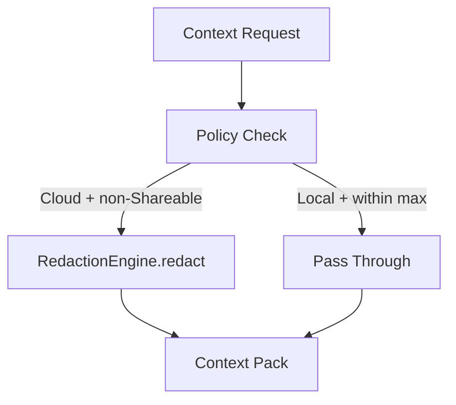

# Redaction Policy

## Overview

Redaction protects private data when sending context to cloud models. It is applied inside the Recall Gateway before any external model receives content. The implementation uses a regex-based `RedactionEngine` with 10 PII pattern categories and session-scoped hash-based pseudonymization for multi-turn consistency.

**Current implementation**: `submodules/runtime/crates/symbiotic-context/src/redaction.rs`

**Planned work**: see `docs/design/redaction-policy.md` for NER-based detection and private note summarization (post-MVP).

## Components

| Component | Location | Purpose |
|-----------|----------|---------|
| `RedactionEngine` | `symbiotic-context/src/redaction.rs` | Regex-based PII detection and redaction |
| `SessionMaskMap` | `symbiotic-context/src/redaction.rs` | Session-scoped pseudonymization with ephemeral salt |
| `PiiCategory` | `symbiotic-context/src/redaction.rs` | Enum of 10 PII categories |
| `PiiDetection` | `symbiotic-context/src/redaction.rs` | Detection result with category, span, and matched text |
| `redact_content()` | `symbiotic-context/src/lib.rs` | Gateway integration point (delegates to `RedactionEngine`) |
| `ContextPolicy` | `symbiotic-context/src/lib.rs` | Policy struct with `redaction` flag |
| `is_allowed_for_policy()` | `symbiotic-context/src/lib.rs` | Sensitivity gating per model class |

## PII Detection Rules

The `RedactionEngine` detects 10 categories of PII using compiled regex patterns (matching the `PiiCategory` enum in code):

| Category | Pattern | Action | Priority |
|----------|---------|--------|----------|
| **Email** | RFC-ish `user@domain.tld` | Replace with `[redacted-email]` | High |
| **Phone (US)** | `(+1-)?(NNN) NNN-NNNN` variants | Replace with `[redacted-phone]` | High |
| **Phone (intl)** | `+CC digit-groups` | Replace with `[redacted-phone]` | High |
| **SSN** | `NNN-NN-NNNN` | Remove entirely | Critical |
| **Credit Card** | 16-digit groups + Luhn validation | Remove entirely | Critical |
| **IpAddress** | `10.x`, `172.16-31.x`, `192.168.x` (private ranges) | Replace with `[redacted-ip]` | Medium |
| **US Address** | `N+ Street St/Ave/Blvd/Dr/Ln/Rd/Way/Ct/Pl` | Remove entirely | High |
| **US Zip Code** | `NNNNN` or `NNNNN-NNNN` (5-digit / ZIP+4) | Remove (entire span deleted) | Medium |
| **API Key** | `api_key=`, `token=`, `secret=`, `ghp_`, `AKIA` patterns | Replace with `[redacted-key]` | Critical |
| **Sensitive Keyword** | Configurable word list (`password`, `api_key`, etc.) | Replace with `[redacted-sensitive]` | Medium |

Detection resolves overlapping matches by keeping the earlier/longer match.

## Pseudonymization

`SessionMaskMap` provides consistent entity masking across multi-turn conversations:

- **Ephemeral salt**: 32 random bytes generated per session, never persisted
- **Salted SHA-256**: Same entity always maps to the same pseudonym within a session
- **Sequential labels**: `Email A`, `Email B`, `Phone A`, etc.
- **Cross-session isolation**: Different sessions produce different pseudonyms (different salt)
- **Category separation**: Each PII category has its own counter

Use `RedactionEngine::redact_with_pseudonyms()` for multi-turn contexts that need consistent masking.

## Policy Schema

```rust
pub enum Sensitivity { Shareable, Restricted, Private }
pub enum ModelClass  { Local, Hybrid, Cloud }

pub struct ContextPolicy {
    pub model_class: ModelClass,
    pub sensitivity_max: Sensitivity,
    pub redaction: bool,
}
```

**Enforcement rules:**
- Cloud models only receive `Shareable` content.
- If a cloud request includes `Restricted` or `Private` entries, they are redacted and downgraded to `Shareable`.
- Local models can access entries up to `sensitivity_max`.
- `redaction` flag is set to `true` when `model_class == Cloud`.

## Data Flow



## Key Decisions

1. **Regex patterns for MVP**: compiled regex patterns cover the highest-risk structured PII (SSN, credit cards, phone numbers, emails) with high precision and low overhead.
2. **Luhn validation for credit cards**: prevents false positives on 16-digit sequences that are not valid card numbers.
3. **Private IP only**: only private/internal IPv4 ranges (10.x, 172.16-31.x, 192.168.x) are flagged (`IpAddress` category) to avoid false positives on public IPs.
4. **Fail-open for local models**: local models may see unredacted data up to the configured sensitivity ceiling.
5. **Fail-closed for cloud models**: any non-Shareable content sent to cloud models is always redacted.
6. **Overlap resolution**: when multiple patterns match overlapping spans, the earlier/longer match wins.
7. **Pseudonymization is opt-in**: simple redaction (placeholder replacement) is the default; pseudonymization requires passing a `SessionMaskMap`.

## Error Handling

| Error | Handling |
|-------|----------|
| Redaction applied but content still sensitive | Cloud entries are downgraded to `Shareable` sensitivity after redaction |
| Entry exceeds sensitivity ceiling for model class | Entry is skipped entirely (non-cloud) or redacted (cloud) |
| Policy validation failure | `ContextPack::validate()` rejects invalid packs before returning |
