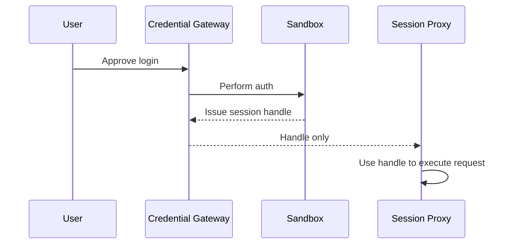

# Session Handles


## Overview

Session handles are **opaque, revocable tokens** that represent authenticated sessions without exposing raw cookies or credentials to cloud models. They are issued by the credential sandbox and consumed only by trusted proxies.

**Status (2026-02-06)**: Implemented in `services/credential-gateway/`. This contract is immutable for v1.

## Contract

```json
{
  "handle_id": "uuid",
  "issued_at": "ISO8601",
  "expires_at": "ISO8601",
  "scope": ["web.login", "api.request"],
  "target": "example.com",
  "session_type": "browser|api",
  "policy": {
    "exportable": false,
    "requires_reauth": false
  }
}
```

## Rules

- **Opaque**: handle never exposes cookies, tokens, or secrets.
- **Scoped**: each handle is bound to a target and purpose.
- **Short‑lived**: default TTL 24h; refresh requires re‑validation.
- **Revocable**: invalidation immediately blocks usage.
- **Non‑exportable by default**: raw session export requires explicit user approval.

## Data Flow



## Error Handling

| Error | Handling |
| --- | --- |
| Handle expired | Request re‑auth via credential channel |
| Invalid scope | Deny request, log audit entry |
| Revoked handle | Hard fail and notify user |
