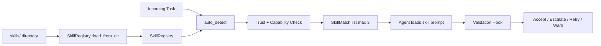
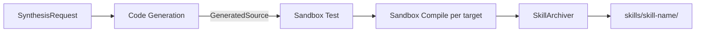

# Skills System


## Overview

Skills provide reusable, versioned prompt workflows with TOML manifests, trust gating, auto-load detection, validation hooks, and dynamic skill synthesis. Skills are loaded on demand to keep agent context lean. When agents encounter novel problems repeatedly, the synthesis pipeline generates new skills automatically: LLM-generated Rust code is compiled in a Docker sandbox, tested, and archived as a multiplatform binary bundle.

## Components

| Module | Location | Purpose |
|--------|----------|---------|
| `manifest` | `submodules/runtime/crates/symbiotic-skills/src/manifest.rs` | TOML manifest parsing and validation |
| `registry` | `submodules/runtime/crates/symbiotic-skills/src/registry.rs` | Skill registry, auto-detection, trust gating |
| `synthesis` | `submodules/runtime/crates/symbiotic-skills/src/synthesis.rs` | Pipeline orchestrator: generate -> test -> compile -> archive |
| `codegen` | `submodules/runtime/crates/symbiotic-skills/src/codegen.rs` | Code generation (LLM-backed via `LlmChat` trait, or stub fallback) |
| `docker` | `submodules/runtime/crates/symbiotic-skills/src/docker.rs` | Docker-backed sandbox compiler with resource limits |
| `tool` | `submodules/runtime/crates/symbiotic-skills/src/tool.rs` | Agent tool wrapper (`synthesize_skill`) with capability gating |
| `validation` | `submodules/runtime/crates/symbiotic-skills/src/validation.rs` | Script-based validation hooks with timeout |

## Data Flow



## Key Decisions

- **Standalone crate**: `symbiotic-skills` depends only on `symbiotic-trust`, avoids coupling to agent framework.
- **Trust level bridging**: `parse_trust_level()` accepts both planned design names (Basic/Standard/Trusted/FullyTrusted) and implemented code names (ReadOnly/ArchiveWrite/CredentialAccess/ExternalAct). See `docs/architecture/trust-capabilities.md` for the naming convention.
- **Max 3 skills per execution**: Prevents context bloat. Explicit invocation has highest priority, then keyword match, then domain match.
- **Validation scripts**: Receive JSON on stdin, exit 0 for pass. On failure, behavior is configurable: escalate, retry once, or warn.
- **TOML manifests**: Human-readable, versionable, consistent with Rust ecosystem conventions.

## Manifest Schema

Each skill is a directory under `skills/` with a `manifest.toml`:

```toml
[skill]
name = "code-review"          # Must match directory name
version = "1.0.0"             # Valid semver
description = "..."
min_trust_level = "ArchiveWrite"  # ReadOnly | ArchiveWrite | CredentialAccess | ExternalAct

[capabilities]
required = ["archive.read"]    # Agent must have these
optional = ["file.write"]      # Used if available

[triggers]
keywords = ["review"]          # Case-insensitive match in task text
domains = ["software-engineering"]
invocation = "code-review"     # "Use code-review" or "skill:code-review"

[files]
prompt = "prompt.md"
rubric = "rubric.md"
examples = ["examples/*.md"]

[validation]
script = "validation.sh"
timeout_secs = 30
on_failure = "escalate"        # escalate | retry | warn
```

## Auto-Load Algorithm

1. Check explicit invocation (`Use $name` or `skill:$name`) -- always wins
2. Check keyword match (case-insensitive in task text)
3. Check domain match
4. Filter by trust level (agent trust >= skill min_trust_level)
5. Filter by capabilities (agent has all required capabilities)
6. Take top 3 matches, sorted by priority (explicit > keyword > domain)

## Error Handling

| Error | Handling |
|-------|----------|
| Invalid manifest TOML | Skip skill, log error |
| Name/dir mismatch | Reject manifest |
| Trust too low | Exclude from auto-detect, error from check_access |
| Missing capabilities | Exclude from auto-detect, error from check_access |
| Validation script timeout | Kill process, return Timeout error |
| Validation script fails | Apply on_failure policy (escalate/retry/warn) |
| Code generation fails | Return `SynthesisError::CodeGenFailed` |
| Docker unavailable | Return `SynthesisError::SandboxUnavailable` |
| Compilation fails | Return `SynthesisError::CompileFailed` with exit code and stderr |
| Tests fail in sandbox | Return `SynthesisError::TestFailed` with details |

## Dynamic Skill Synthesis

When an agent encounters a novel problem that no existing skill solves, it calls the `synthesize_skill` tool to create a new one at runtime.

### Pipeline Stages



1. **Code Generation** (`codegen.rs`): Either LLM-backed (`LlmCodeGenerator` via the `LlmChat` trait) or stub template (`StubCodeGenerator`). The LLM receives a system prompt defining the stdio-json-rpc protocol contract and the user's problem description. Output is validated for `[package]` and `fn main()`.

2. **Sandbox Test** (`SandboxCompiler::test`): Runs `cargo test` in the sandbox to verify generated code. Fails fast if tests don't pass.

3. **Sandbox Compile** (`SandboxCompiler::compile`): Compiles for each target platform (default: `aarch64-apple-darwin` + `x86_64-unknown-linux-musl`). The `DockerSandboxCompiler` runs compilation in an isolated Docker container with memory/CPU limits and optional network isolation.

4. **Archive** (`SkillArchiver`): Writes the skill bundle (manifest.toml + src/ + bin/) to the skills directory.

### Docker Sandbox

The `DockerSandboxCompiler` provides safe compilation:

| Setting | Default | Purpose |
|---------|---------|---------|
| Image | `rust:1.88-slim` | Compilation environment |
| Memory | `512m` | Prevent OOM from generated code |
| CPU | `1.0` | Limit CPU consumption |
| Timeout | `120s` | Kill hung builds |
| Network | `none` | Prevent exfiltration from generated code |

Source files are staged to a temporary directory, mounted read-write into the container, and cleaned up after each operation.

### Code Generation

The `LlmChat` trait decouples code generation from the provider system:

```rust
pub trait LlmChat: Send + Sync {
    async fn chat(&self, system: &str, user: &str) -> Result<String, anyhow::Error>;
}
```

The daemon implements this by adapting `CompletionProvider` from `symbiotic-providers`. This avoids a direct dependency from `symbiotic-skills` to `symbiotic-providers`.

### Agent Tool Integration

The `SynthesizeTool` (`tool.rs`) wraps the pipeline as an agent-callable tool:
- Requires the `vm.exec` capability scope
- Parameters: `skill_name` (kebab-case), `description` (detailed enough for code gen)
- Returns the synthesized skill path and compiled targets on success

### Skill Bundle Directory

```
knowledge-base/operations/skills/{skill-name}/
├── manifest.toml       # TOML manifest with [targets] section
├── Cargo.toml          # Original Cargo.toml
├── src/
│   └── main.rs         # Original source
└── bin/
    ├── aarch64-apple-darwin
    └── x86_64-unknown-linux-musl
```

The runtime loader (`host_target_triple()`) selects the correct binary for the current platform.
