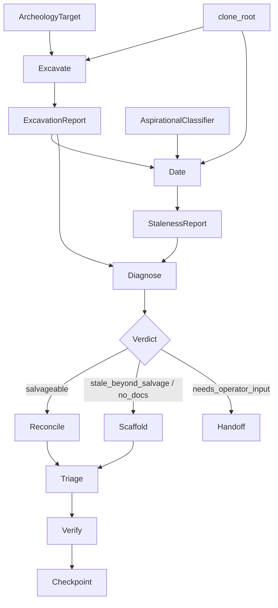

# Source Archeology

## Overview

Source Archeology is a six-stage pipeline that inspects an attached source repository, classifies documentation staleness, and produces triageable findings — used during project onboarding (T127 Phase 2) and on drift-detected hooks (T126).

All six stages are implemented today: Excavate, Date, Diagnose, Reconcile/Scaffold/Handoff (branch), Triage, and Verify — each as a `pub async fn run` in its own file (`excavate.rs`, `date.rs`, `diagnose.rs`, `reconcile.rs`, `scaffold.rs`, `handoff.rs`, `triage.rs`, `verify.rs`), coordinated by `orchestrator.rs` with per-run `checkpoint.rs` artifacts. Daemon-side dispatch (external-push gating, bundle schema v3, notifications, sandbox wiring) landed in T128 §15 on 2026-04-20.

For design intent, model-tier policy, and the full staleness taxonomy, see the design doc.

## Components

All stage code lives in `submodules/runtime/crates/symbiotic-agents/src/source_archeology/` (15 files). Daemon-side dispatch lives in `submodules/runtime/services/symbiotic-daemon/src/` (4 files):

| File | Contents |
|---|---|
| `mod.rs` | `SourceArcheologyRunner` entry point + re-exports. |
| `archeology_types.rs` | Declarative types: `ArcheologyTarget`, `ArcheologyMode`, `PathPattern`, `StalenessClass`, `DiagnosisVerdict`, `Finding`, `FindingSourceStage`, `FindingSeverity`, `FindingAction`, `GoalAlignment`, `TriageDecision`, `FindingDisposition`, `ArcheologyError`. These are the cross-stage vocabulary; later stages extend but do not redefine. |
| `excavate.rs` | Stage 1 worker. Produces `ExcavationReport` of typed `Observation`s across 9 categories (`SignalFile`, `BuildSystem`, `CiConfig`, `TestCommand`, `CommitPattern`, `ContributorSurface`, `Dependency`, `WireMismatch`, `ParseError`). Deterministic; no LLM. |
| `date.rs` | Stage 2 worker. Produces `StalenessReport` with per-artifact `StalenessClass`. Deterministic pre-filter routes unambiguous rows directly; ambiguous rows go through `AspirationalClassifier` (fast-tier LLM). `LlmAspirationalClassifier` is the production impl; trait-level mocks live in `fixtures.rs`. |
| `diagnose.rs` | Stage 3 worker. Deep-tier classifier aggregating Excavate + Date into one of four `DiagnosisVerdict`s (`salvageable`, `stale_beyond_salvage`, `no_docs`, `needs_operator_input`). |
| `reconcile.rs` | Stage 4a worker. Produces per-finding patch hunks for `salvageable` repos; patches are findings, not direct applies. |
| `scaffold.rs` | Stage 4b worker. Produces fresh docs package for `stale_beyond_salvage` / `no_docs` repos, routed to `{slug}-docs`. |
| `scaffold_templates.rs` | Shared scaffold template lookup (rust-workspace, sveltekit, monorepo, fallback, docs-starter). |
| `handoff.rs` | Stage 4c worker. Compiles `archeology-report.md` + explicit operator questions when Diagnose returns `needs_operator_input`. |
| `triage.rs` | Stage 5 decision-tree over findings — emits `resolve` / `defer` / `escalate` dispositions per `Finding`. |
| `verify.rs` | Stage 6 verifiers — patch applicability + markdownlint; rejected findings downgrade to `defer`. |
| `orchestrator.rs` | Drives the six-stage pipeline, manages per-stage state and error flow, writes run artifacts. |
| `checkpoint.rs` | Reads/writes `archeology-checkpoint.json`; carries open issues forward to the next run. |
| `contract.rs` | Cross-crate contract types consumed by the daemon dispatch layer. |
| `fixtures.rs` | `#[cfg(test)]` test harness: `build(recipe)` creates a deterministic fixture repo with pinned `GIT_AUTHOR_DATE` / `GIT_COMMITTER_DATE` for age control, `--initial-branch=main` for cross-platform consistency. `DeterministicOnlyClassifier` panics if the LLM path is invoked; `ScriptedClassifier` returns a pre-configured answer. |

Daemon-side files:

| File | Contents |
|---|---|
| `archeology_dispatch.rs` | Decides push-vs-hold post-Triage; enforces external-push gating + `ApprovalOperation`. |
| `archeology_bundle.rs` | Bundle schema v3 extraction from Archeology Sandbox. |
| `archeology_sandbox.rs` | Sandbox runtime wiring for Archeology workers. |
| `archeology_notify.rs` | Operator notifications for escalated findings and checkpoint summaries. |

The caller (daemon / T127 Phase 2) is responsible for resolving `ArcheologyTarget.repo_id` → filesystem path via `RepoRegistry` and passing the path to `SourceArcheologyRunner::excavate()`. This keeps `symbiotic-agents` ignorant of `symbiotic-control-plane`'s registry primitives (the one-way dependency `control-plane → agents` is preserved).

## Data Flow

All six stages are implemented; the orchestrator drives the flow and writes per-run artifacts under the triggering goal.

## Key Decisions

- **Crate placement**: all Source Archeology code (types + runner + stages) lives in `symbiotic-agents`. An earlier §02 draft placed declarative types in `symbiotic-control-plane`; the operator reversed this on 2026-04-18 because `control-plane → agents` is a load-bearing edge (`goals.rs` uses `AgentPool`), so placing the runner in agents while types lived in control-plane would cycle Cargo. Callers pass a resolved filesystem path rather than a `RepoManifest` so `agents` never needs to import `control-plane`.
- **Deterministic + LLM hybrid at Stage 2**: the easy staleness classifications (Fresh, Stale, Dead) are encoded as rules over git-log signals. Only the genuinely hard edge — distinguishing `aspirational` (describes planned/never-existed behavior) from `stale` (describes past behavior) — goes to an LLM. This keeps token cost proportional to ambiguity rather than to repo size.
- **Trait seam for the LLM**: `AspirationalClassifier` is a trait, not a direct `LlmClient` call. Lets tests inject scripted mocks without standing up `wiremock`, and lets the production impl evolve independently of the stage logic.
- **Model tiers named by capability + speed**: `fast` / `balanced` / `deep` per `docs/NAMING-CANON.md` §Model Tiers. Never provider-bound. Excavate + Date workers use `fast`.
- **Git ops via `std::process::Command`, not `git2`**: matches existing T126 fixture patterns and avoids a workspace-dep change. `git2` is deferred to a perf follow-up if subprocess cost becomes measurable.

## Error Handling

Per the design doc's §Failure Modes table, applied in code:

| Failure | Current handling |
|---|---|
| `std::io::Error` reading a file during wire-mismatch scan | Emit `ObservationCategory::ParseError`; walk continues. |
| File exceeds 500 KB read cap | Emit `ParseError` with the cap note; file content not loaded. |
| Walkdir encounters a walk error (permission, cycle) | Emit `ParseError` with the error string; walk continues. |
| File-count cap (5000) hit | Emit one cap-exceeded `ParseError`; walk terminates cleanly. |
| `git log` subprocess fails | Commit-pattern observation is emitted as `ParseError`; Stage 2 continues with `u32::MAX` age → triggers `Stale`/`Dead` rules conservatively. |
| LLM aspirational classifier errors (even after one retry) | Stage 2 falls back to `Drifting` (if the row is mid-age) or `Stale` (if the row is >180 days old). Evidence string carries `llm:fallback_drifting` so the operator can distinguish a fallback from a real classification. |

No single observation is fatal. Aborts only on catastrophic errors (e.g. `clone_root` entirely unreadable at walk start).

## Tests

Run with `cargo test -p symbiotic-agents source_archeology` (plus daemon-side archeology tests under `cargo test -p symbiotic-daemon archeology`). Coverage spans:

- Unit tests on the declarative types in `archeology_types` (moved in place from §02).
- Utility tests inside `date.rs` (`parse_aspirational_response`, `is_bot_email`).
- Excavate fixture tests (README/LICENSE detection, wire-mismatch, parse-error non-fatal, walk-cap, serde roundtrip).
- Date fixture tests (Fresh/Stale/Dead without LLM; Aspirational via LLM; Drifting via LLM; fallback on LLM error; serde roundtrip).
- Diagnose verdict tests across all four branches.
- Reconcile, Scaffold, Handoff, Triage, and Verify stage tests.
- Orchestrator + Checkpoint round-trip tests (open-issue carryover across runs).
- Daemon-side dispatch tests (external-push gating + `ApprovalOperation`).

All green on `main`. Fixture repos use `--initial-branch=main` and pinned `GIT_AUTHOR_DATE` / `GIT_COMMITTER_DATE` for deterministic behavior regardless of wall clock or CI defaults.

## What's Next

With §02 through §15 landed, the remaining follow-ups are evolutionary rather than foundational:

- Post-MVP: upgrade the Triage decision tree from a declarative rule set to an LLM-reasoning stage that can learn from historical operator decisions.
- Richer "operator mood" signals (explicit `/mood` commands) per `docs/design/source-archeology.md` §Open Questions.
- `defer_ttl_days` policy for pruning long-stale deferred findings.
