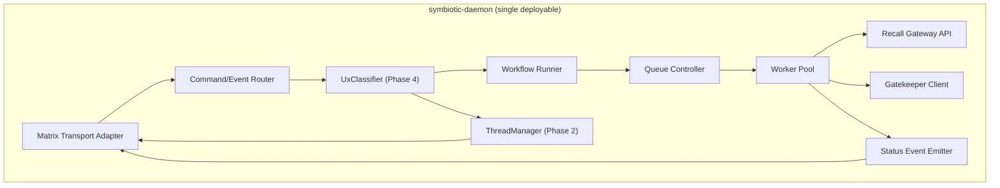
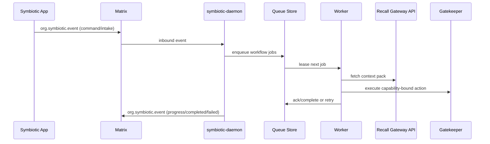
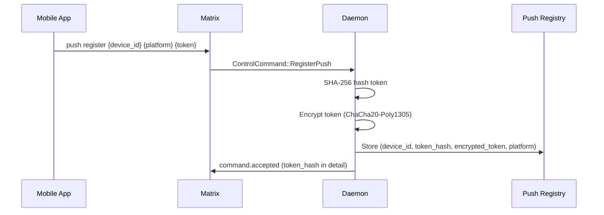
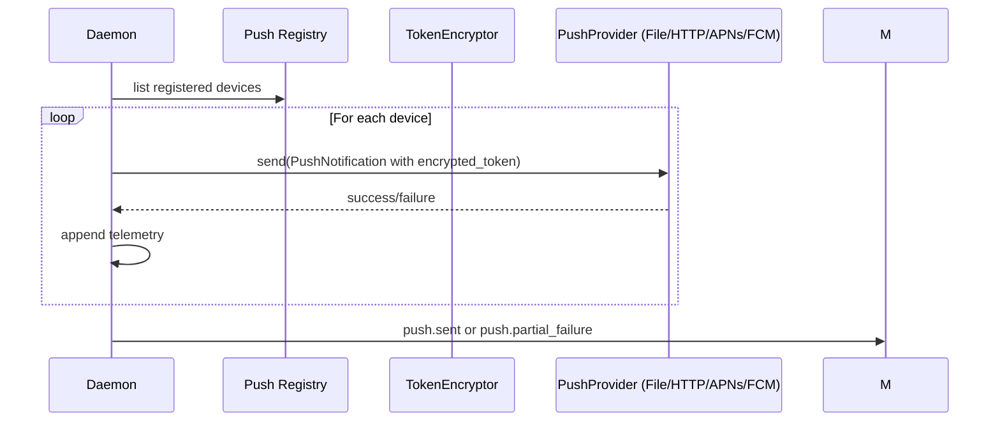

# Nucleus (`symbiotic-daemon`)

## Overview

Nucleus (`symbiotic-daemon`) is the primary runtime service that binds Matrix transport, workflow execution, queue workers, and Recall Gateway access into one deployable control-plane process.

**Status (2026-04-20)**: Shipped · Verified. Nucleus service, queue workers, workflow dispatch, room routing, runtime hardening guardrails, live bookmarks API fallback chain, Matrix SDK/E2EE transport mode, push gateway adapter contracts (generic + APNs/FCM gateway routes with telemetry), encrypted device token storage with push delivery contract, and zero-config daemon bootstrap (credential resolution via Docker secrets/vault/self-registration, room auto-creation) are implemented. Live provider credentials remain pending.

**Management ownership (2026-04-10 / 2026-04-11)**: The daemon now persists management-layer control-plane state under `data/control-plane/` via `symbiotic-control-plane::ManagementStore`. Implemented callers are:

- internal git swarm branch ownership lifecycle (`running` -> `pending_review` -> `done` / `cancelled`, with review regressions returning to `running`)
- top-level goal lifecycle projection from reconciler and dispatcher paths into goal-scoped management work items (`goal:{slug}`)
- direct `#goals` inquisition intake now creates the top-level goal work item immediately and uses a stable `inquisition:{goal_id}` template instead of a flat shared `inquisition` template
- direct `#goals` inquisition intake now also persists canonical goal planning state into the Archive under `knowledge-base/operations/goals/{goal}/plan.md`
- approved inquisition plans now persist canonical child task docs under `knowledge-base/operations/goals/{goal}/tasks/*.md`, then derive durable child task and execution work items from those Archive records instead of leaving generic goal execution as a flat top-level status
- goal planning now also maintains append-only Archive events under `knowledge-base/operations/goals/{goal}/events/*.md`, and task docs keep explicit `task_id`, `task_slug`, `task_kind`, `task_driver`, dependency, execution-status, lineage, and plan-version metadata so replanning history survives restore
- plan and task lifecycle event docs now carry structured frontmatter for task IDs, status transitions, and supersession edges so Archive history is machine-readable without scraping prose
- plan reconciliation now also records owner-change edges when canonical `owner_hint` / role ownership shifts between approved plans
- approved plan steps now carry planner-authored structural lineage hints (`depends_on`, `derived_from`, `replaces`) plus typed `declared_context` and typed `policy`, and Archive reconciliation uses those hints to mark removed tasks as `cancelled` or `superseded` instead of guessing from step order alone
- planner-authored `task_kind` is now separated from `task_driver`: semantic kind no longer decides runtime projection by itself. The orchestrator defaults `execution`/`distillation` to `agent` and `review`/`coordination`/`waiting`/`approval` to `declared`, while still allowing explicit `review`/`coordination` overrides
- planner-authored ownership intent is now separated from execution identity too: `role` is only for `task_driver: agent`, while `owner_hint` is the canonical ownership target for declared or human-facing tasks
- planner-authored declared-task semantics now survive in typed form too: `declared_context` carries review target, waiting condition, coordination target, and external dependency, while `policy.escalation` carries escalation mode, audience, severity, and trigger/cooldown metadata for Archive-native work and `policy.timing` carries timezone-aware lateness/delivery-window overrides
- shared Archive policy scopes are now live too: goal plans may declare `policy_scopes`, the daemon parses `knowledge-base/operations/policy/scopes/*.md`, and shared delivery defaults for subjects like `team:*` or `oncall:*` now merge into effective task policy without relying on hidden daemon config
- Archive-native availability manifests are now live in minimal form too: `knowledge-base/operations/calendar/availability/*.md` defines delivery-subject schedules, and the daemon resolves those records by subject (`operator`, optional `team:*`, optional `oncall:*`) to supply timezone and concrete quiet-hour / working-hour windows during task policy evaluation
- `task_driver: agent` spawns execution children; `task_driver: declared` keeps the task as truthful Archive-native state without a synthetic execution child
- non-execution progression is now explicit rather than inferred: `goal.task.transition` updates canonical Archive task docs plus structured goal event history, then refreshes the derived task/goal management projection (`waiting` becomes `blocked` when active, `approval` becomes `pending_review` when active)
- declared blockers are now explicit and mutable too: `goal.task.condition.set` writes the canonical blocker field on a declared task, while `goal.task.condition.satisfied` clears that field and records a structured condition event instead of leaving stale blocker context in the Archive
- declared-task escalation is now explicit, state-driven, and delivery-window aware: entering `blocked` under `policy.escalation` appends canonical `task_escalated` history when the effective delivery window is open, or `task_escalation_deferred` when it is closed, then projects the user-facing effect (`notify_operator`, `raise_alert`, `auto_replan`) only when delivery is allowed; projection now also respects canonical `audience` and `severity`, so urgent or on-call work may route to `#alerts` even when the policy mode remains `notify_operator`
- background declared-task policy evaluation is now live: built-in/operator/shared-scope/goal/task inheritance resolves effective escalation and timing policy, audience-matched policy scopes and delivery-subject availability can override operator delivery timing for optional shared subjects like `team:*` and `oncall:*`, `after_secs` can trigger later escalations, `lateness_basis` can count either wall-clock or delivery-window elapsed time, deferred deliveries append canonical `task_escalation_deferred` / `task_escalation_window_opened`, cooldown / `max_count` produce canonical suppression events, and internal/explicit blocker clear signals can resume a blocked declared task to its last runnable state when no blockers remain
- `auto_replan` no longer stops at a passive request: the daemon scans Archive goal events for unconsumed `task_replan_requested`, appends canonical `task_replan_enqueued`, and queues a fresh `inquisition:{goal}` planning round with Archive-derived `replan_context`
- task ownership changes are now explicit too: `goal.task.assign` updates canonical Archive `owner_hint`, appends a structured `task_owner_changed` event, and refreshes the derived task work-item assignee
- task work-item assignees now derive from canonical `owner_hint` first and role fallback second, instead of inheriting the top-level goal owner blindly
- durable development task parenting for goal-scoped swarm work (`goal:{slug}:task:development:{repo}`), with checked-out execution work refreshed beneath that task instead of attaching directly to the goal
- explicit execution/artifact split for swarm development ownership, where the execution work item owns the lease + branch claim and a separate development-artifact work item mirrors branch / PR / review / merge state beneath it
- daemon startup now rehydrates active goal/task execution projection from Archive goal/task docs when they exist, so declared project/task state can cold-boot from Vault truth

This is management ownership only. Repo/branch merge policy remains in the development layer, and KB semantic conflicts remain in the Archive layer.

**Thread observability (2026-04-10)**: The daemon now also persists a truthful per-thread Tier 3 projection under `data/threads/observability.json`. For any relevant thread-scoped execution event, it rebuilds and emits:

- `thread.observability.summary`
  - compact `OperationsPillSummary` for the real thread header
- `thread.observability.snapshot`
  - narrow operations snapshot for the real `ProjectBoard`, including recent execution updates derived from the durable goal run log

The projection currently derives from persisted `GoalState`, the durable goal
run log, the thread registry title, persisted management-layer swarm branch
work when a work item is explicitly attached to the thread (with run-scope
matching kept as a fallback compatibility join), and a daemon-owned raw bridge
interaction log for narrow runtime chatter. It still does not invent
peer-to-peer agent chatter or raw reasoning logs.

As of `2026-04-11`, that projection is no longer goal-run-only. The daemon now:

- prefers goal task work items as the primary live `ProjectBoard` operations when a thread has task hierarchy
- surfaces task owner labels from canonical task ownership projection
- reads machine-readable Archive goal events from `knowledge-base/operations/goals/{goal}/events/*.md`
- uses those canonical events for recent board updates such as task owner changes, task status changes, and plan reconciliation

**Bridge interaction durability (2026-04-10)**: The daemon now also persists two distinct bridge-owned stores under `data/bridge/`:

- `raw-events.jsonl`
  - append-only raw runtime interaction log for bridge-emitted context-packet loads, user questions, plan proposals, and pending auth requests
- `checkpoints.jsonl`
  - append-only distilled checkpoint artifacts emitted by runner sessions

The real `thread.observability.snapshot` now derives a truthful **runtime chatter** lane from `raw-events.jsonl` using explicit `thread_id` when present or the active `goal_scope` / `GoalState.last_run_id` join when not. This remains narrower than raw THOUGHT / TOOL / RESULT logging.

**Tier 4 runtime logs (2026-04-10)**: The daemon now also persists append-only raw runtime agent logs under `data/bridge/agent-logs.jsonl`. These are built from runner `goal.event` notifications and currently include only truthful public runtime records:

- `tool`
- `result`
- `blocked`

The daemon intentionally does not project hidden chain-of-thought. Recent thread-matched runtime log entries now flow into `thread.observability.snapshot.agent_logs` using the same explicit `thread_id` / active `goal_scope` join strategy as runtime chatter.

**Current runtime status lane (2026-04-10)**: The daemon now also persists mutable per-agent runtime status under `data/agents/runtime-status.json`. This is distinct from append-only raw logs and is built only from daemon-owned truth:

- bridge handshake runtime profile
- explicit runner `agent.status` events
- durable `goal_scope` / optional `thread_id`

Recent thread-matched current statuses now flow into `thread.observability.snapshot.agent_statuses`. The daemon uses that lane first for:

- live `AgentLogsSheet` metadata (role, sandbox type, model route, iteration, status)
- truthful active-agent chips in the `ProjectBoard`
- the pill's optional `total_active_agents`

Raw runtime logs remain append-only debug history; they are no longer the canonical source of current runtime metadata.

**Thread architecture (2026-03-16)**: The hybrid thread room model has been approved (`docs/design/thread-architecture.md`). Phase 1 implementation is in progress. Key changes: `#stream` replaces `#control`/`#status`/`#intake` (Phase 2), `#thread-{slug}` replaces `#goal-{slug}` (Phase 2), new event types (`chat.reply`, `task.result`, `goal.result`) and `thread_id` on all thread-scoped events (Phase 1), `UxClassifier` pre-filter (Phase 4), `ThreadManager` for room lifecycle (Phase 2). See `tasks/108-thread-architecture/` for implementation plan.

## Responsibilities (MVP)

- Matrix sync + message routing (`#control`, `#status`, `#intake`, `#goal-*`, `#credentials`, `#alerts`)
- Transport modes: file-backed (dev/test), live HTTP polling, and matrix-sdk (E2EE capable)
- Command parsing and workflow dispatch
- Strict command validation (text + JSON v1) with limit enforcement for bookmarks sync
- Bookmarks sync source chain: X API (`/users/me/bookmarks`) -> API fixture -> browser fixture
- Intake submission to queue (`ingest.fetch`, `archive.review.enqueue`, `archive.review`)
- Queue worker execution and retry handling
- Recall Gateway endpoint for agents/workflows
- Gatekeeper integration for external actions
- Push notification dispatch + device registry (encrypted token storage, file + HTTP gateway provider adapters, APNs/FCM gateway routes, delivery telemetry)
- Durable control-plane state for goals/agents (`data/goals/*`, `data/agents/*`)
- Durable management-layer state for work items / claims / leases (`data/control-plane/*`)
- Per-goal workflow dedupe guard (same goal + template while active)
- Status/event publishing (`org.symbiotic.event`)
- `chat.reply` handler — direct LLM call for quick questions (no agent needed) — **Phase 1**
- `task.result` handler — single agent pass for short tasks — **Phase 1**
- `goal.result` event emission before `goal.completed` (carries the structured output/answer) — **Phase 1**
- Thread room management (`ThreadManager` — create/archive `#thread-{slug}` rooms) — **Phase 2**
- Thread registry (thread_id to room_id mapping, persisted in `data/threads/`) — **Phase 2**
- UX Classification (`UxClassifier` — classify incoming messages as QUICK/SHORT_TASK/GOAL/FOLLOW_UP/ROUTING) — **Phase 4**

## Service Decomposition



## Room Routing

**Current (MVP):**
- `#control` — user commands
- `#status` — daemon status updates
- `#intake` — URL drops for ingestion
- `#goal-{slug}` — per-goal conversations
- `#credentials` — credential requests (security-isolated)
- `#alerts` — escalations

**Planned (Thread Architecture):**
- **Phase 2:** `#stream` replaces `#control` + `#status` + `#intake` — all user interaction flows through one room
- **Phase 2:** `#thread-{slug}` replaces `#goal-{slug}` — threads are messaging surfaces that attached goals and work project into
- **Backward compat:** existing `#control`, `#status`, `#intake`, and `#goal-*` rooms continue working during migration. The daemon accepts messages from both old and new rooms.
- `#credentials`, `#cred-{id}`, `#alerts`, `#agent-{id}` — unchanged

See `docs/design/thread-architecture.md` section 2 for the full room model.

## Event Emission

All thread-scoped events include a `thread_id` field in the `sym.d` payload (Phase 1). Events in `#stream` (quick replies, short tasks) MAY omit `thread_id` when truly inline.

```json
{
  "sym": {
    "v": 1,
    "t": "goal.step.completed",
    "s": "completed",
    "d": {
      "goal_id": "goal-build-frontend",
      "thread_id": "thread-saas-product",
      "detail": "step=scaffold type=agent.execute index=1 total=4"
    }
  }
}
```

New event types (Phase 1): `chat.reply`, `task.result`, `goal.result`, `goal.created`.
New event types (Phase 2+): `routing.created`, `routing.moved`, `routing.split`, `routing.undo`, `thread.summary`, `goal.answer`.

See `docs/design/thread-architecture.md` section 6 for full event protocol.

## Runtime Data Flow



## Management Ownership Projection

The daemon now projects two categories of live ownership into the management layer:

1. **Swarm branch ownership**
   - created when a push session is issued
   - moves to `pending_review` on PR creation
   - returns to `running` on changes requested or failed checks
   - ends as `done` on merge or `cancelled` on PR close

2. **Top-level goal ownership**
   - created as `goal:{slug}` work items from reconciler/dispatcher lifecycle events
   - direct `#goals` inquisition intake also creates the goal work item immediately, before planning completes
   - `StartGoal` / `ResumeGoal` -> `running`
   - `PauseGoal` -> `blocked`
   - `StopGoal` -> `cancelled`
   - phase changes update the work-item summary for management visibility

3. **Planner-authored goal task ownership**
   - canonical task truth lives in `knowledge-base/operations/goals/{goal}/tasks/*.md`
   - approved inquisition plans are first written into those Archive task docs
   - the approved plan schema now carries stable `task_id`, mutable `task_slug`, canonical `task_kind`, canonical `task_driver`, explicit `owner_hint`, typed `declared_context`, typed `policy`, agent-only `role`, explicit `depends_on`, and structural lineage hints (`derived_from`, `replaces`)
   - the daemon then derives durable child task work items from the Archive records
   - execution-like task kinds get a child execution work item beneath that task
   - `waiting` / `approval` tasks remain truthful Archive-owned task state without fake execution children
   - explicit `goal.task.transition` commands are the canonical seam for progressing non-execution task kinds while preserving Archive-first truth and structured audit history
   - explicit `goal.task.assign` commands are the canonical seam for changing planned-task ownership while preserving Archive-first truth and structured audit history
   - execution status moves those child records through `todo` -> `running` -> `done` / `failed`
   - parent task and goal status refresh from their direct children rather than from a synthetic flat projection

4. **Goal-scoped development task ownership**
   - created as `goal:{slug}:task:development:{repo_id}` when swarm work is attached to a goal
   - acts as the durable parent for branch-scoped execution work
   - refreshes status from its direct child execution work items (`running`, `pending_review`, `done`, etc.)

5. **Swarm execution + artifact split**
   - `swarm-branch-execution-work-item-*` owns the checked-out implementation/review work
   - `swarm-branch-artifact-work-item-*` carries the visible branch / PR / review / merge lifecycle beneath that execution item
   - thread observability projects only the artifact records, not the execution record itself

This gives the control plane one durable place to answer:

- what work exists
- what is currently owned
- what is blocked
- what has expired or been cancelled

without conflating management with git branch review state.

## Process Model

- One daemon instance per user environment (MVP default).
- Internal modules are isolated by interface boundaries, not separate processes.
- Optional split to separate services post-MVP:
  - `daemon-router`
  - `daemon-workers`
  - `context-gateway`

## Failure Boundaries

| Failure | Handling |
| --- | --- |
| Matrix disconnect | Backoff reconnect; continue local queue processing |
| Queue store unavailable | Fail command admission; keep running workers on leased jobs only |
| Recall Gateway policy error | Fail closed and emit `task.failed` |
| Gatekeeper unavailable | Block external actions and escalate |
| Worker panic | Restart worker, requeue job with retry policy |
| Terminal policy error (`Blocked`, unsafe target, missing credentials) | Acknowledge as terminal failure (no retry/DLQ loop) |

## Runtime Guardrails (MVP)

- Max Matrix message body size (default `32 KiB`) enforced before routing.
- Bookmarks sync limit guardrail: `1..=500`.
- Control command JSON rejects unsupported fields and invalid shape.
- Sensitive runtime files are permission-hardened on unix (`0600` file / `0700` parent where applicable).

## Push Delivery Contract

The daemon implements encrypted device token storage and push notification delivery to APNs and FCM.

### Token Storage

Device tokens are sensitive credentials. The push registry stores them encrypted at rest using ChaCha20-Poly1305 AEAD (via `TokenEncryptor` from `credential-gateway`).

| Field | Purpose |
|-------|---------|
| `device_id` | Stable device identifier (app-assigned) |
| `token_hash` | SHA-256 hash of plaintext token (index/lookup key) |
| `encrypted_token` | `nonce:ciphertext` hex (ChaCha20-Poly1305 AEAD) |
| `platform` | `apns` or `fcm` |
| `last_seen` | Unix timestamp of last registration |

**Registry file format** (`data/push/tokens.tsv`): 5-column TSV:
```
{device_id}\t{token_hash}\t{encrypted_token}\t{platform}\t{last_seen}
```

**Encryption key**: Stored at `data/push/token.key` (hex-encoded 32-byte key, auto-generated on first use, `0600` permissions).

### Registration Flow



### Notification Delivery Flow



### Provider Chain

Notifications are sent through a `CompositePushProvider` that fans out to all configured providers:

1. **FilePushProvider** (always active): Appends to `data/push/outbox.ndjson`
2. **HttpPushProvider** (optional): Generic push gateway HTTP POST
3. **ApnsGatewayPushProvider** (optional): APNs-specific gateway route (filters to `apns`/`ios` platforms)
4. **FcmGatewayPushProvider** (optional): FCM-specific gateway route (filters to `fcm`/`android` platforms)

Each provider receives the full `PushNotification` including `encrypted_token`. Decryption happens inside the downstream push gateway (or equivalent trusted delivery boundary), not inside the daemon.

### Security Properties

- Plaintext device tokens never touch disk; only encrypted form is persisted
- Encryption key is separate from credential vault key (defense in depth)
- Registry file and key file are permission-hardened (`0600`/`0700`)
- Token hash remains available for dedup/lookup without decryption
- Decryption happens only at delivery time, in memory

## Contracts

- Event envelope: `docs/architecture/matrix-channels.md`
- Workflow schema: `schemas/workflow.json`
- Queue semantics: `docs/architecture/queue-system.md`
- Context contract: `docs/architecture/context-delivery.md`
- Capability enforcement: `docs/architecture/trust-capabilities.md`
