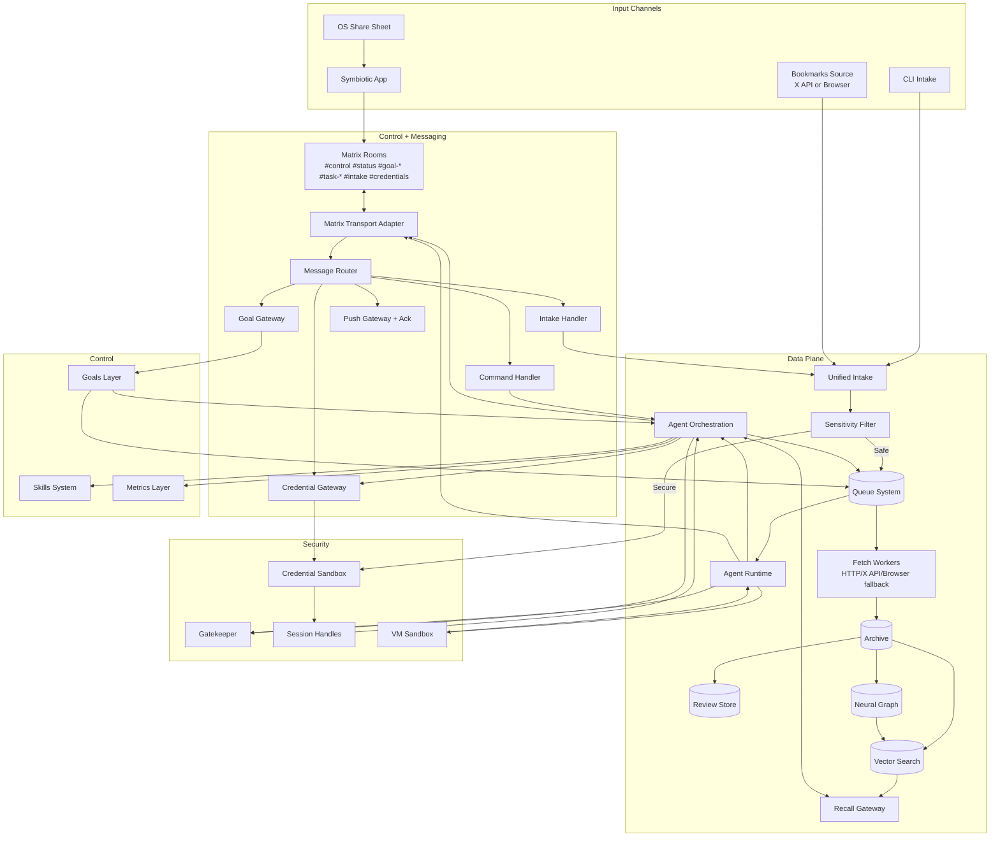
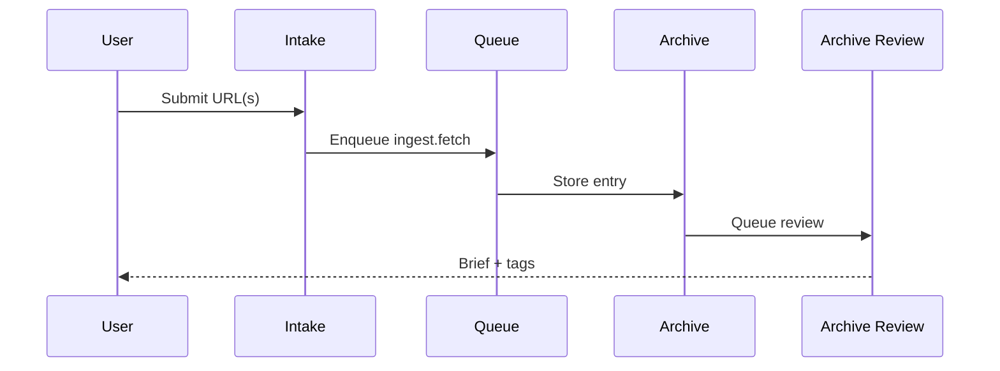
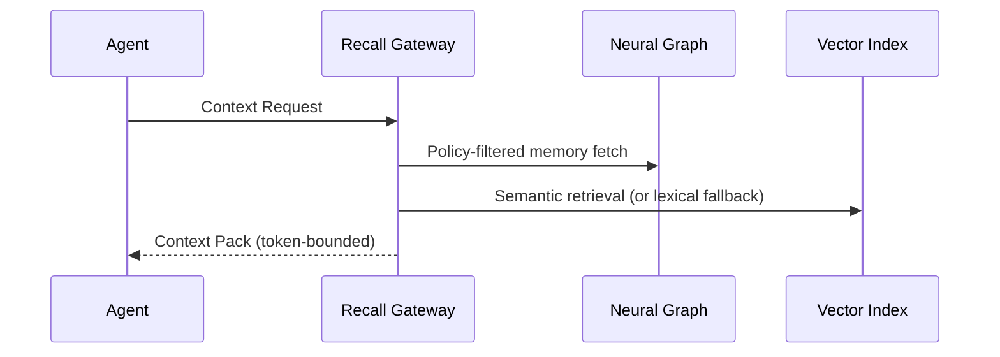
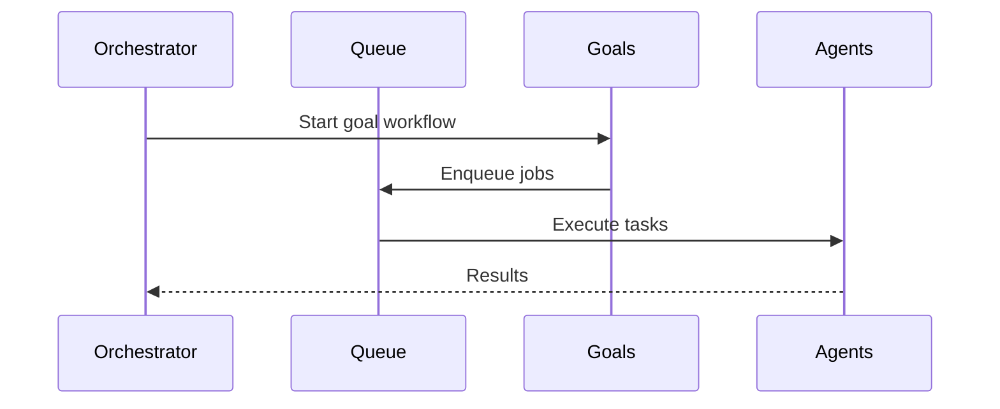

# System Map

> **Historical note:** This document describes the current implemented / migration-era architecture view. For the approved future target topology, see `docs/design/system-map.md`.

## Overview

This document stitches together the core architecture and marks what is **high value** vs **deferred**. It is the single navigation hub for the system.

## Component Map

**Note:** The system map covers both **data plane** (ingest -> queue -> Archive/Neural Graph -> Recall Gateway) and **control plane** (Matrix messaging -> routing -> orchestration/goal execution), including Gatekeeper and Vault enforcement paths.

## Phasing & Value

| Area | Value Add | Phase |
| --- | --- | --- |
| Unified intake + sensitivity filter + queue | Reliable ingestion, secret-safe routing, dedupe, retries | MVP |
| Archive + Brief workflow | Base knowledge system | MVP |
| Recall Gateway | Privacy enforcement + token control | MVP |
| Neural Graph | Long‑term personal context | Beta |
| Vector search + hierarchical retrieval | Accurate recall at scale | Beta |
| Goals layer | Multi‑domain orchestration | Beta |
| Metrics layer | Evidence‑based self‑improvement | Beta |
| Skills system | Reusable, consistent workflows | Beta |
| VM sandboxing | Strong isolation for risky code | Post‑Beta |
| Zero‑touch onboarding | Productization | Post‑Beta |

## Core Flows

### Ingestion

### Memory Access

### Orchestration

## Related Docs

- `docs/architecture/ingestion-pipeline.md`
- `docs/architecture/knowledge-storage.md`
- `docs/design/vault-as-truth.md`
- `docs/architecture/context-delivery.md`
- `docs/architecture/vector-search.md`
- `docs/design/context-graphs.md`
- `docs/design/temporal-modeling.md`
- `docs/architecture/queue-system.md`
- `docs/architecture/goals-layer.md`
- `docs/architecture/agent-orchestration.md`
- `docs/architecture/symbiotic-daemon.md`
- `docs/architecture/metrics-layer.md`
- `docs/architecture/skills-system.md`
- `docs/architecture/vm-sandboxing.md`
- `docs/architecture/onboarding.md`
- `docs/architecture/setup-experience.md`
- `docs/architecture/session-handles.md`
- `docs/architecture/redaction-policy.md`
- `docs/design/memory-extraction.md`
- `docs/architecture/queue-persistence.md`
- `docs/design/embedding-chunking.md`
- `docs/architecture/device-trust-bootstrap.md`
- `docs/architecture/repo-structure.md`
- `docs/architecture/runtime-workflows.md`
- `docs/architecture/implementation-map.md`
- `docs/architecture/mvp-readiness.md`
