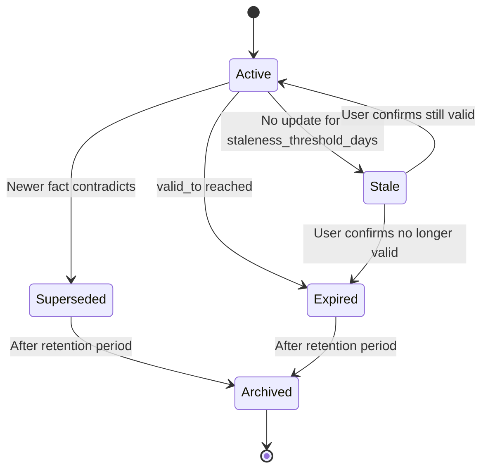
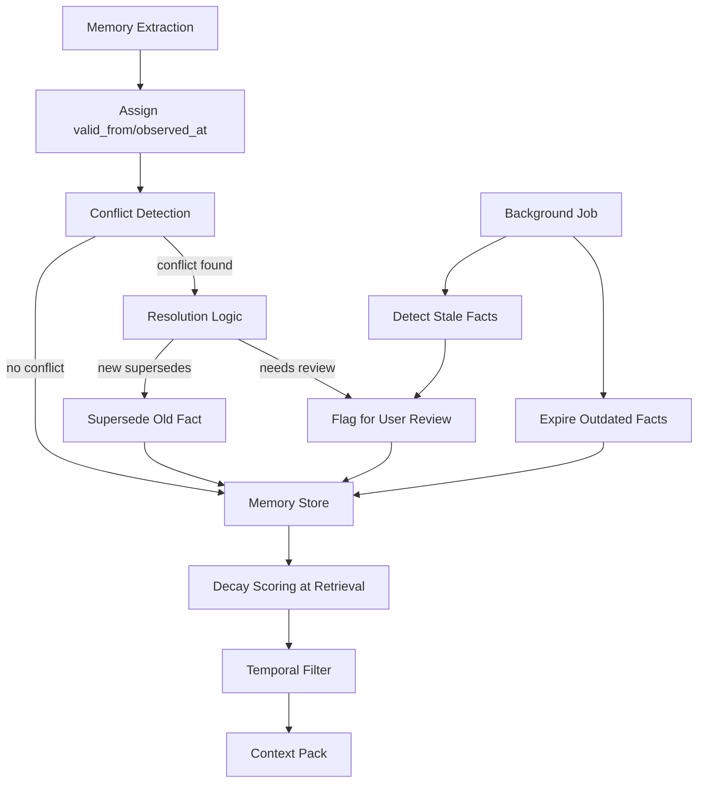

# Temporal Modeling


**Task**: T52 (Temporal Modeling)
**Depends on**: T32 (Vector Embeddings + Semantic Search)

## Overview

Temporal modeling tracks when facts become true, when they expire, and how they evolve. This enables memory to answer questions like "what was true at time T" and prevents stale preferences from polluting context.

## Components

| Component | Purpose |
| --- | --- |
| Temporal Fields | `valid_from`, `valid_to`, `observed_at` timestamps |
| Fact Store | Stores time-bounded memory facts (in Memory Store) |
| Invalidation Engine | Marks facts as superseded or expired |
| Conflict Detector | Detects contradictory facts with overlapping time ranges |
| Decay Scorer | Applies recency/usage decay for retrieval ranking |

## Temporal Decay Formula

Recency boost applied during retrieval to favor recent facts over old ones:

```
recency_boost = 1.0 / (1.0 + days_ago.ln())
```

Where:
- `days_ago` = number of days since `observed_at` (minimum 1.0 to avoid ln(0))
- `ln` = natural logarithm

This produces a gentle decay curve:

| Days Ago | ln(days_ago) | Recency Boost |
|----------|--------------|---------------|
| 1 | 0.0 | 1.000 |
| 2 | 0.693 | 0.591 |
| 7 | 1.946 | 0.339 |
| 30 | 3.401 | 0.227 |
| 90 | 4.500 | 0.182 |
| 365 | 5.900 | 0.145 |

### Combined Retrieval Score

The final retrieval score for a memory fact combines multiple signals:

```
final_score = relevance_score * recency_boost * confidence * status_weight
```

Where:
- `relevance_score` = FTS5/vector/graph score (0.0 to 1.0)
- `recency_boost` = temporal decay as above
- `confidence` = extraction confidence (0.0 to 1.0)
- `status_weight` = 1.0 for active, 0.3 for superseded (kept for history queries), 0.0 for expired/archived

```rust
use serde::{Deserialize, Serialize};
use thiserror::Error;

#[derive(Debug, Clone, Copy, Serialize, Deserialize)]
pub struct TemporalConfig {
    /// Minimum days_ago value (prevents ln(0) and division by zero).
    pub min_days: f64,
    /// Weight multiplier for superseded facts (0.0 to 1.0).
    pub superseded_weight: f64,
    /// Weight multiplier for expired facts.
    pub expired_weight: f64,
    /// Number of days after which facts without valid_to are considered stale.
    pub staleness_threshold_days: u64,
}

impl Default for TemporalConfig {
    fn default() -> Self {
        Self {
            min_days: 1.0,
            superseded_weight: 0.3,
            expired_weight: 0.0,
            staleness_threshold_days: 365,
        }
    }
}

/// Compute the recency boost for a fact.
pub fn recency_boost(days_ago: f64, config: &TemporalConfig) -> f64 {
    let clamped = days_ago.max(config.min_days);
    1.0 / (1.0 + clamped.ln())
}

/// Compute the status weight for a memory.
pub fn status_weight(status: MemoryStatus, config: &TemporalConfig) -> f64 {
    match status {
        MemoryStatus::Active => 1.0,
        MemoryStatus::Superseded => config.superseded_weight,
        MemoryStatus::Expired => config.expired_weight,
        MemoryStatus::Archived => 0.0,
    }
}

/// Compute the combined retrieval score.
pub fn temporal_score(
    relevance: f64,
    days_ago: f64,
    confidence: f64,
    status: MemoryStatus,
    config: &TemporalConfig,
) -> f64 {
    relevance * recency_boost(days_ago, config) * confidence * status_weight(status, config)
}
```

## Conflict Detection

Conflicts occur when the same entity has contradictory facts with overlapping time ranges.

### Detection Algorithm

1. When a new fact is stored for an entity, query all active facts for that entity.
2. For each existing active fact:
   a. Check if the time ranges overlap: `new.valid_from < existing.valid_to AND new.valid_to > existing.valid_from` (treating NULL valid_to as "still active").
   b. Check if the facts are contradictory: same entity + same attribute/topic but different values.
3. If overlap + contradiction detected:
   a. If new fact has higher confidence: supersede the old fact.
   b. If old fact has higher confidence: flag new fact for review.
   c. If confidence is similar (within 0.1): flag both for user resolution.

```rust
#[derive(Debug, Clone, Serialize, Deserialize)]
pub struct TemporalConflict {
    pub entity_id: String,
    pub existing_memory_id: String,
    pub new_memory_id: String,
    pub existing_fact: String,
    pub new_fact: String,
    pub overlap_start: String,   // ISO 8601
    pub overlap_end: Option<String>, // ISO 8601
    pub resolution: ConflictResolution,
}

#[derive(Debug, Clone, Copy, Serialize, Deserialize)]
#[serde(rename_all = "snake_case")]
pub enum ConflictResolution {
    /// New fact supersedes old (higher confidence).
    NewSupersedes,
    /// Old fact retained; new fact flagged for review (lower confidence).
    NewFlaggedForReview,
    /// Both flagged for user resolution (similar confidence).
    BothFlaggedForReview,
    /// User manually resolved.
    UserResolved,
}

#[derive(Debug, Error)]
pub enum TemporalError {
    #[error("invalid time range: valid_from {from} is after valid_to {to}")]
    InvalidRange { from: String, to: String },
    #[error("conflict detected: {0}")]
    ConflictDetected(String),
    #[error("missing timestamp: {field} is required")]
    MissingTimestamp { field: String },
}

#[async_trait::async_trait]
pub trait ConflictDetector: Send + Sync {
    /// Check if a new fact conflicts with existing facts for the same entity.
    async fn detect_conflicts(
        &self,
        entity_id: &str,
        new_fact: &str,
        new_valid_from: &str,
        new_valid_to: Option<&str>,
        new_confidence: f64,
    ) -> Result<Vec<TemporalConflict>, TemporalError>;
}
```

## Invalidation Engine

Facts transition through states based on temporal events:



### Staleness Detection

Facts without a `valid_to` that have not been updated for `staleness_threshold_days` (default: 365 days) are marked as stale. Stale facts are still returned in queries but with reduced weight. A background job periodically scans for stale facts and flags them for user review.

```rust
#[async_trait::async_trait]
pub trait InvalidationEngine: Send + Sync {
    /// Expire all facts whose valid_to has passed.
    async fn expire_outdated(&self) -> Result<usize, TemporalError>;

    /// Find facts that are stale (no valid_to, not updated in staleness_threshold_days).
    async fn find_stale(&self, config: &TemporalConfig) -> Result<Vec<Memory>, TemporalError>;

    /// Supersede a fact with a new one (close old fact's valid_to, link superseded_by).
    async fn supersede(
        &self,
        old_memory_id: &str,
        new_memory: &Memory,
    ) -> Result<(), TemporalError>;
}
```

## Vector Search Integration

Temporal metadata is stored alongside embeddings to enable time-aware vector search:

1. **Metadata fields**: Each chunk embedding's metadata includes `valid_from`, `valid_to`, `observed_at` from the source memory/entity.
2. **Pre-filter**: Before vector similarity search, filter by time range if the query specifies a temporal scope (e.g., "what did I think about X last month?").
3. **Post-score**: After vector similarity, apply `recency_boost` to adjust scores based on freshness.

```rust
#[derive(Debug, Clone, Serialize, Deserialize)]
pub struct TemporalEmbeddingMetadata {
    /// When this fact became valid.
    pub valid_from: String,
    /// When this fact expired (None = still active).
    pub valid_to: Option<String>,
    /// When this fact was observed/extracted.
    pub observed_at: String,
    /// Current memory status.
    pub status: MemoryStatus,
}

/// Temporal filter applied before or after vector search.
#[derive(Debug, Clone, Serialize, Deserialize)]
pub struct TemporalFilter {
    /// Only include facts valid at or after this time.
    pub valid_after: Option<String>,
    /// Only include facts valid at or before this time.
    pub valid_before: Option<String>,
    /// Only include facts observed within the last N days.
    pub observed_within_days: Option<u64>,
    /// Include superseded/expired facts (default: false).
    pub include_inactive: bool,
}

impl Default for TemporalFilter {
    fn default() -> Self {
        Self {
            valid_after: None,
            valid_before: None,
            observed_within_days: None,
            include_inactive: false,
        }
    }
}
```

## Data Flow



## Key Decisions

1. **No hard deletes**: facts are superseded or expired, never erased.
2. **Explicit time bounds**: every fact has `valid_from`; `valid_to` is optional.
3. **Conflict keeps history**: contradictions create a new fact and close the old one.
4. **Decay is multiplicative**: recency * confidence * status determine retrieval weight.
5. **User override wins**: manual edits can pin or revoke facts.
6. **Logarithmic decay**: `1/(1+ln(days))` provides gentle decay that still values old facts.
7. **Staleness detection**: facts without valid_to are reviewed after 365 days.
8. **Temporal vector metadata**: time dimensions added to embedding metadata for time-aware search.

## Test Strategy

| Test | Type | Description |
|------|------|-------------|
| Recency boost calculation | Unit | Verify decay values at 1, 7, 30, 365 days |
| Combined score | Unit | relevance * recency * confidence * status_weight |
| Conflict detection (overlap) | Unit | Two overlapping facts for same entity detected |
| Conflict detection (no overlap) | Unit | Non-overlapping facts pass without conflict |
| Conflict resolution (higher confidence) | Unit | Higher-confidence fact supersedes lower |
| Conflict resolution (similar confidence) | Unit | Both flagged for review |
| Expire outdated | Unit | Facts past valid_to marked as expired |
| Staleness detection | Unit | Facts older than threshold flagged |
| Temporal filter | Unit | Pre-filter excludes facts outside time range |
| Status weight | Unit | Active=1.0, superseded=0.3, expired=0.0 |
| Vector metadata round-trip | Integration | Store temporal metadata with embedding, retrieve with filter |

## Error Handling

| Error | Handling |
| --- | --- |
| Missing timestamps | Treat as low-confidence, include only on explicit request |
| Conflicting facts | Keep both, prefer latest unless user pins older |
| Clock skew | Normalize to server time, record source timestamp |
| Invalid ranges | Reject update with `TemporalError::InvalidRange` |
| Staleness overflow | Cap at staleness_threshold_days; do not delete |

## Related Docs

- `docs/design/vault-as-truth.md`
- `docs/design/context-graphs.md`
- `docs/design/vector-search.md`
- `docs/architecture/context-delivery.md`
