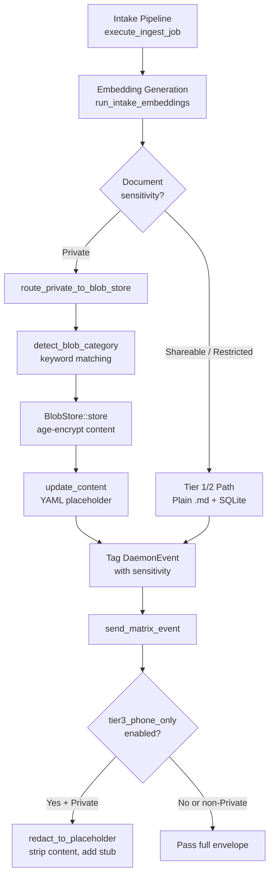
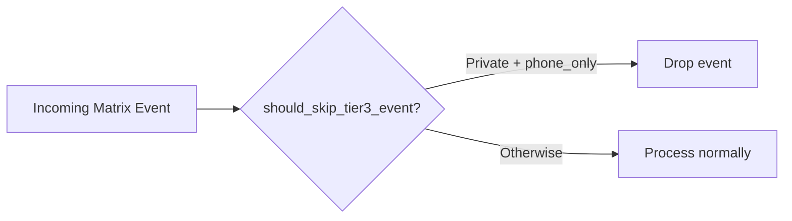
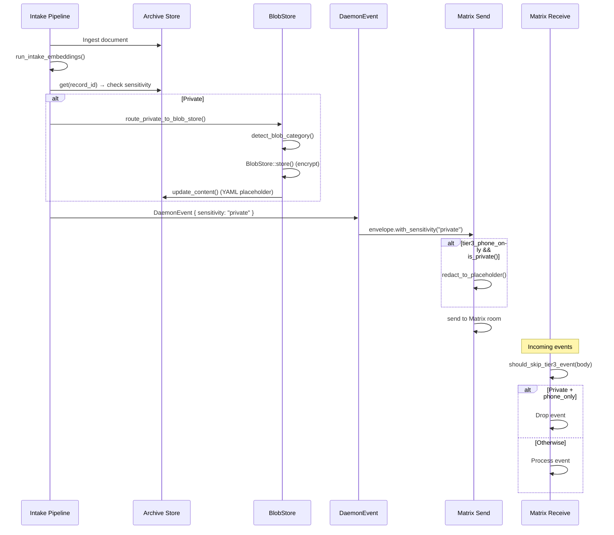

# Tiered Data Protection

## Overview

Symbiotic uses a three-tier data protection model that maps the existing `Sensitivity` enum (`Shareable`, `Restricted`, `Private`) to progressively stronger storage and routing controls. Tier 1 and Tier 2 data are stored as plain Markdown files protected by LUKS full-disk encryption on the VPS. Tier 3 (Private) data is individually encrypted using the [age](https://age-encryption.org/) format (X25519 + ChaCha20-Poly1305) and stored in a dedicated blob store, with plaintext archive entries replaced by metadata-only YAML placeholders. A phone-only mode (enabled by default) prevents Tier 3 content from being synced to the VPS via Matrix, redacting outbound events to stubs and filtering inbound Private events.

## Components

- **`symbiotic-vault-store` crate** (`submodules/runtime/crates/symbiotic-vault-store/`) -- Age-encrypted blob store for Tier 3 data. Provides `BlobStore`, `BlobCategory`, `BlobMetadata`, `EncryptedBlob`, and `VaultStoreError` types. Re-exports `age::x25519::{Identity, Recipient}` and `age::secrecy::ExposeSecret` via a `keys` module.
- **Daemon sensitivity routing** (`submodules/runtime/services/symbiotic-daemon/src/lib.rs`) -- `init_blob_store()`, `detect_blob_category()`, and `route_private_to_blob_store()` functions that wire Tier 3 encryption into the intake pipeline.
- **Archive placeholder system** (`symbiotic-archive::FileArchiveStore::update_content()`) -- Replaces plaintext archive entries with metadata-only YAML stubs after content is encrypted, preserving searchability without exposing content.
- **Category detection** (`detect_blob_category()`) -- Keyword-based content classification into Medical, Financial, Legal, Credential, or Custom categories.
- **Phone-only mode** (`symbiotic-daemon` commands + `symbiotic-matrix` events) -- Send-path redaction (`redact_to_placeholder()`) and receive-path filtering (`should_skip_tier3_event()`) for Tier 3 content on the Matrix transport.

## Data Flow



### Receive Path



## Storage Layout

### Tier 1 -- Shareable (Standard Protection)

- **What**: Public knowledge, tech notes, bookmarks, open research.
- **Storage**: Plain `.md` files in the archive store + SQLite FTS5 indexes.
- **Protection**: LUKS full-disk encryption on the VPS provides at-rest coverage.
- **Location**: VPS + phone (synced via E2EE Matrix rooms).

### Tier 2 -- Restricted (Elevated Protection)

- **What**: Personal reflections, goals, relationship notes, work context.
- **Storage**: Plain `.md` files + SQLite indexes (same format as Tier 1).
- **Protection**: LUKS full-disk encryption + filesystem permissions (0600). Content is redacted before sending to cloud LLM models (handled by the redaction policy engine, T82). Provider routing restricts Restricted content to Local or SelfHosted providers (T101).
- **Location**: VPS + phone.

### Tier 3 -- Private (Vault-Grade Protection)

- **What**: Medical records, financial data, legal documents, credentials.
- **Storage**: Age-encrypted `.age` blobs in the vault-store, with a metadata-only YAML placeholder in the archive.
- **Protection**: Per-item age encryption (X25519 + ChaCha20-Poly1305). Decrypted content is held only in memory, never written to disk. Never sent to cloud models.
- **Location**: Phone-only by default (`tier3_phone_only: true`). VPS receives metadata-only placeholder stubs via Matrix.

### On-Disk Layout

```
data/
├── blob-store/                    # Tier 3 encrypted blobs (configurable root)
│   ├── index.json                 # Unencrypted metadata index (BlobMetadata[])
│   ├── {record-id}.age            # age-encrypted content files
│   └── ...
├── archive/                       # Tier 1 + 2 plain .md files
│   ├── records/                   # Document content files
│   │   ├── {record-id}.md         # Tier 1/2: full content
│   │   └── {record-id}.md         # Tier 3: YAML placeholder only
│   └── state.json                 # Archive index
└── ...
```

### Tier 3 Placeholder Format

When Private content is routed to the blob store, the archive `.md` file is replaced with:

```yaml
---
blob_id: {record_id}
status: encrypted
category: {category}
title: {title}
---

> This entry is Tier 3 (Private). Content is stored in the age-encrypted blob store.
```

The archive entry's title is prefixed with `[encrypted]` and the tag `tier3/encrypted` is added.

## Key Types

### `BlobStore` (`symbiotic-vault-store::store`)

```rust
pub struct BlobStore {
    root: PathBuf,
}

impl BlobStore {
    pub fn new(root: PathBuf) -> Result<Self, VaultStoreError>;
    pub fn store(&self, id: &str, category: BlobCategory, metadata: BlobMetadata,
                 content: &[u8], recipient: &Recipient) -> Result<EncryptedBlob, VaultStoreError>;
    pub fn read(&self, id: &str, identity: &Identity) -> Result<Vec<u8>, VaultStoreError>;
    pub fn list(&self, category: Option<&BlobCategory>) -> Result<Vec<EncryptedBlob>, VaultStoreError>;
    pub fn delete(&self, id: &str) -> Result<(), VaultStoreError>;
    pub fn rotate_key(&self, old_identity: &Identity, new_recipient: &Recipient) -> Result<u32, VaultStoreError>;
    pub fn root(&self) -> &Path;
}
```

Note: `BlobStore` does not hold keys itself. Callers provide a `Recipient` (public key) for encryption and an `Identity` (secret key) for decryption. The daemon holds the `Recipient` at startup and passes it into `store()`.

### `BlobCategory` (`symbiotic-vault-store::types`)

```rust
#[derive(Debug, Clone, PartialEq, Eq, Hash, Serialize, Deserialize)]
#[serde(rename_all = "lowercase")]
pub enum BlobCategory {
    Medical,
    Financial,
    Legal,
    Credential,
    Custom(String),
}
```

Display format: `medical`, `financial`, `legal`, `credential`, `custom:{value}`.

### `BlobMetadata` (`symbiotic-vault-store::types`)

```rust
#[derive(Debug, Clone, PartialEq, Eq, Serialize, Deserialize)]
pub struct BlobMetadata {
    pub title: String,
    pub tags: Vec<String>,
    pub size_bytes: u64,
    pub content_type: String,
}
```

### `EncryptedBlob` (`symbiotic-vault-store::types`)

```rust
#[derive(Debug, Clone, PartialEq, Eq, Serialize, Deserialize)]
pub struct EncryptedBlob {
    pub id: String,
    pub category: BlobCategory,
    pub created_at: u64,
    pub metadata: BlobMetadata,
}
```

### `VaultStoreError` (`symbiotic-vault-store::error`)

```rust
#[derive(Debug, Error)]
pub enum VaultStoreError {
    #[error("I/O error: {0}")]           Io(#[from] std::io::Error),
    #[error("JSON error: {0}")]          Json(#[from] serde_json::Error),
    #[error("encryption error: {0}")]    Encrypt(String),
    #[error("decryption error: {0}")]    Decrypt(String),
    #[error("blob not found: {0}")]      NotFound(String),
    #[error("blob file missing on disk: {0}")] FileMissing(String),
    #[error("no recipients provided for encryption")] NoRecipients,
}
```

### Matrix Envelope Sensitivity Methods (`symbiotic-matrix::events`)

```rust
impl MatrixEventEnvelope {
    pub fn with_sensitivity(self, sensitivity: &str) -> Self;
    pub fn sensitivity(&self) -> Option<&str>;
    pub fn is_private(&self) -> bool;
    pub fn redact_to_placeholder(mut self) -> Self;
}
```

## Key Decisions

1. **LUKS for Tier 1+2 (not per-file encryption)**: Full-disk encryption is transparent to the application, covers all files (`.md`, SQLite, config, logs), and has zero application-level overhead. Per-file encryption adds complexity without proportional benefit when the threat model is at-rest disk access.

2. **age encryption for Tier 3 (not GPG/PGP)**: age has a simpler, more auditable design with a pure Rust implementation. Uses X25519 key agreement + ChaCha20-Poly1305 authenticated encryption. No keyring complexity, no legacy algorithm baggage.

3. **Keyword-based category detection (no LLM dependency)**: `detect_blob_category()` uses simple keyword matching (e.g., "diagnosis", "tax return", "contract", "password") against lowercase content. This is deliberately not LLM-powered because security-critical classification must be deterministic, fast, and free of prompt-injection risk. Falls back to `Custom("general")` when no specific category matches.

4. **Metadata-only placeholders in the archive**: After encrypting Tier 3 content, the archive `.md` file is overwritten with a YAML stub containing `blob_id`, `status`, `category`, and `title`. This preserves the archive index's ability to list and search entries without requiring decryption.

5. **Graceful degradation**: Missing key file or invalid identity does not crash the daemon. `init_blob_store()` returns `(None, None)` and logs a warning; all Tier 3 routing is skipped. This ensures the daemon remains functional even without blob store configuration.

6. **Phone-only default for Tier 3**: `tier3_phone_only` defaults to `true`. Private content stays on the device. The daemon redacts outbound Private envelopes to `"[Private content -- phone only]"` stubs and filters inbound Private events via `should_skip_tier3_event()`. This provides defense-in-depth: even if the VPS is compromised, Tier 3 data is not present.

7. **Atomic writes for blob store**: Both `.age` files and `index.json` are written via a write-to-temp-then-rename pattern (`atomic_write()`), preventing partially-written files from corrupting the store on power loss or crash.

8. **Upsert semantics for BlobStore::store()**: Storing a blob with an existing ID replaces the previous entry in both the index and the `.age` file, enabling content updates without requiring explicit delete-then-store.

## Error Handling

### Blob Store Initialization (`init_blob_store()`)

Best-effort initialization. Returns `(None, None)` on any failure:

| Condition | Behavior |
|-----------|----------|
| No `blob_store_key_file` configured | Log info, return `(None, None)` |
| Key file unreadable | Log warning with path and error, return `(None, None)` |
| Key file contains invalid age identity | Log warning, return `(None, None)` |
| Store directory creation fails | Log warning, return `(None, None)` |

### Tier 3 Routing (`route_private_to_blob_store()`)

Best-effort routing. Errors are logged but never fail the intake pipeline:

| Condition | Behavior |
|-----------|----------|
| Blob store not configured (`None`) | Return immediately (no-op) |
| No encryption recipient (`None`) | Return immediately (no-op) |
| Archive document not found | Log warning, return |
| Document sensitivity is not Private | Return immediately (no-op) |
| `BlobStore::store()` fails | Log warning ("content remains in archive"), return |
| Archive placeholder update fails | Log warning ("plaintext remains"), return |
| Archive record not found for placeholder | Log warning, return |

### BlobStore Operations

| Error | When | Retryable |
|-------|------|-----------|
| `Io` | File read/write/mkdir failures | Maybe (transient FS issues) |
| `Json` | Corrupt `index.json` | No (manual fix required) |
| `Encrypt` | age encryption failure | No |
| `Decrypt` | Wrong key or corrupted `.age` file | No |
| `NotFound` | Blob ID not in index | No |
| `FileMissing` | ID in index but `.age` file deleted | No (re-ingest from source) |
| `NoRecipients` | No public key provided | No (configuration error) |

### Key Rotation

`rotate_key()` processes blobs one at a time. If interrupted mid-rotation, some blobs will be encrypted with the old key and some with the new key. Callers must retain both keys until rotation completes successfully.

## Configuration

### Daemon Config Fields

```rust
pub struct DaemonConfig {
    /// Root directory for the age-encrypted blob store (Tier 3 / Private data).
    /// Defaults to `data/blob-store`.
    pub blob_store_root: PathBuf,

    /// Path to the age identity (secret key) file used for blob store
    /// encryption/decryption. When set, Private content is routed to the
    /// encrypted blob store. When `None`, Tier 3 encryption is disabled.
    pub blob_store_key_file: Option<PathBuf>,

    /// When `true` (default), Tier 3 / Private content stays on the phone
    /// and is NOT synced to the VPS via Matrix. The daemon replaces private
    /// event content with a metadata-only placeholder before sending, and
    /// filters out incoming events tagged as `private` sensitivity.
    pub tier3_phone_only: bool,
}
```

### Age Identity Key Generation

The blob store expects an age X25519 identity key file at `blob_store_key_file`. Generate one with:

```bash
age-keygen -o data/blob-store.key
```

The file contains a line like `AGE-SECRET-KEY-1...` which is parsed by `age::x25519::Identity::from_str()`. The corresponding public key (recipient) is derived at startup via `identity.to_public()`.

### Sensitivity Flow Through the Pipeline


