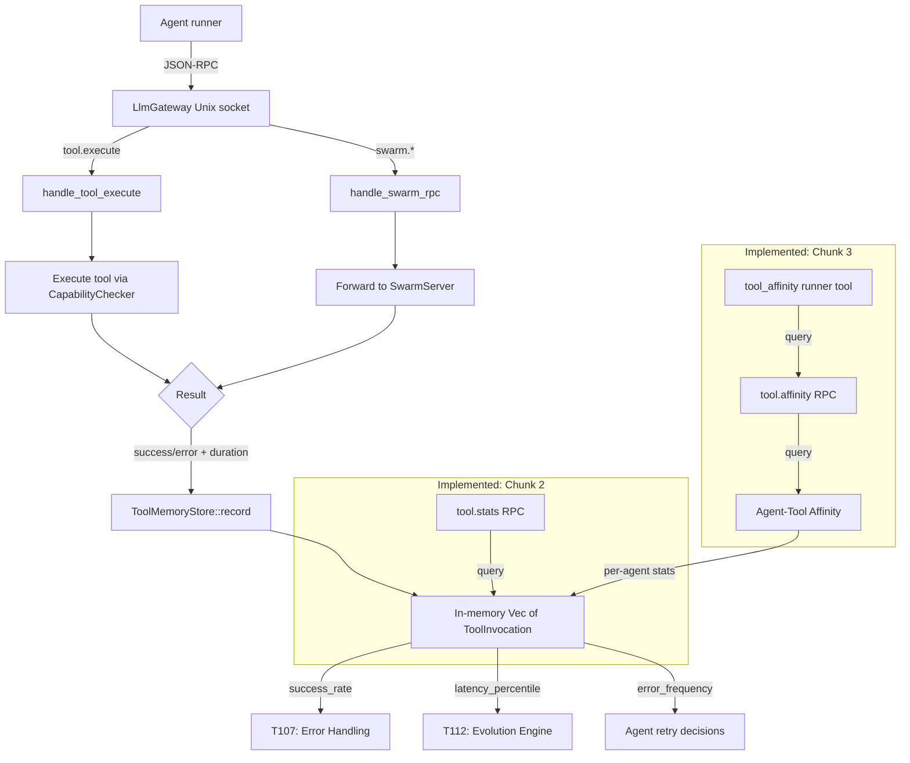

# Tool Memory — Per-Tool Success/Failure Tracking

**Task**: T122 | **Priority**: P1 | **Status**: Complete — Chunks 1–3 all shipped

## Overview

Tool Memory records every tool invocation made by agents so that the system can measure tool reliability over time. Each call through the JSON-RPC bridge (both direct tool executions and swarm RPCs) is logged with outcome, latency, and an input hash. This data feeds T107 (error handling) for flaky-tool detection and T112 (evolution engine) for fitness evaluation — without tool memory, evolution is blind to whether a change improved or degraded tool usage.

## Components

| Module | Path | Status |
|--------|------|--------|
| `ToolInvocation` struct | `crates/symbiotic-memory/src/tool_memory.rs` | Implemented |
| `ToolMemoryStore` | `crates/symbiotic-memory/src/tool_memory.rs` | Implemented |
| `sha256_hex()` utility | `crates/symbiotic-memory/src/tool_memory.rs` | Implemented |
| Gateway wiring (tool execute) | `services/symbiotic-daemon/src/llm_gateway.rs` — `handle_tool_execute()` | Implemented |
| Gateway wiring (swarm RPC) | `services/symbiotic-daemon/src/llm_gateway.rs` — `handle_swarm_rpc()` | Implemented |
| `tool.stats` RPC endpoint | `services/symbiotic-daemon/src/llm_gateway.rs` | Implemented |
| `tool_stats` runner tool | `crates/symbiotic-agent-runner/src/tools/metrics.rs` | Implemented |
| Agent-tool affinity tracker | `crates/symbiotic-memory/src/tool_memory.rs` | Implemented (Chunk 3) |
| `tool.affinity` RPC endpoint | `services/symbiotic-daemon/src/llm_gateway.rs` | Implemented (Chunk 3) |
| `tool_affinity` runner tool | `crates/symbiotic-agent-runner/src/tools/metrics.rs` | Implemented (Chunk 3) |

All paths are relative to `submodules/runtime/`.

## Data Flow

## Implementation Status

### Chunk 1: Tool Invocation Log — Implemented

**Core struct** — `ToolInvocation` (Serialize, Deserialize, Clone, Debug):

| Field | Type | Description |
|-------|------|-------------|
| `tool_name` | `String` | Tool identifier (or `rpc:{method}` for swarm RPCs) |
| `agent_id` | `String` | Agent that triggered the call |
| `timestamp` | `u64` | Unix epoch seconds at invocation start |
| `duration_ms` | `u64` | Wall-clock duration via `Instant::now()` elapsed |
| `success` | `bool` | Whether the call returned Ok |
| `error` | `Option<String>` | Error message on failure (from `anyhow::Error::to_string()`) |
| `input_hash` | `String` | SHA-256 hex digest of serialized input parameters |
| `output_size` | `usize` | Byte size of successful output |

**Store** — `ToolMemoryStore`:

| Method | Signature | Description |
|--------|-----------|-------------|
| `new()` | `-> Self` | Empty store |
| `record()` | `(&mut self, invocation: ToolInvocation)` | Append to in-memory Vec |
| `invocations()` | `(&self) -> &[ToolInvocation]` | All recorded invocations |
| `success_rate()` | `(&self, tool_name: &str) -> Option<f64>` | Successes / total for a tool |
| `latency_percentile()` | `(&self, tool_name: &str, percentile: f64) -> Option<u64>` | Latency at given percentile (0.0-100.0) |
| `error_frequency()` | `(&self, tool_name: &str) -> Vec<(String, usize)>` | Error messages grouped by count, descending |

**Utility** — `sha256_hex(text: &str) -> String`: deterministic SHA-256 hex digest for input dedup.

**Gateway wiring** (in `llm_gateway.rs`):
- `handle_tool_execute()`: hashes input params before execution, measures `Instant` elapsed, records `ToolInvocation` with tool name and agent ID after result
- `handle_swarm_rpc()`: same pattern, but tool name is `format!("rpc:{}", method)` and agent ID is extracted from RPC params (defaults to `"swarm-agent"`)
- Store is `Arc<Mutex<ToolMemoryStore>>` on `GatewayState`, shared across all connections

**Tests** (7 total in `tool_memory.rs`):
- `test_record_invocation` — basic record and read-back
- `test_success_rate_calculation` — 3 success + 1 failure = 0.75
- `test_latency_percentile_p50` — median, p0, p100 on 5-element set
- `test_error_frequency_grouping` — groups and sorts by count descending
- `test_empty_store_returns_none` — None/empty for unknown tools
- `test_multiple_tools_tracked_independently` — cross-tool isolation
- `test_sha256_hex_deterministic` — same input = same hash, different input = different hash

### Chunk 2: Tool Reliability Scoring — Implemented

- `ToolMemoryStore::stats(tool_name, window_size)` now computes rolling reliability windows over the latest retained invocations for a tool
- `tool.stats` is exposed as a first-class bridge RPC in `llm_gateway.rs`
- `tool_stats` is exposed as a dedicated runner tool so agents can consume the metrics without hidden bridge calls
- Response schema is `{ tool_name, window_size, total_invocations, success_rate, p50_latency_ms, p99_latency_ms, last_failure }`
- The stats surface reads from the same SQLite-backed retained store opened at daemon startup

### Chunk 3: Agent-Tool Affinity — Implemented

- Each durable `ToolInvocation` now carries:
  - `agent_fingerprint`: stable SHA-256 fingerprint of the recorded agent id
  - `chain_hash`: per-agent hash-chain head after that invocation
- The store backfills those provenance fields for older durable rows when it opens an existing SQLite database.
- `ToolMemoryStore::affinity_for_agent(agent_id, window_size)` now ranks tools by recent effectiveness for a given agent.
- The daemon exposes that data as `tool.affinity`.
- The runner exposes the same surface as the dedicated `tool_affinity` tool.
- This gives T112 a cleaner fitness signal: not just “is tool X healthy?” but “which tools does this agent actually use well?”

## Key Decisions

| # | Decision | Rationale |
|---|----------|-----------|
| 1 | In-memory `Vec<ToolInvocation>` first | Iterate on schema before committing to SQLite. Single-session tracking is sufficient for Chunk 1. |
| 2 | SHA-256 input hashing via `sha256_hex()` | Enables duplicate-input detection and pattern analysis without storing full tool payloads (which may contain secrets or large content). |
| 3 | Swarm RPCs logged as `rpc:{method}` | Unified naming convention — tool calls use bare names, RPC calls get the `rpc:` prefix. Both flow through the same `ToolMemoryStore`. |
| 4 | Non-blocking recording | `if let Ok(mut store) = state.tool_memory.lock()` — lock failures are silently dropped. Tool execution reliability is the priority; observability is secondary. |
| 5 | `Arc<Mutex<ToolMemoryStore>>` on `GatewayState` | Shared across all concurrent connections on the Unix socket. Mutex contention is negligible — recording is a single `Vec::push`. |
| 6 | Per-agent provenance stored on each invocation | Affinity and future evolution analysis need a durable, tamper-evident trail. Per-agent hash chains provide that without waiting for a broader agent-identity redesign. |

## Error Handling

- **Recording failures**: silently dropped via `if let Ok(guard) = lock()` pattern. A poisoned mutex (from a panic in another thread) does not propagate to tool execution.
- **Tool execution errors**: recorded in the invocation log with `success: false` and `error: Some(e.to_string())`. The error still propagates to the calling agent via the JSON-RPC response.
- **Empty queries**: `success_rate()` and `latency_percentile()` return `None` for unknown tools. `error_frequency()` returns an empty `Vec`. Callers must handle the `None` case.

## Integration Points

| Task | Relationship |
|------|-------------|
| T107 (Resilient Error Handling) | Identifies flaky tools via `success_rate()` and `error_frequency()` — enables targeted retry strategies and circuit-breaker patterns |
| T112 (Evolution Engine) | Tool reliability scores are the fitness function for evolution proposals — "did this prompt change improve tool success rates?" |
| T120 (LLM Audit Trail) | Complementary instrumentation — T120 tracks LLM calls (prompts, tokens, latency), T122 tracks tool calls (success, errors, duration). Together they provide full agent observability. |
| T121 (Mycelium Memory) | FSRS temporal decay could apply to tool reliability windows — recent invocations weighted more heavily than stale data |
