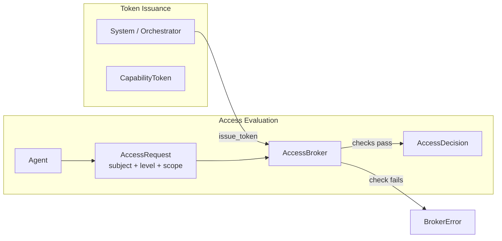

# Trust & Capabilities Architecture

## Overview

The Trust & Capabilities system implements security through explicit capability grants and tiered trust levels. Every agent action requires a capability token, and trust levels determine what capabilities an agent can receive. This provides defense in depth: even if an agent is compromised, it can only act within its granted capabilities.

**Crate:** `submodules/runtime/crates/symbiotic-trust`
**Policy:** `policies/trust-policy.json`

**Core Principles:**
- No ambient authority (agents can't "just do things")
- Capability tokens are explicit, revocable, scoped
- Trust is earned, not assumed
- Cloud LLMs are never fully trusted
- Every action is audited

Planned work: see `docs/design/trust-capabilities.md`

## Trust Levels

### Naming Convention

The codebase uses two naming sets for trust levels:

| Context | Enum Name | Levels | Where Used |
|---------|-----------|--------|------------|
| **Implemented (MVP)** | `AgentTrustLevel` | `ReadOnly` / `ArchiveWrite` / `CredentialAccess` / `ExternalAct` (4 levels) | `symbiotic-trust/src/lib.rs`, `policies/trust-policy.json`, all runtime code |
| **Planned (post-MVP)** | `TrustLevel` | `Untrusted` / `Basic` / `Standard` / `Trusted` / `FullyTrusted` (5 levels) | `docs/design/trust-capabilities.md` |

The `parse_trust_level()` function in `symbiotic-skills` bridges both sets for skill manifests: `Basic`/`Standard` map to `ArchiveWrite`, `Trusted` maps to `CredentialAccess`, `FullyTrusted` maps to `ExternalAct`.

All architecture docs and runtime code use the **implemented** `AgentTrustLevel` names. Design docs use the **planned** names to describe the extended hierarchy.

### Current Hierarchy

The runtime uses a four-level hierarchy, matching `policies/trust-policy.json` and the `AgentTrustLevel` enum in `submodules/runtime/crates/symbiotic-trust/src/lib.rs`:

| Level | Value | Description |
|-------|-------|-------------|
| `ReadOnly` | 0 | Read archive data only |
| `ArchiveWrite` | 1 | Read + write archive entries |
| `CredentialAccess` | 2 | Access stored credentials |
| `ExternalAct` | 3 | Perform external actions (browser login, API calls) |

Levels are ordered: a token at level N satisfies any request requiring level <= N.

```rust
#[derive(Debug, Clone, Copy, PartialEq, Eq, PartialOrd, Ord, Serialize, Deserialize)]
pub enum AgentTrustLevel {
    ReadOnly = 0,
    ArchiveWrite = 1,
    CredentialAccess = 2,
    ExternalAct = 3,
}
```

## Components

| Component | Status | Purpose |
|-----------|--------|---------|
| **AccessBroker** | Implemented | Issues tokens, evaluates access requests |
| **CapabilityToken** | Implemented | Proof of permission with subject, scopes, expiry |
| **AccessRequest / AccessDecision** | Implemented | Request/response types for access evaluation |
| **BrokerError** | Implemented | Typed errors for all denial reasons |
| **trust-policy.json** | Implemented | Declarative scope-to-level mapping |

## Capability Token Structure

```rust
pub struct CapabilityToken {
    pub token_id: String,
    pub subject: String,           // who holds this token
    pub trust_level: AgentTrustLevel,   // max level this token grants
    pub scopes: HashSet<String>,   // permitted action scopes
    pub expires_at: u64,           // unix timestamp
    pub one_time: bool,            // single-use flag
    pub consumed: bool,            // already used (for one-time tokens)
}
```

Key properties:
- **Subject-bound:** token can only be used by the named subject
- **Scoped:** token lists explicit scope strings (e.g. `archive.write`, `action.browser.login`)
- **Time-limited:** every token has an expiry timestamp
- **One-time option:** tokens can be marked single-use; consumed on first evaluation

## AccessBroker

The `AccessBroker` is the central authority. It holds all active tokens and evaluates access requests.

### Token Issuance

```rust
impl AccessBroker {
    pub fn new() -> Self;
    pub fn issue_token(&mut self, token: CapabilityToken);
    pub fn from_tokens(tokens: Vec<CapabilityToken>) -> Self;
    pub fn tokens(&self) -> Vec<CapabilityToken>;
}
```

### Access Evaluation

```rust
pub fn evaluate(
    &mut self,
    token_id: &str,
    request: &AccessRequest,
    now: u64,
) -> Result<AccessDecision>
```

Evaluation checks, in order:
1. **Token exists** -- `TokenNotFound` if missing
2. **Subject match** -- `SubjectMismatch` if token subject != request subject
3. **Not expired** -- `TokenExpired` if `expires_at <= now`
4. **Not consumed** -- `TokenConsumed` if one-time and already used
5. **Trust level sufficient** -- `InsufficientTrust` if token level < required level
6. **Scope contained** -- `ScopeDenied` if requested scope not in token's scope set

On success, one-time tokens are marked consumed.

## Data Flow



## Policy Configuration

The file `policies/trust-policy.json` maps scopes to minimum trust levels:

```json
{
  "version": "1.0",
  "default_action": "deny",
  "levels": {
    "read_only": 0,
    "archive_write": 1,
    "credential_access": 2,
    "external_act": 3
  },
  "rules": [
    { "scope": "archive.read",          "min_level": "read_only" },
    { "scope": "archive.write",         "min_level": "archive_write" },
    { "scope": "credential.read",       "min_level": "credential_access" },
    { "scope": "action.browser.login",  "min_level": "external_act" }
  ]
}
```

The `default_action: "deny"` means any scope not listed is rejected.

## Error Handling

All denial paths return typed `BrokerError` variants:

| Error | Meaning |
|-------|---------|
| `TokenNotFound(id)` | No token with that ID in the broker |
| `SubjectMismatch(id)` | Token belongs to a different subject |
| `TokenExpired(id)` | Token's `expires_at` is in the past |
| `TokenConsumed(id)` | One-time token already used |
| `InsufficientTrust` | Token's trust level < required level |
| `ScopeDenied(scope)` | Requested scope not in token's scope set |

## Key Decisions

### 1. Four-Level Trust Hierarchy

**Decision:** Use 4 concrete levels (ReadOnly, ArchiveWrite, CredentialAccess, ExternalAct) rather than a larger abstract hierarchy.

**Rationale:**
- Maps directly to the MVP's actual resource boundaries
- Each level corresponds to a distinct risk category
- Simple ordered comparison (`PartialOrd`) for level checks
- Extensible later without breaking existing tokens

### 2. Capability Tokens Over ACLs

**Decision:** Every action requires presenting a capability token rather than checking an access control list.

**Rationale:**
- No ambient authority -- agents hold explicit proof of permission
- Tokens are revocable, time-limited, and scope-bound
- Supports one-time tokens for sensitive operations
- Clear grant/revoke model

### 3. Subject-Bound Tokens

**Decision:** Tokens are bound to a specific subject string and cannot be transferred.

**Rationale:**
- Prevents token theft between agents
- Evaluation always verifies subject match
- Combined with expiry, limits blast radius of any compromise

### 4. Scope as String Set

**Decision:** Scopes are plain strings in a `HashSet`, checked by containment.

**Rationale:**
- Simple and extensible -- new scopes added without code changes
- Policy file defines which scopes require which levels
- Case-sensitive matching avoids ambiguity

## Related Components

| Component | Relationship |
|-----------|--------------|
| [Agent Orchestration](./agent-orchestration.md) | Issues tokens to agents before task execution |
| [Credential Sandbox](./credential-sandbox.md) | Protected by `CredentialAccess` level |
| [Matrix Channels](./matrix-channels.md) | Future consent delivery channel |
