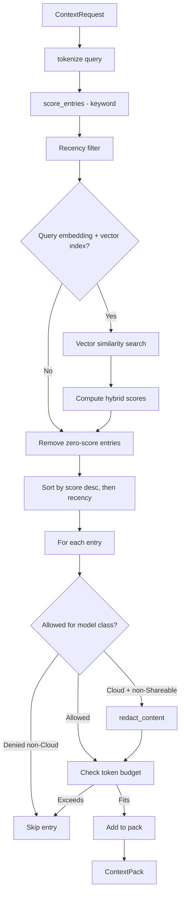

# Vector Search & Retrieval

## Overview

The retrieval system provides keyword-based and hybrid (keyword + vector) search over archive entries via the Recall Gateway. It scores entries against query terms with weighted matching across titles, content, and tags, optionally combines with cosine similarity from vector embeddings, then assembles token-bounded context packs with sensitivity enforcement and redaction.

**Current implementation**:
- `submodules/runtime/crates/symbiotic-context/src/lib.rs` (RecallGateway, scoring, hybrid search)
- `submodules/runtime/crates/symbiotic-context/src/embedding.rs` (EmbeddingService via Ollama)
- `submodules/runtime/crates/symbiotic-context/src/vector_index.rs` (brute-force vector index)

**Planned work**: see `docs/design/vector-search.md` for reranker, hierarchical retrieval, and sensitivity-partitioned indexes.

## Components

| Component | Location | Purpose |
|-----------|----------|---------|
| `RecallGateway` | `symbiotic-context/src/lib.rs` | Main Recall Gateway; orchestrates search, scoring, policy, and redaction |
| `EmbeddingService` | `symbiotic-context/src/embedding.rs` | Generates text embeddings via Ollama HTTP API |
| `VectorIndex` | `symbiotic-context/src/vector_index.rs` | Brute-force cosine similarity search with JSON persistence |
| `score_entries()` | `symbiotic-context/src/lib.rs` | Scores entries against query terms with weighted matching |
| `hybrid_score()` | `symbiotic-context/src/lib.rs` | Combines normalized keyword and vector scores |
| `cosine_similarity()` | `symbiotic-context/src/vector_index.rs` | Computes cosine similarity between two vectors |
| `tokenize()` | `symbiotic-context/src/lib.rs` | Whitespace split, lowercase, alphanumeric normalization |
| `estimate_tokens()` | `symbiotic-context/src/lib.rs` | Word-count-based token estimation |
| `get_context()` | `symbiotic-context/src/lib.rs` | Keyword-only retrieval pipeline |
| `get_context_hybrid()` | `symbiotic-context/src/lib.rs` | Hybrid retrieval pipeline with optional vector scoring |

## Embedding Service

The `EmbeddingService` generates vector embeddings via the Ollama HTTP API:

| Setting | Default |
|---------|---------|
| Endpoint | `http://localhost:11434/api/embeddings` |
| Model | `nomic-embed-text` |

**Graceful fallback**: When Ollama is unavailable, `try_embed()` returns `None` and the system falls back to keyword-only search. No embedding failures block retrieval.

## Vector Index

The `VectorIndex` stores embeddings alongside entry metadata:

| Field | Type | Purpose |
|-------|------|---------|
| `entry_id` | `String` | Links to archive entry |
| `embedding` | `Vec<f32>` | Embedding vector |
| `sensitivity` | `Sensitivity` | Controls access filtering |

- **Storage**: JSON file at `{data_dir}/vector_index.json`
- **Search**: Brute-force cosine similarity (sufficient for < 10K entries)
- **Upsert**: Insert or replace embeddings by entry_id
- **Sensitivity filtering**: Only entries with `sensitivity <= max_sensitivity` are returned

## Keyword Scoring

The `score_entries()` function computes relevance scores per entry:

| Match Location | Weight | Description |
|----------------|--------|-------------|
| Title | +3.0 | Query term found in entry title (case-insensitive) |
| Content | +1.0 | Query term found in entry content (case-insensitive) |
| Tag | +2.0 | Query term found in any entry tag (case-insensitive) |
| Requested tag | +2.0 | Entry has a tag matching a requested tag (exact, case-insensitive) |

Scores are additive across all query terms. Entries with score 0 are excluded unless the query is empty (in which case all entries are candidates).

## Hybrid Scoring

When a query embedding is provided and a vector index is configured, hybrid scoring is used:

```
hybrid_score = 0.4 * keyword_normalized + 0.6 * cosine_similarity
```

- `keyword_normalized`: keyword score divided by max keyword score across all entries (range [0, 1])
- `cosine_similarity`: cosine similarity between query embedding and entry embedding (range [-1, 1])
- If all keyword scores are 0, `keyword_normalized` is 0 for all entries

The `retrieval_mode` in the `ContextPack` is set to `"hybrid"` when vector scoring is active, or `"keyword"` for keyword-only.

## Retrieval Pipeline



## Token Budget

The `estimate_tokens()` function uses word count (whitespace-split) as a rough token estimate. Each entry's budget cost is `estimate_tokens(title) + estimate_tokens(content)`. Entries that would exceed the remaining budget are skipped.

## Key Decisions

1. **Hybrid retrieval**: combines keyword and vector search with configurable weights (0.4/0.6).
2. **Brute-force vector search**: simple and sufficient for < 10K entries; avoids external vector DB dependency.
3. **JSON persistence**: vector index stored as JSON file; easy to inspect and debug.
4. **Graceful Ollama fallback**: embedding failures never block retrieval; system degrades to keyword-only.
5. **Weighted keyword scoring**: title matches are worth 3x content matches, reflecting that titles are more informative signals.
6. **Word-count token estimation**: simple approximation; sufficient for budget enforcement without a tokenizer dependency.
7. **Score + recency tiebreaker**: entries with equal scores are ordered by most recently updated.
8. **Evidence-linked results**: every context item includes `archive:{id}` and optional `source_url` evidence.

## Error Handling

| Error | Handling |
|-------|----------|
| Zero token budget | Returns error before processing |
| Provider list failure | Error propagated to caller |
| Pack validation failure | `ContextPack::validate()` catches invalid packs |
| Token overflow | Entries that exceed remaining budget are skipped |
| Audit sink failure | Error propagated to caller |
| Ollama unavailable | `try_embed()` returns `None`; falls back to keyword-only |
| Empty embedding response | Returns error from `embed()` |
| Vector index file missing | Creates empty index |
| Vector index parse failure | Returns error |

## Related Docs

- `docs/architecture/context-delivery.md`
- `docs/architecture/redaction-policy.md`
- `docs/design/vector-search.md` (planned: reranker, hierarchical retrieval)
