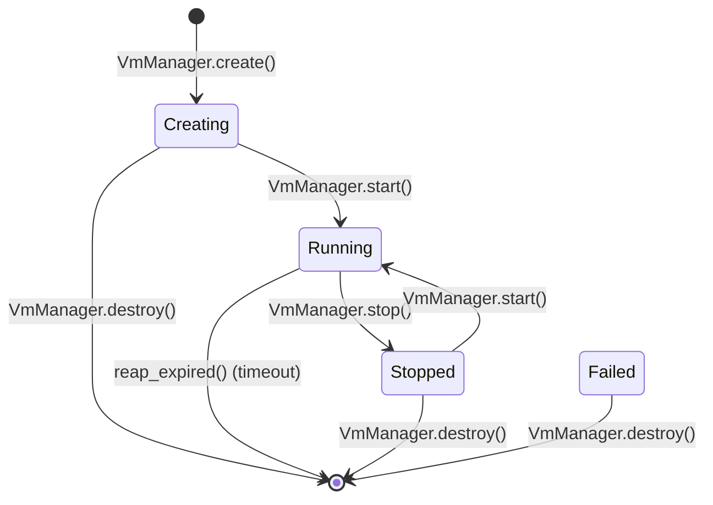

# VM Sandboxing

## Overview

VM sandboxing isolates high-risk agent execution from the host system. Agents request sandbox instances through capability-gated APIs, run commands inside an isolated environment, and move files across a controlled bridge. Every operation is audited.

Today the runtime ships a single backend: `SysboxBackend`, which drives Docker containers (optionally under the `sysbox-runc` runtime) via `bollard`. Sysbox gives containers VM-like isolation — user-namespaced root, nested Docker, isolated `procfs`/`sysfs` — without the boot cost of a full hypervisor. The `VmBackend` trait keeps the door open for stronger backends (see "Future directions").

## Components

| Module | File | Purpose |
|--------|------|---------|
| `types` | `submodules/runtime/crates/symbiotic-vm/src/types.rs` | `VmState`, `VmResources`, `NetworkPolicy`, `VmCreateRequest`, `VmInstance`, `BindMount`, `FileTransfer`, `ExecResult`, `VmAuditEntry`, `VmAction` |
| `backend` | `submodules/runtime/crates/symbiotic-vm/src/backend.rs` | `VmBackend` trait — async `create`/`start`/`exec`/`stop`/`destroy`/`transfer`/`get_state` |
| `backends::sysbox` | `submodules/runtime/crates/symbiotic-vm/src/backends/sysbox.rs` | `SysboxBackend` — Docker + sysbox-runc implementation of `VmBackend` via `bollard` |
| `mock_backend` | `submodules/runtime/crates/symbiotic-vm/src/mock_backend.rs` | `MockBackend` for unit tests and failure injection |
| `file_bridge` | `submodules/runtime/crates/symbiotic-vm/src/file_bridge.rs` | `FileBridge` — allowlist + traversal checks, output dir resolution, 100 MB cap |
| `manager` | `submodules/runtime/crates/symbiotic-vm/src/manager.rs` | `VmManager` — lifecycle, capability gating via `AccessBroker`, audit log, timeout reaping |

## Architecture

```mermaid
flowchart TB
    Agent[Agent / Worker] -->|VmCreateRequest + token| Manager[VmManager]
    Manager -->|check_scope| Broker[AccessBroker<br/>symbiotic-trust]
    Broker -->|allow / deny| Manager
    Manager -->|create / start / exec / stop / destroy / transfer| Trait["`VmBackend` trait"]
    Manager -->|validate| Bridge[FileBridge]
    Manager -->|record| Audit[VmAuditEntry log]
    Trait --> Sysbox[SysboxBackend]
    Trait --> Mock[MockBackend<br/>tests only]
    Sysbox -->|bollard API| Docker[Docker daemon]
    Docker -->|runtime = sysbox-runc| Container[Hardened container]
```

`VmManager` is the only entry point. Backends never see capability tokens, trust levels, or the audit log — they just implement the container lifecycle. This keeps security policy in one place and makes backends swappable.

## The VmBackend trait

```rust
// submodules/runtime/crates/symbiotic-vm/src/backend.rs
#[async_trait]
pub trait VmBackend: Send + Sync {
    async fn create(&self, id: &str, request: &VmCreateRequest) -> Result<VmInstance>;
    async fn start(&self, id: &str) -> Result<()>;
    async fn exec(&self, id: &str, command: &str) -> Result<ExecResult>;
    async fn stop(&self, id: &str) -> Result<()>;
    async fn destroy(&self, id: &str) -> Result<()>;
    async fn transfer(&self, id: &str, transfer: &FileTransfer) -> Result<()>;
    async fn get_state(&self, id: &str) -> Result<VmState>;
}
```

## Request shape

`VmCreateRequest` (see `types.rs`) carries everything a backend needs to provision an instance:

```rust
pub struct VmCreateRequest {
    pub image: String,
    pub resources: VmResources,           // cpus, memory_mb, disk_mb, timeout_secs
    pub network: NetworkPolicy,           // deny_all, allowed_domains, allowed_ports, dns_servers
    pub inject_files: Vec<FileTransfer>,
    pub requesting_agent: String,
    pub purpose: String,                  // audit label
    pub env: Vec<String>,                 // "KEY=value"
    pub mounts: Vec<BindMount>,           // host_path, vm_path, read_only
}
```

`VmResources::default()` is `2 cpus / 2048 MB / 8192 MB disk / 600 s`. `NetworkPolicy::default()` denies everything.

## SysboxBackend in detail

`SysboxBackend::new()` connects to Docker using `bollard`, preferring `DOCKER_HOST` when set, falling back to the local default socket, and finally trying `~/.docker/run/docker.sock` for Docker Desktop. The runtime name `sysbox-runc` is applied to every container when `use_sysbox` is true (the default; toggle via `SYMBIOTIC_VM_USE_SYSBOX=0` or `SysboxBackend::with_runtime(false)` for environments without sysbox). `SysboxBackend::sysbox_runtime_available()` probes `Docker::info()` to check whether the runtime is actually configured.

### Universal hardening floor

Every container created through `build_host_config()` gets the same baseline, regardless of backend caller:

| Flag | Value | Purpose |
|------|-------|---------|
| `cap_drop` | `["ALL"]` | Drops every Linux capability |
| `security_opt` | `["no-new-privileges:true"]` | Blocks `setuid` privilege gain |
| `readonly_rootfs` | `true` | Only bind-mounted paths are writable |
| `pids_limit` | `256` | Caps fork-bomb surface |
| `memory` | `resources.memory_mb * MiB` | Hard memory ceiling |
| `nano_cpus` | `resources.cpus * 1e9` | CPU quota |
| `network_mode` | `"none"` iff `network.deny_all` | Zero connectivity when isolated |
| `runtime` | `sysbox-runc` when enabled | User-namespaced container root |

The unit tests in `sysbox.rs` pin each of these — see `host_config_applies_universal_hardening_flags`, `host_config_enforces_network_isolation_when_deny_all_set`, `host_config_leaves_network_default_when_deny_all_false`.

### Exec protocol

`exec()` wraps the command in a shell script written to a `mktemp` file, runs it, and emits a sentinel `__SYMBIOTIC_EXEC_EXIT_CODE__:<n>` line on stderr. The backend parses that marker to recover the real exit code even when `docker exec` inspection races the stream. `wrap_exec_command` and `extract_exit_code_marker` are pure helpers with dedicated unit tests.

### File transfers

`HostToVm` transfers build a tar archive in memory (`build_upload_tar`) and call `upload_to_container`. `VmToHost` transfers `cat` the file inside the container, capture stdout, and write it to the resolved host path. All transfers go through `FileBridge::validate` inside `VmManager` before the backend is called.

## Capability gating

`VmManager` enforces scopes via `symbiotic_trust::AccessBroker` on every call. Scope-to-trust mapping lives in `required_trust_for_vm_scope`:

| Scope | Required trust | Where |
|-------|----------------|-------|
| `vm.create` | `ArchiveWrite` | create, start, stop |
| `vm.exec` | `ArchiveWrite` | exec |
| `vm.file.inject` | `ArchiveWrite` | transfer (HostToVm) |
| `vm.file.extract` | `ArchiveWrite` | transfer (VmToHost) |
| `vm.destroy` | `ArchiveWrite` | destroy |
| `vm.network.modify` | `ExternalAct` | reserved for future scoped allowlists |

Denials short-circuit before any backend call, and the audit log only records operations that actually executed.

## File bridge rules

`FileBridge::new(project_root, data_dir)` is the production construction pattern used in `services/symbiotic-daemon/src/lib.rs` and `swarm_server.rs`. It enforces:

- **HostToVm**: `host_path` must canonicalize under `project_root` or `data_dir`. Symlinks that escape an allowed root are rejected (`test_file_bridge_denies_symlink_escape`).
- **VmToHost**: `host_path` must be a relative path with no traversal components. The bridge rewrites it to `data_dir/runtime/vm-output/{vm_id}/<relative>` before the backend sees it (`test_transfer_file_passes_validated_extract_path_to_backend`).
- **Size cap**: `check_size()` rejects transfers above 100 MB (`MAX_TRANSFER_BYTES`).
- **VM id hygiene**: ids containing `..`, `/`, or `\` are rejected to keep them safe as path components.

`VmManager::transfer_file` calls `FileBridge::validate`, rewrites `effective_transfer.host_path` to the resolved path, then delegates to the backend — so the backend sees only already-validated paths.

## Audit log

Every lifecycle transition records a `VmAuditEntry` with timestamp, `vm_id`, `agent_id`, `VmAction`, and a free-form `details` string. Actions covered: `Created`, `Started`, `CommandExecuted`, `FileInjected`, `FileExtracted`, `Stopped`, `Destroyed`, `TimedOut`. The log is held in-memory on the manager and exposed via `audit_log()`; the configured `audit_path` (typically `data/runtime/vm-audit.jsonl`) is carried for future persistence work but not flushed from this crate today.

`reap_expired(now)` kills any running VM whose `started_at + resources.timeout_secs <= now`, records a `TimedOut` entry, and removes the instance.

## State machine



`Paused` is defined in the planned API but not currently emitted.

## Callers

Today's production callers all go through `VmManager` + `SysboxBackend`:

- `services/symbiotic-daemon/src/lib.rs` — daemon bootstrap constructs the manager with `SysboxBackend::new()` and a `FileBridge` anchored at the daemon's working directory.
- `services/symbiotic-daemon/src/swarm_server.rs` — T116 swarm-agent path, including the `distillery_job_exec_extract_and_persist_flow_runs_on_sysbox_backend` integration test (ignored by default; requires a real `sysbox-runc` runtime and the `symbiotic-agent-v1:latest` image).
- `services/symbiotic-daemon/src/archeology_sandbox.rs` — T128 Source Archeology pipeline; runs with `NetworkPolicy { deny_all: true, .. }`, binds the source clone read-only at `/workspace/repo`, and relies on the universal hardening floor described above.

## Error Handling

| Error | Handling |
|-------|----------|
| Scope denied | `anyhow!` before any backend call; no audit entry |
| VM not found / not running | `VmManager::require_instance` / `require_running` return error |
| Backend failure (Docker, sysbox) | Propagated as `anyhow::Error` from the manager |
| File bridge path violation | Error returned to caller; transfer never reaches the backend |
| File size over 100 MB | `FileBridge::check_size` returns error |
| Exec marker missing | Backend falls back to `inspect_exec().exit_code` |
| Timeout exceeded | `reap_expired` force-stops, destroys, and writes a `TimedOut` audit entry |

## Future directions

The `VmBackend` trait is explicitly a seam. The planned next backend is **Lume** on macOS — native Apple Virtualization Framework instead of containers, for VM-level isolation on developer hosts. See `docs/design/vm-sandboxing.md` for the design. QEMU/KVM on Linux hosts is not on the near-term roadmap; Sysbox covers Linux server deployments today.
