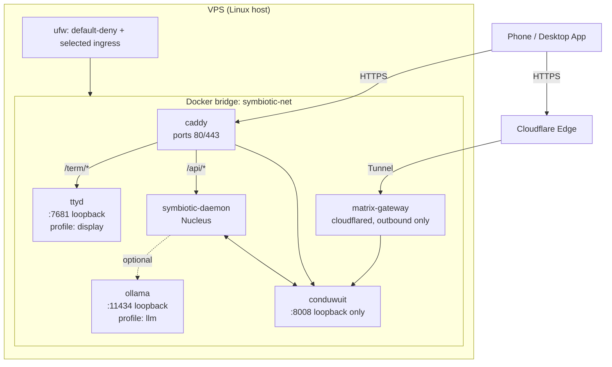
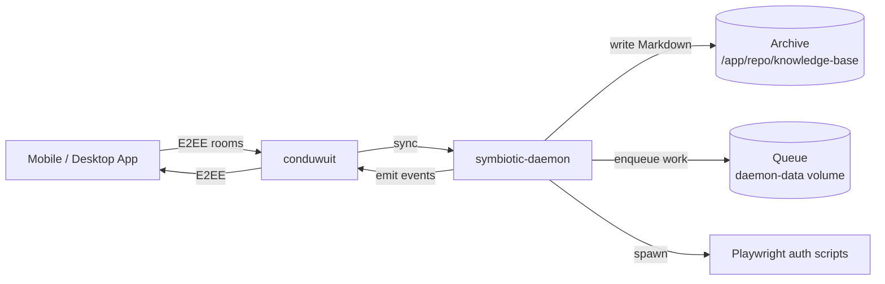

# VPS Deployment

## Overview

Symbiotic deploys to a single Linux VPS as a small, self-contained Docker Compose stack: a Conduit Matrix homeserver, the Nucleus daemon (`symbiotic-daemon`), and one of two front doors that expose the homeserver to the operator's phone — either **Caddy** (Let's Encrypt on ports 80/443) or **Cloudflare Tunnel** (zero inbound). Optional profiles add a local Ollama LLM and a terminal-streaming container.

The compose file at `submodules/runtime/docker-compose.vps.yml` is the canonical topology. `scripts/bootstrap-vps.sh` is the staged installer that brings a fresh VPS to a running stack; `scripts/deploy-quick.sh` is the slimmer path for operators who already manage their own host hardening.

## Components

All containers live on a single Docker bridge network, `symbiotic-net`. Services are defined in `submodules/runtime/docker-compose.vps.yml`.

| Service | Image | Role | Profile |
|---|---|---|---|
| `conduwuit` | `matrixconduit/matrix-conduit:latest` | Matrix homeserver. Bound to `127.0.0.1:8008` (not public). Config: `config/conduwuit.toml`. | always on |
| `daemon` | Built from `Dockerfile.daemon` | Nucleus — orchestration, workflow runner, queue, Matrix transport, Archive writer, Playwright auth scripts. | always on |
| `caddy` | `caddy:2-alpine` | TLS terminator on `:80`/`:443`, reverse-proxies Matrix, `/api/*` (daemon HTTP), and `/term/*` (ttyd). Config: `config/Caddyfile`. | `caddy` |
| `matrix-gateway` | `cloudflare/cloudflared:latest` | Outbound Cloudflare Tunnel. No inbound ports. | `public` |
| `ollama` | `ollama/ollama:latest` | Local LLM runtime on `127.0.0.1:11434`. | `llm` |
| `ttyd` | `tsl0922/ttyd:latest` | Web-terminal (tmux) on `127.0.0.1:7681`, accessed through Caddy `/term/*` with basic auth. | `display` |

Exactly one access mode (`caddy` OR `public`) runs at a time; `bootstrap-vps.sh` selects it via compose profiles. The `llm` and `display` profiles are independent opt-ins.

### Access Modes

| Mode | Front door | Public TCP | DNS requirement |
|---|---|---|---|
| `caddy` | `caddy` service | `80`, `443` | `A` record for `SYMBIOTIC_MATRIX_PUBLIC_DOMAIN` pointing at the VPS |
| `public` | `matrix-gateway` (cloudflared) | none | Cloudflare tunnel route configured for the domain |
| `tailnet` | `tailscale serve --bg 8008` on the host | none | Device on the tailnet |

`tailnet` is not a compose profile — it runs the base stack (`conduwuit` + `daemon`) and exposes Conduit through Tailscale on the host. `bootstrap-vps.sh --access-mode tailnet` sets up the Tailscale `serve` after the stack comes up.

## Topology



### Network

`docker-compose.vps.yml` declares one network:

```yaml
networks:
  symbiotic-net:
    driver: bridge
```

All services attach to `symbiotic-net`. There is no per-service isolation network — the previous multi-network sandbox topology is not implemented. Containers that must not be reachable from the public internet bind their host-mapped ports to `127.0.0.1` (`conduwuit`, `ollama`, `ttyd`).

Host-level isolation is provided by `ufw` (configured in Stage 2 of the bootstrap) and, in `caddy` mode, by TLS termination at Caddy.

## Data Flow



The Nucleus joins Matrix as the **same user** as the mobile app (default: `testuser`) so the pair can share Megolm session keys via SSSS. See `docs/architecture/daemon-bootstrap.md` for the bootstrap priority chain (Docker secret → vault → optional self-register).

## Volumes and Host Mounts

| Mount | Service | Purpose |
|---|---|---|
| `conduwuit-data` | `conduwuit` | Matrix server state (RocksDB) |
| `daemon-data` | `daemon` | Queue, goal artifacts, install artifacts |
| `daemon-logs` | `daemon` | Daemon log retention |
| `./:/app/repo` | `daemon` | Live runtime checkout — agents operate on the mounted repo rather than an empty named volume |
| `./domains`, `./workflows`, `./policies`, `./schemas`, `./config/agents` | `daemon` (ro) | Read-only policy/workflow mounts |
| `caddy-data`, `caddy-config` | `caddy` | Let's Encrypt certificates, Caddy runtime state |
| `ollama-data` | `ollama` | Model weights |

The Matrix password is delivered as a Docker secret (`symbiotic_matrix_password`) backed by the file `config/.secrets/matrix_password` (permissions 0644 so the non-root daemon user can read `/run/secrets/*`). Plaintext env-var overrides for Matrix credentials are intentionally unsupported — see `docs/architecture/daemon-bootstrap.md`.

## LUKS Data Partition (optional but recommended)

`scripts/luks-provision.sh` provisions a LUKS2-encrypted partition at `/var/lib/symbiotic` before the stack runs. It is independent of the compose bring-up and must be executed as root during initial VPS provisioning.

Phases (each followed by a verification gate that aborts on failure):

1. **Preflight** — root check, `cryptsetup` present, target device is a block device, device is not already LUKS-formatted or mounted.
2. **Format** — `cryptsetup luksFormat --type luks2` using the selected method (`passphrase`, `keyfile`, or `tang`). Verifies LUKS2 header.
3. **Open** — maps the device at `/dev/mapper/symbiotic-data` using the selected unlock material.
4. **Filesystem** — `mkfs.ext4 -L symbiotic`, verified via `tune2fs`.
5. **Mount** — mounts to `/var/lib/symbiotic`, verified via `mountpoint`.
6. **Structure** — creates `data/`, `data/blob-store/`, `data/audit/`, `config/` at 0700; `chown` to `symbiotic:symbiotic` when that user exists.
7. **Tang binding** (only for `--method tang`) — `clevis luks bind` with the given Tang URL for network-bound auto-unlock.

The script then appends an `/etc/crypttab` line (commented out by default) and an `/etc/fstab` entry for the mount. Sibling scripts:

- `scripts/luks-verify.sh` — status check, safe to run any time.
- `scripts/luks-unlock.sh` — unlock + mount after reboot.
- `scripts/setup-luks.sh` — minimal non-gated variant.

Tier-3 blob-store encryption (age) lives on top of this partition; see `docs/architecture/tiered-data-protection.md`.

## Bootstrap Flow (`scripts/bootstrap-vps.sh`)

The bootstrap is staged, idempotent, and trap-guarded. Each stage records a marker file under `.bootstrap-stages/`; on re-run, completed stages are skipped unless `--force-reset`. An `ERR` trap invokes `rollback()` on failure.

### Stages

| # | Stage | What it does |
|---|---|---|
| 1 | **Preflight** | Linux host, ≥ 2 GB free on `/`, installs Docker + compose plugin if missing, installs Tailscale if mode=`tailnet`, resolves `SYMBIOTIC_MATRIX_PUBLIC_DOMAIN` and `SYMBIOTIC_CLOUDFLARE_TUNNEL_TOKEN` for public modes. |
| 2 | **Firewall** | Installs `ufw` if missing, `ufw --force reset`, default-deny in/out, then opens only what the selected mode needs (see table below). Fail-closed: rules stay applied on later failures. |
| 3 | **Config** | Scaffolds `config/.env.runtime` with safe defaults, generates `SYMBIOTIC_VAULT_MASTER_KEY` into `config/.env.secrets` (0600) if missing, persists public domain + Cloudflare tunnel token into those files, writes the Matrix Docker secret to `config/.secrets/matrix_password` (0644), and records SHA-256 checksums of the config tree against the previous run. Migrates legacy `VAULT_MASTER_KEY` → `SYMBIOTIC_VAULT_MASTER_KEY` and strips deprecated `SYMBIOTIC_MATRIX_PASSWORD`. |
| 4 | **Services** | `docker compose build && pull`, starts base services (`conduwuit` + optional `matrix-gateway`/`caddy`), waits up to 60 s for `running`, runs `scripts/setup-matrix-rooms.sh` against `http://127.0.0.1:8008`, then starts `daemon`. Final gate: every expected service `running` within 60 s. Failure restores the previous `docker-compose.vps.yml` from `.bootstrap-rollback/`. |
| 5 | **SSH hardening** | Only applied if `authorized_keys` already contains at least one public key (never locks out a key-less operator). Writes `/etc/ssh/sshd_config.d/99-symbiotic-hardening.conf` disabling password auth, runs `sshd -t`, reloads `sshd`. Restores the previous drop-in on validation failure. |

### Firewall Rules (Stage 2)

| Rule | `public` | `caddy` | `tailnet` |
|---|---|---|---|
| Default deny in/out | ✓ | ✓ | ✓ |
| Allow `22/tcp` in | ✓ | ✓ | — (SSH via tailnet) |
| Allow `80/tcp`, `443/tcp` in | — | ✓ | — |
| Allow in/out on detected Tailscale iface | opportunistic | opportunistic | required |
| Allow out on `53`, `80`, `443` | ✓ | ✓ | ✓ |
| Allow `docker0` in/out and `lo` in/out | ✓ | ✓ | ✓ |

`--skip-firewall` leaves ufw alone for environments with an external firewall.

### Flags

| Flag | Purpose |
|---|---|
| `--dry-run` | Print actions without executing. Allows running on non-Linux for sanity checks. |
| `--force-reset` | `docker compose down -v` — destroys vault and Conduit data. |
| `--skip-firewall` | Skip ufw configuration. |
| `--skip-ssh-hardening` | Skip sshd drop-in. |
| `--access-mode {public\|caddy\|tailnet}` | Selects compose profile + firewall rules. |
| `--public-domain <fqdn>` | Matrix domain for `public`/`caddy` modes (also read from `config/.env.runtime`). |
| `--matrix-password-file <path>` | Installer/app-supplied Matrix password (replaces generated secret). |

## Quick Deploy (`scripts/deploy-quick.sh`)

A slimmer alternative for operators who already harden their own VPS. It skips preflight gates, firewall, and SSH hardening; it assumes Docker is installed, a DNS `A` record exists for the domain, and ports 80/443 are open. Steps:

1. Verify `docker` + `docker compose`.
2. Scaffold `config/.env.secrets` with a generated `SYMBIOTIC_VAULT_MASTER_KEY` (0600) if missing.
3. Render `config/conduwuit.toml` from `config/conduwuit.production.toml`, substituting the chosen `server_name`.
4. Update `config/.env.runtime` with `SYMBIOTIC_MATRIX_PUBLIC_DOMAIN`, `SYMBIOTIC_MATRIX_USER`, and `SYMBIOTIC_ALLOWED_SENDERS=@{user}:{server_name}`.
5. Generate `config/.secrets/matrix_password` if missing (0644).
6. `docker compose -f docker-compose.vps.yml --profile caddy up -d`.
7. Wait for `conduwuit` to be `running`, then run `scripts/setup-matrix-rooms.sh`.
8. Print a verification checklist.

Use this when a host already has opinions about firewalling and SSH; use `bootstrap-vps.sh` on fresh provisioners.

## Daemon Image (`Dockerfile.daemon`)

Two-stage build:

1. **Builder** — `rust:1.88-bookworm` compiles `-p symbiotic-daemon --release` from source. Rust 1.88 is the floor (matrix-sdk requires it).
2. **Runtime** — `debian:bookworm-slim` with `libsqlite3-0`, `libssl3`, `ca-certificates`, Node.js 20 LTS (for Playwright auth scripts), and Playwright Chromium system deps. The `rm -rf /var/lib/apt/lists/*` before the first `apt-get update` works around a BuildKit GPG cache issue. Playwright auth scripts under `/app/scripts/auth/` are installed via `npm install --omit=dev && npx playwright install chromium`.

The image runs as a non-root `symbiotic` user and defaults to `ENTRYPOINT ["symbiotic-daemon"]` with `CMD ["serve"]`. `docker-compose.vps.yml` overrides `user: "0:0"` so the container can write to host-mounted directories.

## Configuration Surface

| File | Role | Created by |
|---|---|---|
| `docker-compose.vps.yml` | Service topology | repo |
| `docker-compose.local.yml` | Local-dev overrides (unencrypted transport, self-register, debug logs) | repo |
| `Dockerfile.daemon` | Daemon image spec | repo |
| `config/conduwuit.toml` | Matrix server config (port 8008, `server_name`, registration toggle) | `deploy-quick.sh` or operator |
| `config/Caddyfile` | Caddy routes and TLS | repo |
| `config/.env.runtime` | Non-secret runtime env (homeserver URL, user, allowed senders, public domain) | `bootstrap-vps.sh` / `deploy-quick.sh` |
| `config/.env.secrets` | `SYMBIOTIC_VAULT_MASTER_KEY`, Cloudflare tunnel token; mode 0600 | `bootstrap-vps.sh` / `deploy-quick.sh` |
| `config/.secrets/matrix_password` | Docker secret; mode 0644 | `bootstrap-vps.sh` / `deploy-quick.sh` |
| `config/.matrix-passwords` | Operator-readable mirror for app login bootstrap; mode 0600 | `bootstrap-vps.sh` |
| `config/.env.rooms` | Room IDs after `setup-matrix-rooms.sh` | `setup-matrix-rooms.sh` |

## Live Readiness (`scripts/live-readiness.sh`)

Post-install verification script used by integration tests and operators to confirm a deployed stack is actually usable. Not part of the bootstrap itself. It loads `config/.env.runtime`, `.env.secrets`, and `.env.rooms` and runs gated checks:

- **Gate 1**: `SYMBIOTIC_MATRIX_HOMESERVER` + `SYMBIOTIC_MATRIX_USER` set; Matrix auth material present.
- **Gate 2**: active install marker at `data/install/active-install-id`; optional control-plane probe (`--skip-probes` to bypass).
- Downstream gates check provider credentials, push gateway wiring, etc.

## Sizing

| Tier | Minimum | Recommended | Runs |
|---|---|---|---|
| Base | 1 vCPU, 512 MB | 1 vCPU, 1 GB | `conduwuit` + `daemon` + Playwright |
| + LLM (`llm` profile) | 4 vCPU, 8 GB | 4+ vCPU, 16 GB (or GPU) | adds `ollama` + chosen model |

Tested on Hetzner CPX-class instances. Ollama is opt-in because model weights and CPU inference drive most of the cost.

## Common Failures

- **Conduit won't start with "port mismatch"** — `config/conduwuit.toml` must use integer `port = 8008`, not `port = [8008]`. Env var is `CONDUIT_CONFIG`, pointing at `/etc/conduwuit.toml`.
- **Conduit image not found** — use `matrixconduit/matrix-conduit:latest`. `conduwuit/conduwuit` images are not published to Docker Hub under that name.
- **Health check fails on `conduwuit`** — expected. The image is a `scratch`/`nix` build with no shell, `curl`, or `wget`, so exec-based health checks cannot run inside it. `bootstrap-vps.sh` gates on `State == running` instead.
- **Empty env vars override Rust defaults** — `VAR=` in `.env.runtime` passes an empty string that overrides the daemon's internal default. Comment the line out instead.
- **Stale Matrix keychain after rebuild** — uninstall the mobile app from the simulator before relaunching; otherwise the app holds a device ID that conflicts with the newly-registered daemon.
- **`bootstrap-vps.sh` hangs at Stage 4 in `public` mode** — room setup from the host may fail because the homeserver is only reachable via the tunnel. The script falls back to letting the daemon finish room creation from inside the Docker network; this is logged as a warning, not an error.

## Key Decisions

1. **Single bridge network.** The original multi-network credential-sandbox topology (`credential-net`, `agent-net`, separate `access-broker`/`credential-gateway`/`credential-sandbox`/`browser-sandbox` containers) is not implemented. Containers that must stay private bind to `127.0.0.1` on the host, and Caddy is the only TLS-terminating surface.
2. **Conduit over Synapse.** RocksDB-backed, ~50 MB resident, single-user private homeserver. Good enough; easy enough.
3. **Daemon shares the app's Matrix user.** Enables Megolm session-key sharing via SSSS so events encrypted by the daemon decrypt on reinstalled mobile clients. See `docs/architecture/daemon-bootstrap.md`.
4. **Two front doors, same stack.** `caddy` profile (Let's Encrypt on 80/443) or `public` profile (Cloudflare Tunnel, zero inbound). `tailnet` is a host-level alternative using `tailscale serve`.
5. **No plaintext Matrix password env var.** All credential paths use secure storage (Docker secrets on tmpfs, age/ChaCha20-Poly1305 vault). `bootstrap-vps.sh` actively strips deprecated `SYMBIOTIC_MATRIX_PASSWORD` entries from `.env.secrets`.
6. **LUKS is provisioning-time, not runtime.** `luks-provision.sh` must be run before compose comes up. The stack does not manage the partition; it assumes `/var/lib/symbiotic` is mounted when required.

## Key Files

| File | Purpose |
|---|---|
| `submodules/runtime/docker-compose.vps.yml` | Canonical VPS compose topology |
| `submodules/runtime/docker-compose.local.yml` | Local-dev overrides |
| `submodules/runtime/Dockerfile.daemon` | Daemon image build |
| `submodules/runtime/scripts/bootstrap-vps.sh` | Staged VPS installer (preflight → firewall → config → services → SSH) |
| `submodules/runtime/scripts/deploy-quick.sh` | Minimal Caddy-based deploy for pre-hardened hosts |
| `submodules/runtime/scripts/setup-matrix-rooms.sh` | Matrix user + room bootstrap |
| `submodules/runtime/scripts/luks-provision.sh` | LUKS2 data partition provisioning with verification gates |
| `submodules/runtime/scripts/luks-verify.sh` / `luks-unlock.sh` | LUKS status check + post-reboot unlock |
| `submodules/runtime/scripts/live-readiness.sh` | Post-install gate checks |
| `submodules/runtime/config/conduwuit.toml` | Matrix server config |
| `submodules/runtime/config/Caddyfile` | Caddy routes + TLS |

## Related Docs

- `docs/architecture/daemon-bootstrap.md` — credential resolution chain, self-registration, vault layout.
- `docs/architecture/tiered-data-protection.md` — Tier 3 age encryption on top of the LUKS partition.
- `docs/architecture/symbiotic-daemon.md` — Nucleus internals.
- `docs/architecture/matrix-client.md` — Matrix transport and E2EE.
