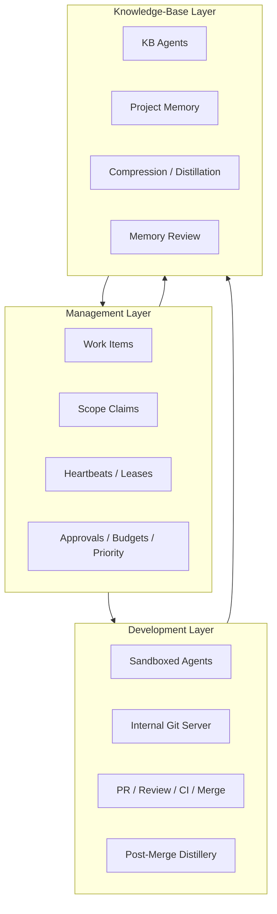
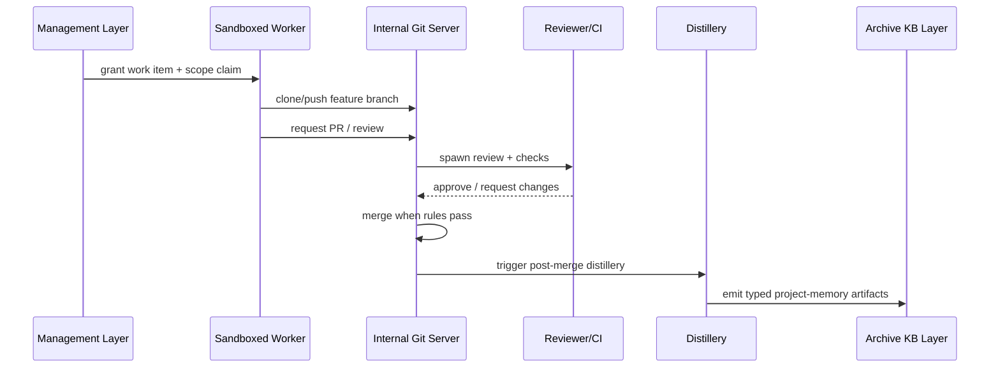

# Agent Collaboration & Conflict Resolution

**Status**: Approved design target
**Related Tasks**: T113, T116, T109, T123
**Related Docs**: `docs/design/internal-git-swarm.md`, `control-plane/docs/design/declarative-control-plane.md`, `docs/design/operator-reasoning-distillation.md`, `docs/design/memory-system.md`, `docs/design/management-work-item-claims.md`

## Goal

Define the end-state collaboration model for Symbiotic's multi-agent system without collapsing three different concerns into one mechanism:

- management/orchestration conflicts
- development/code collaboration conflicts
- knowledge-base semantic conflicts

The system already has partial pieces for all three. This document defines the canonical split, the object model, and the resolution rules.

## Core Decision

Symbiotic must operate with **three separate collaboration layers**:

1. **Management Layer**
   - Paperclip-like control plane
   - decides who is working on what
   - handles assignment, stale work, priorities, approvals, and budgets
2. **Development Layer**
   - sandboxed worker agents + internal git server
   - handles code/doc collaboration on implementation artifacts
   - resolves branch, review, test, and merge concerns
3. **Knowledge-Base Layer**
   - separate Archive agent system with typed scoped tools
   - handles shared project memory, distillation, handoffs, and semantic review

These layers interact, but they must not be conflated.

This split is not arbitrary. It is derived from the external pattern distillation in:

- [external-system-eval-2026-04-07.md](external-system-eval-2026-04-07.md)

Specifically:

- `Paperclip` contributes management primitives
- `llm-wiki`-style file-native project-memory patterns contribute project-memory primitives
- `oh-my-mermaid` contributes derived architecture/context artifacts
- `Hermes / GEPA` contributes learning-from-runs primitives
- `graphify` contributes optional derived graph/report ideas

## Why This Split Is Necessary

Older swarm/worktree thinking treated all conflicts as "parallel edits".

That is too shallow.

In practice, Symbiotic faces different conflict classes:

1. **Management conflict**
   - two agents or teams claim the same work item
   - a stale task continues after priorities changed
   - one initiative should preempt another
2. **Development conflict**
   - two sandboxed agents change overlapping implementation artifacts
   - CI, reviewer, or merge policy blocks landing
3. **Knowledge conflict**
   - competing summaries
   - contradictory facts
   - unresolved promotion from evidence to shared project memory

The wrong architecture would try to solve all of these with one mechanism.

The correct architecture assigns each class to the layer that can solve it most cleanly.

## Layer Model



## Layer Responsibilities

### 1. Management Layer

The management layer is the Paperclip-like control plane. It governs live execution state.

The key adopted primitives are:

- atomic checkout
- lease
- heartbeat
- stale-work recovery
- approval/budget/audit state

It owns:

- work item creation
- scope claims
- lease/heartbeat renewal
- stale-work detection
- blocked/unblocked state
- priority arbitration
- approval requirements
- budget/cost ceilings
- run/session audit state

It does **not** own:

- code merging
- canonical repo docs
- shared project-memory synthesis

### 2. Development Layer

The development layer is the internal git swarm.

It owns:

- sandboxed worker execution
- internal repo/branch lifecycle
- branch protection
- review agent flow
- CI/check runs
- merge decisions under policy
- post-merge distillery extraction

It does **not** own:

- task prioritization across the company
- long-term project memory
- canonical KB truth

### 3. Knowledge-Base Layer

The KB layer is handled by Archive-specific agent tooling and Recall/Distillery infrastructure.

The key adopted primitives here are from the `compiled project memory` pattern:

- file-native project memory
- lazy compilation
- tiered retrieval/query
- human-readable distilled artifacts

It owns:

- project handoffs
- architecture notes
- decisions
- distilled collaboration memory
- typed project/repo notes
- memory contradiction detection
- semantic promotion from evidence to shared project memory

It does **not** own:

- raw task leasing
- code branch integration
- low-level run coordination

## Canonical Storage Split

### Control Plane

Control-plane state is not Markdown-first truth.

It should remain runtime-managed structured state for:

- active work items
- live claims
- heartbeats
- run status
- approvals
- costs
- queue state

### Repos

Repos hold:

- code
- code-coupled canonical docs
- `AGENTS.md`

### Archive

The Archive holds **shared project memory**, not raw operational lock state.

Primary location:

```text
knowledge-base/
  operations/
    projects/
      {project}/
```

Representative structure:

```text
knowledge-base/
  operations/
    projects/
      symbiotic/
        symbiotic.md
        symbiotic.brief.md
        architecture/
        decisions/
        handoffs/
        conversations/
          raw/
          distilled/
          checkpoints/
        repos/
          runtime/
            runtime.md
            runtime.brief.md
          app/
            app.md
            app.brief.md
```

## Conflict Classes And Where They Resolve

| Conflict Class | Example | Primary Resolution Layer |
|---|---|---|
| Assignment conflict | Two agents claim the same feature slice | Management |
| Priority conflict | Low-priority work blocks urgent work | Management |
| Stale-work conflict | Agent continues after work became stale | Management |
| Branch/edit conflict | Two agents touch overlapping files | Development |
| Review/check conflict | Reviewer/CI rejects merge candidate | Development |
| Merge conflict | Git overlap during landing | Development |
| Semantic contradiction | Two promoted facts disagree | KB / Memory Review |
| Summary drift | Shared project brief no longer matches evidence | KB |

## Management Layer Design

The focused management-layer contract now lives in:

- [management-work-item-claims.md](management-work-item-claims.md)

The types below remain the high-level collaboration summary.

### Work Item Model

```rust
#[derive(Debug, Clone, Serialize, Deserialize)]
pub struct WorkItem {
    pub id: String,
    pub project: String,
    pub title: String,
    pub status: WorkItemStatus,
    pub priority: u8,
    pub scopes: Vec<ScopeRequirement>,
    pub assignee: Option<String>,
    pub lease: Option<Lease>,
    pub blocked_by: Vec<String>,
    pub related_repo_targets: Vec<RepoTarget>,
    pub related_kb_targets: Vec<KbTarget>,
}

#[derive(Debug, Clone, Serialize, Deserialize, PartialEq, Eq)]
#[serde(rename_all = "snake_case")]
pub enum WorkItemStatus {
    Todo,
    Claimed,
    InProgress,
    PendingReview,
    Blocked,
    Done,
    Cancelled,
    Expired,
}

#[derive(Debug, Clone, Serialize, Deserialize)]
pub struct Lease {
    pub holder_agent_id: String,
    pub issued_at: i64,
    pub expires_at: i64,
    pub heartbeat_at: i64,
}
```

### Scope Claim Model

The management layer must claim scopes before meaningful work begins.

```rust
#[derive(Debug, Clone, Serialize, Deserialize)]
pub struct ScopeRequirement {
    pub scope: CollaborationScope,
    pub mode: ScopeMode,
}

#[derive(Debug, Clone, Serialize, Deserialize)]
#[serde(tag = "kind", rename_all = "snake_case")]
pub enum CollaborationScope {
    RepoPath { repo: String, path: String },
    RepoDoc { repo: String, path: String },
    KbSubtree { path: String },
    KbAppendChannel { path: String },
    ReviewQueue { queue: String },
}

#[derive(Debug, Clone, Copy, Serialize, Deserialize, PartialEq, Eq)]
#[serde(rename_all = "snake_case")]
pub enum ScopeMode {
    SharedRead,
    ExclusiveWrite,
    AppendOnly,
}
```

### Management Rules

1. `exclusive_write` claims must never overlap.
2. `append_only` claims may run in parallel.
3. lease expiry returns the scope to the pool.
4. heartbeat absence marks work stale before reassignment.
5. management may cancel or preempt work without touching repo state directly.

These rules are the minimal distilled set from the Paperclip-like management pattern. Symbiotic should not adopt the broader company metaphor as product canon unless it proves useful later.

## Development Layer Design

The development layer assumes agents do **not** work directly in host worktrees.

They run in sandboxes and collaborate through the internal git server described in:

- [internal-git-swarm.md](docs/design/internal-git-swarm.md)
- [tasks/116-internal-git-swarm/README.md](../../tasks/116-internal-git-swarm/README.md)

### Development Flow



### Development Rules

1. host daemon remains a passive orchestrator, not a code executor
2. code conflicts are resolved through PR/review/merge policy
3. repo coupling belongs in repo docs, not in raw task chatter
4. post-merge distillery may emit KB artifacts, but never bypasses KB routing policy

### Integrator Pattern

Even if multiple sandboxes contribute in parallel, one integrator/reviewer path should land the change.

That integrator is responsible for:

- merge readiness
- stale-review invalidation
- test/check aggregation
- promotion hooks into the KB layer

## KB Layer Design

The KB layer uses typed tools and scoped write surfaces. It should not behave like an unbounded shared scratchpad.

This is where the `llm-wiki` family matters most: not as a generic repo wiki to adopt wholesale, but as pressure to create stronger file-native compiled project memory with lazy updates and cheaper query tiers.

### Write Classes

There are only three safe KB write classes:

1. **append-only evidence**
   - handoffs
   - checkpoints
   - run notes
   - conversation artifacts
2. **single-writer summary**
   - project brief
   - architecture summary
   - decision summary
   - repo-level brief
3. **canonical typed records**
   - ledger entities
   - project records
   - reviewed memory state

### KB Rules

1. many agents may contribute append-only evidence
2. summary pages should have one designated synthesizer at a time
3. canonical record mutation must use typed mutation paths
4. contradictions should trigger semantic investigation before user escalation

## Memory Review Boundary

`Memory Review` is the user-facing escalation surface for unresolved semantic disagreement.

It should only occur after:

1. KB agents detect contradiction
2. investigation compares provenance and competing claims
3. a proposed resolution exists or confidence remains insufficient

So KB conflicts are generally:

- semantic disagreement
- promotion uncertainty
- summary drift

not raw text-collision events.

## Conversation History Policy

The Archive may store the history of agentic conversations, but not all at the same semantic level.

### Storage Classes

1. **Raw conversation artifacts**
   - append-only
   - JSONL or equivalent transcript/event records
   - audit/replay substrate
2. **Distilled conversation artifacts**
   - run summaries
   - lessons
   - decision extracts
   - failure patterns
3. **Checkpoint artifacts**
   - compact resumable state
   - assumptions
   - open questions
   - next actions

### Policy

Raw transcripts are not normal shared memory.

They are:

- audit material
- distillation input
- optional replay substrate

Shared project memory should instead consume:

- distilled summaries
- checkpoint artifacts
- promoted conclusions

### Compression Principle

Conversation history should be aggressively compressed into machine-usable and human-readable artifacts.

The end-state is not transcript sprawl.

It is:

- long raw history kept available
- short checkpoint state used for resumption
- distilled notes promoted when durable

## Recommended Archive Layout For Conversation History

```text
knowledge-base/
  operations/
    projects/
      {project}/
        conversations/
          raw/
          distilled/
          checkpoints/
```

## Integration Plan

### Immediate

1. keep T116 as the development-collaboration source of truth
2. keep T113 as the runner/protocol source of truth
3. add management-layer checkout/lease/heartbeat design in the orchestration stack
4. keep KB review semantics under the existing memory-system work

### Near-Term

1. define `WorkItem` and `ScopeRequirement` in the orchestrator domain
2. add lease/heartbeat persistence and expiry handling
3. connect internal git swarm PR lifecycle to work-item ownership
4. add Archive project-memory routes and tool scopes for:
   - append-only evidence
   - summary synthesis
   - conversation checkpoints

### Later

1. add conversation compression pipeline from raw artifacts to distilled notes
2. add promotion workflow from project-memory evidence to canonical repo docs or ledger records
3. add stronger automatic semantic reconciliation before `Memory Review` user escalation

## Module Layout

> **Note (2026-04-20):** The original proposal below has diverged from the realized layout. The three-layer model is implemented, but the management-side code lives in the `symbiotic-control-plane` crate (`work_items.rs`, `claims.rs`, `leases.rs`, `management_store.rs`) rather than in daemon modules named `collaboration_coordinator.rs` / `heartbeat_monitor.rs`. Development-layer collaboration lives in `symbiotic-git-swarm` (`SwarmPR`, `PRManager`, `MergeRuleSet`, `BranchRule`) rather than a `pipeline/backend_team.rs` file. Treat the snippet below as the original design intent, not the current layout.

Originally proposed ownership:

```text
submodules/runtime/
  services/symbiotic-daemon/src/
    work_items.rs
    scope_claims.rs
    collaboration_coordinator.rs
    heartbeat_monitor.rs

  crates/symbiotic-agents/src/
    pipeline/backend_team.rs         # development collaboration

knowledge-base/
  operations/projects/{project}/     # shared project memory
```

Current realized layout:

```text
submodules/runtime/
  crates/symbiotic-control-plane/src/
    work_items.rs            # WorkItem, WorkItemStatus
    claims.rs                # ScopeClaim, CollaborationScope, ScopeMode
    leases.rs                # Lease, HeartbeatUpdate
    management_store.rs      # persistence

  crates/symbiotic-git-swarm/src/
    types.rs                 # SwarmPR, MergeRuleSet, BranchRule
    pr.rs                    # PRManager, review / merge flow
    server.rs                # internal git server

knowledge-base/
  operations/projects/{project}/     # shared project memory
```

The `CollaborationConfig` struct described below is also not present under that exact name; equivalent tuning lives on `symbiotic-control-plane` types (e.g. lease TTLs, scope modes) and on `MergeRuleSet` / `BranchRule` for the development layer.

## Config Surface

```rust
#[derive(Debug, Clone, Serialize, Deserialize)]
pub struct CollaborationConfig {
    pub lease_ttl_secs: u64,
    pub stale_after_secs: u64,
    pub max_parallel_claims_per_agent: usize,
    pub allow_append_only_parallelism: bool,
    pub auto_escalate_semantic_conflicts: bool,
    pub raw_conversation_retention_days: u32,
}
```

Recommended defaults:

- `lease_ttl_secs = 900`
- `stale_after_secs = 300`
- `max_parallel_claims_per_agent = 3`
- `allow_append_only_parallelism = true`
- `auto_escalate_semantic_conflicts = false`

## What We Explicitly Reject

1. treating Paperclip-like management as code-merge control
2. treating KB writes like freeform shared chat logs
3. letting multiple agents rewrite the same summary page at once
4. using graph/index/MCP artifacts as canonical truth
5. collapsing management, development, and KB conflicts into one queue

## Recommendation

Symbiotic should converge on:

- **management conflict prevention** in the control plane
- **development conflict resolution** in the sandbox + internal git swarm
- **knowledge conflict reconciliation** in the KB agent layer
- **conversation history compression** as a first-class Archive function

That gives the system:

- safer parallel work
- clearer ownership
- less Markdown chaos
- less transcript sludge
- a natural path from raw agent collaboration to durable project memory
