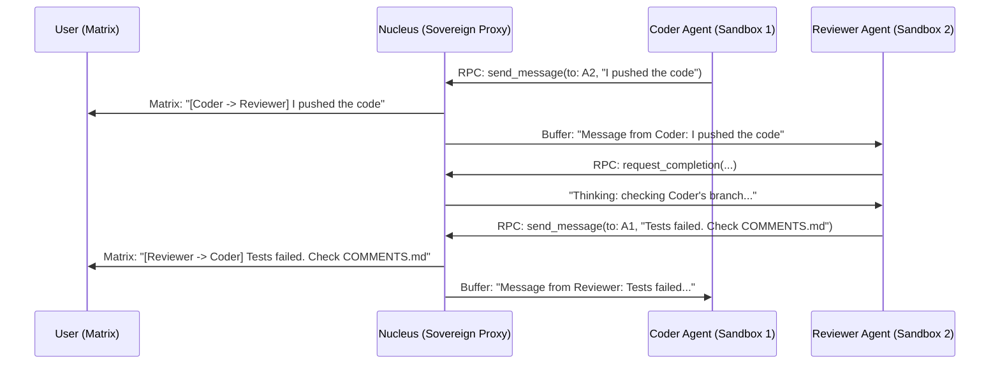

# The "Company" Model: Multi-Agent Swarms & Collaboration

**Status**: Architectural Pillar (Linked to T103 / T112)
**Replaces**: Single Monolithic "God Agent" ReAct Loop

This document outlines the conceptual shift in Symbiotic's execution layer. We are moving from a single monolithic agent that tries to do everything, to a structured "Company of Specialists" that collaborate asynchronously and securely.

---

## 1. The Paradigm Shift

**The Old Way (Monolithic):**
A single agent loop receives a complex goal ("Build a trading bot"). It tries to research, write code, run tests, and evaluate itself in one massive, linear chain of thought. If it gets stuck, the whole process fails. If it hallucinates a dangerous command, the host is compromised.

**The New Way (The Company):**
Symbiotic operates like a software company. The **Nucleus** acts as the CEO and HR department. When a goal is initiated, it spins up dedicated, isolated "Workers" (Agents) inside separate Sysbox containers. These workers do not share memory or filesystems. They collaborate exactly like human engineers: by pushing and pulling from a shared Git repository.

---

## 2. The Corporate Structure

### The Nucleus (The Sovereign / CEO)
*   **Role**: Orchestration, Resource Allocation, and Security.
*   **Abilities**: Spawns Agent Sandboxes, holds the API keys (LLM Gateway), and hosts the internal Git server.
*   **Limitations**: It **does not write code**, and it **does not execute code**. It strictly delegates work and enforces security policies (via the Gatekeeper).

### The Agents (The Workers)
Each agent is a `symbiotic-agent-runner` binary injected into an isolated Sysbox container. They are given specific system prompts and scopes based on their role.

1.  **The Architect / Researcher**:
    *   *Role*: Analyzes the goal, reads the Knowledge Base, and writes the technical specification (`spec.md`) into the Git repo.
2.  **The Coder**:
    *   *Role*: Clones the repo, reads `spec.md`, writes the actual `.rs` or `.ts` code, and pushes the implementation branch.
3.  **The Tester / QA**:
    *   *Role*: Pulls the implementation branch, runs `cargo test` or `npm run test` inside its own isolated environment. It pushes fixes or leaves Git commit comments for the Coder.

### The Distillery (The Archivist)
*   **Role**: When the workers declare the job is done, the Nucleus spawns the Distillery Sandbox. The Distillery acts as a final "Air-Lock". It verifies the final Git repository, extracts the clean, finished artifacts, and hands them over to the Nucleus to be stored permanently in the Archive.

---

## 3. How the Company Collaborates: "The Sovereign Proxy"

Agents **never** communicate directly with each other or with the external Matrix network. Direct communication would require sharing credentials (violating security) and would bypass the system's "Transparent Autonomy" mandate.

Instead, the **Nucleus** acts as a **Sovereign Message Broker** and the **Internal Git Server** acts as the shared workspace.

### 1. Collaboration via Git (The "Pull Request" Pattern)
For technical collaboration on code, documents, or research, agents use the standard software engineering workflow:
*   **The Shared Workspace**: Every goal has an internal bare Git repository (e.g., `task-123.git`) hosted by the Nucleus.
*   **External Integration (Real-World Projects)**: The Nucleus can configure the internal bare repository to mirror to an external remote (e.g., `github.com/your-username/real-project.git`). 
    *   Agents push code to the internal `172.17.0.1` server.
    *   **Branch Restrictions**: The Nucleus enforces strict access controls on the internal server using Git `update` hooks. Agents are explicitly **denied** permission to push to `main`, `master`, or other protected branches. They can only push to their assigned feature branches (e.g., `agent/task-123`).
    *   **The Internal Pull Request (PR) Workflow**: Because LLMs are extensively trained on millions of open-source GitHub Pull Requests, the Company Model natively maps to this workflow. This is vastly more efficient than raw conversational prompting. 
        1. **The Branch**: A Coder pushes a feature branch (`feature/task-123`).
        2. **The "PR" Signal**: The Coder sends an RPC message to the Nucleus: *"Ready for Review."*
        3. **Parallel Checks (CI & Security)**: The Nucleus spawns multiple checks simultaneously. It spins up a pristine sandbox and runs `cargo test` (acting as CI/CD). Simultaneously, it spawns a **Security Researcher Agent** to scan for vulnerabilities.
        4. **The Review**: A **Reviewer Agent** pulls the branch, reads the diffs, and pushes a `REVIEW.md` file back to the branch or sends feedback via RPC.
        5. **The Ping Pong**: The Coder pulls the feedback, fixes the branch, and repushes. This loop continues entirely on the internal server.
        6. **The Merge**: Once all checks (CI, Security, Reviewer) issue an 'Approve' signal via RPC, the Nucleus (acting as the Git server) performs the `git merge` into the main branch. 
    *   **The Final Handoff**: Only after the internal PR is merged does the Nucleus perform a `git push` to the external GitHub remote. 
    *   This allows the "Company" to safely open highly-vetted Pull Requests on your public or private GitHub projects without the agents themselves needing internet access to GitHub or holding your personal GitHub token, and with zero risk of an agent accidentally overwriting production code.
*   **Reviews & Fixes**: If a Tester Agent finds a bug, it doesn't just send a text message. It pushes a failing test case or a `REVISION.md` note to the internal Git repo.
*   **Comments**: Agents can append Git trailers (e.g., `Reviewer-Comment: Variable name is ambiguous`) or use a `COMMENTS.md` file at the root of the repo for multi-agent orchestration.

### 2. Operational Chatter via Nucleus RPC
For fast, real-time coordination (e.g., "I've pushed the branch, please review"), agents use the **Nucleus RPC Bridge**:
1.  **Agent A** calls the `send_message(to: "Reviewer", content: "Branch 'feature/api' is ready")` RPC method.
2.  **The Nucleus (CEO)** receives this over the Unix Socket.
3.  **The Nucleus** performs two actions:
    *   **Internal Routing**: It places the message into the incoming buffer for the **Reviewer Agent**.
    *   **Transparent Autonomy**: It mirrors the message into the **Matrix Thread Room**.
4.  **The User** sees the agent-to-agent chatter in their Symbiotic app, providing total oversight of the "Company's" internal workings.

---

## 4. Why the Company Model is Superior

### 1. Zero "Blast Radius" (Security)
If the Coder Agent accidentally runs a malicious `npm` package, or gets stuck in an infinite `while` loop, it only kills **Sandbox 1**. The Tester Agent, the Nucleus, and the Host VPS are completely unaffected.

### 2. Auditable "Chain of Thought"
Because every significant action results in a Git commit and every message is proxied through the Nucleus to Matrix, the user has a 100% complete audit log of the "Company's" thought process.

### 3. Parallel Execution
The Architect can begin drafting the spec for Phase 2 while the Coder and Tester are iterating on Phase 1. Because they are in separate sandboxes, they do not contend for host resources.

### 4. Preventing Context Degradation (The 80% Rule)
In a monolithic model, a long task fills up the 200k LLM token window. In the Company Model, agents are ephemeral. The Coder pushes its work to Git and dies. The Tester wakes up with a **fresh, 100% clean context window**, cloning the repo to see the current state. The "Memory" of the task is held safely in the Git repository, not in the LLM's fragile context window.