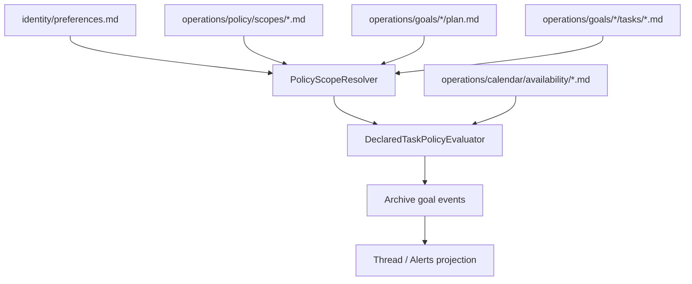

# Archive Policy Scope Hierarchy

**Status**: Approved design target  
**Related Tasks**: T113, T115, T109  
**Related Docs**: `docs/design/declared-task-policy-evaluator.md`, `docs/design/declared-task-policy-time-windows.md`, `docs/design/calendar-and-scheduling-layer.md`, `control-plane/docs/design/declarative-control-plane.md`, `docs/architecture/goals-layer.md`

## Goal

Define the next canonical policy layer above operator / goal / task policy so
Symbiotic can support:

- lightweight shared delivery defaults
- optional technical audience defaults such as `team:infra` or `oncall:infra`
- urgent audience defaults for operational agent workflows

without inventing a second control-plane store or hiding policy in daemon
config.

The end-state requirement is:

- `Archive` is the only canonical durable policy truth
- `Nucleus` resolves policy from Archive scopes
- thread / alert projection is derived from Archive facts
- delivery availability later plugs into the same scope model instead of
  replacing it

## Core Decision

Add **Archive-native policy scopes** as first-class records.

These scopes sit between operator defaults and goal/task overrides.

They are shared policy bundles such as:

- `company:default`
- `team:infra`
- `team:product`
- `oncall:infra`
- `oncall:security`

They are not intended to model an HR org chart. They exist to express shared
delivery policy for agent workflows when personal operator defaults are not
enough.

The canonical hierarchy becomes:

1. built-in defaults
2. operator defaults in `identity/preferences.md`
3. shared Archive policy scopes attached to the goal
4. audience-specific scope defaults when escalation targets a known scope
5. goal defaults in `operations/goals/{goal}/plan.md`
6. task overrides in `tasks/*.md`

This keeps policy explicit, backupable, and inspectable.

## Why This Is Better

This is the strongest design because it avoids two bad alternatives:

1. hidden daemon config for org/team policy
- impossible to reconstruct from Archive alone
- drifts from user-visible truth

2. trying to make `identity/preferences.md` carry shared team/on-call policy
- wrong ownership model
- mixes personal preference with shared operational policy

Archive policy scopes solve both:

- operator preferences remain personal
- shared policy remains shared
- goals opt into shared scopes explicitly
- audience delivery can resolve to the right subject instead of always assuming
  `operator`

## Big-Picture Model

The final system should separate three things:

1. `task semantics`
- what the task means
- review, waiting, approval, coordination, execution

2. `escalation semantics`
- mode
- audience
- severity
- retry / cooldown / max_count

3. `delivery subject and timing`
- whose schedule applies
- which timezone matters
- whether quiet hours / working hours / optional on-call delivery availability
  suppress delivery

Today the task policy model already handles 1 and most of 2.

This design adds the missing shared layer for 2 and prepares the Archive shape
needed for 3 without pushing Symbiotic into general workplace scheduling.

## Archive Layout

Recommended canonical layout:

```text
knowledge-base/
  identity/
    preferences.md
  operations/
    policy/
      scopes/
        company-default.md
        team-infra.md
        team-product.md
        oncall-infra.md
        oncall-security.md
```

This stays separate from the future delivery-availability records in:

```text
knowledge-base/
  operations/
    calendar/
      availability/
      events/
      sources/
      sync/
```

Reason:

- `policy/scopes/` is the canonical place for shared escalation/timing defaults
- `calendar/availability/` is the canonical place for delivery availability
  windows and future schedule sync

Policy scopes may reference availability subjects, but they should not duplicate
the whole calendar model.

## Canonical Scope Model

Each policy scope is a Markdown record with typed frontmatter.

Recommended shape:

```yaml
---
id: "team:infra"
kind: "team"               # company_default | team | oncall
title: "Infrastructure Team"
enabled: true
priority: 200

delivery_subject: "team:infra"

task_policy_defaults:
  evaluator:
    timezone: "Europe/Bratislava"
    lateness_basis: wall_clock
    delivery_window:
      mode: working_hours
      working_hours:
        weekdays: [mon, tue, wed, thu, fri]
        start_local: "09:00"
        end_local: "18:00"

  waiting:
    mode: notify_operator
    audience: "team:infra"
    severity: high
    after_secs: 14400
    max_count: 3
    cooldown_secs: 14400

  coordination:
    mode: raise_alert
    audience: "team:infra"
    severity: urgent
    after_secs: 3600
    max_count: 2
    cooldown_secs: 3600
---
```

### Field Semantics

- `id`
  - canonical scope identifier
  - must match what goals reference and what audiences can resolve to

- `kind`
  - semantic category only
  - does not change inheritance rules

- `priority`
  - deterministic conflict resolution when multiple scopes affect the same field
  - larger number wins among sibling scopes

- `delivery_subject`
  - canonical subject string used to resolve timing and later calendar
    availability
  - examples:
    - `operator`
    - `team:infra`
    - `oncall:infra`

- `task_policy_defaults`
  - same schema family already used in `identity/preferences.md` and goal plans

## Goal Attachment Model

Goals should explicitly declare which shared policy scopes apply.

Recommended addition to `operations/goals/{goal}/plan.md`:

```yaml
---
policy_scopes:
  - "company:default"
  - "team:infra"
---
```

This is intentionally explicit.

The system should not guess shared delivery policy from hidden runtime membership
state.

That keeps Archive restore deterministic:

- clone Archive
- load goal plan
- load referenced policy scopes
- compute the same effective defaults

## Audience-Aware Resolution

This is the key end-state refinement.

The effective policy for a task is not resolved only from the task owner or
goal.

It must also consider the actual delivery audience.

Examples:

- `audience: operator`
  - resolve delivery via operator preferences and operator availability

- `audience: team:infra`
  - resolve delivery via the `team:infra` policy scope and later the
    `team:infra` availability subject

- `audience: oncall:infra`
  - resolve delivery via the `oncall:infra` policy scope and later the
    on-call delivery subject

This is how a sysadmin/on-call path can legitimately bypass quiet hours while a
normal operator reminder does not.

For most personal Symbiotic use, `operator` is enough. Shared scopes become
useful only when the system is managing operational or team-oriented agent
workflows.

## Effective Resolution Rules

### Escalation Defaults

For `mode`, `severity`, `after_secs`, `cooldown_secs`, and `max_count`:

```text
built-in
-> operator defaults
-> goal.policy_scopes (in declared order, then by priority)
-> goal defaults
-> task override
```

### Delivery Timing

For `timezone`, `lateness_basis`, and `delivery_window`:

```text
built-in
-> operator evaluator defaults
-> delivery subject scope defaults (if audience resolves to a scope)
-> goal.policy_scopes
-> goal defaults
-> task override
```

Important nuance:

- if escalation targets `operator`, operator timing remains the baseline
- if escalation targets a shared audience like `oncall:infra`, the shared
  delivery subject should override operator quiet hours

This is the only way to get correct behavior for real operational roles
without pushing the core product toward general workplace scheduling.

## Relationship To Calendar Layer

Policy scopes are not the full calendar system.

They are the shared policy layer that calendar availability will later feed.

End-state:

- `policy/scopes/*.md`
  - escalation and timing defaults
  - audience semantics

- `calendar/availability/*.md`
  - working hours
  - quiet hours
  - explicit delivery availability windows
  - optional on-call delivery windows for technical workflows

- `Nucleus`
  - resolves policy scopes first
  - then resolves delivery subject availability

This avoids duplicating scheduling logic in policy docs while still allowing
strong defaults before full calendar integration lands.

## Type Signatures

Recommended Rust additions:

```rust
#[derive(Debug, Clone, Serialize, Deserialize)]
pub struct PolicyScopeManifest {
    pub id: String,
    pub kind: PolicyScopeKind,
    pub title: String,
    #[serde(default = "default_true")]
    pub enabled: bool,
    #[serde(default)]
    pub priority: u16,
    #[serde(default)]
    pub delivery_subject: Option<String>,
    #[serde(default)]
    pub task_policy_defaults: GoalTaskPolicyDefaults,
    #[serde(skip)]
    pub body_markdown: String,
}

#[derive(Debug, Clone, Copy, PartialEq, Eq, Serialize, Deserialize)]
#[serde(rename_all = "snake_case")]
pub enum PolicyScopeKind {
    CompanyDefault,
    Team,
    OnCall,
}

#[derive(Debug, Clone)]
pub struct EffectivePolicyContext<'a> {
    pub goal_id: &'a str,
    pub task_id: &'a str,
    pub task_kind: GoalTaskKind,
    pub task_driver: GoalTaskDriver,
    pub audience: Option<&'a str>,
    pub attached_scope_ids: &'a [String],
}

pub trait PolicyScopeResolver {
    fn resolve_scopes(
        &self,
        archive_root: &Path,
        scope_ids: &[String],
    ) -> Result<Vec<PolicyScopeManifest>>;

    fn resolve_effective_defaults(
        &self,
        archive_root: &Path,
        preferences: Option<&PreferencesManifest>,
        goal: &GoalManifest,
        task: &PlannedTaskRecord,
        audience: Option<&str>,
    ) -> Result<ResolvedTaskPolicyDefaults>;
}
```

Recommended resolved output:

```rust
pub struct ResolvedTaskPolicyDefaults {
    pub escalation: EffectiveEscalationPolicy,
    pub timing: EffectiveTimingPolicy,
    pub applied_scope_ids: Vec<String>,
    pub delivery_subject: String,
}
```

## Module Layout

Recommended first implementation:

```text
submodules/runtime/
  crates/symbiotic-control-plane/src/
    types.rs
    manifest.rs

  services/symbiotic-daemon/src/
    policy_scopes.rs
    declared_task_policy.rs
    goals.rs
    tests.rs
```

Responsibilities:

- `types.rs`
  - `PolicyScopeManifest`
  - `PolicyScopeKind`
  - goal `policy_scopes: Vec<String>`

- `manifest.rs`
  - parse `operations/policy/scopes/*.md`
  - parse goal `policy_scopes`

- `policy_scopes.rs`
  - load scope manifests
  - sort by declared order + `priority`
  - merge defaults deterministically
  - resolve delivery subject for `audience`

- `declared_task_policy.rs`
  - replace direct operator/goal-only merge with scope-aware merge

- `goals.rs`
  - preserve `policy_scopes` when writing canonical goal plans

## Dependency Graph



## Integration Plan

### Phase 1: Shared Scope Manifests

Implement:

- policy scope manifest types
- parser support
- goal `policy_scopes`
- deterministic merging into the existing evaluator

No calendar dependency required yet.

### Phase 2: Delivery Subject Resolution

Implement:

- if `audience` matches a known scope ID, use its `delivery_subject`
- otherwise fall back to:
  - explicit task timing
  - goal timing
  - operator timing

### Phase 3: Calendar-Aware Availability

Implement:

- resolve `delivery_subject` into `calendar/availability/*.md`
- support explicit delivery availability windows and optional on-call windows
- keep Archive events canonical and runtime projection derived

## Config Schema

### Goal Plan

Add:

```yaml
policy_scopes:
  - "company:default"
  - "team:infra"
```

### Policy Scope Doc

Canonical frontmatter:

```yaml
id: "oncall:infra"
kind: on_call
title: "Infrastructure On-Call"
enabled: true
priority: 300
delivery_subject: "oncall:infra"
task_policy_defaults:
  evaluator:
    timezone: "UTC"
    delivery_window:
      mode: anytime
  coordination:
    mode: raise_alert
    audience: "oncall:infra"
    severity: critical
    after_secs: 900
    cooldown_secs: 1800
    max_count: 6
```

## Recommended Defaults

Start with these canonical shared scopes:

- `company:default`
  - optional baseline shared defaults when the operator wants them

- `team:infra`
  - stronger coordination and review urgency
  - working-hours delivery

- `oncall:infra`
  - `delivery_window: anytime`
  - urgent/critical severity allowed
  - short `after_secs`

This gives a strong end-state path without needing the full calendar layer on
day one.

## Non-Goals

This design does not yet require:

- org membership auto-discovery from external systems
- a hidden org database
- workplace-admin policy
- rota math outside Archive
- implicit scope guessing from branch names, rooms, or sender IDs

Those can come later through the calendar layer.

The important thing now is that Archive policy inheritance becomes explicit,
durable, and reconstructible.
