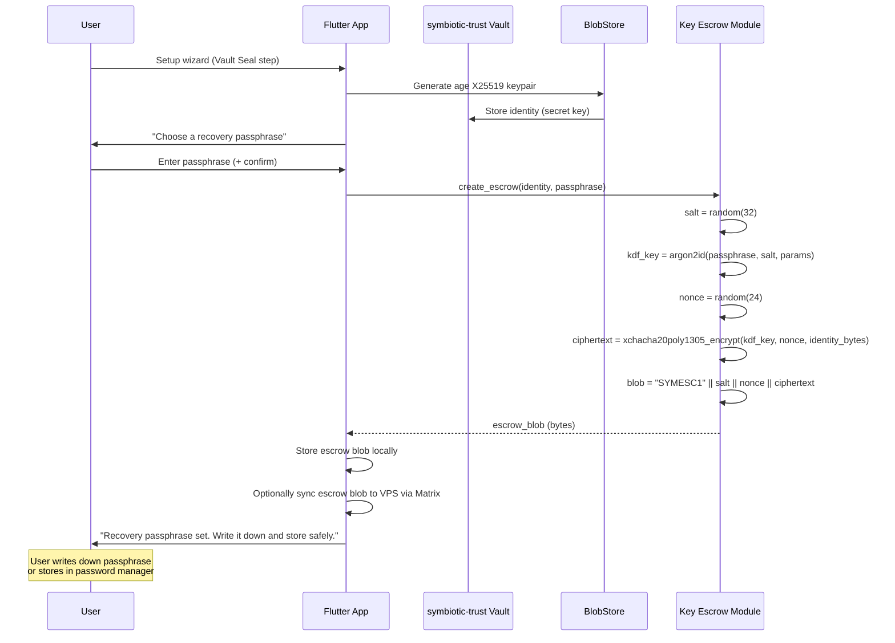
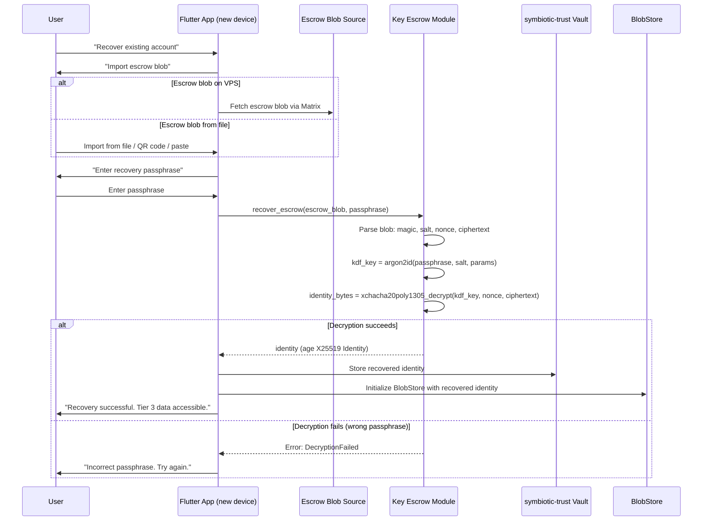
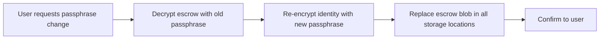
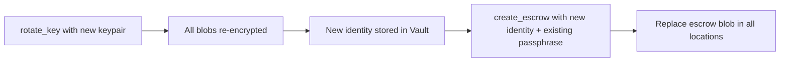

# Blob Store Key Escrow for Disaster Recovery

> **Status**: Draft
> **Task**: T104-P6 (Tiered Data Protection)
> **Related**: `docs/architecture/tiered-data-protection.md`, `docs/architecture/phone-only-mode.md`
> **Crate**: `symbiotic-vault-store`

## Problem Statement

Symbiotic's Tier 3 (Private) data is encrypted with an age X25519 key stored on the user's device. By default, `tier3_phone_only: true` means Private content (medical records, financial data, legal documents) never leaves the phone. The encryption key is a single `AGE-SECRET-KEY-1...` string loaded from `blob_store_key_file`.

**If the user loses their device, the Tier 3 encryption key is lost, and all Private data becomes permanently unrecoverable.**

This is unacceptable for data like medical records and tax returns. Users need a disaster recovery path that does not compromise the security guarantees of Tier 3 encryption.

### Specific scenarios

1. **Phone loss/theft** -- device is gone, key is gone.
2. **Phone hardware failure** -- device won't boot, storage unreadable.
3. **Accidental key deletion** -- user resets app data or reinstalls.
4. **Migration to new device** -- user upgrades phone, needs to transfer Tier 3 access.

### Constraints

- Must not weaken Tier 3 encryption (no plaintext keys on VPS, no cloud storage of raw keys).
- Must work with phone-only mode (VPS never sees Private content).
- Must not depend on a third-party custodian service.
- Must be self-hostable and offline-capable.
- Recovery must be possible even if the VPS is also lost (since blob data may live only on-device).

## Options Evaluated

### Option A: Shamir's Secret Sharing (SSS)

Split the age identity key into N shares using Shamir's (k, n) threshold scheme. Distribute shares to multiple custodians (other devices, trusted contacts, paper backups). Require k shares to reconstruct.

**Pros:**
- No single point of failure.
- Configurable trust threshold (e.g., 2-of-3, 3-of-5).
- Well-studied cryptographic primitive (GF(256) polynomial interpolation).

**Cons:**
- Requires the user to manage share distribution (complex UX).
- Custodians must be available at recovery time.
- Share storage is itself a key management problem.
- Shares on paper can be photographed, lost, or damaged.
- Overkill for a single-user system with no inherent multi-party trust model.

### Option B: Password-Derived Key Escrow (RECOMMENDED)

Encrypt the age identity key with a key derived from a user-chosen recovery passphrase using Argon2id. Store the encrypted escrow blob on the VPS (or any backup location). The passphrase never leaves the user's head.

**Pros:**
- Simple UX: user memorizes one passphrase.
- Self-contained: no custodians, no external services.
- Escrow blob is safe to store on VPS or cloud backup (useless without passphrase).
- Works offline.
- Integrates naturally with existing age encryption.
- Passphrase strength is tunable via Argon2id parameters.

**Cons:**
- Single point of failure is the passphrase (user can forget it).
- Brute-force resistant only as strong as the passphrase + Argon2id cost.
- No way to recover if passphrase is forgotten (by design).

### Option C: Matrix SSSS Integration

Leverage Matrix's Secure Secret Storage and Sharing (SSSS) to store the age identity key alongside the cross-signing keys, protected by the same recovery key/passphrase.

**Pros:**
- Reuses existing Matrix infrastructure.
- Users who already have a Matrix recovery key get blob recovery "for free".
- Cross-device key sharing via Matrix SSSS.

**Cons:**
- Tight coupling to Matrix transport (Symbiotic aims to be transport-agnostic long-term).
- Matrix SSSS has known UX issues (`import_secrets()` swallows errors -- see MEMORY.md).
- Recovery key mismatch is only visible via SDK tracing logs.
- SSSS stores secrets on the homeserver -- violates phone-only mode's trust model.
- `auto_enable_backups: false` on daemon to avoid conflicts with Flutter's SSSS -- adding another secret increases fragility.
- If the homeserver is compromised, the attacker gets the encrypted escrow blob AND controls the SSSS recovery flow.

## Recommendation: Option B -- Password-Derived Key Escrow

Option B provides the best balance of security, simplicity, and independence. It requires no custodians, no external services, and no coupling to Matrix. The escrow blob is a single encrypted file that can be backed up anywhere (VPS, USB drive, cloud storage, email to self) without risk, because it is useless without the passphrase.

The passphrase-forgetting risk is mitigated by:
1. Showing the passphrase once during setup for the user to write down.
2. Requiring passphrase confirmation (type it twice).
3. Periodic passphrase verification prompts (opt-in).
4. Supporting an optional paper backup code (the raw age identity, printed and stored in a safe).

## Detailed Design

### Cryptographic Primitives

| Primitive | Algorithm | Parameters |
|-----------|-----------|------------|
| Key derivation | Argon2id | 256-bit output, 256 MiB memory, 3 iterations, 4 lanes |
| Escrow encryption | XChaCha20-Poly1305 | 192-bit nonce, 256-bit key (from Argon2id) |
| Salt | Random | 32 bytes (256-bit), generated per escrow blob |
| Age identity key | X25519 | 256-bit scalar (standard age format) |

**Why Argon2id**: Memory-hard KDF that resists both GPU and ASIC brute-force. The 256 MiB / 3-iteration parameter set takes ~1 second on modern mobile hardware, making offline brute-force impractical for passphrases with >= 40 bits of entropy (~4 random words).

**Why XChaCha20-Poly1305**: Authenticated encryption with a 192-bit nonce (safe for random nonce generation without collision risk). Standard AEAD. Available in the `chacha20poly1305` crate (RustCrypto).

### Escrow Blob Format

```
+------------------+
| Magic: "SYMESC1" |  7 bytes -- format identifier + version
| Salt             | 32 bytes -- Argon2id salt
| Nonce            | 24 bytes -- XChaCha20-Poly1305 nonce
| Ciphertext+Tag   | Variable -- encrypted age identity key + 16-byte auth tag
+------------------+
```

Total overhead: 7 + 32 + 24 + 16 = 79 bytes + identity key length (~74 bytes for age X25519).

The escrow blob is ~153 bytes. Small enough to encode as a QR code or transmit over any channel.

### Escrow Creation Flow



### Recovery Flow



### Escrow Blob Storage Locations

The escrow blob is encrypted and safe to store anywhere. Recommended locations (user chooses during setup):

| Location | How | Risk |
|----------|-----|------|
| VPS (via Matrix) | Sync as a special Matrix event in the system room | VPS compromise exposes blob (but not passphrase) |
| Local backup file | Export to Files app / Downloads | File loss, but user can re-export |
| QR code on paper | Display QR during setup, user prints/photographs | Physical theft, but blob is encrypted |
| Password manager | Copy blob (base64) into password manager notes | Depends on password manager security |
| USB drive | Export to external storage | Physical loss/damage |

**Default**: Store on VPS via Matrix (encrypted event in the `#system` room). This provides automatic backup without user effort. The blob is useless without the passphrase, so storing it on the homeserver does not violate the phone-only trust model -- the VPS never sees the raw identity key.

### Passphrase Change Flow

Users can change their recovery passphrase without re-encrypting any blobs (since the underlying age identity key stays the same):



This is a fast operation (~1 second for Argon2id) regardless of how many blobs exist in the store.

## Trust Model

| Entity | Trusts | Does NOT Trust |
|--------|--------|----------------|
| User's device | Has plaintext identity key in Vault | -- |
| VPS / Homeserver | Holds encrypted escrow blob | Never sees passphrase or raw identity |
| Backup storage (USB/cloud) | Holds encrypted escrow blob | Never sees passphrase or raw identity |
| Flutter app | Handles passphrase in memory only | Never persists passphrase to disk |
| Recovery flow | User proves knowledge of passphrase | No custodians, no third parties |

**Key assumption**: The user can remember (or has written down) their recovery passphrase. If the passphrase is lost AND all devices with the raw identity key are lost, Tier 3 data is unrecoverable. This is an intentional security property -- there is no backdoor.

## Threat Model

### What this protects against

| Threat | Protection |
|--------|------------|
| Device loss/theft | Escrow blob + passphrase recovers identity on new device |
| VPS compromise | Attacker gets escrow blob but not passphrase; brute-force impractical with Argon2id (256 MiB memory-hard) |
| Backup storage compromise | Same as VPS compromise -- blob is encrypted |
| Network eavesdropping | Escrow blob transits via E2EE Matrix; even without E2EE, blob is independently encrypted |
| Insider at hosting provider | No access to passphrase; LUKS protects disk; escrow blob resists brute-force |

### What this does NOT protect against

| Threat | Why |
|--------|-----|
| Passphrase forgotten + all devices lost | By design -- no backdoor. Mitigated by paper backup option. |
| Keylogger on device during passphrase entry | Runtime compromise is out of scope for at-rest protection. |
| User coerced to reveal passphrase | Duress protection is out of scope. Future work: plausible deniability / decoy vault. |
| Weak passphrase brute-force | Mitigated by Argon2id cost parameters. UI enforces minimum 4-word passphrase (~44 bits entropy from EFF wordlist). |
| Quantum computing (Grover's on AES/ChaCha) | XChaCha20 with 256-bit key has 128-bit post-quantum security. Argon2id output is 256-bit. Sufficient for medium-term. |

### Passphrase Strength Policy

The app enforces a minimum passphrase strength during escrow creation:

- **Minimum**: 4 words from the EFF large wordlist (7776 words, ~51 bits entropy), OR
- **Minimum**: 12 characters with mixed case + digits (~60 bits entropy)
- **Recommended**: 6 words (~77 bits entropy)
- UI shows entropy estimate and strength meter

## Key Types

### Escrow module (`symbiotic-vault-store::escrow`)

```rust
use age::x25519::Identity;

/// Parameters for Argon2id key derivation.
#[derive(Debug, Clone)]
pub struct EscrowKdfParams {
    /// Memory cost in KiB (default: 262_144 = 256 MiB).
    pub memory_kib: u32,
    /// Number of iterations (default: 3).
    pub iterations: u32,
    /// Degree of parallelism (default: 4).
    pub parallelism: u32,
}

impl Default for EscrowKdfParams {
    fn default() -> Self {
        Self {
            memory_kib: 262_144,
            iterations: 3,
            parallelism: 4,
        }
    }
}

/// Errors from escrow operations.
#[derive(Debug, thiserror::Error)]
pub enum EscrowError {
    #[error("invalid escrow blob format")]
    InvalidFormat,
    #[error("unsupported escrow version: {0}")]
    UnsupportedVersion(String),
    #[error("decryption failed (wrong passphrase or corrupted blob)")]
    DecryptionFailed,
    #[error("passphrase too weak: {0}")]
    PassphraseTooWeak(String),
    #[error("key derivation error: {0}")]
    Kdf(String),
    #[error("encryption error: {0}")]
    Encrypt(String),
}

/// Create an escrow blob from an age identity and a recovery passphrase.
///
/// The identity is encrypted with a key derived from the passphrase via
/// Argon2id, then wrapped in XChaCha20-Poly1305.
///
/// Returns the escrow blob bytes (prefixed with "SYMESC1").
pub fn create_escrow(
    identity: &Identity,
    passphrase: &str,
    params: &EscrowKdfParams,
) -> Result<Vec<u8>, EscrowError>;

/// Recover an age identity from an escrow blob and recovery passphrase.
///
/// Parses the blob, derives the decryption key from the passphrase via
/// Argon2id with the embedded salt, and decrypts the identity.
///
/// Returns `EscrowError::DecryptionFailed` if the passphrase is wrong.
pub fn recover_escrow(
    escrow_blob: &[u8],
    passphrase: &str,
) -> Result<Identity, EscrowError>;

/// Validate passphrase strength.
///
/// Returns `Ok(())` if the passphrase meets minimum entropy requirements.
/// Returns `Err(EscrowError::PassphraseTooWeak)` with a human-readable
/// reason if it does not.
pub fn validate_passphrase(passphrase: &str) -> Result<(), EscrowError>;

/// Change the recovery passphrase for an existing escrow blob.
///
/// Decrypts with `old_passphrase`, re-encrypts with `new_passphrase`.
/// Returns the new escrow blob bytes.
pub fn change_passphrase(
    escrow_blob: &[u8],
    old_passphrase: &str,
    new_passphrase: &str,
    params: &EscrowKdfParams,
) -> Result<Vec<u8>, EscrowError>;
```

### Integration with `BlobStore`

No changes to `BlobStore` itself. The escrow module operates on the `Identity` key, not on individual blobs. The existing `BlobStore::rotate_key()` remains the mechanism for changing the encryption key; escrow handles backing up whichever key is currently in use.

### Crate Dependencies (new)

```toml
# In symbiotic-vault-store/Cargo.toml
[dependencies]
argon2 = "0.5"                    # Argon2id KDF (RustCrypto)
chacha20poly1305 = "0.10"         # XChaCha20-Poly1305 AEAD (RustCrypto)
rand = "0.8"                      # Salt and nonce generation
# age, serde, serde_json, thiserror, uuid -- already present
```

## Integration Plan

### Phase 1: Core escrow module

1. Add `escrow.rs` to `symbiotic-vault-store` with `create_escrow()`, `recover_escrow()`, `validate_passphrase()`, `change_passphrase()`.
2. Add unit tests: roundtrip, wrong passphrase, corrupted blob, weak passphrase rejection.
3. Export from `lib.rs` as `pub mod escrow`.

### Phase 2: Setup wizard integration

1. Add "Recovery Passphrase" step to the Flutter setup wizard (after Vault Seal, before System Alive).
2. Wire passphrase entry to Rust via FFI: call `create_escrow()` with the generated identity.
3. Store escrow blob locally in app storage.
4. Optionally sync escrow blob to VPS as a Matrix event in `#system` room.

### Phase 3: Recovery flow

1. Add "Recover Account" flow to Flutter app (alternative to fresh setup).
2. Import escrow blob from Matrix, file, or QR code.
3. Call `recover_escrow()` via FFI with user's passphrase.
4. Re-initialize `BlobStore` and Vault with recovered identity.

### Phase 4: Passphrase management

1. Add "Change Recovery Passphrase" to app settings.
2. Add periodic passphrase verification prompt (opt-in, configurable interval).
3. Add escrow blob export (QR code, file download) from settings.

## Relationship to Existing Key Rotation

Key escrow and key rotation are independent operations:

- **Key rotation** (`BlobStore::rotate_key()`) changes the age keypair and re-encrypts all blobs. After rotation, the old key is discarded.
- **Key escrow** backs up the current identity key. After a key rotation, the escrow blob must be regenerated with `create_escrow()` using the new identity.

The rotation flow should automatically trigger escrow regeneration:



**Important**: The user does NOT need to re-enter their passphrase during rotation. The app holds the passphrase in memory for the duration of the rotation operation (prompted once at the start), then discards it.

## Open Questions

1. **Should the escrow blob contain a key fingerprint for pre-flight validation?** Adding a truncated hash of the identity's public key (8 bytes) would allow the recovery flow to detect "wrong escrow blob" vs. "wrong passphrase" before attempting decryption. Trade-off: leaks a fingerprint of the key.

2. **Should there be a "paper key" option that bypasses the passphrase entirely?** Some users may prefer to print the raw age identity key (the `AGE-SECRET-KEY-1...` string) and store it in a safe. This is simpler but requires physical security. Could be offered as an alternative during setup.

3. **Multi-device escrow sync protocol**: When the user has multiple devices, should escrow blobs be synced via Matrix automatically, or only on explicit export? Automatic sync is more convenient but creates more copies of the escrow blob.
