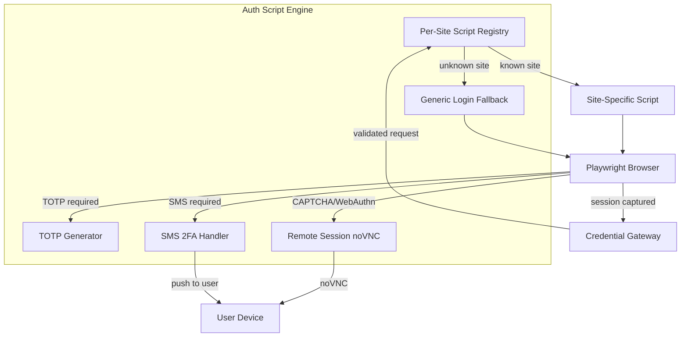

# Compute Tiers

**Status**: Planned (Approved)
**Depends on**: --

## Overview

Symbiotic deployments are split into two compute tiers. The **base tier** runs the core stack (Matrix + daemon + credential sandbox) on minimal hardware. The **LLM tier** adds local model inference as an opt-in upgrade for features like Distillery processing and on-device reasoning.

This separation was driven by the realization that credential operations do not require AI reasoning — deterministic scripts handle 95%+ of login flows more securely and at a fraction of the cost.

## Tier Definitions

### Base Tier (No Local LLM)

| Resource | Specification |
|----------|--------------|
| **vCPU** | 1 |
| **RAM** | 512 MB – 1 GB |
| **Disk** | 10 GB SSD |
| **Estimated cost** | $3–5/mo (Hetzner CX22, DigitalOcean Basic) |

**Runs:**
- Conduwuit (Matrix homeserver, ~50 MB RAM)
- `symbiotic-daemon` (orchestration, queue, agent dispatch)
- SQLite (archive, memory store, audit trail)
- Auth Script Engine (Playwright-based credential injection)
- Browser sandbox (Playwright for content extraction)

**Does NOT run:**
- Ollama or any local LLM
- GPU workloads

### LLM Tier (Opt-in)

| Resource | Minimum | Recommended |
|----------|---------|-------------|
| **vCPU** | 4 | 4+ (or GPU) |
| **RAM** | 8 GB | 16 GB |
| **Disk** | 20 GB SSD | 40 GB SSD |
| **Estimated cost** | $15–30/mo (CPU) or $30–80/mo (GPU) |

**Adds (on top of base tier):**
- Ollama runtime + chosen model(s)
- Distillery pipeline processing
- On-device reasoning agents
- Privacy-maximized workflows (data never leaves VPS)

The LLM tier can run on the same VPS as the base tier (if sized appropriately) or on a separate GPU instance spun up on demand.

## LLM Access Paths

Users choose how they want LLM inference to work:

| Path | Description | Privacy | Cost | Latency |
|------|-------------|---------|------|---------|
| **BYOK** | User provides their own API key (OpenRouter, Anthropic, OpenAI) | Medium (data hits cloud API) | Per-token cloud pricing | Low |
| **Metered** | Proxied cloud calls through Symbiotic's API (no key management) | Medium | Markup on cloud pricing | Low |
| **Managed Local** | Ollama on LLM tier VPS or GPU instance | High (data stays on VPS) | Instance cost | Medium-High |

All three paths are mutually compatible — a deployment can use BYOK for most tasks and Managed Local for privacy-sensitive Distillery processing.

## Auth Script Engine

The Auth Script Engine replaces the previously-planned local LLM for credential operations. It provides deterministic, script-based credential injection that is both more secure and less resource-intensive than LLM-based approaches.

### Why Not an LLM?

| Concern | LLM Approach | Script Approach |
|---------|-------------|-----------------|
| **Security** | Credential enters LLM context window → prompt injection attack surface | Credential in browser memory for microseconds via `page.fill()` → no injection surface |
| **Resources** | 8 GB+ RAM for Qwen 3B | ~100 MB for Playwright |
| **Reliability** | Model may hallucinate, misidentify fields | Deterministic: script finds `input[type=password]`, fills it |
| **Cost** | $15–30/mo base VPS | $3–5/mo base VPS |
| **Coverage** | Better at novel/unusual forms | 95%+ via generic fallback + per-site scripts |

Industry consensus (1Password, Anthropic Computer Use, Skyvern): credential injection is a scripting problem, not a reasoning problem.

### Components



### Script Registry

Per-site scripts live in `scripts/auth/` and are loaded at gateway startup:

```
scripts/auth/
  _generic.ts          # Generic login form handler (fallback)
  x.com.ts             # X/Twitter-specific login flow
  github.com.ts        # GitHub login + 2FA
  google.com.ts        # Google multi-step login
  ...
```

Each script implements a standard interface:

```typescript
interface AuthScript {
  /** Domains this script handles */
  domains: string[];
  /** Drive the browser through the login flow */
  login(page: Page, credentials: { username: string; password: string; totp?: string }): Promise<void>;
  /** Check if login was successful */
  isLoggedIn(page: Page): Promise<boolean>;
}
```

### TOTP Generation

TOTP codes are generated from vault-stored secrets using standard RFC 6238 math. No LLM needed:

```rust
/// Generate a TOTP code from a stored secret.
/// Pure computation — no network, no LLM.
fn generate_totp(secret: &[u8], time_step: u64) -> String {
    let counter = SystemTime::now()
        .duration_since(UNIX_EPOCH)
        .unwrap()
        .as_secs() / time_step;
    hmac_sha1_truncate(secret, counter)
}
```

### Escalation Path

When the script engine can't handle a login flow:

1. **Standard form** → Generic fallback script
2. **TOTP required** → Auto-generate from vault secret
3. **SMS 2FA** → Push notification to user's device, wait for code input
4. **CAPTCHA / WebAuthn / non-standard** → Open noVNC remote session for user

## Impact on Control Plane Provisioning

The `ProvisionRequest` in `submodules/control-plane/` becomes tier-dependent:

```rust
pub struct ProvisionRequest {
    pub user_id: UserId,
    pub tier: ComputeTier,
    pub region: Region,
    // ...
}

pub enum ComputeTier {
    /// 1 vCPU, 1 GB RAM — Conduit + daemon + Auth Script Engine
    Base,
    /// 4+ vCPU, 8-16 GB RAM — adds Ollama + chosen model
    Llm { model: String },
}
```

Base tier provisions are fast (< 2 min) and cheap. LLM tier provisions may include model pulling (additional 2-5 min depending on model size and bandwidth).

## Impact on Install Wizard

The install wizard flow changes:

**Before (model pull in base flow):**
`Signal Online → Nucleus Boot → Matrix Link → Model Pull → Memory Channels → Provider Keys → Vault Seal → Recall Calibration → System Alive`

**After (model pull only for LLM tier):**
`Signal Online → Nucleus Boot → Matrix Link → Memory Channels → Provider Keys → Vault Seal → Recall Calibration → System Alive`

The "Model Pull" step is removed from the base wizard. If the user opts into the LLM tier (during or after setup), a separate "LLM Setup" flow handles model selection and pulling.

## Key Decisions

### 1. Credential Operations are Infrastructure, Not AI

**Decision:** Replace local LLM with Auth Script Engine for all credential operations.

**Rationale:**
- Deterministic scripts are more secure (no prompt injection surface)
- Deterministic scripts are more reliable (no hallucination risk)
- Reduces base tier from $15–30/mo to $3–5/mo
- Industry standard approach (1Password, Skyvern, Anthropic Computer Use)

### 2. Two Tiers, Not One

**Decision:** Split into base (no LLM) and LLM (opt-in) tiers.

**Rationale:**
- Most users need always-on orchestration + credential management (base tier)
- Local LLM is valuable but optional (privacy, Distillery, offline)
- Separating tiers dramatically lowers the entry barrier
- LLM tier can scale independently (GPU instances on demand)

### 3. Three LLM Access Paths

**Decision:** Support BYOK, Metered, and Managed Local simultaneously.

**Rationale:**
- Different users have different privacy/cost/latency preferences
- Paths are not mutually exclusive — mix and match per task
- BYOK is zero infrastructure cost for Symbiotic
- Managed Local serves the privacy-first audience

## Related Docs

| Component | Relationship |
|-----------|--------------|
| [Credential Sandbox](credential-sandbox.md) | Auth Script Engine replaces local LLM |
| [Local LLM Runtime](local-llm-runtime.md) | Opt-in LLM tier design |
| [VPS Deployment](../architecture/vps-deployment.md) | Sizing and container architecture |
| [Browser Automation](browser-automation.md) | Login handoff protocol |
| [Trust & Capabilities](trust-capabilities.md) | Trust levels no longer coupled to LLM type for credentials |
| [Install Wizard](../architecture/install-wizard.md) | Model pull step removed from base flow |
