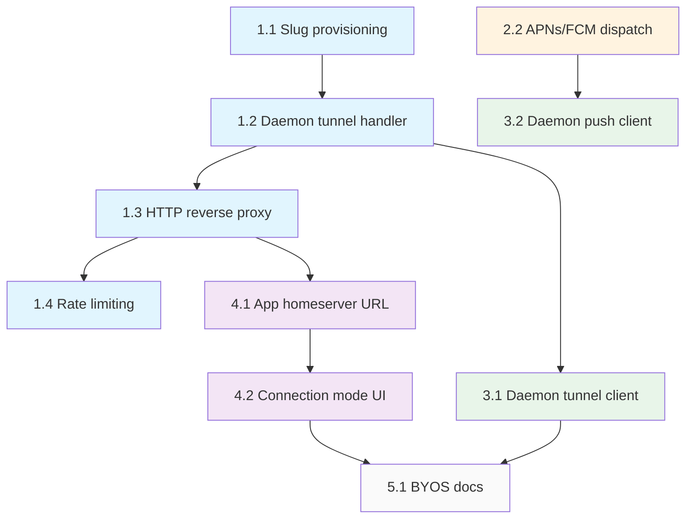

# Connectivity Relay — Implementation Plan (v2)


**Design doc**: `docs/design/connectivity-relay.md` (v2 — HTTP reverse proxy model)

## What changed from v1

The relay is now an **HTTP reverse proxy**, not a custom WebSocket pipe. This means:
- **App side**: Zero custom transport code. Just set homeserver URL to `relay.symbiotic.sh/p/<slug>`. Matrix SDK handles everything.
- **Daemon side**: Outbound WebSocket tunnel to relay. Receives forwarded HTTP requests, proxies to local Conduwuit.
- **Element compatible**: Any standard Matrix client works through the relay.
- **No custom frame protocol** on app side. No client-side queue. No relay_status signaling.

### From v1 implementation (already built)

- **Keep**: `push_gateway.rs` (unchanged — push gateway API is correct as-is)
- **Rewrite**: `relay.rs` — replace custom WebSocket pipe with HTTP proxy + daemon tunnel
- **Keep from relay.rs**: Token provisioning/revocation endpoints, `RelayState` concept (but restructured)

## Phase 1: Relay HTTP Proxy (control-plane)

### Chunk 1.1 — Slug provisioning + daemon tunnel

**Files**: `apps/control-api/src/relay.rs`, `apps/control-api/src/main.rs`

1. Replace current `RelayState` with:
   ```rust
   struct RelayState {
       /// slug → daemon tunnel sender (for forwarding HTTP requests)
       tunnels: RwLock<HashMap<String, DaemonTunnel>>,
       /// daemon_token → (user_id, slug)
       daemon_tokens: RwLock<HashMap<String, (String, String)>>,
       /// slug → user_id (for access control)
       slugs: RwLock<HashMap<String, String>>,
   }
   ```
2. Slug generation: 3 random words from a wordlist + 2 random digits (e.g. `quiet-forest-42`)
3. Provision endpoint: `POST /v1/relay/provision` → returns `{ slug, homeserver_url, daemon_token, daemon_tunnel_url }`
4. Revocation: `DELETE /v1/relay/slugs/:user_id`
5. Tests: slug generation, provisioning, revocation, collision handling

### Chunk 1.2 — Daemon WebSocket tunnel handler

**Files**: `apps/control-api/src/relay.rs`

1. Endpoint: `GET /v1/daemon-tunnel` — WebSocket upgrade
   - Auth: `Authorization: Bearer <daemon_token>`
   - Registers tunnel in `RelayState.tunnels` keyed by slug
2. Request/response framing over the tunnel:
   ```json
   // Relay → Daemon (request)
   { "id": "req_001", "method": "GET", "path": "/_matrix/client/v3/sync?timeout=30000",
     "headers": { "authorization": "Bearer syt_..." }, "body": null }

   // Daemon → Relay (response)
   { "id": "req_001", "status": 200,
     "headers": { "content-type": "application/json" }, "body": "<bytes>" }
   ```
3. Concurrent request multiplexing (multiple in-flight requests by `id`)
4. Tunnel reconnection handling: old tunnel replaced, in-flight requests get 502
5. Keepalive: relay sends ping every 30s, daemon responds with pong
6. Tests: tunnel connect/disconnect, auth rejection, reconnect replaces old tunnel

### Chunk 1.3 — HTTP reverse proxy handler

**Files**: `apps/control-api/src/relay.rs`, `apps/control-api/src/main.rs`

1. Catch-all route: `ANY /p/:slug/*path` → `proxy_to_daemon` handler
2. Handler:
   - Extract slug from path
   - Look up daemon tunnel for slug
   - If no tunnel → 502 Bad Gateway
   - Generate request ID, serialize HTTP request as JSON frame
   - Send through daemon tunnel WebSocket
   - Wait for response frame with matching ID (with timeout)
   - Return HTTP response to client
3. Headers: pass through all client headers (including Matrix auth). Add `X-Forwarded-For`.
4. Streaming: for large responses, consider chunked forwarding (or buffer for MVP)
5. Timeout: 60s for sync long-polls, 30s for other requests
6. Tests: proxy round-trip, 502 on offline daemon, timeout handling, concurrent requests

### Chunk 1.4 — Rate limiting for relay

**Files**: `apps/control-api/src/rate_limit.rs`

1. Add `Relay` endpoint group for `/p/*` paths (standard `Read` rate for GET, `Write` for POST/PUT)
2. Add `DaemonTunnel` group for `/v1/daemon-tunnel` (Auth-class, strict)
3. Tests: rate limiting applied to proxy requests

## Phase 2: Push Gateway (already built)

`push_gateway.rs` is correct as-is. Remaining:

### Chunk 2.2 — APNs/FCM dispatch

**Files**: `apps/control-api/src/push_gateway.rs`, `Cargo.toml`

1. Wire `symbiotic-push` crate (or add reqwest for manual APNs/FCM HTTP calls)
2. APNs: ES256 JWT auth, `.p8` key from env, map category → title
3. FCM: OAuth2 service account, HTTP v1 API
4. Tests: mock APNs/FCM responses, verify payload format

## Phase 3: Daemon Tunnel Client (runtime)

### Chunk 3.1 — Outbound tunnel + HTTP proxy

**Files**: new crate or module in `submodules/runtime/`

1. `TunnelClient` struct:
   - Connects to `wss://relay.symbiotic.sh/v1/daemon-tunnel`
   - Auth: `Authorization: Bearer <daemon_token>`
   - Receives JSON request frames from relay
   - Proxies each to local Conduwuit (`http://localhost:8008`)
   - Sends JSON response frames back
   - Reconnection with exponential backoff (1s → 60s cap)
2. Config: `SYMBIOTIC_RELAY_TUNNEL_URL`, `SYMBIOTIC_RELAY_DAEMON_TOKEN`
3. Fallback: if env vars not set, skip tunnel (BYOS mode — Conduwuit is directly reachable)
4. Integration with daemon startup: spawn tunnel task alongside Matrix client
5. Tests: connect, receive and proxy request, reconnect on disconnect

### Chunk 3.2 — Daemon push gateway client

Same as v1 plan — already correct. Use `daemon_token` for auth instead of `relay_token`.

## Phase 4: App Configuration (Flutter)

### Chunk 4.1 — Homeserver URL from slug

**Files**: `submodules/app/lib/src/services/`

1. During onboarding, receive slug from control plane
2. Set Matrix SDK homeserver to `https://relay.symbiotic.sh/p/<slug>`
3. That's it — no custom transport layer needed

### Chunk 4.2 — Connection mode toggle

**Files**: `submodules/app/lib/src/screens/settings_screen.dart`

1. Settings → Advanced → Connection Mode:
   - Managed (default): homeserver = `https://relay.symbiotic.sh/p/<slug>`
   - Direct: user enters custom homeserver URL
2. Switching mode reconnects the Matrix SDK with the new homeserver

## Phase 5: Documentation

### Chunk 5.1 — BYOS self-hosting guide

`docs/SELF-HOSTING.md` — same as v1 plan.

## Implementation Order & Dependencies



**Parallelizable**: Chunk 2.2 (APNs/FCM dispatch) is independent. Chunks 3.1 and 4.1 can start once 1.3 is done.

## Estimated scope

| Phase | Chunks | Est. LoC | Notes |
|-------|--------|----------|-------|
| 1. Relay v2 | 4 | ~900 | Rewrite of relay.rs to HTTP proxy model |
| 2. Push dispatch | 1 | ~300 | Wire actual APNs/FCM calls |
| 3. Daemon client | 2 | ~400 | Tunnel client + push client |
| 4. App config | 2 | ~100 | Just URL config + settings toggle |
| 5. Docs | 1 | ~300 | BYOS guide |
| **Total** | **10** | **~2000** | Simpler than v1 due to no app-side transport |

Note: App-side went from ~500 LoC (custom WebSocket transport + offline queue) to ~100 LoC (just set a URL). The complexity moved to being eliminated entirely — Matrix SDK handles everything.
