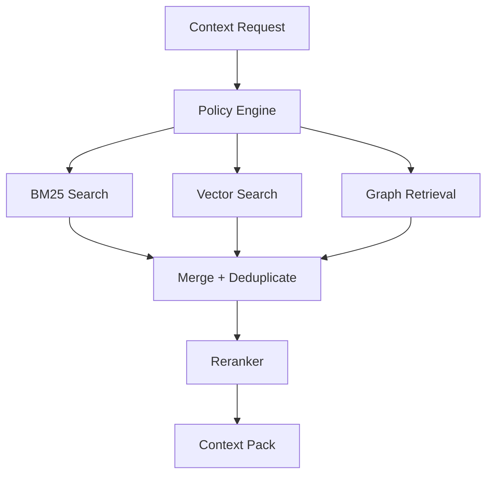
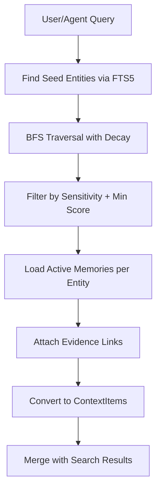

# Context Graphs

**Status**: Planned (Approved)
**Task**: T53 (Hierarchical Retrieval)
**Depends on**: T32 (Vector Embeddings + Semantic Search)

## Overview

Context graphs connect entities and relationships to provide structured, retrievable context at inference time. They complement vector search by adding explicit relationships, temporal validity, and evidence trails.

The current system has a document Archive; graph-based memory is planned as a separate store with links back to Archive evidence.

## Components

| Component | Purpose |
| --- | --- |
| Entity Store | People, projects, concepts, tools, tasks (in Memory Store) |
| Relationship Store | Typed edges between entities (in Memory Store) |
| Evidence Links | Links from memory facts to Archive articles (`article_id`, `source_url`) |
| Context Layers | Grounding (definitions), Performance (actions), Scope (relevance) |
| Graph Retrieval Engine | BFS traversal from query entities with decay scoring |
| Quality Filters | Curation flags, recency weighting, relevance scoring |

## Graph Retrieval Algorithm

The retrieval engine uses breadth-first search (BFS) from query-matched entities, with score decay per hop to prioritize closely related context.

### Algorithm: BFS with Decay

1. **Seed selection**: Identify entities matching the query (via FTS5 or vector similarity on entity names/facts).
2. **BFS traversal**: From each seed entity, traverse relationships up to `max_depth` hops.
3. **Score decay**: Each hop applies a decay factor: `score = base_score * decay_factor^depth`.
4. **Deduplication**: If an entity is reached via multiple paths, keep the highest score.
5. **Budget enforcement**: Stop expanding when accumulated token estimate exceeds budget.
6. **Result assembly**: Return entities + memories + evidence, sorted by decayed score.

```rust
use serde::{Deserialize, Serialize};
use thiserror::Error;

#[derive(Debug, Clone, Copy, Serialize, Deserialize)]
pub struct GraphRetrievalConfig {
    /// Maximum BFS traversal depth from seed entities.
    pub max_depth: usize,
    /// Score decay factor per hop. Score = base_score * decay_factor^depth.
    pub decay_factor: f64,
    /// Maximum number of entities to return.
    pub max_entities: usize,
    /// Maximum number of memories per entity to include.
    pub max_memories_per_entity: usize,
    /// Minimum score threshold; entities below this are excluded.
    pub min_score: f64,
}

impl Default for GraphRetrievalConfig {
    fn default() -> Self {
        Self {
            max_depth: 3,
            decay_factor: 0.7,
            max_entities: 20,
            max_memories_per_entity: 5,
            min_score: 0.1,
        }
    }
}

#[derive(Debug, Clone)]
pub struct GraphNode {
    pub entity_id: String,
    pub entity_name: String,
    pub entity_type: EntityType,
    /// Score after decay is applied (base_score * 0.7^depth).
    pub score: f64,
    /// How many hops from the seed entity.
    pub depth: usize,
    /// The path of relationship types from seed to this node.
    pub path: Vec<String>,
    /// Active memories for this entity.
    pub memories: Vec<Memory>,
}

#[derive(Debug, Clone)]
pub struct GraphRetrievalResult {
    /// Seed entities that matched the query directly.
    pub seeds: Vec<GraphNode>,
    /// Related entities discovered via BFS traversal.
    pub related: Vec<GraphNode>,
    /// Total entities considered (before filtering).
    pub total_considered: usize,
}

#[derive(Debug, Error)]
pub enum GraphRetrievalError {
    #[error("no seed entities found for query")]
    NoSeeds,
    #[error("memory store error: {0}")]
    StoreError(#[from] MemoryStoreError),
    #[error("traversal budget exceeded")]
    BudgetExceeded,
}
```

### Traversal Implementation

```rust
#[async_trait::async_trait]
pub trait GraphRetriever: Send + Sync {
    /// Retrieve context graph for a query.
    /// 1. Find seed entities matching the query.
    /// 2. BFS from seeds with decay scoring.
    /// 3. Collect memories and evidence for each entity.
    async fn retrieve(
        &self,
        query: &str,
        config: &GraphRetrievalConfig,
        sensitivity_max: Sensitivity,
    ) -> Result<GraphRetrievalResult, GraphRetrievalError>;
}
```

### Decay Function

```
score(entity, depth) = base_score * 0.7^depth
```

Where:
- `base_score` = FTS5 relevance score for seed entities (1.0 for direct matches) or relationship strength for traversed entities
- `depth` = number of hops from nearest seed entity
- `0.7` = decay factor (configurable via `GraphRetrievalConfig::decay_factor`)

Example scores:
| Depth | Decay | Score (base=1.0) |
|-------|-------|-------------------|
| 0 (seed) | 1.0 | 1.0 |
| 1 | 0.7 | 0.7 |
| 2 | 0.49 | 0.49 |
| 3 | 0.343 | 0.343 |

## Integration with Recall Gateway

The graph retriever plugs into the Recall Gateway as an additional context source alongside keyword and vector search:



### Gateway Integration Types

```rust
pub struct RecallGateway {
    provider: Arc<dyn ArchiveProvider>,
    audit: Arc<dyn AuditSink>,
    vector: Option<Arc<dyn VectorSearchProvider>>,
    /// Optional graph retrieval -- degrades gracefully when None.
    graph: Option<Arc<dyn GraphRetriever>>,
    hybrid_config: HybridConfig,
}
```

When `graph` is `Some`, the gateway includes graph-derived context in the merge step. Graph results are converted to `ContextItem` with `type: "memory"` and included in the context pack. When `None`, retrieval proceeds without graph context.

### Merging Graph Results with Search Results

Graph results are merged with BM25/vector results using score-based interleaving:

1. Graph entities with `depth=0` (direct matches) get a merge bonus of +0.2 to their score.
2. Graph entities with `depth>0` use their decayed score directly.
3. Deduplication: if the same entity appears in both search and graph results, keep the higher score.
4. Final ordering: by merged score descending, then by depth ascending (prefer closer entities).

## Data Flow



## Key Decisions

1. **Graph is retrieval infrastructure, not intelligence**: it improves context delivery; judgment remains human/agent-driven.
2. **Lightweight ontology**: simple entity types and relationships, not heavyweight RDF/OWL.
3. **Curation over capture**: noise control is mandatory; do not ingest everything.
4. **Single-user assumptions**: avoid enterprise governance overhead; focus on personal coherence.
5. **Temporal validity**: facts are time-scoped; stale facts are filtered or invalidated.
6. **Evidence links required**: every memory fact must link to Archive evidence.
7. **BFS with decay**: simple, predictable traversal; depth-3 max prevents runaway expansion.
8. **Graceful degradation**: graph retrieval is optional; system works without it.

## Test Strategy

| Test | Type | Description |
|------|------|-------------|
| Seed entity matching | Unit | Query finds correct seed entities via FTS5 |
| BFS depth 1 | Unit | Direct relationships returned with 0.7 decay |
| BFS depth 3 | Unit | Third-hop entities have score * 0.343 |
| Max depth enforcement | Unit | Traversal stops at max_depth |
| Deduplication | Unit | Entity reached via two paths keeps highest score |
| Min score filtering | Unit | Entities below min_score excluded |
| Sensitivity filtering | Unit | Private entities excluded when sensitivity_max=shareable |
| No seeds | Unit | Returns `GraphRetrievalError::NoSeeds` |
| Gateway integration | Integration | Graph results appear in context pack with type "memory" |
| Empty graph | Integration | System works when no entities exist |

## Error Handling

| Failure | Handling |
| --- | --- |
| Conflicting facts | Keep both with `valid_from/valid_to`, prefer newest unless marked false |
| Missing evidence | Store with low confidence and flag for review |
| Identity collision | Require human resolution for entity merges |
| Stale memories | Decay weights; suppress from auto-injection |
| Over-retrieval | Enforce token budgets and scope filters |
| No seed entities | Return empty graph result (not an error for the gateway) |
| Store unavailable | Degrade to search-only retrieval; log warning |

## Related Docs

- `docs/design/vault-as-truth.md`
- `docs/design/temporal-modeling.md`
- `docs/design/vector-search.md`
- `docs/architecture/context-delivery.md`
