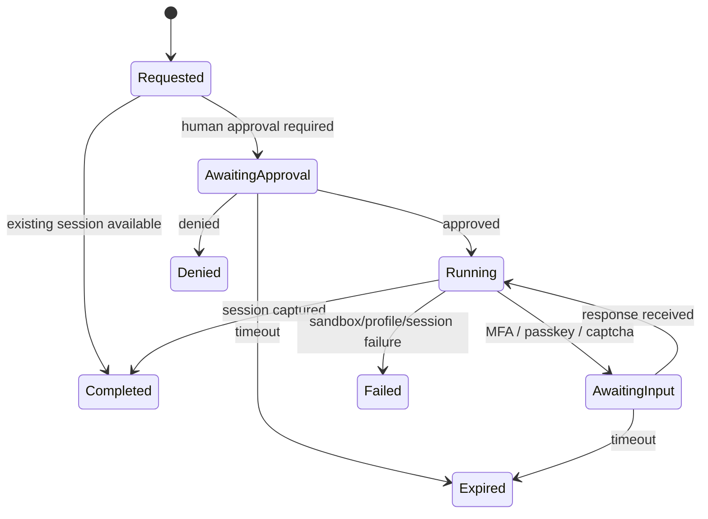
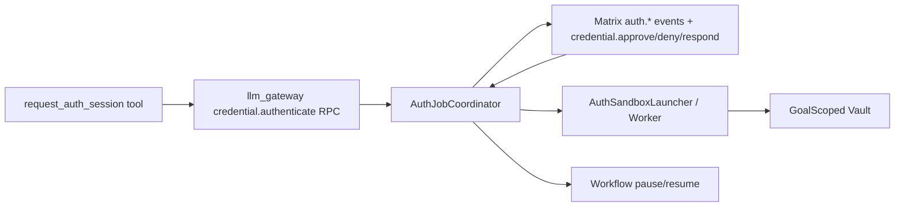

# Credential Auth Bridge Design

**Status**: Planned (Approved)
**Tasks**: T113 (Nuclear Orchestrator), T41 (Local-Only Credential Handling)
**Depends on**: `docs/design/credential-sandbox.md`, `docs/architecture/session-handles.md`

## Goal

Add a dedicated runner/daemon auth surface for first-login and session-capture flows without reopening raw-secret access to the general runner.

This design makes three boundaries explicit:

1. The general runner still receives only session handles or structured auth state.
2. Raw credentials remain confined to the one-shot auth sandbox worker.
3. Human-visible approval and status continue to flow through Matrix channels, even when the request originates from the runner bridge.

## Decision Summary

- Keep `credential.request` as the low-level "issue a handle from already-available credentials/session material" RPC.
- Add a dedicated bridge RPC, `credential.authenticate`, for first-login or re-auth flows that need the auth sandbox worker.
- Expose a single LLM-visible known tool, `request_auth_session`, in the runner. It is not routed through generic `tool.execute`.
- Keep channel visibility first-class: auth jobs emit `auth.*` events to `#credentials` and, when tied to a workflow, summary state to the originating goal/chat surface.
- Canonical action-required event name is `auth.required`. Older `auth.approval_request` references are superseded by `auth.required` with typed phase metadata.
- Primary FE entrypoint is a special action-required notification that jumps from the universal input, with inline approve/deny affordances. Vault remains the deep-detail and policy surface, not the mandatory first screen.

## Why This Shape

The current split is safe but awkward:

- runner bridge can call `credential.request`
- first-login auth still exists only as room command `credential.authenticate`
- workflows needing login must stop, rely on an out-of-band room command, then retry later

That is acceptable for manual operation, but it is not a coherent workflow contract.

The approved target is:

- one auth-job core inside the daemon
- two ingress paths:
  - bridge RPC for runner-backed workflows
  - room command compatibility path for manual use
- one event model in Matrix
- one raw-secret exception path in the auth sandbox worker

## Auth Layering

The end-state auth architecture is explicitly three-layered:

1. `AuthJobCoordinator`
   - pure auth state machine
   - worker execution
   - approval/input timeout handling
   - policy lookup and remembered-approval matching

2. `AuthOrchestrator`
   - Matrix event fan-out
   - goal/workflow state transitions
   - bridge pending-auth artifact recording
   - workflow resume after successful auth

3. Transport adapters
   - `commands.rs` for Matrix/room ingress
   - `llm_gateway.rs` for runner bridge ingress

Rule:
- transport adapters stay thin
- the coordinator stays deterministic and transport-agnostic
- the orchestrator is the only place where auth affects the rest of the product

Boundary note:
- `ask_user` and `generate_plan` do not currently use the auth orchestrator
- they remain bridge interaction artifacts because they are single-step runner pauses consumed by workflow execution, not multi-phase credential lifecycles with policy, channel mediation, and resume side effects
- the shared bridge interaction state is now intentionally separate from auth orchestration for that reason

## Non-Goals

- No raw credentials to `symbiotic-agent-runner`
- No generic auth tool routed through daemon `tool.execute`
- No cloud-model participation in auth flows
- No replacement of channel-visible approval with opaque background login
- No forced screen jump to Vault for the common approve/deny path

## Surface Layers

### 1. LLM-Visible Known Tool

The runner exposes a fixed, known tool to the model:

```rust
pub struct RequestAuthSessionTool;
```

Canonical name:

```text
request_auth_session
```

Parameters:

```json
{
  "target": "github.com",
  "scopes": ["web.login"],
  "session_type": "browser",
  "purpose": "Open GitHub settings and read repository permissions",
  "thread_id": "thread-project-x",
  "auth_profile": "github.com"
}
```

Rules:

- Implemented in the runner as a dedicated bridge-backed tool, not as a daemon-side generic `tool.execute` call.
- May internally try `credential.request` first and fall back to `credential.authenticate`.
- Returns structured auth state, not raw secrets.

Result shape:

```json
{
  "state": "completed|awaiting_approval|awaiting_input|failed",
  "request_id": "authreq_123",
  "message": "Waiting for approval in #credentials",
  "handle_id": "sh_abc",
  "target": "github.com",
  "room_id": "#credentials",
  "expires_at": 1767203530
}
```

Execution attestation, when available after the worker has actually resolved and run a profile, is returned and emitted as:

```json
{
  "auth_profile_id": "github.com",
  "auth_profile_match": "exact|parent|generic",
  "auth_script_kind": "shell|type_script",
  "auth_profile_sha256": "<sha256 hex>"
}
```

These fields are trusted worker-side provenance, not model-supplied hints. Remembered approvals are now keyed on this attestation surface rather than on bare domains alone.

### 2. Bridge RPC

The daemon bridge gains a dedicated RPC:

```text
credential.authenticate
```

This is not part of generic `tool.execute`.

Request type:

```rust
pub struct CredentialAuthenticateRequest {
    pub target: String,
    pub scopes: Vec<String>,
    pub session_type: SessionType,
    pub purpose: String,
    pub thread_id: Option<String>,
    pub auth_profile: Option<String>,
    pub prefer_existing_session: bool,
    pub require_human_approval: bool,
}
```

Response type:

```rust
pub enum CredentialAuthenticateResponse {
    Completed {
        request_id: String,
        handle: SessionHandleSummary,
    },
    AwaitingApproval {
        request_id: String,
        target: String,
        room_id: String,
        expires_at: u64,
        message: String,
    },
    AwaitingInput {
        request_id: String,
        target: String,
        room_id: String,
        input: AuthInputRequest,
        expires_at: u64,
        message: String,
    },
    Failed {
        request_id: String,
        code: AuthFailureCode,
        message: String,
        retryable: bool,
    },
}
```

Supporting types:

```rust
pub struct SessionHandleSummary {
    pub handle_id: String,
    pub target: String,
    pub session_type: SessionType,
    pub expires_at: u64,
}

pub struct AuthInputRequest {
    pub kind: AuthInputKind,
    pub prompt: String,
    pub masked_hint: Option<String>,
}

pub enum AuthInputKind {
    Approval,
    TotpCode,
    SmsCode,
    Passkey,
    Captcha,
}

pub enum AuthFailureCode {
    Denied,
    TimedOut,
    NoCredentials,
    NoProfile,
    SandboxUnavailable,
    TargetBlocked,
    ScriptFailed,
    SessionCaptureFailed,
}
```

### 3. Matrix Commands

The auth-job core remains human-mediated over Matrix. The bridge origin changes transport, not approval semantics.

Canonical commands:

```rust
pub struct CredentialApproveCommand {
    pub request_id: String,
    pub remember_for_secs: Option<u64>,
}

pub struct CredentialDenyCommand {
    pub request_id: String,
    pub reason: Option<String>,
}

pub struct CredentialRespondCommand {
    pub request_id: String,
    pub value: String,
}
```

Command names:

- `credential.approve`
- `credential.deny`
- `credential.respond`
- `credential.approval_policy.list`
- `credential.approval_policy.revoke`

Notes:

- `credential.respond` is the generic typed-input command for MFA/TOTP/SMS/passkey follow-through.
- The current implementation now supports `credential.respond` for typed follow-up input, with opaque continuation state passed only between the daemon and the one-shot auth worker over stdin rather than process args.
- Existing manual `credential.authenticate` room command becomes a compatibility shim that creates the same auth job through the same coordinator.
- `credential.approve { remember_for_secs }` creates a remembered approval policy only after the request is confirmed still approvable; expired requests do not leak stale policies.
- remembered approval policies are listed and revoked from the Vault-side Matrix surface, not from the runner.

### 4. Matrix Event Contract

Canonical event names:

- `auth.required`
- `auth.started`
- `auth.completed`
- `auth.failed`

When the worker has already resolved a deterministic auth profile, `auth.required` (input phase), `auth.completed`, and `auth.failed` must include the attested execution fields:

- `auth_profile_id`
- `auth_profile_match`
- `auth_script_kind`
- `auth_profile_sha256`

The initial approval-phase `auth.required` event may omit these fields because the worker has not executed yet.

When an auth request is satisfied through a remembered approval policy, `auth.required` (input phase), `auth.completed`, and `auth.failed` should additionally carry:

- `approval_mode = "remembered_policy"`
- `approval_policy_id`

`auth.required` remains the canonical action-needed event. The older `auth.approval_request` concept is represented as:

```json
{
  "t": "auth.required",
  "d": {
    "phase": "approval"
  }
}
```

Example event:

```json
{
  "msgtype": "org.symbiotic.event",
  "body": "Approval required for GitHub login",
  "sym": {
    "v": 1,
    "t": "auth.required",
    "s": "blocked",
    "rid": "authreq_123",
    "ts": 1767203530,
    "d": {
      "request_id": "authreq_123",
      "target": "github.com",
      "phase": "approval",
      "purpose": "Open GitHub settings and read repository permissions",
      "requested_by": "agent-1",
      "goal_scope": "wf_123",
      "thread_id": "thread-project-x",
      "expires_at": 1767203830
    }
  }
}
```

Channel rules:

- `#credentials` always receives the full auth event stream.
- the originating workflow/chat surface receives human-readable summary events when the request came from an active goal.
- `#alerts` receives `auth.failed` only for terminal failure or expiry paths, not for normal "awaiting approval" states.

## FE Contract

Auth requests should feel like the rest of the conversational notification system, not like an abrupt navigation away from the current chat surface.

### Primary Presentation

- Present `auth.required` using the same notification mechanic that jumps from the universal input bar, but with a distinct visual treatment from ordinary goal/result notifications.
- Include concise context inline:
  - target
  - purpose
  - requesting workflow / current activity
  - requested capability type
- Provide primary actions inline:
  - `Approve`
  - `Deny`
- If the auth request requires more than a binary decision, the same notification opens the next required step (`credential.respond`) instead of sending the user hunting through unrelated screens.

### Secondary Surfaces

- `Vault` is the detailed security surface:
  - full request metadata
  - policy / remembered approvals
  - audit trail
  - active session / revocation views
- agent/activity screens provide origin context:
  - what the workflow was doing
  - why the auth request happened
  - what will resume after approval

### Navigation Rule

- Common case: user should be able to approve or deny directly from the special auth notification without leaving the current screen.
- Deep-inspection case: the notification can link to:
  - `Vault` for security details and policy
  - agent/activity screen for execution context

### Notification Semantics

Auth notifications reuse the broader notification UX model but remain visually distinct.

Required properties:

- higher contrast / more security-signaled treatment than ordinary completion notifications
- persistent until resolved or expired
- no silent auto-dismiss
- queue-compatible with the broader notification system that expands / jumps from the input
- always classified as action-required

### Approval Modes

The initial notification UX supports:

- `Approve`
- `Deny`

The broader Vault policy surface now supports remembered approvals keyed on:

- `target`
- normalized scope set
- `auth_profile_id`
- `auth_profile_sha256`

These remembered approvals must remain:

- narrow
- revocable
- TTL-bounded
- created only from a valid live approval, never from expired or already-terminal requests

This keeps the inline action fast while preventing the agent/chat surface from becoming the place where broad credential trust policy is granted.

## Capability Model

`credential.authenticate` is more privileged than `credential.request`.

Required capability scopes:

- `credential.read`
- `action.browser.login`

Rationale:

- `credential.read` authorizes use of stored credentials/session material
- `action.browser.login` authorizes active external login/session creation

The bridge handshake token is not a capability grant. It only binds session identity. All privileged auth operations still evaluate against broker-backed agent capabilities under the current `goal_scope`.

## Workflow Contract

When `request_auth_session` cannot return a handle immediately, it must pause the workflow cleanly.

New pending artifact:

```rust
pub struct PendingAuthRequest {
    pub request_id: String,
    pub target: String,
    pub room_id: String,
    pub phase: AuthPendingPhase,
    pub expires_at: u64,
    pub message: String,
}

pub enum AuthPendingPhase {
    Approval,
    Input(AuthInputKind),
}
```

Bridge session store:

```rust
pub struct BridgeSessionArtifacts {
    pub pending_question: Option<PendingQuestion>,
    pub pending_plan: Option<ProposedPlan>,
    pub pending_auth_request: Option<PendingAuthRequest>,
}
```

Workflow behavior:

- if auth completes immediately, workflow continues
- if auth requires approval/input, the runner returns blocked state and the daemon stores `pending_auth_request`
- the daemon emits `auth.required` to `#credentials`
- the daemon emits a summary workflow event in the originating goal/chat surface and a special action-required notification that jumps from the current input surface
- on approval/success, the daemon resumes the waiting workflow automatically when bound to a workflow goal scope

## State Machine



## Exact Module Layout

### `submodules/runtime/services/symbiotic-daemon`

New or changed modules:

```text
src/
  auth_jobs.rs              # new: auth job state machine + coordinator
  llm_gateway.rs            # add credential.authenticate RPC handler
  commands.rs               # route credential.approve / deny / respond; keep manual compatibility shim
  goals.rs                  # resume workflow after auth completion
  workers.rs                # preserve pending_auth_request in runner execution result
```

### `submodules/runtime/crates/symbiotic-agent-runner`

New or changed modules:

```text
src/
  lib.rs                    # BridgeClient::authenticate_credential helper
  tools/auth.rs             # RequestAuthSessionTool
```

### `submodules/runtime/services/credential-gateway`

New or changed modules:

```text
src/
  auth_engine.rs            # richer validated auth request + result types
  main.rs                   # worker entry remains, but launcher request metadata expands
```

## Dependency Graph



## Integration Plan

1. Introduce `AuthJobCoordinator` in the daemon and route both ingress paths into it.
2. Add `credential.authenticate` handler to `llm_gateway.rs`.
3. Add runner helper `BridgeClient::authenticate_credential(...)`.
4. Add `RequestAuthSessionTool` to runner known tools.
5. Extend bridge session artifacts and workflow pause/resume to support `PendingAuthRequest`.
6. Add Matrix commands `credential.approve`, `credential.deny`, and coordinator handling.
7. Make existing room-only `credential.authenticate` call the same coordinator for manual compatibility.
8. Add tests:
   - gateway RPC success / denial / pending-approval responses
   - runner tool -> bridge RPC -> pending auth artifact
   - daemon workflow pause/resume on auth approval
   - channel event emission and auto-resume

## Config Schema

Daemon config additions:

```toml
[auth_jobs]
approval_ttl_secs = 300
input_ttl_secs = 300
resume_on_success = true
emit_goal_room_status = true
credentials_room = "#credentials"
```

Notes:

- `auth_sandbox_bin`, `auth_scripts_dir`, and worker launch config remain in the existing credential sandbox config surface.
- No raw-secret config is added to the runner.

## Compatibility and Migration

- Existing `credential.request` remains unchanged.
- Existing manual room command `credential.authenticate` remains accepted, but becomes a compatibility ingress into the shared auth job coordinator.
- Existing `auth.required` app routing remains valid.
- Older `auth.approval_request` references are migrated conceptually to `auth.required { phase: "approval" }`.

## Open Follow-Through

This design does not try to solve every future auth concern immediately. It intentionally leaves these as later slices:

- richer device-trust proofs beyond the current attestation-keyed remembered approval policy
- noVNC / remote passkey / captcha follow-through
- richer auth profile selection than simple domain mapping
- policy-aware auto-reauth heuristics

The important boundary is fixed now: runner-backed workflows get a first-class auth-job API, but raw-secret handling still never leaves the one-shot auth sandbox worker.
